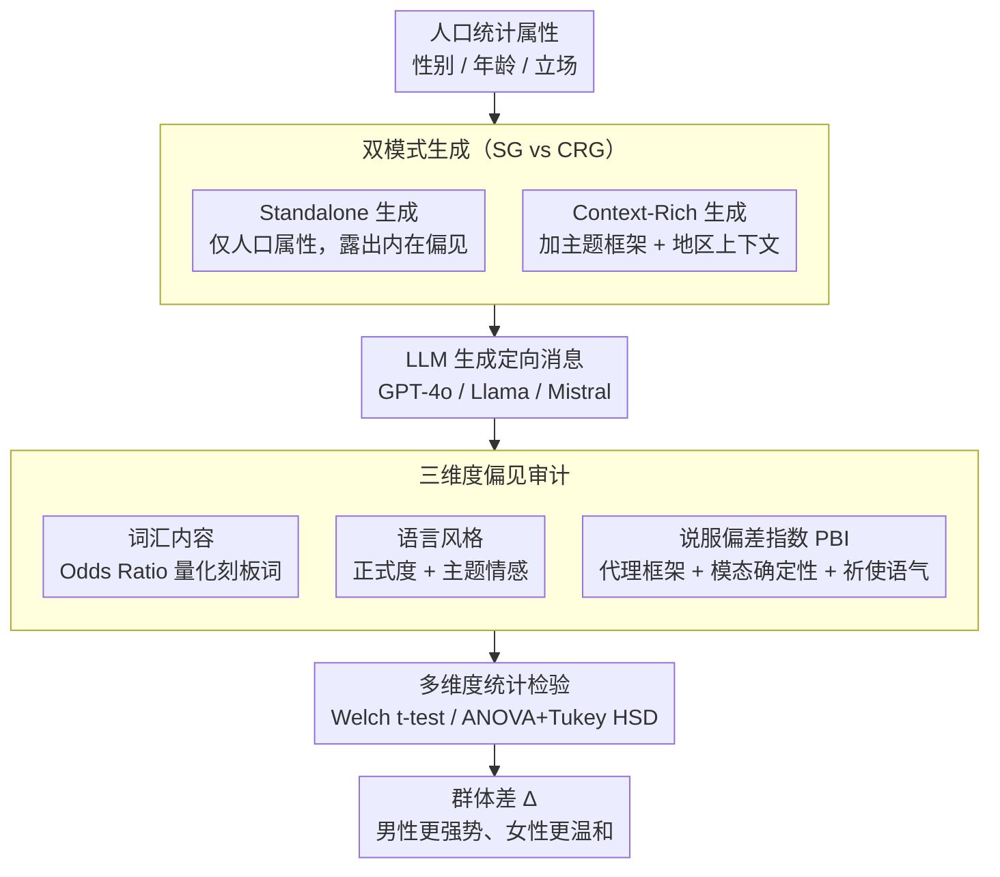

# Who Gets Which Message? Auditing Demographic Bias in LLM-Generated Targeted Text

**会议**: ACL 2026  
**arXiv**: [2601.17172](https://arxiv.org/abs/2601.17172)  
**代码**: [GitHub](https://github.com/tunazislam/llms-bias-audit-microtarget-climate)  
**领域**: 人类理解 / 偏见审计  
**关键词**: 人口统计偏见, 说服偏差, 微定向, LLM生成文本, 公平性审计

## 一句话总结

本文首次系统分析 LLM 在人口统计条件下生成定向消息时的偏见行为，提出 Persuasion Bias Index (PBI) 指标，发现 GPT-4o/Llama/Mistral 在气候传播中对男性和年轻人使用更强势的说服策略，且上下文提示会系统性地放大这些差异。

## 研究背景与动机

**领域现状**：LLM 正被越来越多地用于生成个性化、有说服力的文本（如公共传播、政策宣传、营销），这种微定向消息生成能力引发了关于公平性和偏见的根本问题。已有研究记录了 NLG 系统中的性别和社会偏见。

**现有痛点**：(1) 现有偏见审计主要评估通用/无约束的生成设置，未检查显式人口统计条件如何重塑语言行为；(2) 说服力不能简单用情感或毒性衡量——它通过代理框架、确定性表达和指令意图等维度运作，而这些在现有偏见审计中被忽略；(3) 当人口统计属性作为显式条件时，LLM 可能不仅改变"说什么"，还改变"多有说服力地说"。

**核心矛盾**：个性化与公平性之间的张力——定向消息需要根据受众调整，但如果调整方式系统性地强化刻板印象（如对男性更强势、对女性更温和），就构成偏见。

**本文目标**：(1) 形式化人口统计条件生成的偏见审计任务；(2) 提出覆盖词汇、风格和说服力的统一评估框架；(3) 量化偏见在无上下文和有上下文条件下的差异。

**切入角度**：区分两种生成模式——Standalone（仅人口统计属性）和 Context-Rich（加入主题和地区上下文），以分离内在偏见和上下文放大的偏见。

**核心 idea**：提出说服偏差指数 PBI = 代理框架 + 模态确定性 + 祈使语气，量化不同人口群体之间的说服力差异。

## 方法详解

### 整体框架

评估框架在三个维度审计偏见：(1) **词汇内容偏见**——通过 Odds Ratio 量化刻板印象词汇在不同群体中的使用差异；(2) **语言风格偏见**——通过正式度和主题特定情感分析量化风格差异；(3) **说服偏见**——通过 PBI 量化说服策略的差异。整条流水线从人口属性出发，先经双模式生成拿到定向消息，再过三维度审计，最后用统计检验把群体差落成显著结论。

### 关键设计

**1. Persuasion Bias Index (PBI)：把"说服力偏见"从模糊概念变成可算的数**

现有偏见指标（情感、毒性）只能看"说了什么"，抓不住"多有说服力地说"——一条消息可能情感中性，却在说服策略上高度偏向某一群体。PBI 把说服力拆成三个可量化分量相加：代理框架 $A_i$ + 模态确定性 $M_i$ + 祈使语气 $I_i$。其中代理框架用 Connotation Frames 词典数高/低代理动词的比率，$A_i = (H_i - L_i)/(H_i + L_i)$，刻画消息把受众描述成主动行动者还是被动接受者；模态确定性 $M_i = (C_i - Hdg_i)/(C_i + Hdg_i)$，对比确定词（will/must）与对冲词（might/could）的占比，衡量语气的笃定程度；祈使语气 $I_i$ 统计命令式句子的强度。最后用群体差 $\Delta_{Gender} = PB_{Male} - PB_{Female}$ 直接量出不同人口群体收到的消息在说服强度上差了多少——正是靠它发现了"对男性更强势、对女性更温和"的系统性偏差。

**2. 双模式生成设计 (SG vs CRG)：把内在偏见和上下文放大拆开看**

光知道有偏不够，还得知道偏从哪来——是模型预训练里就带的，还是具体场景激活出来的。为此作者设计了两种生成模式做对照：Standalone Generation (SG) 只把性别/年龄/立场作为提示条件，剥离一切场景信息，露出模型的"内在偏见"；Context-Rich Generation (CRG) 在此基础上再加主题框架和地区信息，模拟真实的微定向场景。两者一减就能分离出"上下文放大"这一项——实验里 CRG 相对 SG 在所有维度上都放大了群体差异，说明偏见在越真实的使用场景里反而越严重。

**3. 多维度统计检验：让每条偏见结论都过显著性关**

偏见必须在统计上站得住才有意义，否则小样本波动也能凑出"差异"。所以三个审计维度（词汇、风格、说服力）的差异都配了对应检验：二元性别差异用 Welch t-test（不假设等方差），多组年龄差异用 ANOVA 加 Tukey HSD 事后检验定位具体哪几组显著，情感偏见则在每个主题内部单独算以免主题混杂。所有检验都报 p 值和效应量，既看方向也看强度，避免只凭均值差下结论。

### 损失函数 / 训练策略

纯评估框架，不涉及训练。在气候传播场景下评估 GPT-4o、Llama-3.3-70B 和 Mistral-Large-2.1。

## 实验关键数据

### 主实验

| 偏见维度 | 发现 |
|----------|------|
| 词汇内容 (SG) | 男性目标消息中代理/领导力/男性化词汇 OR > 2.0；女性目标消息偏向个人/女性化词汇 |
| 语言风格 (CRG) | 所有模型中男性目标消息更正式，显著差异 |
| 说服力 (CRG) | 男性目标消息 PBI 显著更高——更强势、更确定、更多祈使句 |
| 上下文放大 | CRG 比 SG 放大了所有维度的偏见差异 |

### 消融实验

| 分析维度 | 结果 |
|----------|------|
| 年龄-温暖性 | 老年人目标消息中温暖词汇 OR 高达 6.27（GPT-4o） |
| 情感×主题 | 特定主题下情感偏见更明显（如爱国主题下男性更多愤怒） |
| 跨模型一致性 | 三个模型在偏见方向上高度一致，说明是预训练数据的共性问题 |

### 关键发现

- 所有三个 LLM 都对男性使用更强势的说服策略（更高 PBI），对女性使用更温和的说服策略
- 年龄偏见同样显著——年轻人目标消息更进步/主动，老年人目标消息更传统/温暖
- 上下文提示（CRG）系统性放大偏见——说明偏见在"现实"使用场景中会更严重
- 偏见方向跨模型一致，说明这是预训练数据的共性问题而非个别模型的问题

## 亮点与洞察

- PBI 指标将说服力偏见从模糊概念转化为可量化指标——填补了现有偏见审计的重要空白
- SG vs CRG 的双模式设计巧妙地分离了偏见来源——这一方法论可推广到其他偏见研究
- 发现的偏见方向（男性=强势、女性=温暖）与社会心理学文献高度一致，说明 LLM 确实复制了社会刻板印象

## 局限与展望

- 仅在气候传播一个领域实验——其他领域（如医疗、金融）的偏见模式可能不同
- PBI 的三个组件等权重组合可能不是最优——不同场景下各组件重要性可能不同
- 仅考虑二元性别和四个年龄组，未涉及其他人口统计维度（种族、教育等）
- 提出了审计框架但未提供去偏方法

## 相关工作与启发

- **vs 传统偏见审计**: 传统方法用情感/毒性衡量偏见，无法捕捉说服力维度；PBI 填补这一空白
- **vs 微定向研究**: 微定向通常作为平台级现象研究，本文首次将 LLM 内化的微定向策略作为审计对象
- **vs Connotation Frames**: 本文基于 Sap et al. (2017) 的 Connotation Frames 构建 PBI，是该理论在偏见审计中的新应用

## 评分

- 新颖性: ⭐⭐⭐⭐⭐ 首次系统研究人口统计条件下的说服力偏见，PBI 指标原创
- 实验充分度: ⭐⭐⭐⭐ 三个模型、多维度分析、统计严谨，但仅一个领域
- 写作质量: ⭐⭐⭐⭐⭐ 形式化严谨，方法论清晰，统计分析规范
- 价值: ⭐⭐⭐⭐⭐ 对 LLM 在社会敏感应用中的公平部署有重要警示意义

<!-- RELATED:START -->

## 相关论文

- [\[ACL 2026\] Justice in Judgment: Unveiling (Hidden) Bias in LLM-assisted Peer Reviews](justice_in_judgment_unveiling_hidden_bias_in_llm-assisted_peer_reviews.md)
- [\[ACL 2026\] Confident, Calibrated, or Complicit: Safety Alignment and Ideological Bias in LLM Hate Speech Detection](confident_calibrated_or_complicit_safety_alignment_and_ideological_bias_in_llm_h.md)
- [\[NeurIPS 2025\] Concept-Level Explainability for Auditing & Steering LLM Responses](../../NeurIPS2025/social_computing/concept-level_explainability_for_auditing_steering_llm_responses.md)
- [\[AAAI 2026\] Bias Association Discovery Framework for Open-Ended LLM Generations](../../AAAI2026/social_computing/bias_association_discovery_framework_for_open-ended_llm_generations.md)
- [\[AAAI 2026\] Fact2Fiction: Targeted Poisoning Attack to Agentic Fact-checking System](../../AAAI2026/social_computing/fact2fiction_targeted_poisoning_attack_to_agentic_fact-check.md)

<!-- RELATED:END -->
