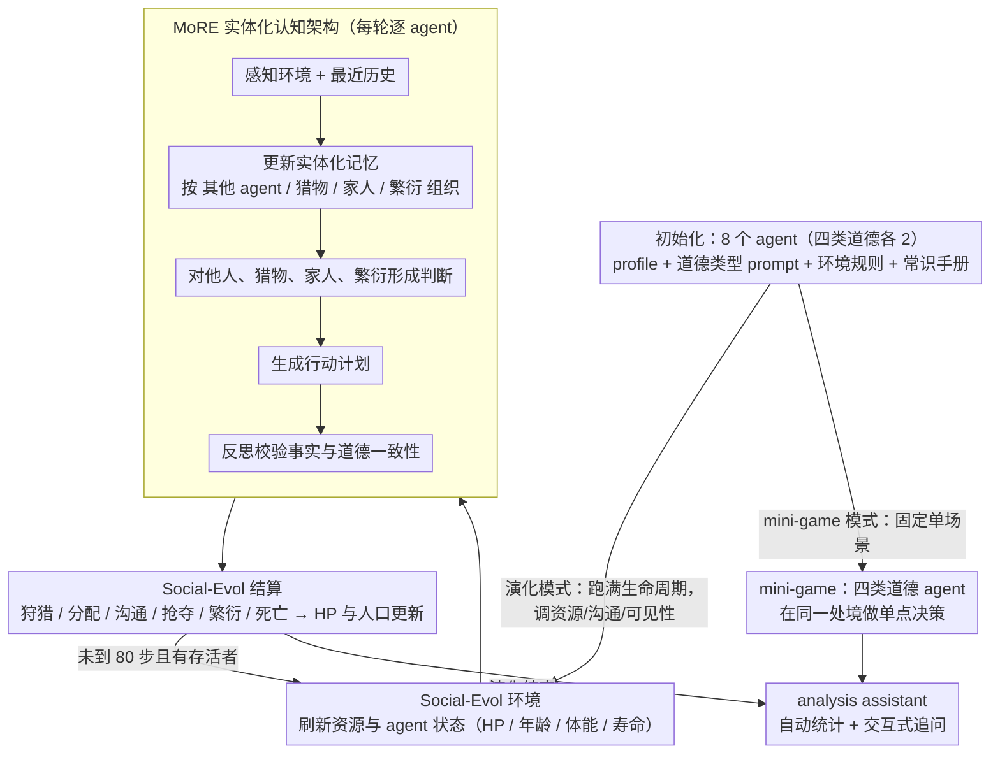

# Why Are We Moral? An LLM-based Agent Simulation Approach to Study Moral Evolution

**会议**: ACL2026  
**arXiv**: [2509.17703](https://arxiv.org/abs/2509.17703)  
**代码**: https://github.com/MoralAgentSim/Simulation-Engine  
**领域**: Agent仿真 / 社会演化  
**关键词**: LLM Agent, 道德演化, 社会仿真, 多智能体系统, 认知架构

## 一句话总结
这篇论文用 LLM agent 构建史前狩猎采集社会仿真平台，把道德类型、记忆、判断、协作和繁衍都纳入演化实验，发现合作和互助通常提升生存稳定性，而判断他人道德类型的认知成本会改变哪类道德策略胜出。

## 研究背景与动机
**领域现状**：道德为什么会演化出来，是进化生物学、社会科学和伦理学中的长期问题。经典解释包括亲缘选择、互惠利他、群体选择、演化博弈论和 expanding circle 等理论，它们说明了合作在某些条件下可以提升适应度。另一方面，LLM agent 仿真近年开始用于模拟小镇、经济行为和社会互动，能够把记忆、推理、价值观和社会关系显式放进 agent 决策过程。

**现有痛点**：传统演化博弈往往把 agent 简化成固定策略，把环境简化成收益矩阵。这种抽象有利于数学分析，却很难研究认知因素：agent 如何记住过去互动、如何判断别人是否可信、如何在沟通带宽有限时协调、如何因为误判引发冲突。已有 LLM 社会仿真也很少系统建模道德类型、合作/竞争、长期演化和繁衍机制。

**核心矛盾**：道德演化既有宏观群体结果，也有微观认知过程。只看收益矩阵会看不到“判断成本”“声誉形成”“误解”“自毁式竞争”等中间机制；但如果直接在真实社会中做实验，又无法控制变量、重复运行和观察每个个体的推理。

**本文目标**：作者希望把 LLM agent 仿真作为一种补充传统模型的新范式：用更具认知现实感的 agent 和更丰富的史前生态环境，探索不同道德倾向在资源、沟通、可观测性变化下如何影响生存、合作和繁衍。

**切入角度**：论文采用 Singer 的 expanding circle 作为道德类型设计框架，从只关心自己、关心亲属、关心互惠群体到普遍关心所有个体，构造四类可比较 agent。这样既能保持实验可控，又能覆盖从自利到广义利他的连续谱。

**核心 idea**：用 LLM agent 的认知能力替代固定策略，用可配置的狩猎采集环境替代 2x2 收益矩阵，让道德演化中的合作、判断、误解和生存压力从 agent 交互中涌现出来。

## 方法详解
论文包含两个主要系统：MoRE agent cognitive architecture 和 Social-Evol 环境平台。MoRE 定义 agent 的价值/道德类型、感知、记忆、判断、计划和反思；Social-Evol 提供资源、生命值、狩猎、采集、分配、沟通、攻击、繁衍等环境动力学。两者结合后，可以运行长期 evolutionary game，也可以运行针对某一机制的 mini-game。

### 整体框架
仿真初始化时，每个 agent 得到个人 profile、道德类型 prompt、环境规则和常识手册。每一轮，环境先更新资源和 agent 状态，然后 agent 接收当前感知和最近历史，更新实体化记忆，形成对其他 agent、猎物、家庭成员和繁衍计划的判断，再生成具体行动计划。行动经过反思模块校验后提交给环境，环境根据规则结算 HP、资源、狩猎成败、分配、攻击、繁衍和死亡。

道德类型分为四类：Selfish 只追求个人生存与繁衍，对子代不提供后续照护；Kin-focused 优先亲属，会为家庭成员分配资源；Reciprocal group-focused 关心互惠合作的群体成员，对不合作或自利者保持警惕；Universal group-focused 对所有个体都更倾向合作、分享和避免伤害。每次长期仿真初始有 8 个 agent，每类 2 个，观察到最多 80 步。

环境是一个文本化史前狩猎采集社会。agent 通过采集植物获得低风险资源，通过狩猎获得高风险高回报资源，也可以转移 HP、沟通、抢夺、战斗或繁衍。后代继承父母道德类型，当前版本不引入突变和文化传播，以保持代际选择效果可控。作者还实现了 simulation analysis assistant，用于自动统计结果并支持交互式追问单个 agent 的行为动机。

### 关键设计

**1. MoRE 道德驱动的实体化认知架构：让 agent 拥有可调用的社会关系记忆，而不是固定策略表**

传统演化博弈把 agent 简化成一张收益矩阵下的固定策略，看不到“我如何看待他人”这个道德演化的核心环节。MoRE 给每个 agent 配上道德价值、感知、记忆、判断、计划和反思六个模块，关键创新是把记忆**围绕实体组织**而非堆成一条事件日志：对每个其他 agent 单独维护互动历史、关系判断和应对计划，对每种猎物维护狩猎历史、协作计划和分配记录，对家庭成员维护状态和照护计划，对繁衍维护前提与时机判断。

这种结构让 agent 在决策时能精准检索到“这个人上次背叛过我”“这个家庭成员 HP 偏低需要照护”之类的相关社会关系，从而形成声誉、信任、怀疑和报复计划。相比把历史压成事件日志，实体化记忆更贴近人类社会推理，也让声誉形成、误解、报复等机制有了承载的认知基础——后面消融实验里记忆模块去掉后道德一致性下降最多（$0.89 \to 0.78$），正说明它是整套架构里最关键的一环。

**2. Social-Evol 狩猎采集生态环境：把抽象收益矩阵换成有资源、生死和代际压力的可观测生态**

只有收益矩阵就观察不到“沟通成本导致错过合作”“家庭照护拖垮父母”“自利者互相攻击”这些中间动态。Social-Evol 构造了一个文本化的史前狩猎采集社会，给每个 agent 加上 HP、年龄、体能和寿命约束：采集植物稳定但收益低，狩猎收益高却可能失败并损失 HP（合作能提高成功率、分摊风险），繁衍需要跨过年龄和 HP 门槛且会消耗父母 HP，而分配、沟通让合作得以成形，抢夺、战斗让竞争策略显性化。

正因为合作与竞争都被实现成显式的环境动力学，道德倾向的后果才能作为可观测过程暴露出来——一个自利 agent 抢夺后引发的连锁攻击、一个亲缘 agent 为子代耗尽 HP 的代价，都会真实地反映到 HP 结算和人口动态里，而不是被收益矩阵一笔抹平。

**3. 长期演化与 mini-game 双模式：既看群体涌现结果，又能隔离单条因果机制**

长期仿真能看到 emergent outcome，但很难解释每个结果的局部成因；只看单点决策又看不到群体层面的演化趋势。论文用两种模式互补：evolutionary game 运行完整生命周期直到 80 步或全员死亡，并把资源丰度、沟通轮数、道德类型可见性当作可调变量来对比不同生态条件；mini-game 则固定一个具体场景（如亲子 HP 分配），观察四类道德 agent 在同一处境下如何做单点决策。

两者结合后，宏观人口动态和微观道德决策被连了起来——例如长期实验中亲缘型人口的兴衰，可以回到 mini-game 里看到“亲缘型父母系统性优先照顾子代、极端时牺牲几乎全部 HP”这条具体机制，从而把“为什么这类策略胜出”落到可追溯的行为差异上。

### 一个完整示例

一次 baseline 长期仿真这样展开：初始放入 8 个 agent，Selfish / Kin / Reciprocal / Universal 各 2 个，每个 agent 初始 HP 20、最大 HP 40、最大年龄 20、资源丰度设为 2、道德类型彼此可见、每轮 2 个社会交互步骤。仿真启动时每个 agent 拿到个人 profile、道德类型 prompt、环境规则和常识手册。

进入循环后，每一轮先由环境刷新资源和各 agent 状态，agent 再接收当前感知与最近历史、更新实体化记忆，并对周围的其他 agent、猎物、家庭成员和繁衍计划形成判断，据此生成行动计划；计划经反思模块校验后提交，环境按规则结算 HP、狩猎成败、分配、攻击、繁衍和死亡。随着回合推进，两个 Kin 型 agent 会优先把资源和 HP 转给亲属、逐步组成能内部互助的家族，而两个 Selfish 型 agent 倾向囤积资源、甚至互相抢夺攻击，往往先被自我清除。跑到 80 步时，这次 baseline 通常由亲缘型主导（最终约 6/8 的存活个体为 Kin 型）、总人口稳定在 12 上下。最后由 simulation analysis assistant 自动统计这一过程，并支持研究者交互式追问某个 agent 当时为何做出某步决策。

### 训练策略
本文不训练新的 LLM，而是把 GPT-5-mini 作为主要仿真模型，并用 Qwen-3.5、Kimi-K2.5 做跨模型鲁棒性验证。基线设置为 80 个时间步、初始 8 个 agent、四种道德类型各占 25%、初始 HP 20、最大 HP 40、最大年龄 20、每轮 2 个社会交互步骤、道德类型可见、资源丰度为 2。资源稀缺实验把 resource abundance 改为 1，高沟通成本实验把 social interaction steps 改为 1，道德类型不可见实验隐藏其他 agent 的 moral type。所有长期演化统计共 20 次运行：baseline 8 次，其他三个条件各 4 次。

## 实验关键数据

### 主实验
作者先验证仿真是否能稳定表达道德类型。使用 GPT-5 作为 evaluator，从行为反推 agent 道德类型，混淆矩阵对角准确率在不同模型上都约 0.86-0.89，说明 agent 行为与 prompt 设定有较高一致性。

| 仿真模型 | 道德类型反推准确率 | 主导类型 | 最终人口 | 说明 |
|----------|-------------------|----------|----------|------|
| GPT-5-mini | 0.89 ± 0.03 | Kin (6/8) | 12.0 ± 2.0 | 主实验模型，行为一致性最高 |
| Qwen-3.5 | 0.86 ± 0.03 | Kin (7/8) | 11.6 ± 1.7 | 开源模型上趋势一致 |
| Kimi-K2.5 | 0.87 ± 0.03 | Kin (5/8) | 12.1 ± 1.8 | 说明结果不完全依赖单一 LLM |

核心演化实验统计不同条件下每类道德 agent 在一次运行结束时是否仍有非零人口。若多个类型共存，则每个幸存类型都计 1 分。

| 设置 | 运行数 | Universal | Reciprocal | Kin | Selfish | 主要现象 |
|------|--------|-----------|------------|-----|---------|----------|
| Baseline | 8 | 4 | 2 | 6 | 2 | 资源充足、可沟通、类型可见时，亲缘型最常形成自我维持家族 |
| Scarce Resource | 4 | 2 | 3 | 0 | 1 | 资源稀缺时，互惠型更会排除 free-rider 并维持公平协作 |
| High Social Cost | 4 | 2 | 3 | 0 | 1 | 沟通轮数少时，亲缘型难以及时组队，互惠和普遍合作更稳定 |
| Moral Type Invisible | 4 | 4 | 2 | 2 | 0 | 类型不可见时，普遍合作型避免误判成本，所有运行都幸存 |

### 消融实验
架构消融显示，MoRE 的记忆、计划和反思模块都对“行为符合道德类型”有贡献，其中记忆影响最大。去掉所有这些结构退化成 ReAct baseline 后，准确率明显下降。

| 配置 | 道德类型反推准确率 | 变化 | 说明 |
|------|-------------------|------|------|
| Full Architecture | 0.89 ± 0.03 | — | 完整 MoRE 架构 |
| w/o Memory | 0.78 ± 0.04 | -0.11 | 记忆缺失最伤害道德一致性 |
| w/o Plan | 0.82 ± 0.04 | -0.07 | 计划模块帮助将道德倾向转成行动 |
| w/o Reflection | 0.84 ± 0.03 | -0.05 | 反思帮助校验事实和道德一致性 |
| ReAct Baseline | 0.67 ± 0.06 | -0.22 | 简单观察-行动循环难以稳定表达道德类型 |
| Prompt Variant A | 0.87 ± 0.03 | -0.02 | 词汇改写影响较小 |
| Prompt Variant B | 0.86 ± 0.04 | -0.03 | 结构改写影响较小 |

### 关键发现
- 合作与互助是最稳定的生存驱动。Universal 和 Reciprocal 在所有条件下都更稳定，Selfish 在多数设置中被强烈劣势化，甚至会因为同类之间互相攻击而自我清除。
- “道德判断成本”会改变赢家。类型可见、沟通充分时，互惠型能通过选择性合作获得优势；类型不可见或沟通成本高时，判断他人是否可信需要时间且容易误判，Universal 因为行为可预测、声誉清晰而更占优。
- Kin-focused 在基线中很强，但依赖资源和沟通条件。当它形成足够大的家族后可以内部互助、自我维持；但资源稀缺或沟通带宽不足时，亲缘策略很难启动有效合作。
- Mini-game 中，亲缘型父母会系统性优先照顾子代，极端情况下牺牲几乎全部 HP；Selfish 父母则更倾向保留资源给自己。这说明长期人口动态确实可追溯到微观道德决策差异。

## 亮点与洞察
- 最大亮点是把道德演化里的“认知中介”显式化。论文不只是复现实验博弈里合作优于自利的结论，而是展示判断成本、误解、声誉和自我清除如何从 agent 推理中涌现。
- MoRE 的实体化记忆设计很适合社会仿真。相比把历史压成事件日志，按 agent、猎物、家庭和繁衍目标组织记忆，更容易让 LLM 在后续决策中调用相关社会关系。
- 论文很清楚地把 LLM 仿真定位为传统数学模型的补充，而不是替代。它不能给出封闭形式定理，但能帮助发现过去抽象模型难以表达的候选机制。
- Simulation analysis assistant 也很实用。大规模 agent 仿真最大的困难之一是日志太多、行为链太长，自动统计和交互式追问可以让研究者更快定位个体行为原因。

## 局限与展望
- 当前系统依赖通用 LLM 进行细粒度空间、时间和因果推理，作者也观察到这些模型在精细计算上会有脆弱性。这类错误会传导到行为和人口动态中，未来可能需要专门的状态表示或受约束推理模块。
- 环境没有显式建模性选择、择偶竞争、文化传播和突变。后代确定性继承父母道德类型有利于控制变量，但也简化了真实演化中的复杂机制。
- 社会环境局限于简化的狩猎采集场景，没有工具创新、市场交换、制度治理、技术协作等现代社会因素。因此结论应理解为对简化社会生态条件下的假设生成，而不是直接社会政策建议。
- 初始 agent 数量和运行次数仍有限。每次 8 个 agent、总共 20 次主实验能看到趋势，但要做更强统计结论，还需要更多种子、更大群体和更系统的参数扫描。

## 相关工作与启发
- **vs 演化博弈论**: 传统模型用固定策略和收益矩阵分析合作条件，优势是简洁可证明；本文牺牲一部分可解析性，换来对记忆、误解、沟通成本和声誉形成的可观察建模。
- **vs Generative Agents / 经济仿真**: Park、Horton、Aher 等工作展示 LLM agent 能复现社会或经济行为；本文进一步加入道德类型、资源竞争、繁衍和长期演化，目标更接近社会演化研究。
- **vs Artificial Leviathan**: Artificial Leviathan 假设 agent 天生自利，研究社会秩序如何出现；本文显式给 agent 不同道德倾向，研究这些倾向本身如何在生态压力下竞争。
- **启发**: 这种框架可以扩展到 norm formation、群体冲突、制度设计、文化传播等问题。关键不是相信某一次仿真结果，而是用仿真发现值得进一步用数学模型或人类实验检验的新机制。

## 评分
- 新颖性: ⭐⭐⭐⭐☆ 把 LLM agent 仿真用于道德演化很有新意，MoRE + Social-Evol 的组合也比较完整。
- 实验充分度: ⭐⭐⭐⭐☆ 有跨模型验证、架构消融、prompt 敏感性和多条件演化实验，但运行规模和社会机制仍偏简化。
- 写作质量: ⭐⭐⭐⭐☆ 论文动机清楚，系统设计和实验解释详细；部分设定较多，读者需要区分“平台能力”和“本次实验结论”。
- 价值: ⭐⭐⭐⭐☆ 对社会科学仿真、LLM agent 方法论和道德演化假设生成有较高参考价值。

<!-- RELATED:START -->

## 相关论文

- [\[ACL 2026\] Inertia in Moral and Value Judgments of Large Language Models](inertia_in_moral_and_value_judgments_of_large_language_models.md)
- [\[ACL 2026\] Point of Order: Action-Aware LLM Persona Modeling for Realistic Civic Simulation](point_of_order_action-aware_llm_persona_modeling_for_realistic_civic_simulation.md)
- [\[ACL 2026\] Dynamics of Cognitive Heterogeneity: Investigating Behavioral Biases in Multi-Stage Supply Chains with LLM-Based Simulation](dynamics_of_cognitive_heterogeneity_investigating_behavioral_biases_in_multi-sta.md)
- [\[ACL 2026\] MM-StanceDet: Retrieval-Augmented Multi-modal Multi-agent Stance Detection](mm-stancedet_retrieval-augmented_multi-modal_multi-agent_stance_detection.md)
- [\[ACL 2026\] Estimating the Black-box LLM Uncertainty with Distribution-Aligned Adversarial Distillation](estimating_the_black-box_llm_uncertainty_with_distribution-aligned_adversarial_d.md)

<!-- RELATED:END -->
