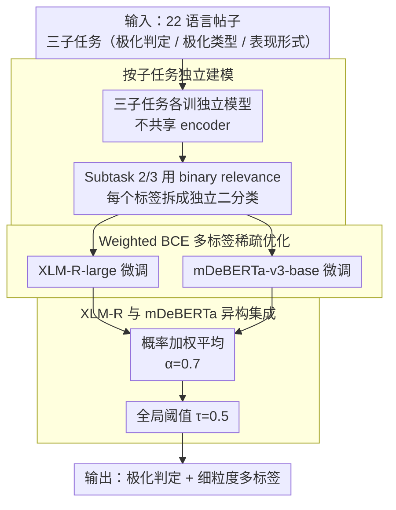

# YEZE at SemEval-2026 Task 9: Detecting Multilingual, Multicultural and Multievent Online Polarization via Heterogeneous Ensembling

**会议**: ACL2026  
**arXiv**: [2605.06231](https://arxiv.org/abs/2605.06231)  
**代码**: https://github.com/FezeGo/SemEval-2026-Task9-Polar  
**领域**: 多语言翻译 / 多语言内容安全 / 社交媒体分析  
**关键词**: 多语言极化检测, SemEval, 类不平衡, XLM-R, 异构集成

## 一句话总结
YEZE 系统把 SemEval-2026 Task 9 的 22 语言在线极化识别拆成独立子任务，用 XLM-RoBERTa-large 与 mDeBERTa-v3-base 分别微调，再通过加权概率平均和 weighted BCE 缓解多标签稀疏问题，在细粒度极化类型与表现形式预测上取得稳定的官方 Top-10 排名。

## 研究背景与动机
**领域现状**：在线极化检测已经从二分类“是否极化”扩展到更细的多标签问题：极化对象是什么，以及极化以何种语言表现出来。SemEval-2026 Task 9 把这一问题放到 22 种语言、多个文化和事件语境中，要求系统同时处理 POLARDETECT、POLARTYPE、POLARMANIFEST 三个子任务。

**现有痛点**：多语言社交媒体数据的分布非常不均衡。不同语言的极化正例比例差异很大，细粒度标签又高度稀疏；在 Macro-F1 作为指标时，少数类学不好会被明显惩罚。更麻烦的是，多任务学习看似能共享表示，但粗粒度二分类任务往往主导梯度，反而让细粒度目标类型和表现形式标签被淹没。

**核心矛盾**：系统既需要跨语言共享能力，又不能让不同语言、不同子任务和不同标签之间互相干扰；既要提升低资源标签召回，又不能因为过度预测导致精度崩掉。

**本文目标**：作者希望构建一个可提交的 shared task 系统，在所有语言和三个子任务上保持稳定表现。具体包括：选择稳健的多语言 encoder；为多标签任务设计类不平衡优化；比较独立建模、MTL、单模型与集成；分析哪些语言和标签仍然困难。

**切入角度**：论文没有转向大模型 prompt，而是回到监督式多语言 encoder。作者认为在低资源、类不平衡、细粒度多标签条件下，可控的 XLM-R/mDeBERTa 微调比 LLM 生成式方案更稳定。

**核心 idea**：用“每个子任务独立建模 + weighted BCE + XLM-R/mDeBERTa 异构集成”替代共享 MTL，把跨语言鲁棒性和细粒度标签稳定性分开处理。

## 方法详解
这篇论文是一篇系统描述论文，重点不在新模型结构，而在一套针对多语言极化 shared task 的稳健工程组合。系统面向三类输出：Subtask 1 是二分类，判断帖子是否极化；Subtask 2 是五类极化目标的多标签预测；Subtask 3 是六类极化表现形式的多标签预测。Subtask 1/2 覆盖 22 语言，Subtask 3 覆盖 18 语言。

### 整体框架
整体 pipeline 很直接：先对每个子任务分别训练 XLM-RoBERTa-large 和 mDeBERTa-v3-base；对多标签子任务使用 binary relevance，把每个标签都视为一个独立二分类；使用 weighted BCE 处理类别稀疏；在 dev set 上搜索 XLM-R 与 mDeBERTa 的集成权重，最终采用 `alpha=0.7` 的概率平均；推理时使用全局阈值 `tau=0.5`，没有采用 per-label threshold tuning，因为它在极端稀疏条件下降低了 Macro-F1。

作者还实现了两个对照方向：单 backbone 模型，以及共享 XLM-R encoder、任务特定 head 的 MTL 版本。最终提交采用独立子任务训练的异构集成，因为它在三个任务平均表现上最稳，尤其更能保护细粒度多标签信号。

### 关键设计

**1. 按子任务独立建模：把粗粒度二分类和细粒度多标签拆开，避免共享 encoder 里的负迁移**

多任务学习看似能共享跨语言表示，但 POLARDETECT 的训练信号最密集、标签最粗，而 POLARTYPE / POLARMANIFEST 的少数标签高度稀疏；一旦共用 encoder 联合更新，主任务会把表示拉向二分类边界，细粒度标签反而被淹没。作者干脆为三项任务各训一套模型，不再共享 encoder；Subtask 2/3 进一步用 binary relevance 分解成多个独立二分类，每个标签输出自己的 sigmoid 概率。

这样做牺牲了参数共享，换来的是细粒度信号不被二分类主导的梯度压扁——后面消融里 MTL 在 Subtask 1 偶尔有帮助、却在 Subtask 2/3 平均更弱，正印证了这种负迁移的存在。

**2. Weighted BCE 的多标签稀疏优化：按标签频率放大稀有正例，对准 Macro-F1 而非整体准确率**

SemEval 的指标是 label-wise Macro-F1，少数标签学不好会被显著惩罚，而普通 BCE 在极稀疏标签上很容易直接学成“全判负”。WBCE 对每个标签按正负样本频率算一个正类权重，形式上可理解为 $w_c = N_{\text{neg},c} / \max(N_{\text{pos},c}, 1)$，再喂进 `BCEWithLogitsLoss(pos_weight=...)`，把稀有标签的正例损失放大、不让它被海量负例稀释。

相比 Focal Loss 靠 hard example 加权，WBCE 直接对准“正例稀缺”这个病根：Focal Loss 在一些高资源语言上有帮助，但对 Telugu、Hausa 这类极稀疏语言不够稳，而 WBCE 在这些语言上带来了最大幅度的增益（Telugu $+0.21$、平均 $+0.10$）。

**3. XLM-R 与 mDeBERTa 异构集成：用两种多语言 encoder 的互补表示压低单模型方差**

不同语言的脚本、形态和社媒表达会让单个 backbone 出现语言特定的脆弱点。系统分别得到 $P_{\text{XLM-R}}(c{=}1\mid x)$ 和 $P_{\text{mDeBERTa}}(c{=}1\mid x)$，再做概率平均 $\bar{P} = \alpha\, P_{\text{XLM-R}} + (1-\alpha)\, P_{\text{mDeBERTa}}$，权重在 dev set 上搜得 $\alpha=0.7$，说明 XLM-R 是主力、mDeBERTa 提供补充；推理时统一用全局阈值 $\tau=0.5$，而没有做 per-label threshold tuning——后者在极端稀疏条件下反而拉低了 Macro-F1。

异构集成的价值不在结构复杂，而在于以很低成本降低单 backbone 的方差：两种模型分词行为和表示各有所长，平均后跨语言鲁棒性更稳，代价只是个别语言上会被单模型或 MTL 反超。

### 损失函数 / 训练策略
训练仅使用官方 task 数据，不引入外部词典。开发阶段从官方 train 中做 85/15 内部分割：Subtask 1 用标准 stratification，Subtask 2/3 用 iterative stratification 保留稀有标签共现。测试阶段在 dev label 发布后，用官方 dev 作验证集调参，最终在 train+dev 上重训生成 hidden test 预测。

实现上保留 emojis 作为情感线索，删除空文本，最大长度 256，动态 padding。模型用 PyTorch/Hugging Face，在 A100 上用 bf16/tf32 微调；XLM-R 学习率 `1e-5`、4 epochs、batch size 32，mDeBERTa 学习率 `2e-5`、5 epochs、batch size 64；AdamW、linear scheduler、warmup ratio 0.1、weight decay 0、early stopping patience 2。作者尝试了 per-label threshold tuning 和 translation augmentation，前者降低 Macro-F1，后者对 Hausa 的 4,000 个 Gemini 翻译样本没有显著收益。

## 实验关键数据

### 主实验
官方结果显示，集成模型在平均 Macro-F1 上是最稳的选择。Subtask 1 和 Subtask 2 的平均分均为最高，Subtask 3 与 XLM-R 单模型几乎持平，但仍优于 mDeBERTa 与 MTL。

| 子任务 | XLM-R | mDeBERTa | Ensemble | MTL | 结论 |
|--------|------:|---------:|---------:|----:|------|
| Subtask 1: POLARDETECT | 0.788 | 0.778 | 0.796 | 0.792 | 集成最高，MTL 次之 |
| Subtask 2: POLARTYPE | 0.565 | 0.550 | 0.575 | 0.554 | 集成明显最好 |
| Subtask 3: POLARMANIFEST | 0.485 | 0.456 | 0.484 | 0.476 | XLM-R 略高，集成几乎持平 |

官方排名上，系统在三个子任务中分别有 11/22、16/22、17/18 个语言进入 Top 10，说明它在细粒度任务上更有竞争力。

| 指标 | Subtask 1 | Subtask 2 | Subtask 3 |
|------|----------:|----------:|----------:|
| Top-10 语言数 | 11/22 | 16/22 | 17/18 |
| 代表性 Top-5 语言 | Odia 第4 | Amharic 第4、Urdu/Odia/Polish 第5 | Arabic 第3、Urdu 第3、Spanish 第4、English/Khmer 第5 |
| 主要薄弱点 | 英语/阿拉伯等竞争激烈语言排名较低 | 稀疏目标标签波动大 | 表现形式标签最稀疏，类别间差异大 |

### 消融实验
优化目标消融显示，WBCE 对低资源和稀疏标签特别重要。以 Subtask 2 的开发实验为例，WBCE 在 Telugu、Hausa 等语言上带来大幅增益，平均也明显高于普通 BCE 和 Focal Loss。

| 语言/平均 | BCE Base | Focal Loss | WBCE | WBCE 相对 Base 提升 |
|-----------|---------:|-----------:|-----:|--------------------:|
| Chinese | 0.6905 | 0.6893 | 0.7218 | +0.0313 |
| Hindi | 0.7724 | 0.8127 | 0.7996 | +0.0272 |
| Telugu | 0.2253 | 0.2986 | 0.4372 | +0.2119 |
| Amharic | 0.3760 | 0.4568 | 0.4589 | +0.0829 |
| Hausa | 0.1115 | 0.2719 | 0.2513 | +0.1398 |
| Average | 0.4351 | 0.5053 | 0.5338 | +0.0987 |

| 设计选择 | 实验现象 | 解释 |
|----------|----------|------|
| 独立建模 vs MTL | MTL 对 Subtask 1 有时有帮助，但 Subtask 2/3 平均更弱 | 粗粒度二分类主导共享 encoder，稀疏细粒度标签被负迁移影响 |
| 全局阈值 vs per-label threshold | per-label threshold tuning 降低整体 Macro-F1 | 开发集上稀疏标签估计不稳定，阈值容易过拟合 |
| 翻译增强 | Hausa 4,000 个 Gemini 翻译样本无显著收益 | translationese 和语用漂移会削弱地区特定表达与隐含线索 |
| 异构集成 vs 单模型 | 平均更稳，但并非每个语言都第一 | 两个 encoder 互补，代价是部分语言上会被单模型或 MTL 超过 |

### 关键发现
- Binary detection 已相对成熟，困难主要来自 Subtask 2/3 的细粒度多标签稀疏。尤其是 Gender/Sexual、Religious、Other、Dehumanization、Lack of Empathy、Invalidation 等标签更脆弱。
- WBCE 比 Focal Loss 更适合这个任务的极端稀疏条件。Focal Loss 可改善一些高资源语言，但在低资源或低频标签下不够稳定。
- 独立建模提高了鲁棒性，但带来跨任务不一致：一个样本可能在 Subtask 1 被判为非极化，却在 Subtask 2/3 得到正标签。这说明后续需要轻量级 gating 或层级校准。
- 多语言模型的困难不只是语言覆盖，还包括脚本、分词、文化语境和地区政治表达。纯翻译扩增无法可靠补上这些文化语用差异。

## 亮点与洞察
- 这篇系统论文的亮点在于“保守但稳”。它没有堆复杂模块，而是针对 shared task 的真实瓶颈选择了独立建模、类权重和异构集成，工程判断清晰。
- 作者对 MTL 的反思很有启发：相关任务不一定适合共享训练，尤其当一个任务标签密集、另一个任务标签稀疏时，共享 representation 可能把细粒度信号压扁。
- translation augmentation 失败这一点值得注意。多语言内容安全不只是把文本翻成目标语言，地区政治隐喻、讽刺、群体称谓和语用强度都可能在翻译中被洗掉。
- 后验分析把问题定位到 calibration 和 label collapse，而不是简单说“低资源语言难”。这对后续改进更有用，因为可以自然导向 hierarchical calibration、label prior 校准和文化语境增强。

## 局限与展望
- 系统主要依赖 supervised encoder，无法充分利用 LLM 的跨文化解释和长上下文能力；但论文也说明 LLM 在细粒度标签上不一定可靠。
- 集成使用固定 `alpha=0.7` 和全局阈值 `0.5`，简单稳健，但无法适配语言/标签层面的校准差异。未来可以尝试语言感知或标签感知阈值，但要防止 dev set 过拟合。
- 独立建模导致跨任务层级不一致。后续可以在推理后加入 gating：若 Subtask 1 为非极化，则压低 Subtask 2/3 概率，或用软约束保持一致性。
- 翻译增强无效并不代表数据增强不可行，而是说明需要 culturally grounded synthesis，例如保留地区特定事件、称谓和讽刺风格的生成式增强。
- 官方结果表显示一些语言上 MTL 或单模型仍优于集成，说明统一 pipeline 牺牲了局部最优；若追求 leaderboard，可能需要 language-specific model selection。

## 相关工作与启发
- **vs 多任务学习 MTL**: MTL 通过共享 encoder 期望利用任务相关性，但本文发现稀疏细粒度标签会受到负迁移；独立建模牺牲参数共享，换来更稳的 Macro-F1。
- **vs LLM prompt 方法**: LLM 可能具备跨文化知识，但在 shared task 的多标签细粒度分类中可控性和校准不如监督 encoder；本文提示，在高风险内容分析里，轻量可控模型仍有现实优势。
- **vs Focal Loss**: Focal Loss 关注 hard examples，适合目标检测式类别不平衡；WBCE 更直接按标签频率补偿正例稀缺，在此任务的稀疏多标签场景里更稳。
- **启发**: 多语言内容安全系统不应只报告平均分，还应报告语言族、脚本、标签覆盖和 precision-recall gap。否则一个高平均分系统可能在最敏感的少数类上完全 label collapse。

## 评分
- 新颖性: ⭐⭐⭐ 系统组合本身较常规，但对 MTL 负迁移、类不平衡和翻译增强失败的分析有实际价值。
- 实验充分度: ⭐⭐⭐⭐ 覆盖 22 语言、三子任务、单模型/MTL/集成/损失函数对照，shared task 系统论文里算扎实。
- 写作质量: ⭐⭐⭐⭐ 结构清楚，实验和错误分析给出了可操作结论；部分表格较大，读者需要自行提炼重点。
- 价值: ⭐⭐⭐⭐ 对多语言内容安全、低资源多标签分类和 shared task 系统搭建有直接参考意义。

<!-- RELATED:START -->

## 相关论文

- [\[ACL 2026\] mdok-style at SemEval-2026 Task 9: Finetuning LLMs for Multilingual Polarization Detection](mdok-style_at_semeval-2026_task_9_finetuning_llms_for_multilingual_polarization_.md)
- [\[ACL 2026\] BITS Pilani at SemEval-2026 Task 9: Structured Supervised Fine-Tuning with DPO Refinement for Polarization Detection](bits_pilani_at_semeval-2026_task_9_structured_supervised_fine-tuning_with_dpo_re.md)
- [\[ACL 2026\] PSK@EEUCA 2026: Fine-Tuning Large Language Models with Synthetic Data Augmentation for Multi-Class Toxicity Detection in Gaming Chat](pskeeuca_2026_fine-tuning_large_language_models_with_synthetic_data_augmentation.md)
- [\[ACL 2026\] Why Are We Moral? An LLM-based Agent Simulation Approach to Study Moral Evolution](why_are_we_moral_an_llm-based_agent_simulation_approach_to_study_moral_evolution.md)
- [\[ACL 2026\] Point of Order: Action-Aware LLM Persona Modeling for Realistic Civic Simulation](point_of_order_action-aware_llm_persona_modeling_for_realistic_civic_simulation.md)

<!-- RELATED:END -->
