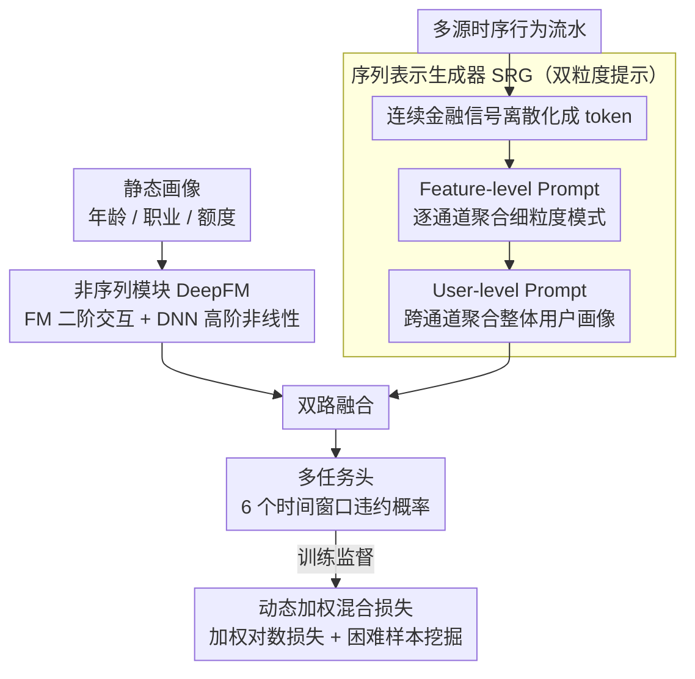

# A Unified Framework for Modeling Heterogeneous Financial Data via Dual-Granularity Prompting

**会议**: ACL 2026  
**arXiv**: [2404.13004](https://arxiv.org/abs/2404.13004)  
**代码**: [GitHub](https://github.com/didiglobal-fintech-credit-risk/FinLangNet)  
**领域**: Time Series / Financial NLP  
**关键词**: 信用风险预测, 异构金融数据, 双粒度提示, 多尺度预测, 工业部署

## 一句话总结

提出FinLangNet框架，通过双模块架构（DeepFM处理静态特征 + 双粒度提示机制的Transformer处理时序行为）实现多尺度信用风险预测，在滴滴金融平台部署后实现KS提升6.3pp和坏账率下降9.9%。

## 研究背景与动机

**领域现状**：工业信用评分系统仍高度依赖XGBoost等统计学习方法，需要大量人工特征工程，且深度学习方法在该领域尚未稳定超越传统方法。

**现有痛点**：(1) XGBoost需要耗时的特征工程和领域专家知识；(2) 静态模型无法捕获用户行为的时序依赖；(3) 现有方法仅做点时预测（point-in-time），无法建模信用度在不同时间窗口的演化。

**核心矛盾**：用户信用风险是动态变化的——短期可能安全但长期有风险——单一预测点不足以支撑全面的风险管理决策。

**本文目标**：将信用评分从静态二分类重新定义为多尺度序列学习问题，同时处理异构金融数据（静态属性+多源时序行为）。

**切入角度**：借鉴NLP中Transformer和prompt技术的思路，设计双粒度提示机制来处理金融时序数据的特殊性。

**核心 idea**：用feature-level prompt捕获通道特定的时序模式，用user-level prompt聚合整体用户画像，实现从细粒度到粗粒度的完整风险表示。

## 方法详解

### 整体框架

FinLangNet 把信用评分从"静态二分类"重新定义为"多尺度时序预测"，并用两个互补模块分别消化金融数据里两种性质完全不同的信号。一条支路是非序列模块（DeepFM），负责吃下用户的静态画像（年龄、职业、额度等）；另一条支路是序列表示生成器（SRG），用双粒度提示机制处理多源的时序行为流水。两路输出融合后送入多任务头，一次性预测 6 个不同时间窗口的违约概率，从而刻画信用度随时间的演化而不只是某一个时间点的快照；训练时用动态加权混合损失对抗类别不平衡并挖掘困难样本。

### 关键设计

**1. 非序列模块（DeepFM）：让静态特征里的组合风险显式可见**

静态画像里的风险信号往往不藏在单个字段里，而藏在字段组合中（如"年龄×职业×收入"这类交叉才真正说明问题），单纯把特征喂进 MLP 很难自动学出这种二阶交互。模块因此沿用 DeepFM 的双分支结构：FM 分支显式建模二阶特征交互 $y_{FM} = \langle w, m \rangle + \sum_{j_1}\sum_{j_2} \langle V_{j_1}, V_{j_2} \rangle m_{j_1} m_{j_2}$，DNN 分支补上高阶非线性关系，两者拼起来得到静态嵌入 $O_m$。这样既保留了 XGBoost 时代靠特征交叉抓风险的优势，又免去了人工构造交叉特征的繁重工程。

**2. SRG 的双粒度提示机制：在通道和用户两个粒度上各抓一层时序画像**

金融时序和自然语言很不一样——它多源、高度稀疏、含噪声，直接套 Transformer 难以稳定。SRG 先把连续金融信号离散化成 token 增强鲁棒性，再引入两级可学习提示来分层聚合：Feature-level Prompt $\widetilde{\phi}_c$ 为每个通道序列各加一个聚合 token，专门捕获该通道特定的全局模式（细粒度的行为信号）；User-level Prompt $P_s$ 则跨所有通道再聚合一次，凝练出整体用户行为画像（粗粒度的风险倾向）。从细到粗两级提示叠起来，才得到一个既保留通道细节又有全局视角的完整用户表示，这也是消融里两个粒度各自掉点、谁都不能省的原因。

**3. 动态加权混合损失：同时治"违约是少数"和"难样本被淹没"两个病**

信用数据天然严重不平衡（违约样本是少数），且不同样本难度差异很大，普通损失会被海量易分负样本主导。损失因此分两手：加权对数损失（WLL）给少数类更高惩罚以对抗类别不平衡；动态困难样本挖掘则按梯度范数 $g_i = |\partial \mathcal{L}_i / \partial y'_i|$ 实时算出样本权重 $\omega_i$，自动上调那些模型当前还学不好的困难样本。两者合在一个回归+分类的混合目标里，让模型把注意力集中到真正有判别价值的样本上。

### 损失函数 / 训练策略

总目标函数为 $\mathcal{L}_{total} = \frac{1}{n} \sum_{i=1}^{n} \omega_i [\beta(y'_i - y_i)^2 + (1-\beta) \mathcal{L}_{WLL,i}]$，其中 $\beta$ 平衡回归平滑性和分类稳定性，$\omega_i$ 为动态权重。多尺度预测使用独立的任务头，预测6个不同时间窗口的违约概率。

## 实验关键数据

### 主实验

| 模型 | y1 AUC | y1 KS | y2 AUC | y2 KS | y3 AUC | y3 KS |
|------|--------|-------|--------|-------|--------|-------|
| XGBoost | 72.78 | 32.85 | 75.76 | 37.42 | 70.89 | 30.00 |
| Transformer | 72.54 | 32.62 | 75.95 | 37.98 | 70.97 | 30.12 |
| TimesNet | 72.49 | 32.54 | 75.90 | 37.98 | 70.83 | 29.99 |
| GPT-4.1 (零样本) | 55.90 | 10.85 | 56.80 | 12.50 | 55.15 | 9.30 |
| **FinLangNet** | **73.55** | **34.08** | **76.96** | **39.46** | **71.92** | **31.60** |

### 消融实验

| 配置 | 关键指标 | 说明 |
|------|---------|------|
| 移除Feature-level Prompt | KS下降 | 通道级模式对精细风险刻画重要 |
| 移除User-level Prompt | KS下降 | 用户级聚合对整体画像必要 |
| 移除多尺度预测 | 长期预测恶化 | 多尺度互相提供梯度信号 |
| 工业部署 | KS +6.3pp, 坏账率 -9.9% | 显著超越原XGBoost系统 |

### 关键发现
- FinLangNet在所有6个时间尺度上全面超越XGBoost和深度学习基线
- LLM零样本信用评分表现极差（AUC仅55-56），证明该任务需要专用模型
- 双粒度提示机制的两个粒度各有不可替代的作用
- 工业部署效果显著，6.3pp的KS提升在金融领域有重大商业价值

## 亮点与洞察
- 将NLP中的prompt概念迁移到金融时序数据处理中，创造性地解决了异构多源数据的统一表示问题
- 从"信用评分是分类"到"信用评分是多尺度时序预测"的问题重新定义非常有洞察力
- 工业部署数据有力证明了方法的实际价值——6.3pp KS提升和9.9%坏账率下降意味着巨大的经济效益

## 局限与展望
- 目前仅在滴滴金融场景验证，泛化到其他金融场景（如银行、保险）需进一步验证
- 可解释性是金融模型的刚需，本文在这方面讨论不足
- 动态加权损失的超参数（$\alpha$, $\beta$）选择策略未充分说明
- 未来可结合LLM的知识为特征工程提供辅助，或探索联邦学习框架下的隐私保护

## 相关工作与启发
- **vs XGBoost**: 保留了XGBoost处理静态特征的优势（DeepFM），同时增加了时序建模能力
- **vs 通用时序模型（TimesNet等）**: 通过双粒度提示机制更好地适配金融数据的多源异构特性
- **vs LLM零样本方法**: 证明信用评分需要专用模型，通用LLM无法胜任

## 评分
- 新颖性: ⭐⭐⭐⭐ 双粒度提示机制和问题重定义均有创新
- 实验充分度: ⭐⭐⭐⭐⭐ 公开数据集+工业部署双重验证
- 写作质量: ⭐⭐⭐⭐ 方法描述清晰，工业数据有说服力
- 价值: ⭐⭐⭐⭐⭐ 工业落地效果显著，对金融AI有重要参考价值

<!-- RELATED:START -->

## 相关论文

- [\[ICLR 2026\] Towards Robust Real-World Multivariate Time Series Forecasting: A Unified Framework](../../ICLR2026/time_series/towards_robust_real-world_multivariate_time_series_forecasting_a_unified_framewo.md)
- [\[ICLR 2026\] Delta-XAI: A Unified Framework for Explaining Prediction Changes in Online Time Series Monitoring](../../ICLR2026/time_series/delta-xai_a_unified_framework_for_explaining_prediction_changes_in_online_time_s.md)
- [\[ICLR 2026\] EDINET-Bench: Evaluating LLMs on Complex Financial Tasks using Japanese Financial Statements](../../ICLR2026/time_series/edinet-bench_evaluating_llms_on_complex_financial_tasks_using_japanese_financial.md)
- [\[ICML 2025\] Event-Aware Sentiment Factors from LLM-Augmented Financial Tweets: A Transparent Framework for Interpretable Quant Trading](../../ICML2025/time_series/event-aware_sentiment_factors_from_llm-augmented_financial_tweets_a_transparent_.md)
- [\[ICLR 2026\] Reasoning on Time-Series for Financial Technical Analysis](../../ICLR2026/time_series/reasoning_on_time-series_for_financial_technical_analysis.md)

<!-- RELATED:END -->
