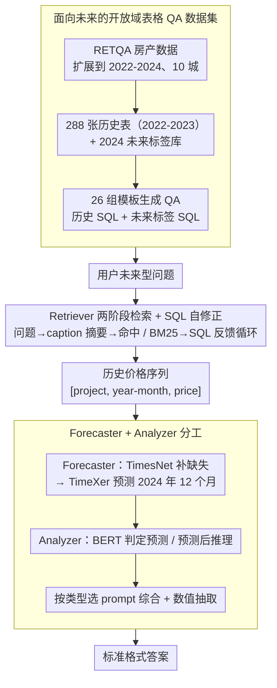

# ODTQA-FoRe: An Open-Domain Tabular Question Answering Dataset for Future Data Forecasting and Reasoning

**会议**: ACL2026  
**arXiv**: [2606.02433](https://arxiv.org/abs/2606.02433)  
**代码**: https://github.com/jensenw1/ODTQA-FoRe  
**领域**: 时间序列 / 表格问答  
**关键词**: open-domain tabular QA, time-series forecasting, LLM agent, text-to-SQL, real estate

## 一句话总结
ODTQA-FoRe 提出面向未来数值预测和预测后推理的开放域表格问答任务，并用 TimeFore 三代理框架把表格检索、SQL 取数、专用时间序列预测和答案规范化串成一个可评测 baseline。

## 研究背景与动机

**领域现状**：LLM + RAG 已经推动 open-domain QA 和 tabular QA 发展，许多系统能根据用户问题检索表格、生成 SQL、做历史事实或数值推理。WikiTableQuestions、Spider、Open-WikiTable、NQ-TABLES、RETQA 等数据集覆盖了闭域/开放域表格 QA、SQL 生成或多表检索。

**现有痛点**：这些任务大多回答“数据库里已有的历史数据”，很少处理用户真正常问的未来型问题，比如“某小区明年价格会怎样”“哪些项目未来价格会超过阈值”。LLM 本身对时间序列预测并不可靠，而开放域场景中用户也不会直接给出连续历史序列，系统必须自己找表、取数、预测再推理。

**核心矛盾**：传统 ODTQA 擅长检索和表格推理，时间序列模型擅长预测，但两者通常分离。未来型问答要求一个系统同时具备开放域历史数据获取能力、外部数值预测能力和面向不同问题类型的标准化回答能力。

**本文目标**：作者提出 ODTQA-FoRe 任务和数据集，要求系统从大规模候选表中自主定位历史数据，预测 2024 年未来价格，并回答直接预测或基于预测的 reasoning 问题。同时提出 TimeFore 作为强 baseline。

**切入角度**：论文选择房地产垂直领域，因为该领域有连续时间序列和真实决策需求。虽然领域具体，但任务形式可迁移到金融、零售、气候等任何有历史结构化数据和未来预测需求的场景。

**核心 idea**：用 LLM agent 负责语义理解、表格检索、SQL 生成和最终解释，把精确数值预测交给 TimesNet / TimeXer 等专用时间序列模型。

## 方法详解

论文包含两条主线：一条是 ODTQA-FoRe 数据集构建，另一条是 TimeFore 框架。数据集提供自然语言问题、答案、历史数据 SQL、未来标签 SQL；TimeFore 则模拟真实系统，在推理时只能访问历史数据库，通过 Retriever、Forecaster、Analyzer 三个角色逐步完成回答。

### 整体框架

数据来自 RETQA 的房地产销售数据，并被扩展到 2022 年 1 月到 2024 年 12 月，覆盖 10 个中国城市。作者把 2023 年 12 月 31 日作为参考日期：2022-2023 是历史可见数据，2024 是未来 ground truth，只用于评测。经过过滤后保留 11,149 个项目，并按项目级别 6:2:2 划分训练、验证和测试，避免项目泄漏。

历史数据库由 2022-2023 年数据按城市、区、年份聚合成 288 张表，平均每张表 845 行；未来数据库由 2024 年数据构成，只用于自动执行 ground-truth SQL。QA 生成阶段设计 26 组模板，其中 7 组是直接 time-series forecasting，19 组是 forecast-based reasoning。作者先人工审查每组 10 个样例，共 260 个 QA，再大规模生成。

TimeFore 框架由三类 agent 组成。Retriever 把用户问题概括成表 caption 风格文本，先直接匹配表 caption，失败时用 BM25 检索，再用 few-shot LLM 生成 SQL 并通过执行反馈循环修正。Forecaster 接收 SQL 结果，把 `[project, year-month, price]` 三元组转成数值序列，先用 TimesNet 补全缺失值，再用 TimeXer 预测 2024 年 12 个月。Analyzer 先用 BERT 分类器判断问题是直接预测还是预测推理，再选对应 prompt 综合历史和预测数据，最后用数值抽取模块输出标准格式答案。

### 关键设计

**1. 面向未来的开放域表格 QA 数据集：把问答从"查历史"推到"测未来"**

现有 ODTQA 数据集几乎都在回答数据库里已有的历史事实，可用户真正常问的是"某小区明年价格会怎样""哪些项目未来会超过阈值"这类未来型问题。要评测这种能力，光给目标表或只问历史是不够的——你无法判断系统是否真的检索了连续历史序列、做了预测、再做了推理。ODTQA-FoRe 的做法是让每个 QA 同时携带四样东西：自然语言问题、答案、历史 SQL（模拟系统推理时可见的数据）和未来标签 SQL（在 2024 future ground truth 上自动执行得到客观唯一的答案）。这种"历史可见、未来仅用于评测"的拆分，让答案不靠主观文本匹配，而是由未来 SQL 严格生成。

**2. Retriever 的两阶段检索 + SQL 自修正：先把问题翻译成"表的语言"再找数据**

开放域场景下，第一步检索的好坏直接决定后面预测的天花板，而直接拿用户问题去 BM25 匹配 288 张候选表并不稳定，语义差距太大。Retriever 因此先用 5-shot prompt 把 query 压缩成"表 caption 风格"的摘要，能直接命中 caption 就用它，命不中再退回 BM25 检索最相关的表；定位到表后再用 5-shot examples 生成 SQL，并套一个最多 25 次的执行反馈循环来修语法或逻辑错误。先摘要成 caption 风格相当于把用户的口语问题翻译成数据库能听懂的话，明显缩小了语义鸿沟。消融里表检索 F1 高达 97~99、SQL 可执行率近乎满分，说明这一步被做得足够稳，瓶颈并不在这里。

**3. Forecaster + Analyzer 分工：LLM 擅长的留给 LLM，数值预测交给专用模型**

实验里通用 LLM 直接预测时间序列误差明显大于专用模型（如 Qwen3 30B 的 MRE 0.1706 vs TimeXer 的 0.1209），而且 LLM 还爱给一大段解释而不是可评测的数值。于是 TimeFore 把数值预测彻底外包：Forecaster 调用 `imputationThenPredictionTool`，先用 TimesNet 把 `[project, year-month, price]` 序列的缺失值补全，再用 TimeXer 预测 2024 年 12 个月；Analyzer 则先用 BERT 分类器判断这是"直接预测"还是"预测后推理"问题，按类型选对应 prompt 综合历史与预测数据，最后用数值抽取模块把回答规范成可评测的标准格式。举例来说，面对"某小区 2024 年 12 月均价是多少"，系统会从 288 张表里检索该小区历史价格、TimeXer 推出 12 个月预测、Analyzer 认出这是 forecasting 类问题并抽取出那个具体数值——三个角色各司其职，比让一个大模型包办全部步骤可靠得多。消融也印证了这点：去掉数值抽取模块，Qwen3 30B 的有效回答率直接掉 33.08%。

### 损失函数 / 训练策略

TimeFore 本身不是端到端训练。BERT 分类器用于 query type classification，时间序列模块按各自官方最佳超参训练。Imputation 数据集选择 2022-2023 至少有 6 个月历史记录的项目序列，包含 8,418 / 2,815 / 2,853 条 train / validation / test；forecasting 数据集选择至少 9 个月历史数据且 2024 至少 2 个月数据的序列，包含 5,806 / 1,975 / 1,963 条 train / validation / test。

LLM 基线通过 in-context learning 做预测，temperature 统一为 0.8。LLM 推理使用 SGLang，在 20 张 NVIDIA A800-SXM4-80GB GPU 集群上运行；BERT 和时间序列模型训练使用单张 RTX 4090。

## 实验关键数据

### 数据集规模

| 项目 | 数值 | 说明 |
|------|------|------|
| QA pairs | 28,507 | 去重、过滤 invalid queries 和 empty results 后得到 |
| 训练 / 验证 / 测试 | 16,944 / 5,742 / 5,821 | 按项目划分，避免泄漏 |
| 问题类型 | 8,042 forecasting + 20,465 reasoning | 7 个 forecasting 模板，19 个 reasoning 模板 |
| 城市和时间 | 10 个中国城市，2022-2024 | 2022-2023 为历史，2024 为未来标签 |
| 候选历史表 | 288 张 | 平均每表 845 行 |
| 项目数 | 11,149 refined projects | 初始 60,183 项目经时间覆盖过滤后得到 |

### 主实验

| 模型 | 方法 | Forecast MSE | Forecast MAE | Forecast MRE | Reasoning Acc | Reasoning F1 |
|------|------|--------------|--------------|--------------|---------------|--------------|
| Qwen3 30B | Vanilla | 40,385,720.95 | 3698.36 | 0.1627 | 12.19 | 24.87 |
| Qwen3 30B | TimeFore | 31,572,410.36 | 2788.20 | 0.1326 | 31.59 | 60.25 |
| Qwen3 Next 80B | Vanilla | 30,942,598.21 | 3406.43 | 0.1586 | 24.45 | 46.62 |
| Qwen3 Next 80B | TimeFore | 22,442,845.96 | 2588.87 | 0.1181 | 36.31 | 58.41 |
| GPT OSS 20B | Vanilla | 105,115,117.20 | 4394.56 | 0.1838 | 21.52 | 44.25 |
| GPT OSS 20B | TimeFore | 29,757,828.58 | 2887.44 | 0.1280 | 27.80 | 49.11 |
| GPT OSS 120B | Vanilla | 47,324,931.58 | 3786.48 | 0.1683 | 21.60 | 41.06 |
| GPT OSS 120B | TimeFore | 18,493,634.83 | 2501.18 | 0.1151 | 31.37 | 51.86 |
| GLM4.5 Air | Vanilla | 139,922,250.13 | 3324.41 | 0.1415 | 23.59 | 48.72 |
| GLM4.5 Air | TimeFore | 90,865,440.59 | 2709.25 | 0.1172 | 35.46 | 61.24 |

### 专用预测模型对比

| 模型 | MSE | MAE | MRE | 观察 |
|------|-----|-----|-----|------|
| TimesNet | 2.77E+07 | 3103.52 | 0.1254 | 强于通用 LLM |
| TimeMixer | 2.78E+07 | 3108.29 | 0.1255 | 与 TimesNet 接近 |
| TimeXer | 2.50E+07 | 2989.55 | 0.1209 | 最优，作为 TimeFore forecaster |
| WPMixer | 2.75E+07 | 3097.81 | 0.1248 | 接近 TimesNet |
| AutoTimes | 2.93E+07 | 3204.13 | 0.1288 | 弱于轻量专用模型 |
| Time-MoE | 2.95E+07 | 3164.47 | 0.1271 | 弱于 TimeXer |
| Qwen3 30B | 6.69E+07 | 4344.02 | 0.1706 | 通用 LLM 直接预测明显较差 |
| GLM 4.5 Air | 7.30E+07 | 4824.57 | 0.1869 | 通用 LLM 预测误差最大 |

### 消融与模块分析

| 模块 / 设置 | 关键数字 | 结论 |
|-------------|----------|------|
| 表检索 Summary+BM25 | GPT OSS 120B F1 99.21，最低 GLM 4.5 Air F1 97.59 | 表检索整体很强，不是主要瓶颈 |
| SQL 生成 | Qwen3 30B ECR 99.85，Qwen3 Next 80B EA 85.72 | 可执行性和执行准确率较高 |
| Golden table captions | 最大准确率提升约 1.02% | 单纯表定位不是主误差来源 |
| Golden history + predicted future | 最大准确率提升约 1.93% | SQL / 历史数据取数不是主瓶颈 |
| Golden history + golden future | Qwen3 30B +46.80%，Qwen3 Next 80B +49.23%，GLM +44.73% | 未来预测误差是核心瓶颈 |
| Analyzer query 分类 | BERT fine-tuned F1 99.98 | 简单分类器足够可靠 |
| 去掉数值抽取模块 | Qwen3 30B Valid Completion Rate 下降 33.08% | 标准化输出对可评测性很关键 |

### 关键发现

- TimeFore 在五个 LLM 上都优于 Vanilla，说明“LLM 直接预测未来数值”不是好 baseline，必须把 forecasting 交给专用模型。
- TimeXer 是被选中的 forecasting backbone，MRE 0.1209，明显低于 Qwen3 30B 的 0.1706 和 GLM 4.5 Air 的 0.1869。
- 系统瓶颈不在 table retrieval 或 SQL，而在未来数据预测；这对后续 ODTQA-FoRe 方法设计非常重要。

## 亮点与洞察

- 任务定义很实用：用户并不只问“数据库里有什么”，还会问“未来会怎样”。把 open-domain table QA 和 forecasting 合并，是一个自然但过去缺位的 benchmark 方向。
- TimeFore 的分工符合工程直觉：LLM 做语言理解和工具编排，时间序列模型做数值预测，BERT 做简单类型分类。这比让一个大模型包办所有步骤更可靠。
- 消融设计很有诊断价值。作者不是只报告 end-to-end 分数，而是用 golden caption、golden history、golden future 分别定位错误来源，清楚证明 forecasting 是主瓶颈。
- 数据集构造用未来 SQL 生成标签，保证答案客观唯一。这一点对未来型问题特别关键，否则评测会沦为主观文本匹配。

## 局限与展望

- **外部因素缺失**：当前预测只用项目价格历史序列，没有纳入宏观经济、政策、环境、区域供需等 exogenous variables。房地产价格受外部因素影响很大，这限制了预测上限。
- **领域单一**：数据集只覆盖房地产。TimeFore 声称 domain-agnostic，但还需要在金融、零售、气候等不同波动性和周期性的领域验证。
- **模板生成仍有限**：虽然作者使用 LLM rewrite 提高自然性，并做人工验证，但 26 组模板未必覆盖真实用户所有复杂问法。
- **预测 backbone 泛化未充分验证**：TimeXer 在该数据集上最优，但跨领域、跨频率或更强非平稳场景下是否仍合适，需要进一步实验。
- **端到端优化空间未探索**：当前 pipeline 是模块化拼接；未来可尝试让 Retriever、Forecaster 和 Analyzer 共享不确定性估计，输出置信区间而不是单点答案。

## 相关工作与启发

- **vs WikiTableQuestions / Spider**: 这些数据集关注给定表或 SQL 生成，不涉及开放域未来预测；ODTQA-FoRe 要先检索表，再预测未来。
- **vs Open-WikiTable / NQ-TABLES / RETQA**: 它们推进开放域表格检索和历史问答，但主要回答静态数据库中已有信息；ODTQA-FoRe 显式引入 2024 future ground truth。
- **vs LLMTIME / TP-BERTa 等 LLM forecasting**: 这些方法研究语言模型做时间序列预测，但没有和开放域表格检索、SQL 取数、最终 QA 整合。
- **启发**：未来的 agent benchmark 应该评估“检索-工具调用-数值模型-语言回答”的组合能力，而不是只看单步 text-to-SQL 或单步预测。

## 评分
- 新颖性: ⭐⭐⭐⭐☆ 任务组合新颖，数据集定位清楚；TimeFore 框架是合理模块组合而非特别新的模型算法。
- 实验充分度: ⭐⭐⭐⭐☆ 主实验、专用预测模型对比、检索/SQL/Analyzer 消融都较完整；跨领域验证不足。
- 写作质量: ⭐⭐⭐⭐☆ 数据构造和 pipeline 讲得清楚，表格数字充分；模板生成细节主要放附录。
- 价值: ⭐⭐⭐⭐⭐ 对 open-domain QA、LLM agent 和时间序列预测结合很有 benchmark 价值。

<!-- RELATED:START -->

## 相关论文

- [\[ICML 2026\] PATRA: Pattern-Aware Alignment and Balanced Reasoning for Time Series Question Answering](../../ICML2026/time_series/patra_pattern-aware_alignment_and_balanced_reasoning_for_time_series_question_an.md)
- [\[ACL 2025\] Time-MQA: Time Series Multi-Task Question Answering with Context Enhancement](../../ACL2025/time_series/time-mqa_time_series_multi-task_question_answering_with_context_enhancement.md)
- [\[ACL 2026\] STReasoner: Empowering LLMs for Spatio-Temporal Reasoning in Time Series via Spatial-Aware Reinforcement Learning](streasoner_empowering_llms_for_spatio-temporal_reasoning_in_time_series_via_spat.md)
- [\[ICLR 2026\] Adapt Data to Model: Adaptive Transformation Optimization for Domain-shared Time Series Foundation Models](../../ICLR2026/time_series/adapt_data_to_model_adaptive_transformation_optimization_for_domain-shared_time_.md)
- [\[AAAI 2026\] Harmonic Dataset Distillation for Time Series Forecasting](../../AAAI2026/time_series/harmonic_dataset_distillation_for_time_series_forecasting.md)

<!-- RELATED:END -->
