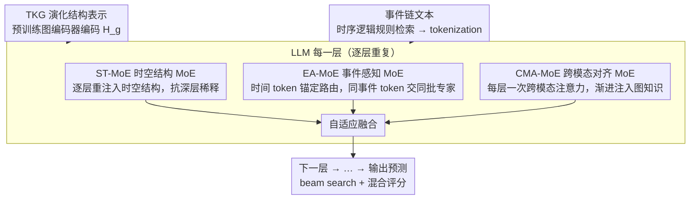

# STK-Adapter: Incorporating Evolving Graph and Event Chain for Temporal Knowledge Graph Extrapolation

**会议**: ACL 2026  
**arXiv**: [2604.19042](https://arxiv.org/abs/2604.19042)  
**代码**: [GitHub](https://github.com/Zhaoshuyuan0246/STK-Adapter)  
**领域**: 时间序列  
**关键词**: 时序知识图谱外推, MoE适配器, 跨模态对齐, 事件链建模, 图结构演化

## 一句话总结

本文提出 STK-Adapter，通过在 LLM 每一层嵌入三个 MoE 模块（ST-MoE 捕捉时空结构、EA-MoE 建模事件链语义、CMA-MoE 深度跨模态对齐），解决现有方法将 TKG 嵌入与 LLM 浅层对齐导致的时空信息丢失和逐层稀释问题，在四个基准数据集上显著超越 SOTA。

## 研究背景与动机

**领域现状**：时序知识图谱（TKG）外推旨在基于历史事件预测未来事件。早期方法（如 REGCN、TiRGN）通过图神经网络建模快照序列中的时空依赖，但将事件嵌入隐空间丢失了文本语义。随着 LLM 兴起，CoH 等方法将 TKG 线性化为文本事件链进行指令微调，但线性化过程丢失了 TKG 的拓扑结构。

**现有痛点**：(1) 浅层对齐问题——GenTKGQA、TGL-LLM 等方法用简单的 MLP 一次性将 TKG 的演化结构表示投影到 LLM 语义空间，无法充分保留时空信息；(2) 逐层稀释问题——LLM 本质上为 next-token prediction 优化，微调过程中隐层状态偏向文本语义，TKG 的演化结构特征在各层间逐渐衰减。

**核心矛盾**：TKG 的结构表示和 LLM 的文本语义处于不同模态空间，需要深度、逐层的对齐才能让 LLM 真正理解图结构。但现有方法只做"一次性投影"（浅层对齐），导致 LLM 在深层处理中逐渐"遗忘"图结构信息。

**本文目标**：设计一种灵活的适配器，在 LLM 每一层建立专用处理通道，逐层捕获并注入 TKG 的演化结构表示和事件链语义依赖。

**切入角度**：借鉴 MoE 在处理异构数据方面的优势——通过专家专化实现稀疏计算，同时显著增强模型容量。将 MoE 引入 PEFT 框架，用低秩专家池替代单一适配器。

**核心 idea**：在 LLM 每一层嵌入三个独立的 MoE 模块，分别负责 TKG 时空特征提取（ST-MoE）、事件链语义依赖建模（EA-MoE）和跨模态深度对齐（CMA-MoE），通过自适应融合整合输出，实现渐进式的多模态对齐。

## 方法详解

### 整体框架

STK-Adapter 集成在 LLM（如 Llama3-8B）的每一层中。输入包含两部分：(1) 由预训练图编码器（如 LogCL）编码的 TKG 演化结构表示 $\text{H}_g^0 = [\text{H}_s^{(t)}; \text{H}_r^{(t)}]$；(2) 由时序逻辑规则检索的事件链文本，经 LLM tokenization 后得到文本隐层表示。三个 MoE 模块在每层并行处理后通过自适应融合输出到下一层。

### 关键设计

**1. Spatial-Temporal MoE（ST-MoE）：每一层都重新注入一次时空结构，对抗深层稀释**

浅层对齐的根本毛病是 TKG 的演化结构只在第一层被投影进来，越往 LLM 深层越被文本语义冲淡。ST-MoE 的对策是把"注入"从一次性变成逐层迭代：稀疏激活路由器 $f_{\text{ST\_router}}$ 根据上一层的 TKG 表示 $\text{H}_g^{l-1}$ 算路由权重并激活 Top-k 专家，每个专家用瓶颈结构（下投影→非线性→上投影）在专化的低维子空间里建模时空模式，输出按路由权重加权聚合 $\overline{\text{H}}_g^l = \sum_{i \in \mathcal{A}^l} \text{gate}_i^l \cdot \text{E}^{(i)}(\text{H}_g^{l-1})$。这样每一层都重新过一遍时空信息，结构特征不再随深度衰减，浅层对齐"投影完只能祈祷模型别忘"的问题被从机制上堵住。

**2. Event-Aware MoE（EA-MoE）：用时间 token 锚定路由，把同一事件的 token 绑在一起处理**

ST-MoE 抓的是图层面的时空结构，但事件链里那种"事件重复、时间先后"的复杂时序语义依赖它刻画不够。EA-MoE 复用 ST-MoE 的专家结构，关键改动在路由器：同一时间戳下的所有 token 共享同一路由信号——对第 $j$ 个 token，路由信号取自它对应的时间 token $\tau(j)$ 的隐层状态，即 $\hat{\text{gate}}_j^l = f_{\text{EA\_router}}(\hat{\text{H}}_{\tau(j)}^l)$。这保证了属于同一事件的 token 被一致地交给同一批专家处理，专家因此能专化到不同的时序语义模式上。消融里去掉 EA-MoE 掉点最猛，正说明事件链语义这一路是整个框架最吃重的部分。

**3. Cross-Modality Alignment MoE（CMA-MoE）：每一层做一次跨模态注意力，把图知识渐进式注入文本表示**

结构空间和文本语义空间隔着一道模态鸿沟，传统 MLP 一次性投影根本弥合不了。CMA-MoE 改成在每一层都做一次 TKG 引导的跨模态注意力：每个专家以事件链表示 $\hat{\text{H}}_{\text{text}}^l$ 作 Query、以 TKG 表示 $\text{H}_g^{l-1}$ 作 Key 和 Value，通过 $\text{Softmax}(\frac{QK^\top}{\sqrt{d_k}})V$ 把演化结构知识注入文本表示；路由器同样由 TKG 表示驱动，优先从时空角度挑对齐策略。一层层精炼下来，LLM 的语义空间和 TKG 的结构空间被渐进式地深度融合，而不是浅层一锤子买卖。

### 损失函数 / 训练策略

总损失由交叉熵和负载均衡损失组成：$\mathcal{L} = -\sum_{i=1}^{|Y|} \log P(y_i | y_{<i}, \mathcal{C}, \mathcal{G}) + \alpha \sum_{j=1}^{n} f_j \cdot p_j$。图编码器预训练后冻结，LLM 主干冻结，仅微调 STK-Adapter（2 个 epoch）。推理时采用 beam search（B=20）+ 混合评分策略，融合 LLM 解码分数和拓扑感知分数。

## 实验关键数据

### 主实验

| 模型 | ICE14 Hit@1 | ICE18 Hit@1 | ICE15 Hit@1 | WIKI Hit@1 |
|------|-----------|-----------|-----------|----------|
| LogCL | 37.76 | 24.53 | 46.07 | 70.85 |
| LLM-DA (LogCL) | 37.71 | 22.83 | 40.90 | 79.10 |
| MESH | 35.22 | 23.61 | 38.62 | 75.03 |
| **STK-Adapter (LogCL)** | **41.16** | **25.95** | **48.82** | 82.43 |

### 消融实验

| 配置 | ICE14 Hit@1 | WIKI Hit@1 | 说明 |
|------|-----------|----------|------|
| STK-Adapter | 37.26 | 82.14 | 完整模型 (REGCN编码器) |
| w/o EA-MoE | 35.56 | 74.36 | 去掉事件感知MoE，掉点最大 |
| w/o ST-MoE | 37.03 | 80.11 | 去掉时空MoE |
| w/o CMA-MoE | 36.86 | 80.08 | 去掉跨模态对齐MoE |
| w/o ST- & CMA-MoE | 33.12 | 78.37 | 去掉整个TKG分支 |
| w LoRA | 32.47 | 72.10 | 用LoRA替代STK-Adapter |

### 关键发现

- EA-MoE 贡献最大——去掉后 WIKI Hit@1 从 82.14% 暴跌至 74.36%（-7.78pp），说明事件链语义建模比图结构更关键
- 用 LoRA 替代 STK-Adapter 导致性能大幅下降（-4.79pp ICE14, -10.04pp WIKI），证明专门的适配器设计优于通用 PEFT
- STK-Adapter 可兼容不同图编码器（REGCN、TiRGN、CognTKE、LogCL）且始终优于对应的 LLM-DA 基线
- 跨不同 LLM 主干（Llama3-8B、Qwen2.5-7B、Mistral-7B）均保持一致的性能优势

## 亮点与洞察

- 逐层注入 TKG 信息的思路从根本上解决了"信息稀释"问题——不是一次性投影后祈祷 LLM 不遗忘，而是在每一层都强制刷新结构信息。这个设计可迁移到任何需要将外部结构化知识持续注入 LLM 的场景
- 事件感知路由器的设计很巧妙——通过时间 token 锚定实现同事件 token 共享路由，既保证了处理一致性又隐式建模了时序结构
- 编码器无关设计使得 STK-Adapter 可以即插即用地集成任何预训练图编码器，降低了工程实现成本

## 局限与展望

- 仅在四个相对较小的 TKG 数据集上评估，缺乏大规模 TKG 上的验证
- 固定使用 4 个专家和 Top-1 路由，未探索更多专家数量或路由策略
- 预训练图编码器冻结后可能限制了 STK-Adapter 的上限——联合端到端训练可能进一步提升

## 相关工作与启发

- **vs GenTKGQA/TGL-LLM**: 浅层投影（MLP）对齐 TKG 与 LLM，STK-Adapter 通过逐层 MoE 实现深度对齐
- **vs CoH**: 纯文本线性化丢失拓扑结构，STK-Adapter 保留并持续注入图结构
- **vs LLM-DA**: 仅在推理时融合 TKG 分数，STK-Adapter 在训练时就深度整合

## 评分

- 新颖性: ⭐⭐⭐⭐ 三MoE逐层注入的框架设计新颖，但MoE+适配器的组合有先例
- 实验充分度: ⭐⭐⭐⭐⭐ 4数据集+多编码器兼容性+多LLM兼容性+详细消融
- 写作质量: ⭐⭐⭐⭐ 结构清晰但公式较多，方法部分偏冗长
- 价值: ⭐⭐⭐⭐ 对TKG+LLM集成领域有明确推进，编码器无关设计实用性强

<!-- RELATED:START -->

## 相关论文

- [\[ACL 2025\] ANRE: Analogical Replay for Temporal Knowledge Graph Forecasting](../../ACL2025/time_series/anre_analogical_replay_for_temporal_knowledge_graph_forecasting.md)
- [\[ACL 2025\] G2S: A General-to-Specific Learning Framework for Temporal Knowledge Graph Forecasting with Large Language Models](../../ACL2025/time_series/g2s_a_general-to-specific_learning_framework_for_temporal_knowledge_graph_foreca.md)
- [\[ICML 2026\] Beyond Extrapolation: Knowledge Utilization Paradigm with Bidirectional Inspiration for Time Series Forecasting](../../ICML2026/time_series/beyond_extrapolation_knowledge_utilization_paradigm_with_bidirectional_inspirati.md)
- [\[NeurIPS 2025\] Simple and Efficient Heterogeneous Temporal Graph Neural Network](../../NeurIPS2025/time_series/simple_and_efficient_heterogeneous_temporal_graph_neural_network.md)
- [\[NeurIPS 2025\] Graph-based Neural Space Weather Forecasting](../../NeurIPS2025/time_series/graph-based_neural_space_weather_forecasting.md)

<!-- RELATED:END -->
