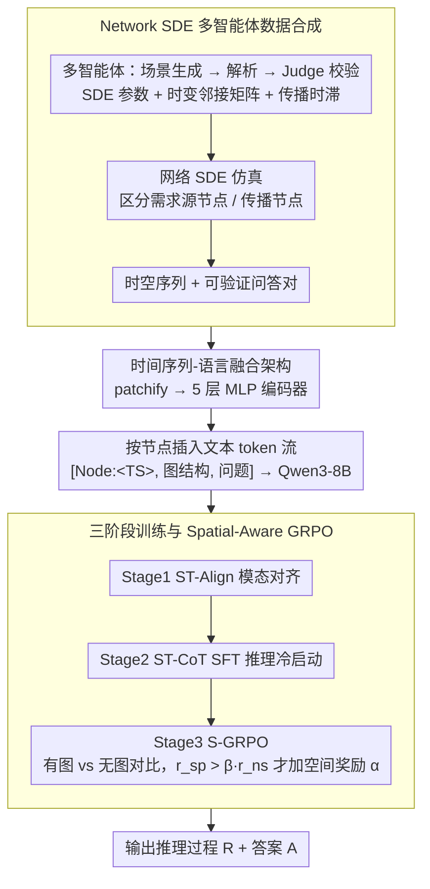

# STReasoner: Empowering LLMs for Spatio-Temporal Reasoning in Time Series via Spatial-Aware Reinforcement Learning

**会议**: ACL2026  
**arXiv**: [2601.03248](https://arxiv.org/abs/2601.03248)  
**代码**: https://github.com/LingFengGold/STReasoner  
**领域**: 时空推理 / 自动驾驶  
**关键词**: 时空时间序列, 空间感知强化学习, S-GRPO, 合成数据, 多模态LLM  

## 一句话总结
STReasoner 用网络 SDE 合成带图结构和文本语义的时空时间序列数据，再通过时间序列编码器、三阶段训练和空间感知 S-GRPO，让 LLM 学会基于时间动态与空间依赖做显式推理。

## 研究背景与动机
**领域现状**：交通网络、电网、疾病传播、河流与气候系统都可以表示为节点上的时间序列加空间图结构。现有时空模型大多优化预测精度，例如未来流量或未来数值；而 LLM/时间序列语言模型虽然能处理问答或多步推理，却通常忽略节点间的空间依赖。

**现有痛点**：真实决策场景不只是预测某个数值，还需要回答“什么原因导致了哪里在什么时候变化”。例如交通拥堵中，用户问“哪个源节点导致 Node 2 在 9:00 拥堵”，模型必须追踪上游节点、传播延迟和时间序列变化，而不是只看 Node 2 在 9:00 的数值。

**核心矛盾**：时空推理同时需要数值精度、图结构依赖和自然语言解释。现有预测模型缺少显式 reasoning；现有 LLM 缺少时空先验；普通 RL 只奖励最终答案，模型可能依赖表面时间模式，而不真正利用图结构。

**本文目标**：作者提出三个配套目标：构造可控且文本对齐的时空推理数据；定义覆盖多种推理能力的 ST-Bench；训练一个能融合时间序列、图和文本的 STReasoner，并用空间感知 RL 奖励让模型真正依赖空间结构。

**切入角度**：论文从数据合成开始做闭环。先用 Network SDE 和多智能体生成器创造有明确空间传播、时滞和语义描述的数据，再用这些数据训练 TS-LM，最后用“有图输入比无图输入表现更好才给奖励”的对比式 S-GRPO 强化空间 grounding。

**核心 idea**：把时空推理建模成 $f:(Q,T,G)->(R,A)$，并通过“时间序列编码 + 图文本提示 + 空间依赖奖励”让 LLM 的推理过程必须对时间动态和图结构同时敏感。

## 方法详解

### 整体框架
STReasoner 要解决的是：给定图 $G=(V,E)$、每个节点的时间序列 $T_i$ 和自然语言 query $Q$，让 LLM 输出中间推理过程 $R$ 和最终答案 $A$，即学习映射 $f:(Q,T,G)\to(R,A)$。整条管线分三层：数据层用 Network SDE 配合多智能体流水线合成同时带图结构、时间动力学和文本语义的时空数据；模型层把每个节点的时间序列 patchify 后送进 5 层 MLP encoder，再按节点顺序把 embedding 插进文本 token 流，和图结构描述、问题一起喂给 Qwen3-8B；训练层用 Align、SFT、S-GRPO 三阶段，依次完成模态对齐、推理冷启动和空间感知强化。

### 关键设计

**1. Network SDE 多智能体数据合成：造出可控、文本对齐、能自动出题的时空世界**

时空推理同时要数值精度、图依赖和语言语义，但现实数据里这三者很难同时齐备且可验证——只有时间序列没文本，LLM 学不到语义；只有文本没可控图动力学，又无法判断模型的空间推理对不对。作者干脆用 Network SDE 造一个可解释的底层世界模型：每个节点的连续 latent process 由 drift、diffusion 和邻居耦合项共同决定，并区分 demand source nodes 和 propagation nodes——前者带正弦、均值回复等外生时间模式，后者主要被邻居驱动；边权是 time-varying adjacency，能模拟早晚高峰的方向切换；每条边还带 propagation lag，对应交通、污染、疾病传播的时滞。围绕它的多智能体流水线各司其职：Scenario Generation Agent 产出交通/能源/公共健康等场景描述，Scenario Parsing Agent 把描述解析成节点、边、时间模式和空间依赖，Judge Agent 校验逻辑，SDE Parameters Agent 与 Time-Varying Adjacency Agent 分别给出节点 drift/diffusion、耦合强度、时变边权和时滞，最后仿真模块积分网络 SDE 得到时空序列。因为底层动力学完全已知，问答对可以自动生成且答案可验证。

**2. 时间序列-语言融合架构：在数值精度和 token 成本之间折中**

纯文本表示时间序列 token 成本极高，纯图像表示又会丢精确数值。STReasoner 用一个轻量 5 层 MLP 当 time series encoder：输入序列先 patchify，编码后的 patch embedding 作为特殊标记按节点顺序插进文本流，例如 `[Node1:<TS1>, Node2:<TS2>, ..., Graph, Question]`，其中图结构以文本方式给出。它还借用 ChatTS 的 value-preserving normalization，尽量保住原始数值而不只保留形状。这样既保留了全局形状又保留了数值精度，同时把 token 成本压到远低于"把时间序列写成长文本"的水平。

**3. 三阶段训练与 Spatial-Aware GRPO：把"真的用了图结构"变成优化目标**

普通 GRPO 只看最终答案对错，模型完全可能从时间趋势里猜出答案、根本没用图结构，所以需要分阶段建立能力并显式奖励空间 grounding。Stage 1 用 ST-Align 做大规模对齐预训练，问题覆盖时间、空间和时空三类属性；Stage 2 用 ST-CoT 做 SFT 冷启动，CoT 由 Claude-4.5-Sonnet 对每题采样 5 个候选、经 rejection sampling 只保留答案正确的推理轨迹；Stage 3 是核心的 S-GRPO：同一问题生成两组回复，一组带显式空间结构 $o^{sp}$、一组不带 $o^{ns}$，当且仅当带图回复的奖励显著优于不带图、即满足 $r^{sp}>\beta r^{ns}$ 时，才额外给空间奖励 $\alpha$，否则只用原始 $r^{sp}$，最后在组内归一化 advantage 并用 GRPO 目标更新。这个对比式设计要求"有图确实更好"才加分，等于直接把"利用空间结构"写进了奖励函数。

### 损失函数 / 训练策略
任务奖励由格式奖励和任务奖励加权组成，输出必须符合 `<think>...</think><answer>...</answer>`。离散标签任务答对得 1，答错得 0；预测序列任务用相对误差打分，长度完全匹配还会有小奖励。最终单样本奖励为 $r=(1-\lambda)r_{task}+\lambda r_{format}$，论文取 $\lambda=0.5$。实现上，Stage 1 训练 ST-Align 1000 steps，Stage 2 训练 ST-CoT 400 steps，学习率 $1e-5$；Stage 3 RL 用 ST-RL 训练 1 epoch，group size 8，空间奖励参数 $\alpha=0.1$、$\beta=0.8$，学习率 $1e-7$。

## 实验关键数据

### 主实验
主表包含四个任务：T1 病因/来源推理、T2 空间实体识别、T3 空间相关推理、T4 in-context forecasting。T1-T3 用 ACC，T4 用 MAE。STReasoner 在推理类任务上超过闭源大模型，并以低很多的成本运行。

| 模型 | 输入方式 | T1 ACC | T2 ACC | T3 ACC | T4 MAE | 估计成本 |
|------|----------|--------|--------|--------|--------|----------|
| GPT-5.2 | Text | 83.09 | 38.78 | 58.79 | 63.99 | $22.48 |
| GPT-5.2 | Image | 86.47 | 40.54 | 65.08 | 64.70 | $6.69 |
| Claude-4.5-Sonnet | Text | 78.64 | 41.93 | 77.87 | 63.74 | $45.80 |
| Qwen3-8B | Text | 21.26 | 5.28 | 5.53 | 94.03 | $3.85 |
| Qwen3-8B SFT+S-GRPO | Text | 89.37 | 65.41 | 81.34 | 66.35 | $3.85 |
| Qwen3-VL-8B SFT+S-GRPO | Image | 91.79 | 69.43 | 83.92 | 67.29 | $0.66 |
| ChatTS-8B | TS Encoder | 56.52 | 19.51 | 41.08 | 85.14 | $0.27 |
| Time-R1-7B | Text | 60.39 | 29.65 | 48.62 | 68.15 | $3.85 |
| STReasoner-8B | TS Encoder | 95.65 | 75.71 | 87.12 | 65.59 | $0.27 |

### 消融实验
三阶段训练缺一不可。Align 单独不能推理，SFT 是冷启动关键，S-GRPO 比普通 GRPO 更能提升空间任务表现。

| 配置 | T1 ACC | T2 ACC | T3 ACC | T4 MAE | 说明 |
|------|--------|--------|--------|--------|------|
| STReasoner: Align+SFT+S-GRPO | 95.65 | 75.71 | 87.12 | 65.593 | 完整三阶段 |
| Align+SFT+GRPO | 91.79 | 69.60 | 86.12 | 69.961 | 去掉空间感知奖励 |
| SFT+S-GRPO | 91.30 | 67.76 | 83.98 | 69.014 | 无 alignment pretraining |
| Align+SFT | 88.41 | 63.32 | 80.97 | 66.653 | 无 RL |
| SFT | 90.34 | 61.47 | 81.47 | 71.096 | 仅监督推理冷启动 |
| S-GRPO | 47.34 | 23.20 | 39.20 | 91.921 | 无 SFT 冷启动，奖励太稀疏 |
| Align | 3.38 | 8.79 | 3.77 | 75.360 | 只做模态对齐不能产生推理能力 |

### 泛化与空间奖励分析

| 实验 | GPT-5.2 | Claude-4.5-Sonnet | STReasoner | 结论 |
|------|---------|-------------------|------------|------|
| CausalRivers 零样本 ACC | 22.32 | 83.18 | 98.82 | 只用合成数据训练也能迁移到真实河流因果图 |
| CausalRivers 成本 | $6.15 | $2.35 | $0.05 | TS encoder 输入成本优势明显 |
| RL step 1 w/ graph vs w/o graph | 82.4 vs 81.9 | 无 | 差距 0.5 | 初期空间依赖还不明显 |
| RL step 51 w/ graph vs w/o graph | 95.65 vs 89.4 | 无 | 差距 6.2 | S-GRPO 让模型越来越依赖图结构 |

### 关键发现
- STReasoner 的优势主要集中在 T1-T3 的时空推理任务，而不是纯 forecasting。T4 MAE 与闭源模型接近但不绝对领先，说明它的核心价值是解释和推理。
- 将时间序列作为图像提示比文本提示更便宜且更强，但仍不如专门的 TS encoder。图像保留全局形状，文本保留数值，STReasoner 试图同时保留两者。
- Align 单独分数很低，说明模态对齐不是推理能力；SFT 是 RL 的必要冷启动，直接 S-GRPO 会因奖励稀疏而不稳定。
- S-GRPO 相比普通 GRPO 平均提升约 5.10%，并且让“显式使用空间信息的回复比例”更高，证明它改变的不只是答案分数，还有推理行为。

## 亮点与洞察
- 论文最大的亮点是把“空间信息是否真的被利用”做成了对比式奖励，而不是只在输入里给一张图然后希望模型自己学会。
- 数据合成管线设计得很完整。Network SDE 控制时间动态，time-varying adjacency 控制空间依赖，propagation lag 控制时滞，非常适合构造可验证问答。
- ST-Bench 的四任务划分清晰：病因、实体、相关、预测分别对应“为什么、是谁、如何相关、接下来怎样”，比单一预测指标更接近决策需求。
- 结果显示，闭源大模型在这类结构化数值推理上并没有天然优势。只要数据和奖励设计合适，8B 模型可以以极低成本超过大模型 API。

## 局限与展望
- 训练和主评测大量依赖合成数据。虽然 CausalRivers 零样本结果很强，但真实世界中的噪声、缺失值、非平稳性和隐变量会更复杂。
- 时间序列编码器只是 5 层 MLP，对本文构造的结构化信号足够，但对高维多变量传感器、异步采样或多模态交通/气象数据可能不够。
- 图结构在实验中是显式给定的。许多现实场景需要从数据中同时推断图和做推理，STReasoner 还没有覆盖这一层。
- S-GRPO 依赖成对的 w/ graph 和 w/o graph rollout，会增加训练成本。未来可以探索更轻量的空间使用判别器或局部奖励。

## 相关工作与启发
- **vs 时间序列语言模型**: ChatTS、Time-MQA 等主要把时间序列接入语言模型，但缺少图结构和空间传播奖励；STReasoner 明确面向时空图上的推理任务。
- **vs 时空预测模型**: 传统 STGNN 或 forecasting 模型擅长预测数值，却不生成自然语言推理链。STReasoner 把预测、溯因和实体识别统一到 QA 形式。
- **vs 普通 GRPO/RL reasoning**: DeepSeek-R1 风格奖励重最终答案，S-GRPO 额外要求图结构带来性能增益，因此更适合多模态结构化推理。
- **对自动驾驶的启发**: 交通场景中很多问题都是“上游哪个路段导致拥堵”“事件影响何时传播到下游”。这种空间奖励可以迁移到车路协同、路网异常解释和多传感器诊断。

## 评分
- 新颖性: ⭐⭐⭐⭐⭐ 数据合成、TS-LM 架构和 S-GRPO 形成了完整新问题范式。
- 实验充分度: ⭐⭐⭐⭐☆ 主实验、消融、真实数据零样本和奖励分析充分，但真实场景覆盖仍有限。
- 写作质量: ⭐⭐⭐⭐☆ 方法链条清楚，表格信息量大，部分训练细节分散在附录中。
- 价值: ⭐⭐⭐⭐⭐ 对时空时间序列上的 LLM 推理是很有开创性的工作，应用场景很广。

<!-- RELATED:START -->

## 相关论文

- [\[ICML 2026\] Nested Spatio-Temporal Time Series Forecasting](../../ICML2026/time_series/nested_spatio-temporal_time_series_forecasting.md)
- [\[NeurIPS 2025\] Learning with Calibration: Exploring Test-Time Computing of Spatio-Temporal Forecasting](../../NeurIPS2025/time_series/learning_with_calibration_exploring_test-time_computing_of_spatio-temporal_forec.md)
- [\[ICML 2026\] Learning Long Range Spatio-Temporal Representations over Continuous Time Dynamic Graphs with State Space Models](../../ICML2026/time_series/learning_long_range_spatio-temporal_representations_over_continuous_time_dynamic.md)
- [\[ICML 2026\] PATRA: Pattern-Aware Alignment and Balanced Reasoning for Time Series Question Answering](../../ICML2026/time_series/patra_pattern-aware_alignment_and_balanced_reasoning_for_time_series_question_an.md)
- [\[ICLR 2026\] SciTS: Scientific Time Series Understanding and Generation with LLMs](../../ICLR2026/time_series/scits_scientific_time_series_understanding_and_generation_with_llms.md)

<!-- RELATED:END -->
