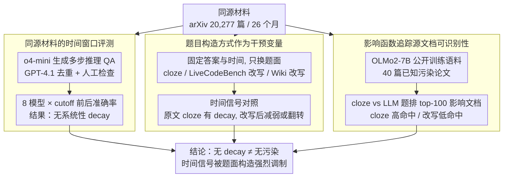

# Test of Time: Rethinking Temporal Signal of Benchmark Contamination

**会议**: ACL2026  
**arXiv**: [2509.00072](https://arxiv.org/abs/2509.00072)  
**代码**: 无  
**领域**: LLM评测 / 基准污染 / 时间分析  
**关键词**: 基准污染、时间信号、LLM评测、题目改写、影响函数

## 一句话总结
这篇论文证明“cutoff 之后性能下降”并不是稳健的 benchmark contamination 证据：同一批源文档只要从原文填空题换成 LLM 改写题，时间衰减信号就会显著改变甚至消失。

## 研究背景与动机
**领域现状**：大模型评测越来越依赖公开 benchmark，但公开题目、题解、衍生讨论很可能进入训练语料。因为多数前沿模型不公开训练数据，研究者常用间接探针判断污染，其中一个流行做法是 temporal analysis：比较模型在训练 cutoff 前后发布题目上的表现，如果 cutoff 后明显变差，就把这种 post-cutoff performance decay 解读为 pre-cutoff 题目被记住了。

**现有痛点**：这个推断看似直观，却把“题目发布时间”与“题目构造方式”混在了一起。很多时间 benchmark 直接从网页、竞赛或论文中截取原题；另一些 benchmark 则让 LLM 根据同一源材料生成新题。两者虽然共享源材料，但表面形式、检索线索和可背诵程度完全不同，因而同一模型可能在一种格式上像是在记忆，在另一种格式上却像是在真正推理。

**核心矛盾**：时间衰减信号想测的是训练语料和测试题的污染关系，但实际观测到的是“模型能否把测试输入追溯到训练中见过的文本”。如果题目被 LLM 改写得足够远，即便源论文在训练集中，模型也未必能把当前问题和源文档对上号；反过来，cloze 或原文片段会暴露强烈的记忆线索。

**本文目标**：作者要回答三个问题：第一，LLM 生成的 arXiv 推理题是否真的缺少 post-cutoff decay；第二，这种缺失是否由题目生成方式造成，而不是源材料本身没有污染；第三，能否从模型内部机制上解释为什么 cloze 与 LLM 生成题给出不同信号。

**切入角度**：论文的关键控制变量是“同一源材料，不同题面”。作者围绕同一批 arXiv 论文构造 LLM-synthesized QA 与 cloze QA，再把这个想法迁移到 LiveCodeBench 和 Wikipedia current events，最后用 open-data 模型 OLMo2 的训练语料做 influence function 分析。

**核心 idea**：用题目构造方式作为干预变量，证明 temporal contamination signal 对题面变换高度敏感，不能单独作为污染结论的充分证据。

## 方法详解

### 整体框架
这篇论文不提出新模型，而是搭了一个三层验证框架来拆解"cutoff 后性能下降 = 污染"这条推断：性能层先在 26 个月、8 个前沿模型上比较 LLM 生成 arXiv 推理题的 cutoff 前后准确率；干预层把同一批源论文换成 cloze 填空题、并把改写实验扩展到 LiveCodeBench 和 Wikipedia QA，只动题面、不动答案与发布时间；机制层在公开训练数据的 OLMo2-7B-Instruct 上用影响函数追踪模型回答时究竟最受哪些训练文档影响。最终产出不是一个模型，而是一组污染探针结果，把"是否污染"拆成"题面可追溯性"和"源材料是否在训练中出现"两个独立层面。

### 关键设计

**1. 同源材料的时间窗口评测：先确认 LLM 生成题是否稳定地"不掉点"**

要质疑时间衰减信号，第一步得复现并放大它本该出现的场景。作者用 arXiv API 抓取 20,277 篇覆盖 26 个月的 math / physics 论文，用 o4-mini 从 theorem 等材料生成需 5 步以上推理的 QA，经 GPT-4.1 去重和人工检查后保留 1,098 篇论文对应的 1,643 题；每月准确率按 $Accuracy_m=C_m/Q_m$ 归一化，再围绕各模型 cutoff 做 pre/post 对比。如果这些题在多个模型、多个领域、多个 cutoff 上都不掉点，就说明"源材料来自公开 arXiv"本身并不足以制造 temporal decay——问题必然出在题面是否还保留可记忆的原文线索。

**2. 题目构造方式作为干预变量：固定答案与时间，只让"是否近似原文"变化**

时间信号想测污染，实测到的却是"模型能否把测试输入追溯回训练中见过的文本"，这两者被题面形式混在了一起。作者把题目构造方式抽成干预变量：对 arXiv 摘要构造 cloze 题，每篇 mask 5 个语义关键短语；对 LiveCodeBench 的 400 道题用 o4-mini 改写变量名、语义背景和符号但保持算法解法不变；对 Wikipedia current events 构造 dated MCQ、只改写问题陈述而保留选项与答案。难度、答案、发布时间都尽量钉死，唯一变化的是"题面有多接近原文"。一旦 temporal decay 在原文 / cloze 形式出现、却在 LLM 改写形式下减弱甚至翻转，就证明时间信号不是稳定污染指标，而是被 benchmark construction 强烈调制。

**3. 影响函数追踪源文档可识别性：从机制上解释为什么同一污染源给出不同信号**

性能曲线只能呈现现象，回答不了"模型回答时是否真把源论文当成关键训练点"。作者选 OLMo2-7B-Instruct，因为它公开训练数据、可确认某些 arXiv 论文确实在训练集中：对 40 篇已知污染论文分别构造 cloze 与 LLM-generated QA，在含这些论文的 10,000 个训练文档样本里排 top-100 influential documents，影响分数用 Kronfluence / EK-FAC 近似，核心形式是 $I_f(z) \approx -\nabla_\theta f(\theta_s)^\top (G+\lambda I)^{-1}\nabla_\theta L(z,\theta_s)$。结果 cloze 题对源文档高命中、LLM 改写题低命中，正好从内部机制印证"改写削弱了源文档的可追溯性"这一解释。

### 损失函数 / 训练策略
本文不是提出训练新模型，而是提出评测和分析流程。问题生成阶段使用 o4-mini high reasoning effort，过滤阶段用 GPT-4.1 删除重复或简单样本，并通过人工检查保证 deterministic answer、至少 5 个中间推理步骤、题意清晰和可从源材料推导。模型评测通过 OpenRouter API 运行，不允许 web search，以减少隐藏检索对时间分析的干扰。影响函数实验使用 OLMo2-7B-Instruct 的公开训练语料，并用 EK-FAC 近似 inverse-curvature vector product，以便在大模型上做可计算的训练点归因。

## 实验关键数据

### 主实验
LLM 生成的 arXiv 多步 QA 没有出现系统性 post-cutoff decay。physics 领域中，多数模型 cutoff 后反而略有提升；16 个模型-领域观测的平均变化为 +2.19 个百分点，95% CI 为 [+0.61, +3.78]，配对 t 检验 $p=0.010$。

| 设置 | 模型 / 统计量 | Pre-cutoff | Post-cutoff | Gap(Post-Pre) | 结论 |
|------|---------------|------------|-------------|---------------|------|
| Physics, LLM-generated QA | DeepSeek-R1 | 21.1 | 22.7 | +1.6 pp | 无下降 |
| Physics, LLM-generated QA | Gemini-2.5-Flash | 33.3 | 39.2 | +5.9 pp | cutoff 后更高 |
| Physics, LLM-generated QA | Llama-3.3-70B | 15.1 | 15.5 | +0.4 pp | 基本持平 |
| Physics, LLM-generated QA | o4-mini | 36.8 | 40.5 | +3.7 pp | cutoff 后更高 |
| Math + Physics 汇总 | 16 个观测均值 | - | - | +2.19 pp | 反证“必然下降” |

### 消融实验
当同一源论文被改成 cloze 题后，时间衰减重新出现；当 LiveCodeBench 或 Wiki QA 被 LLM 语义改写后，原本更明显的衰减被削弱或移除。

| 干预 | 指标 / 模型 | 原始或 cloze gap | LLM-transformed gap | 说明 |
|------|-------------|------------------|---------------------|------|
| RealMath arXiv cloze | GPT-4o-mini, LLM judge | -3.83 pp | 不适用 | cloze 形式出现下降 |
| RealMath arXiv cloze | Llama-3.1-405B, LLM judge | -5.25 pp | 不适用 | 大模型也有下降 |
| RealMath arXiv cloze | Claude-3.5-Sonnet, BLEU | -6.60 pp | 不适用 | 字面匹配指标同样下降 |
| Wiki-based QA | GPT-3.5-turbo | -2.65 pp | -0.62 pp | 改写显著减弱下降 |
| Wiki-based QA | GPT-4 | -1.04 pp | +2.81 pp | 改写后变为提升 |
| Wiki-based QA | GPT-4o-mini | -7.59 pp | -4.99 pp | 下降仍在但幅度变小 |

机制实验进一步显示，cloze 题让模型更容易追踪到训练中的源文档，而 LLM-generated QA 让这种追踪变得困难。

| 问题形式 | Top-1 hit rate | Top-3 hit rate | 样本数 | 含义 |
|----------|----------------|----------------|--------|------|
| Cloze questions | 77.5% | 100.0% | 40 篇污染论文 | 源论文常是最有影响训练文档 |
| LLM-generated QA | 17.5% | 25.0% | 40 篇污染论文 | 同源材料经生成后更难被追溯 |

### 关键发现
- 最关键的发现不是“没有污染”，而是“没有 decay 不等于没有污染”。影响函数实验显示 LLM-generated QA 可以来自已知训练文档，但 temporal decay 仍然不明显。
- 题目构造方式是强混杂因素。直接源文本 / cloze 问题更像记忆探针，LLM 改写题更像语义迁移或推理探针，两者对 contamination 的敏感性不同。
- LiveCodeBench 与 Wiki QA 的跨域验证很重要，因为它说明这个现象不是 arXiv theorem QA 的特例，而是更一般的 benchmark transformation 效应。

## 亮点与洞察
- 把污染检测从“看 cutoff 曲线”推进到“同源材料、不同题面”的因果式对照，这是本文最有价值的设计。它提醒后续 benchmark 不应只报告题目发布日期，还要报告题目如何从源材料构造出来。
- influence function 的使用很巧妙：它没有试图证明所有黑盒模型是否污染，而是在 open-data 模型上建立一个机制示例，说明源文档在训练集中并不保证 LLM 改写题能触发记忆式检索。
- 对评测实践的启发很直接：如果一个 benchmark 依赖时间新鲜度，最好同时测试原文式、cloze 式、语义改写式和结构保持式变体；只看一个 scalar accuracy gap 很容易过度解读。

## 局限与展望
- arXiv 时间窗口为 26 个月，虽然覆盖多个模型 cutoff，但仍可能受到各月论文难度、领域热度和题目生成质量变化的影响。
- 影响函数实验只有 40 篇已知污染论文，主要受计算成本限制；结论机制清晰，但统计规模仍偏小。
- LLM 生成题与 cloze 题不只在“是否改写”上不同，也可能在难度、答案粒度和评分可靠性上不同。未来可以设计更细的连续扰动强度，量化题面距离与 temporal signal 的关系。
- 本文主要讨论污染检测，尚未给出一个可替代 temporal analysis 的完整新指标。更稳健的方向可能是组合时间切分、近重复检测、影响函数或成员推断、多版本题面一致性测试。

## 相关工作与启发
- **vs Time Travel / LiveCodeBench 类 temporal analysis**: 这些工作把 cutoff 前后差异视为污染线索，本文指出这个线索对题目构造高度敏感，因此更适合作为 warning signal，而不是单独下结论的证据。
- **vs rephrasing / perturbation contamination probes**: 既有工作常观察到改写后性能下降，并解释为模型推理脆弱或污染。本文反过来展示改写也可能移除 temporal decay，说明“改写后分数变化”本身要结合构造机制解释。
- **vs RealMath**: RealMath 发现 LLM-generated research-level math QA 没有明显 post-cutoff decay，本文把这个现象扩展到更大时间窗口、更多模型和 physics 领域，并用 cloze 对照解释其原因。
- **vs 训练数据审计方法**: 直接训练数据审计要求模型开发者公开数据，现实中很难。本文的 influence-function 小规模 open-data 实验给黑盒评测提供了机制参考，但还不能替代大规模数据审计。

## 评分
- 新颖性: ⭐⭐⭐⭐☆ 把 temporal contamination signal 与 benchmark construction 解耦，问题设定很敏锐。
- 实验充分度: ⭐⭐⭐⭐☆ 有 arXiv、LiveCodeBench、Wiki 和影响函数四组证据，但机制实验样本较小。
- 写作质量: ⭐⭐⭐⭐☆ 论证线清楚，实验层次递进，少数表格信息较密。
- 价值: ⭐⭐⭐⭐⭐ 对 LLM benchmark 新鲜度、污染检测和题目生成规范都有直接警示意义。

<!-- RELATED:START -->

## 相关论文

- [\[NeurIPS 2025\] Learning with Calibration: Exploring Test-Time Computing of Spatio-Temporal Forecasting](../../NeurIPS2025/time_series/learning_with_calibration_exploring_test-time_computing_of_spatio-temporal_forec.md)
- [\[NeurIPS 2025\] SynTSBench: Rethinking Temporal Pattern Learning in Deep Learning Models for Time Series](../../NeurIPS2025/time_series/syntsbench_rethinking_temporal_pattern_learning_in_deep_learning_models_for_time.md)
- [\[ACL 2026\] STReasoner: Empowering LLMs for Spatio-Temporal Reasoning in Time Series via Spatial-Aware Reinforcement Learning](streasoner_empowering_llms_for_spatio-temporal_reasoning_in_time_series_via_spat.md)
- [\[ICLR 2026\] Uni-NTFM: A Unified Foundation Model for EEG Signal Representation Learning](../../ICLR2026/time_series/uni-ntfm_a_unified_foundation_model_for_eeg_signal_representation_learning.md)
- [\[ICLR 2026\] Decentralized Attention Fails Centralized Signals: Rethinking Transformers for Medical Time Series](../../ICLR2026/time_series/decentralized_attention_fails_centralized_signals_rethinking_transformers_for_me.md)

<!-- RELATED:END -->
