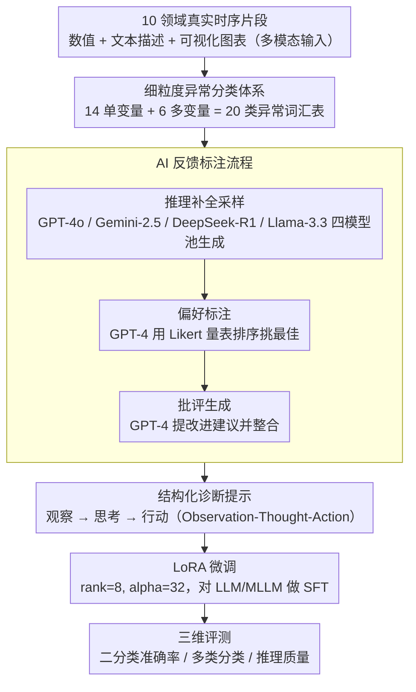

# Time-RA: Towards Time Series Reasoning for Anomaly Diagnosis with LLM Feedback

**会议**: ACL 2026  
**arXiv**: [2507.15066](https://arxiv.org/abs/2507.15066)  
**代码**: [yyysjz1997/Time-RA](https://github.com/yyysjz1997/Time-RA)  
**领域**: 时序分析 / LLM推理  
**关键词**: 时间序列异常检测, 异常推理诊断, 多模态基准, LLM微调, AI反馈标注

## 一句话总结

定义 Time-RA 新任务将时间序列异常检测从二分类升级为生成式推理诊断（检测+分类+原因解释），构建首个包含约 4 万样本、10 个领域、20 种异常类型的多模态基准 RATs40K，并通过 AI 反馈标注流程和 LLM 微调验证了该范式的可行性。

## 研究背景与动机

**领域现状**：时间序列异常检测（TSAD）在金融、医疗、AIOps、工业系统等领域至关重要。当前深度学习方法主要将其视为二分类任务（正常 vs 异常），缺乏对异常类型的细粒度分类和原因解释。

**现有痛点**：(1) 传统 TSAD 只输出二值标签，不提供根因分析所需的具体异常类别和诊断推理；(2) 现有基准数据集缺乏解释性推理标注和细粒度异常分类；(3) 多模态 TSAD 数据集大多是合成的或范围有限，无法捕获真实世界的复杂性；(4) 多模态 LLM 的推理能力在时序领域探索不足。

**核心矛盾**：异常"检测到了"但不知道"为什么异常"——理解根因对于预防性或纠正性行动至关重要，但当前方法止步于检测。

**本文目标**：(1) 定义 Time-RA 新任务——将 TSAD 从判别式升级为生成式推理诊断；(2) 构建大规模多模态基准数据集支持该任务；(3) 系统评测 LLM/MLLM 在时序推理诊断上的能力。

**切入角度**：将时序异常诊断结构化为"观察-思考-行动"（Observation-Thought-Action）三阶段流程，与人类分析师的诊断推理过程对齐，使 LLM 可以通过结构化提示学习这种诊断能力。

**核心 idea**：将 TSAD 重新定义为多目标生成任务（检测+分类+推理），通过多模态数据集（数值+文本+图像）和 AI 反馈标注流程训练 LLM 执行类人诊断推理。

## 方法详解

### 整体框架

Time-RA 把"检测异常"升级为"诊断异常"，整条流水线分四步走通：先从 10 个真实领域收集约 4 万条时序片段，并配上文本描述与可视化图表构成多模态输入；再用一套 AI 反馈标注流程把"检测标签 + 异常类别 + 诊断推理"自动写进每个样本；然后用结构化诊断提示对 LLM/MLLM 做 LoRA 微调，让它学会按人类分析师的方式推理；最后分二分类准确率、多类分类准确率、推理质量三个维度评测。

### 关键设计

**1. 细粒度异常分类体系：先给模型一份"异常词汇表"可学**

传统时序异常数据集只给"正常/异常"二值标签，模型既不知道异常属于哪一类，也无从解释根因。本文综合文献定义了 14 种单变量异常（点异常、趋势漂移、非线性模式异常等）和 6 种多变量异常（趋势偏离、联合上下文异常等），共 20 类，每一类都配有正式定义、示例时序和真实场景描述。每个样本因此同时带二值标签和具体异常类别，模型得以学习区分不同异常模式、给出针对性解释——这正是后续"生成式诊断"能成立的前提。

**2. AI 反馈标注流程：用模型互评代替人工标注 4 万条推理**

为 4 万条样本逐一人工写诊断解释并不现实，本文用三阶段流水线把标注自动化并逐层提纯。第一阶段是推理补全采样，用 GPT-4o、Gemini-2.5、DeepSeek-R1、Llama-3.3-70B 四个强模型池为每个样本各自生成诊断推理和异常分类；第二阶段是偏好标注，由 GPT-4 用 Likert 量表对模型池输出排序、挑出最佳结果；第三阶段是批评生成，GPT-4 再对最佳结果提具体改进建议并整合进最终标注。整个过程产出 15.8 万条模型输出和 15 万+ 条反馈数据点，"多模型生成 + 偏好排序 + 批评改进"的层层精炼，让标注质量逼近专家水平。

**3. 结构化诊断提示：把诊断拆成"观察-思考-行动"三段**

直接问 LLM"这段时序异常吗"，得到的回答零散又不可控。本文用结构化提示模拟人类分析师的思维：先设定角色（"时间序列异常检测专家"），再把任务分成观察（输入时序与领域知识）、思考（分析行为模式、变量关系、偏离规律）、行动（输出异常类别）三阶段，提示里还嵌入完整的异常类别列表、自然语言定义和少样本示例。这种 Observation-Thought-Action 结构让输出在清晰性、一致性和可解释性上都更稳定，也给微调提供了明确的格式目标可以对齐。

### 损失函数 / 训练策略

标准 SFT 目标：$\max_\theta \mathbb{E}_{(x,y) \sim \mathcal{D}} [\log P_\theta(y|x)]$，其中输入 $x = \{T, D, V\}$ 包含时序数据、文本描述和视觉图表，输出 $y = \{y_l, a, r\}$ 包含检测标签、异常类别和推理解释。使用 LoRA（rank=8, alpha=32）进行参数高效微调。

## 实验关键数据

### 主实验

| 模型 | 设置 | Label F1 | Action F1 | RCS (推理一致性) |
|--------|------|------|----------|------|
| DeepSeek-7B | Zero-shot | 0.47 | 0.07 | 2.17 |
| DeepSeek-7B | SFT | 提升 | 提升 | 提升 |
| Qwen2.5-7B | Zero-shot | 较低 | 较低 | 较低 |
| Qwen2.5-7B | SFT | 显著提升 | 显著提升 | 显著提升 |

### 数据集对比

| 数据集 | 样本数 | 模态 | 领域数 | 异常类别 | 推理标注 |
|------|---------|------|------|------|------|
| RATs40K (本文) | 39,574 | 时序+文本+图像 | 10 | 20 (14+6) | AI反馈 (avg 101 tokens) |
| LLMAD | 37,000 | 时序+文本+图像 | 3 | 8 | 100条人工 |
| AnomLLM | 3,200 | 时序+文本 | - | 8 | 合成 |
| VisualTimeAnomaly | 12,400 | 时序+文本+图像 | - | 9 | 合成 |

### 关键发现

- SFT 微调后 LLM 的异常检测和推理能力大幅提升，验证了 Time-RA 任务范式的有效性
- 视觉模态（时序图表）对诊断准确率有正面贡献，多模态输入优于纯文本
- 微调后的模型在未见真实数据集上展示出强"即插即用"迁移能力，优于传统 TSAD 基线
- 异常类别越复杂、跨变量关系越多的场景，模型性能下降越多，说明 Time-RA 仍是开放前沿

## 亮点与洞察

- **TSAD 的范式重定义**：从二分类到"检测+分类+推理"的三层输出，本质上将异常检测升级为异常诊断，更接近实际运维分析师的需求。这个任务定义本身就是重要贡献
- **AI 反馈标注流程的工程价值**：多模型池+偏好排序+批评改进的三阶段流程是一个可复用的大规模高质量标注范式，适用于任何需要推理标注的场景
- **RATs40K 数据集的规模和多样性**：10 个真实领域、20 种异常类型、约 4 万样本，填补了时序推理诊断领域的数据空白

## 局限与展望

- AI 反馈标注虽经 GPT-4 精炼但仍可能存在偏差，专家验证仅覆盖子集
- 当前评估中二分类和多类分类的绝对性能仍有较大提升空间
- 异常比例偏高（83.7%），可能导致模型偏向预测异常
- 可探索：引入在线/流式异常检测设置、结合领域特定知识图谱增强推理、开发交互式诊断系统

## 相关工作与启发

- **vs 传统 TSAD（如 Anomaly Transformer 等）**：传统方法仅输出二值标签，本文在此基础上增加异常分类和推理解释，提供可操作的诊断信息
- **vs LLMAD/AnomLLM**：这些前期工作探索了 LLM 做时序异常检测但数据规模小、标注简陋、不含推理；RATs40K 在规模、多样性和标注深度上全面超越

## 评分

- 新颖性: ⭐⭐⭐⭐⭐ 首次定义时序异常推理诊断任务，构建首个大规模多模态推理基准
- 实验充分度: ⭐⭐⭐⭐ 多模型评测和迁移实验充分，但缺少与更多传统方法的对比
- 写作质量: ⭐⭐⭐⭐ 任务定义清晰，数据集构建流程详尽
- 价值: ⭐⭐⭐⭐⭐ 为时序分析社区开辟新方向，数据集和代码全面开源

<!-- RELATED:START -->

## 相关论文

- [\[ICML 2026\] AnomSeer: Reinforcing Multimodal LLMs to Reason for Time-Series Anomaly Detection](../../ICML2026/time_series/anomseer_reinforcing_multimodal_llms_to_reason_for_time-series_anomaly_detection.md)
- [\[ICLR 2026\] Reasoning on Time-Series for Financial Technical Analysis](../../ICLR2026/time_series/reasoning_on_time-series_for_financial_technical_analysis.md)
- [\[ICML 2026\] IMPACT: Influence Modeling for Open-Set Time Series Anomaly Detection](../../ICML2026/time_series/impact_influence_modeling_for_open-set_time_series_anomaly_detection.md)
- [\[ICML 2026\] Adaptive Time Series Reasoning via Segment Selection](../../ICML2026/time_series/adaptive_time_series_reasoning_via_segment_selection.md)
- [\[ICLR 2026\] Rating Quality of Diverse Time Series Data by Meta-learning from LLM Judgment](../../ICLR2026/time_series/rating_quality_of_diverse_time_series_data_by_meta-learning_from_llm_judgment.md)

<!-- RELATED:END -->
