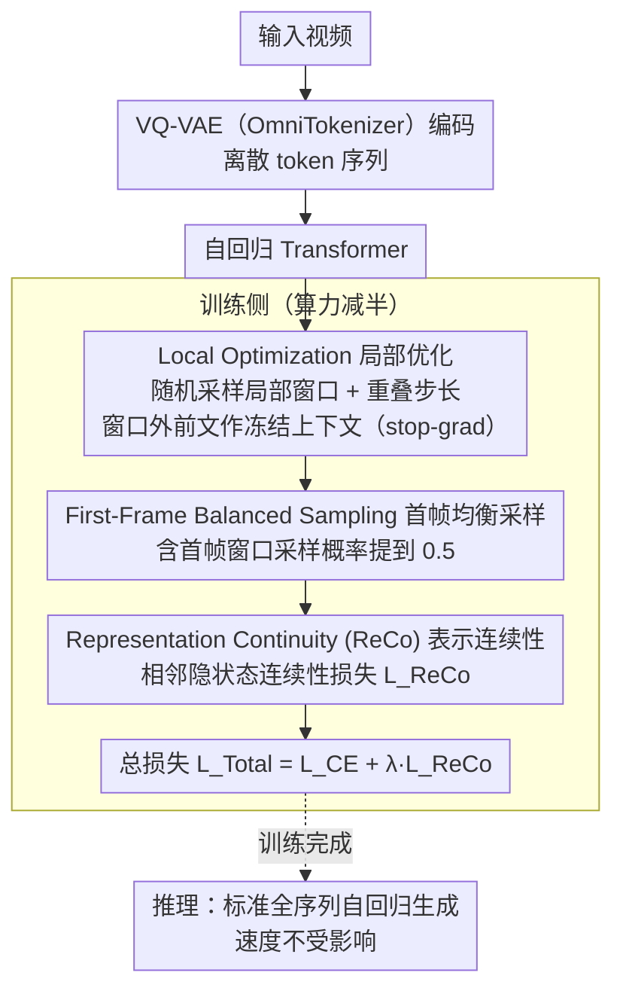

# Accelerating Training of Autoregressive Video Generation Models via Local Optimization with Representation Continuity

**会议**: ACL 2026  
**arXiv**: [2604.07402](https://arxiv.org/abs/2604.07402)  
**代码**: 无  
**领域**: 视频生成  
**关键词**: 自回归视频生成, 训练加速, 局部优化, 表示连续性, Lipschitz连续

## 一句话总结
提出 Local Optimization + Representation Continuity (ReCo) 训练策略，通过在局部窗口内优化并约束隐状态的平滑过渡，实现自回归视频生成模型训练速度提升 2 倍且不牺牲生成质量。

## 研究背景与动机

**领域现状**：自回归模型在图像生成中已展现出优于扩散模型的推理速度和性能，但在视频生成中由于视频token序列远长于图像序列，训练成本极高（需要在完整视频帧序列上进行全序列自回归建模）。

**现有痛点**：直觉上可以通过减少训练帧数来加速训练（Fewer-Frames方法），即只在短序列上训练然后推理时迭代生成。但实验发现这会导致严重的误差累积和时序不一致——因为推理时每个block只基于上一个（可能有误差的）block生成，缺乏全局上下文信息，误差呈指数级放大。

**核心矛盾**：训练效率与生成一致性之间存在trade-off。减少训练帧数能降低计算量，但会破坏视频帧间的时序连贯性，导致FVD大幅恶化（如FFS从73.65增至229.32）。

**本文目标**：在保持baseline水平的视频质量和时序一致性的前提下，将训练成本减半。

**切入角度**：作者从两个层面切入——(1) 训练策略层面：用局部窗口优化代替全序列优化，窗口外的上下文作为冻结条件输入；(2) 表示空间层面：从Lipschitz连续性出发，约束相邻时间步的隐状态变化幅度，抑制误差传播。

**核心 idea**：在随机采样的局部窗口内优化自回归损失（Local Opt.），同时用表示连续性损失（ReCo）约束隐状态平滑过渡，从而在训练阶段大幅减少计算量，同时在推理阶段保持全序列生成的一致性。

## 方法详解

### 整体框架
输入视频先用 VQ-VAE（OmniTokenizer）编码成离散 token 序列，再交给自回归 Transformer 建模。关键改动全在训练侧：不在完整序列上算损失，而是随机采样一个局部窗口、只优化窗口内的自回归损失，窗口外的前文 token 当作冻结上下文（stop-gradient），同时对窗口内相邻隐状态施加连续性约束；推理时仍走标准的全序列自回归生成，因此推理速度不受影响。

### 关键设计

**1. Local Optimization：只在局部窗口上回传，砍掉一半训练算力**

视频 token 序列远比图像长，在完整序列上做全序列自回归训练成本极高；而朴素地少训几帧（Fewer-Frames）又会因推理时缺乏全局上下文导致误差指数放大。本文给定完整 token 序列 $\mathbf{E}$，随机采样起始位置 $s$ 和窗口长度 $W$，只在窗口 $\mathbf{E}_\mathcal{W} = (\mathbf{e}_s, ..., \mathbf{e}_{s+W-1})$ 内计算交叉熵，窗口前的 $\mathbf{E}_{<s}$ 作为冻结上下文不回传梯度，并用步长 $S < W$ 制造重叠窗口、让同一 token 在不同上下文下被多次优化。这样既始终以 ground-truth 上下文为条件、避免 exposure bias，又靠重叠窗口逼模型学到更鲁棒的表示，而推理仍是标准全序列生成、速度不打折。

**2. First-Frame Balanced Sampling：把首帧多喂几次，补上训练-生成的分布缺口**

作者对比训练样本与生成样本的损失分布，发现 Local Opt. 模型在生成时首帧损失明显偏高——而首帧质量会直接影响后续所有帧。对策很直接：把"包含首帧的窗口"的采样概率提升到 0.5，让模型更多地优化视频开头部分。这一改让 FFS 上的 FVD 从 190.46 降到 127.11，训练加速也进一步提升到 2.0 倍。

**3. Representation Continuity (ReCo)：用 Lipschitz 约束把误差从指数压成线性**

只盯着独立窗口优化，容易在表示空间里留下突变，跨窗口拼接时误差会被放大。本文把自回归模型看成离散时间动力系统，受 Lipschitz 连续性启发，对窗口内相邻隐状态加一项连续性损失 $\mathcal{L}_{ReCo} = \frac{1}{W-1}\sum_{i=s}^{s+W-2}\|\mathbf{h}_{i+1} - \mathbf{h}_i\|_2^2$，与交叉熵合成总损失 $\mathcal{L}_{Total} = \mathcal{L}_{CE} + \lambda \cdot \mathcal{L}_{ReCo}$。当局部 Lipschitz 常数被压小，误差传播被限制在 $\|\epsilon_{t+1}\| \leq L \cdot \|\epsilon_t\| + \delta_t$ 的线性增长范围内，而非指数放大，于是在算力减半的同时把全序列生成的一致性追回到 baseline 水平。

### 损失函数 / 训练策略
总损失由两部分组成：(1) 窗口内标准交叉熵损失 $\mathcal{L}_{CE}$；(2) 表示连续性正则项 $\mathcal{L}_{ReCo}$，权重 $\lambda=0.1$。首帧窗口采样概率设为0.5。训练300个epoch，学习率 $1\times10^{-4}$。

## 实验关键数据

### 主实验

| 数据集 | 指标 | ReCo★ | Baseline★ | 提升 |
|--------|------|-------|-----------|------|
| FFS | FVD↓ | 42.5 | 46.1 | -7.8% |
| SKY | FVD↓ | 58.8 | 62.7 | -6.2% |
| UCF101 | FVD↓ | 251.4 | 254.5 | -1.2% |
| Taichi | FVD↓ | 98.3 | 105.5 | -6.8% |

训练速度：ReCo 约为 Baseline 的 2 倍。

### 消融实验

| 配置 | FFS FVD↓ | SKY FVD↓ | 训练速度 |
|------|----------|----------|----------|
| Baseline | 73.65 | 89.09 | 1.0× |
| Fewer-Frames | 229.32 | 292.41 | 2.5× |
| Local-Opt. | 190.46 | 256.94 | 1.7× |
| Local-Opt. (w/ first frame) | 134.73 | 186.63 | 1.7× |
| Local-Opt. (w/ balanced) | 127.11 | 179.84 | 2.0× |
| ReCo (完整方法) | 72.6 | 87.5 | 2.0× |

### 关键发现
- Fewer-Frames方法虽然训练快2.5倍但FVD恶化3倍以上，证实了误差累积理论分析的正确性
- Local Opt.的首帧均衡采样策略贡献巨大，FVD从190降至127
- ReCo进一步将FVD从127降至72.6，与Baseline（73.7）持平甚至更优，验证了Lipschitz正则化的有效性
- 在MSR-VTT文本到视频任务上，ReCo*以50%训练成本达到了与7B baseline相当的CLIP Score和FVD

## 亮点与洞察
- **动力系统视角的创新**：将自回归模型视为离散动力系统，用Lipschitz连续性理论指导正则化设计，这一视角为理解和改进自回归生成提供了新工具
- **训练-推理解耦设计**：Local Opt.只改变训练流程（局部窗口优化），推理时仍保持标准全序列生成，这种"训练trick不影响推理"的设计哲学值得借鉴
- **损失分布分析驱动的改进**：通过对比训练/生成样本的loss分布发现首帧瓶颈，进而设计均衡采样策略，这种数据驱动的改进思路可迁移到其他序列生成任务

## 局限与展望
- 实验主要在小规模模型（110M-770M）和短视频（17帧）上验证，未在商用大模型上测试
- ReCo的 $\lambda$ 超参可能需要针对不同数据集和分辨率调优
- 文本到视频实验只在MSR-VTT上做了零样本评估，缺少更多text-to-video benchmark的验证
- 未探索ReCo与其他加速技术（如KV-cache压缩、量化）的组合效果

## 相关工作与启发
- **vs Fewer-Frames**: Fewer-Frames只减帧数训练，推理时迭代生成导致严重误差累积；ReCo通过Local Opt.+连续性约束在训练侧解决问题，推理侧保持全序列生成
- **vs LARP**: LARP通过更好的tokenizer改进视频质量；ReCo与LARP正交互补——ReCo♠（结合LARP）在UCF上达到56.1 FVD（LARP原始为57.0）

## 评分
- 新颖性: ⭐⭐⭐⭐ 动力系统视角+Lipschitz正则化在自回归视频生成中的应用较新颖，但核心思想（局部优化+平滑约束）在NLP序列建模中有先例
- 实验充分度: ⭐⭐⭐⭐ 4个数据集+2种模型规模+文本到视频扩展实验+详细消融，但缺少大规模验证
- 写作质量: ⭐⭐⭐⭐⭐ 从问题分析→理论证明→方法设计→实验验证的逻辑链非常清晰，图表设计直观有效

<!-- RELATED:START -->

## 相关论文

- [\[ICML 2026\] Light Forcing: Accelerating Autoregressive Video Diffusion via Sparse Attention](../../ICML2026/video_generation/light_forcing_accelerating_autoregressive_video_diffusion_via_sparse_attention.md)
- [\[NeurIPS 2025\] Autoregressive Adversarial Post-Training for Real-Time Interactive Video Generation](../../NeurIPS2025/video_generation/autoregressive_adversarial_posttraining_for_realtime_interac.md)
- [\[ICCV 2025\] VPO: Aligning Text-to-Video Generation Models with Prompt Optimization](../../ICCV2025/video_generation/vpo_aligning_text-to-video_generation_models_with_prompt_optimization.md)
- [\[ICML 2026\] WorldCache: Accelerating World Models for Free via Heterogeneous Token Caching](../../ICML2026/video_generation/worldcache_accelerating_world_models_for_free_via_heterogeneous_token_caching.md)
- [\[CVPR 2026\] PhysVid: Physics Aware Local Conditioning for Generative Video](../../CVPR2026/video_generation/physvid_physics_aware_local_conditioning_for_generative_video_models.md)

<!-- RELATED:END -->
