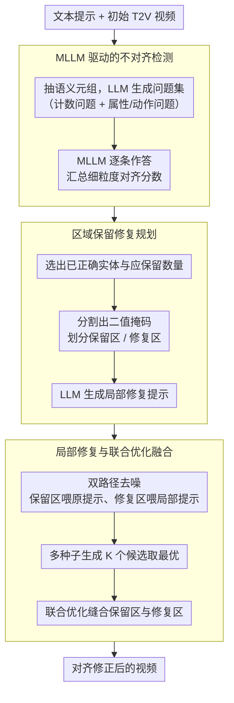

# Self-Correcting Text-to-Video Generation with Misalignment Detection and Localized Refinement

**会议**: ACL 2026  
**arXiv**: [2411.15115](https://arxiv.org/abs/2411.15115)  
**代码**: [video-repair](https://video-repair.github.io/)  
**领域**: 视频生成  
**关键词**: 文本到视频生成, 自校正, 局部修复, 文本-视频对齐, 扩散模型

## 一句话总结

提出 VideoRepair，首个免训练、模型无关的文本到视频自校正框架，通过 MLLM 检测细粒度文本-视频不对齐，保留正确区域并选择性修复问题区域，在 EvalCrafter 和 T2V-CompBench 上跨四种 T2V 骨干模型一致提升对齐质量。

## 研究背景与动机

**领域现状**：文本到视频（T2V）扩散模型在生成质量上取得了显著进步，但在遵循复杂文本提示方面仍有困难——特别是涉及多物体、属性绑定和空间关系时。常见错误包括物体数量错误、属性绑定混乱或区域变形。

**现有痛点**：现有的组合式 T2V 方法虽然改善了组合性，但缺乏显式的反馈机制来检测和纠正不对齐。图像领域的修复框架存在计算开销大、依赖外部生成器、或引入视觉不一致等问题。关键问题是：即使生成的视频存在不对齐的部分，其中正确生成的区域往往应该被保留而非重新生成。

**核心矛盾**：全局重新生成浪费了已正确生成的内容，而简单的 inpainting/editing 缺乏语义引导的能力来引入或修正与文本不匹配的实体。需要一种既能精确定位问题区域又能保留忠实内容的机制。

**本文目标**：设计一个免训练的视频修复框架，能自动检测哪里错了、规划如何修复、然后局部修正。

**切入角度**：类比人类修改创作作品的方式——只修改错误部分，保留正确部分。通过 MLLM 生成细粒度的评估问题来识别不对齐区域，然后利用扩散模型本身的重新生成能力来选择性修复。

**核心 idea**：保留正确区域、选择性修复错误区域——将 MLLM 评估反馈转化为可操作的生成指导。

## 方法详解

### 整体框架

VideoRepair 模仿人改稿的方式——只改错的地方、留对的地方，把一段已经生成好的视频拿去"局部返工"，而不是从头重生成。它分三阶段串起来：先让 MLLM 把文本提示拆成可问的问题，逐条检查视频哪里没对齐；再据此规划出"哪些实体保留、哪些区域修复、用什么局部提示修复"；最后在去噪过程里对保留区和修复区分别施加不同引导，并通过联合优化把两者无缝缝合成一段视频。整个流程免训练，直接套在任意 T2V 扩散模型上。

### 关键设计

**1. MLLM 驱动的不对齐检测：把"哪里错了"变成可量化的问答**

T2V 模型常在数量、属性绑定、空间关系上出错，但全局重生成既浪费已对的内容、又没有"错在哪"的信号。VideoRepair 先从提示中抽出语义元组（实体、属性、关系、动作），用 LLM 生成评估问题集 $Q$，并刻意分成计数问题 $Q_c$（如"有一只熊吗？"）和其他属性/动作/场景问题 $Q_{others}$。MLLM 对初始视频逐条作答：计数问题返回三元组（判断、提示要求数量、视频实际数量），其余返回二值判断，最终汇总成 $[0,1]$ 的对齐分数。

这样得到的不是一个笼统的"对不对齐"标量，而是细粒度、按元素拆开的诊断结果——它显式区分了"数量不对"和"颜色不对"，因此能直接告诉下一阶段该保留谁、该重做谁，比单纯检查物体是否存在精确得多。

**2. 区域保留修复规划：把诊断结果翻译成像素级的保留/重做指令**

知道哪里错还不够，得落到具体像素和具体提示上。这一步做三件事：(a) 让 MLLM 根据上一阶段的问答，挑出已经生成正确的关键实体 $O^*$ 及应保留的实例数 $N^*$；(b) 用 pointing 提示驱动分割模型，把这些实体在每一帧上抠出二值掩码 $\mathbf{M}$，精确划出"保留区"与"修复区"的边界；(c) 用 LLM 生成一条排除掉已保留实体后的局部修复提示 $p^r$，专门描述待修复区域应该长什么样。

掩码负责"在哪里改"，局部提示负责"改成什么"，两者合起来把抽象的评估反馈变成扩散模型能直接执行的生成指令，避免了修复区被原提示里那些"已经对了的部分"反复干扰。

**3. 局部修复与联合优化融合：既能引入新实体、又不动正确区域**

单纯的掩码 inpainting 只能填洞、引不进新实体，单纯的编辑又无法自由纠正不对齐——VideoRepair 用双路径去噪绕开这对矛盾。它把掩码下采样到潜空间，保留区沿用原始噪声、修复区重新采样噪声；每一步去噪都跑两次扩散模型，保留区喂原提示 $p$、修复区喂局部提示 $p^r$，得到两份候选 $\hat{V}_{pres}$ 与 $\hat{V}_{refine}$。

为了让两块在边界处无缝过渡，最后用一次联合优化把它们融成一段视频：

$$V_1 = \arg\min_{\tilde{V}} \|M_{pres} \otimes (\tilde{V} - \hat{V}_{pres})\|^2 + \|M_{refine} \otimes (\tilde{V} - \hat{V}_{refine})\|^2$$

掩码逐区域约束各自向对应候选靠拢，于是保留区保持原样、修复区接受新引导，又在拼接处保持全局一致。这也是它比 SLD（全局语义引导）更能守住视觉/时序质量的根本原因——它从一开始就只动该动的那部分。

### 损失函数 / 训练策略

完全免训练，全程复用现成 T2V 扩散模型做推理。为降低单次修复的随机性，系统对同一规划用不同随机种子生成 $K$ 个修复候选，按评估问题得分选最优；若得分持平，再用 BLIP-BLEU 分数作为 tiebreaker。

## 实验关键数据

### 主实验

| T2V骨干 | 方法 | EvalCrafter Avg↑ | Visual Quality | Motion Quality | Temporal Consistency |
|--------|------|------|----------|------|------|
| Wan 2.1-1.3B | Original | 44.83 | 63.2 | 61.0 | 62.1 |
| Wan 2.1-1.3B | + VideoRepair | 49.01 | 65.1 | 61.6 | 62.0 |
| VideoCrafter2 | Original | 45.97 | 61.8 | 62.6 | 62.9 |
| VideoCrafter2 | + VideoRepair | 48.83 | 62.1 | 62.4 | 62.0 |
| CogVideoX-5B | Original | 45.01 | 65.8 | 61.0 | 61.8 |
| CogVideoX-5B | + VideoRepair | 46.41 | 64.8 | 61.1 | 61.9 |

### 消融实验

| 配置 | 关键指标 | 说明 |
|------|---------|------|
| vs LLM paraphrasing | 43.12-45.81 | 简单改写提示，提升有限甚至下降 |
| vs SLD | 43.72-47.11 | 部分场景有效但严重破坏视觉/时序质量 |
| vs OPT2I | 45.63-48.69 | 提升明显但低于 VideoRepair |
| VideoRepair | 46.41-49.01 | 一致最优且不损害质量指标 |

### 关键发现

- VideoRepair 在所有四种 T2V 骨干上都带来一致提升，验证了模型无关性
- 关键优势在于不损害视觉质量、运动质量和时序一致性——SLD 方法虽然在对齐分数上有时接近，但严重破坏了这些质量指标（如时序一致性从 62.1 降至 21.0）
- 计数（Count）和颜色（Color）子类别提升最显著，这正是当前 T2V 模型最薄弱的环节

## 亮点与洞察

- **"保留正确、修复错误"的范式**：这是一个直觉上很自然但技术上非平凡的思路——相比全局重新生成或简单 inpainting，区域保留修复在效率和质量上都更优。这个范式可以迁移到任何需要后处理校正的生成任务
- **评估反馈驱动的生成**：将 MLLM 的评估问答结果直接转化为修复计划（掩码+提示），建立了评估和生成之间的闭环。这种自校正范式比单纯的人工反馈更具可扩展性
- **免训练+模型无关**：不需要额外训练任何模型，可以即插即用到任何 T2V 扩散模型上

## 局限与展望

- 需要两次扩散模型前向（保留+修复），推理开销翻倍
- 依赖 MLLM 的评估准确性——如果 MLLM 误判对齐状态可能导致不必要的修改或遗漏
- 当前仅支持单轮修复，迭代修复可能导致误差累积
- 可探索：与 T2V 模型的训练过程结合实现在线自校正、引入用户交互反馈

## 相关工作与启发

- **vs SLD/OPT2I**：SLD 使用全局语义引导但严重破坏视觉质量；OPT2I 优化提示但不做像素级修复；VideoRepair 的区域保留策略兼顾了对齐精度和质量保持
- **vs 图像修复/编辑方法**：Inpainting 只能填充而无法引入新实体，editing 无法自由修正不对齐；VideoRepair 的双路径去噪克服了这两个限制

## 评分

- 新颖性: ⭐⭐⭐⭐ 首个免训练视频自校正框架，区域保留修复范式新颖
- 实验充分度: ⭐⭐⭐⭐⭐ 四种骨干、两个基准、全面消融和质量指标评测
- 写作质量: ⭐⭐⭐⭐ 三阶段流程图清晰，方法描述系统化
- 价值: ⭐⭐⭐⭐ 为 T2V 生成提供了通用且实用的后处理改善方案

<!-- RELATED:START -->

## 相关论文

- [\[CVPR 2025\] PhyT2V: LLM-Guided Iterative Self-Refinement for Physics-Grounded Text-to-Video Generation](../../CVPR2025/video_generation/phyt2v_llm-guided_iterative_self-refinement_for_physics-grounded_text-to-video_g.md)
- [\[ACL 2026\] OSCBench: Benchmarking Object State Change in Text-to-Video Generation](oscbench_benchmarking_object_state_change_in_text-to-video_generation.md)
- [\[ICML 2026\] Self-Refining Video Sampling](../../ICML2026/video_generation/self-refining_video_sampling.md)
- [\[AAAI 2026\] GenVidBench: A 6-Million Benchmark for AI-Generated Video Detection](../../AAAI2026/video_generation/genvidbench_a_6-million_benchmark_for_ai-generated_video_detection.md)
- [\[CVPR 2026\] LocalDPO: Direct Localized Detail Preference Optimization for Video Diffusion Models](../../CVPR2026/video_generation/mind_the_generative_details_direct_localized_detail_preference_optimization_for_.md)

<!-- RELATED:END -->
