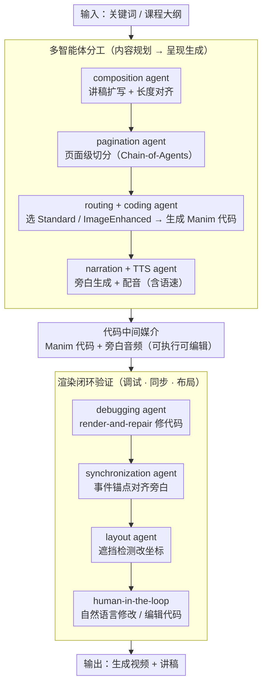

# TeachMaster: Generative Teaching via Code

**会议**: ACL2026  
**arXiv**: [2601.04204](https://arxiv.org/abs/2601.04204)  
**代码**: 无  
**领域**: 视频生成 / 教育智能体 / 多模态内容生成  
**关键词**: 生成式教学, 代码中间表示, 多智能体, Manim, 教育视频生成

## 一句话总结
TeachMaster 提出 Generative Teaching 范式，用代码作为教育视频的可解释中间表示，让规划、代码生成、配音、调试、同步和布局智能体协作生成完整课程视频，在接近人工质量的同时把 45 小时课程制作成本降到传统方式的约 0.3%。

## 研究背景与动机
**领域现状**：在线教育已经能大规模分发课程，但高质量课程内容本身仍依赖人工设计、录制、剪辑和反复修改。视频生成模型虽然能从文本直接生成画面，但主流 E2E 视频生成更擅长短片或视觉片段，不擅长保证教学结构、叙事逻辑和可编辑性。

**现有痛点**：教育视频不是普通短视频。它需要准确脚本、分层知识组织、画面与旁白同步、关键概念逐步展开，还要方便教师后续修改。像 Sora 这类像素级生成模型输出黑盒、时长受限、修改困难；仿照人类操作软件的 agent 又依赖大量轨迹和训练成本。

**核心矛盾**：可扩展的教育内容生产需要自动化，但教育质量需要结构、可控性和可追溯修改。纯视频生成自动化强但不可控，纯人工制作质量高但昂贵且更新慢。

**本文目标**：作者希望把教师从手工制作者转变为高层导演，只输入教学意图或课程大纲，由一组生成式智能体完成脚本、页面、动画、配音、调试和渲染，最终产出可教、可改、可部署的视频课程。

**切入角度**：论文认为教育视频不必直接做像素级生成。对于讲解类、概念类、可视化类课程，代码本身就是更好的中间表示：它能表达布局、动画、颜色、时间轴和对象关系，也便于调试、同步和人工编辑。

**核心 idea**：用代码连接教学语义和视频渲染，把“从大纲到视频”的过程拆成内容规划、呈现生成和质量验证三阶段多智能体流水线，让教育视频生成变成可解释、可编辑、可验证的程序化生产过程。

## 方法详解
TeachMaster 的关键不是单个大模型生成一段视频，而是一个面向课程生产的工程流水线。输入可以是关键词或课程大纲，输出包括生成视频 $V_{out}$ 和讲稿 $L_{out}$。系统把抽象教学意图先变成页面级蓝图，再把蓝图变成 Manim 可执行代码和旁白，最后通过调试、同步、布局优化与人工接口完成可交付视频。

### 整体框架
整体流程分为三阶段。第一阶段是内容规划，composition agent 把原始输入扩展成完整讲稿，并通过长度 refinement 对齐目标时长；pagination agent 再把长讲稿切成页面级单元，长文本处理使用 Chain-of-Agents，把讲稿拆分为多个片段分别分页再合并。

第二阶段是 presentation generation。每个页面蓝图会进入 routing agent，系统判断应该走标准代码生成，还是走 image-enhanced coding agent 以引入照片级或复杂图像资产。随后 narration agent 根据当前页面、上一页讲稿和视觉代码生成旁白，TTS agent 再把旁白转成音频并估计语速。

第三阶段是 quality validation。debugging agent 对生成代码做 render-and-repair，遇到语法或运行错误就根据报错修复；synchronization agent 根据音频语速和代码中的事件锚点插入等待与触发逻辑；layout agent 检测遮挡和拥挤，调整几何位置；最后 human-in-the-loop 接口允许自然语言修改或直接编辑代码。

### 关键设计
**1. 代码作为教育视频的中间语义媒介：让生成结果可执行、可检查、可改**

教育内容讲准确性和可维护性，但像 Sora 这类像素级生成是黑盒——改一个公式位置、调一下动画节奏都得重生成整段。TeachMaster 不直接生成最终像素，而是生成 Python / Manim 程序：视觉对象、几何关系、颜色、运动轨迹、等待时间、文本元素全都落在代码里，再把每页渲染出的片段与旁白音频合成完整视频。

这样代码就成了教学语义和视频渲染之间的可编辑中间层。教师和系统都能精确定位问题、局部修改，例如替换一张图像资产或改动某段时间轴，而不必把整段视频当黑盒推倒重来——这正是"可教、可改、可部署"得以成立的基础。

**2. 内容规划到呈现生成的多智能体分工：每个工序对一个明确质量目标**

单流生成容易在"画面漂亮、脚本完整、时长可控"之间失衡，而课程生产本身就是写稿、分页、画图、配音几道工序协同。TeachMaster 据此拆出专职智能体：composition agent 做 semantic skeletonization、content expansion 和 length refinement，把教学意图变成长度合适的讲稿；pagination agent 做页面粒度分割；routing agent 在 Standard 与 ImageEnhanced 之间选模式；coding agent 生成视觉代码；narration agent 结合页面蓝图、上一段讲稿和视觉代码写出连贯旁白；TTS agent 生成音频和语速信息。

把课程拆成这些边界清晰、输入输出明确的子任务后，每个模块只需围绕自己那个质量目标优化，叙事、画面和声音的协同就从"一次性碰运气"变成"逐道工序可控"。

**3. 渲染闭环中的调试、同步与布局验证：把多模态错位变成可执行的代码修复**

教学视频翻车常常不是"内容错"，而是字幕挡住图、动画比旁白快、代码根本渲染不出来。TeachMaster 把这些都变成可执行验证：debugging agent 通过实际渲染拿到错误栈再修代码，超过重试阈值就用标准模板兜底；synchronization agent 把 debug 后代码里的事件锚点和旁白语义单元对齐，依据语速插入 timing 控制；layout agent 检测对象重叠，按启发式扫描找更优坐标并回写代码。

因为中间表示是代码，这些校验都能落成"执行—报错—改代码"的闭环，而不是事后逐帧人工审查。这也是后面实验里 75.2% 以上页面无需人工介入的来源——大部分生成问题在渲染闭环内就被消化掉了。

### 损失函数 / 训练策略
论文整体是系统框架，不是端到端训练一个视频模型。视觉合成引擎可以切换：一种调用 Gemini-3 API，另一种使用本地 Qwen3-32B 生成高保真 Manim 代码。为提升 Qwen3-32B 的代码生成能力，作者构造了 3735 对高质量人工标注数据，按难度分类并采用 curriculum learning。

训练配置使用 8 张 NVIDIA A800 40GB，LoRA rank 为 128，LoRA alpha 为 256，DeepSpeed ZeRO-3，学习率 $1 \times 10^{-5}$。TTS agent 使用 Minimax。系统部署时支持异步任务队列，以适应多用户同时生成课程视频。

## 实验关键数据

### 主实验
视频质量与效率评估比较人工视频、Sora 2，以及 TeachMaster 的 Gemini 和 Qwen 两个引擎版本。质量指标由 GPT-5.2 在 1 到 10 分量表上评分，并用 3 名人类专家对 300 个随机视频做偏好验证，人与 GPT 评估一致率为 81.71%。

| 方法 | 空间清晰度 | 视觉丰富度 | 教学逻辑 | 图文一致 | 事实准确 | 总体质量 | 制作时长 min | 视频时长 min | 制作/视频比 |
|------|------------|------------|----------|----------|----------|----------|--------------|--------------|------------|
| Human | 8.22 | 7.31 | 8.38 | 8.29 | 9.24 | 8.29 | 795.00 | 32.50 | 24.46 |
| Sora 2 | 7.36 | 6.36 | 7.55 | 7.64 | 8.96 | 7.57 | 3.20 | 0.25 | 12.80 |
| TeachMaster-Gemini | 7.97 | 6.98 | 7.97 | 7.63 | 8.99 | 7.91 | 88.43 | 35.97 | 2.46 |
| TeachMaster-Qwen | 7.42 | 6.42 | 7.49 | 7.66 | 8.94 | 7.59 | 112.80 | 32.55 | 3.47 |

脚本质量和跨模态对齐进一步说明代码中心范式的价值。TeachMaster-Gemini 在脚本总体质量上达到 8.95，略高于人工 8.84；TeachMaster-Qwen 在跨模态对齐总体得分 8.79，高于人工 8.13 和 Sora 2 的 6.65。

| 方法 | 脚本结构 | 叙事连贯 | 准确性 | 完整性 | 一致性 | 脚本总体 | 语义覆盖 | 指称准确 | 视听对称 | 对齐总体 |
|------|----------|----------|--------|--------|--------|----------|----------|----------|----------|----------|
| Human | 8.90 | 9.11 | 9.05 | 8.32 | 8.84 | 8.84 | 8.17 | 7.94 | 8.28 | 8.13 |
| Sora 2 | 3.14 | 6.57 | 1.86 | 6.00 | 4.39 | 4.39 | 6.64 | 6.59 | 6.73 | 6.65 |
| TeachMaster-Gemini | 8.89 | 9.00 | 9.67 | 8.22 | 8.95 | 8.95 | 8.63 | 8.11 | 8.57 | 8.44 |
| TeachMaster-Qwen | 8.50 | 9.00 | 8.17 | 7.67 | 8.34 | 8.34 | 8.93 | 8.57 | 8.87 | 8.79 |

### 消融实验
论文没有传统模块删除式消融，但从部署、用户反馈和成本统计展示了系统各组件带来的实际效率收益。

| 分析维度 | 数值 / 现象 | 含义 |
|----------|-------------|------|
| 真实部署规模 | 服务超过 1000 名教育者，生成超过 30000 分钟内容 | 系统不是离线 demo，已进入多学科真实使用 |
| 学科覆盖 | 超过 40 个学科 | 代码中心表示对 AI、分子生物、语言学等不同主题都有泛化性 |
| 页面人工介入 | 75.2% 以上页面无需人工修改 | 调试、同步和布局验证能处理大部分生成问题 |
| 需要修改页面 | 平均 1.88 轮交互完成 | human-in-the-loop 接口降低后期编辑成本 |
| 标准 45 小时课程成本 | 约 83.70 美元 | 约为传统在线课程制作费用的 0.3% |

### 关键发现
- TeachMaster 的质量不只是“比 Sora 2 更长”。它在脚本结构、跨模态对齐和教学逻辑上显著更稳，因为内容先被组织成页面和代码，而不是一次性生成短视频片段。
- Sora 2 的制作时间看似短，但只能生成 0.25 分钟视频，制作/视频比为 12.80；TeachMaster-Gemini 能生成 35.97 分钟内容，制作/视频比降到 2.46，更适合课程级生产。
- 人工视频总体质量仍最高，但时间成本极高。TeachMaster 的核心价值是让质量略低于人工或在部分指标超过人工，同时把单位内容生产成本压低一个数量级以上。
- Qwen 版本在跨模态对齐上最高，说明本地代码生成模型虽然视觉丰富度略弱，但通过代码对象和旁白显式绑定，能更好保持视觉与语言同步。

## 亮点与洞察
- 最重要的洞察是：教育视频生成不必以像素为中心。对于大量知识讲解场景，代码比视频帧更接近“可控语义”，也更适合做调试、同步、回滚和人工编辑。
- 系统把教师定位为 high-level director，而不是被 AI 替代的内容工人。教师仍然把控教学目标和逻辑，智能体负责繁琐实现，这个交互定位比完全自动生成更容易被教育场景接受。
- 多智能体不是为了“显得复杂”，而是对应了课程生产的真实工序：写稿、分页、画图、配音、调节节奏、排版、审查。每个工序都有明确输入输出，利于工程化。
- TeachMaster 对科研内容生成也有启发。例如论文讲解视频、课程可视化、实验流程演示都可以用“语义蓝图 -> 代码 -> 渲染 -> 同步”的路径，而不必直接依赖黑盒视频模型。

## 局限与展望
- 评价主要依赖 GPT-5.2 打分和专家一致性校验，虽然规模可扩展，但教育效果最终还需要更多学习者成绩、留存、理解深度等长期指标。
- 系统非常适合动画、图表和概念可视化，但对于真实实验录像、人物授课、复杂场景叙事或高写实镜头，代码中心范式可能不如专业视频生成模型。
- Qwen3-32B 的高质量 Manim 代码生成依赖 3735 对人工标注数据和较强算力，迁移到其他动画框架或低资源语言时仍有成本。
- 论文没有细化每个智能体失败率、调试重试次数、布局冲突消除成功率等工程指标。未来如果公开模块级日志，会更利于复现和比较。

## 相关工作与启发
- **vs E2E 视频生成**: Sora 2 等模型能直接生成像素，但黑盒且不适合长课程。TeachMaster 牺牲部分视觉真实感，换来结构控制、时长可扩展和可编辑性。
- **vs AI 课件 / 幻灯片系统**: 传统 AI slide 或 tutoring 系统通常只能生成静态内容或短静音片段。TeachMaster 同时生成脚本、动画、配音和同步视频，更接近完整课程生产。
- **vs 软件操作型 agent**: 让 agent 模仿人类使用视频编辑软件需要大量轨迹并且动作空间庞大。TeachMaster 直接生成代码，动作空间更结构化，也更容易调试。
- **vs Code2Video / Paper2Video**: 相关工作已经证明代码可用于科学图示或教育视频。TeachMaster 的扩展在于把代码生成放入课程级多智能体生产线，并给出真实部署和成本数据。

## 评分
- 新颖性: ⭐⭐⭐⭐☆ 代码中心视频生成已有相关脉络，但 Generative Teaching 的系统化多智能体流程和部署规模很有新意。
- 实验充分度: ⭐⭐⭐⭐☆ 有多维质量评测、人类一致性、真实部署和成本统计；模块级消融仍不够细。
- 写作质量: ⭐⭐⭐⭐☆ 场景动机清楚，系统流程完整，表格数据能支撑效率论点。
- 价值: ⭐⭐⭐⭐⭐ 对教育内容生产、课程可视化和可编辑多模态生成很有实际价值，尤其适合大规模在线教育更新。

<!-- RELATED:START -->

## 相关论文

- [\[ICLR 2026\] Arbitrary Generative Video Interpolation](../../ICLR2026/video_generation/arbitrary_generative_video_interpolation.md)
- [\[CVPR 2026\] PhysVid: Physics Aware Local Conditioning for Generative Video](../../CVPR2026/video_generation/physvid_physics_aware_local_conditioning_for_generative_video_models.md)
- [\[CVPR 2026\] Generative Neural Video Compression via Video Diffusion Prior](../../CVPR2026/video_generation/generative_neural_video_compression_via_video_diffusion_prior.md)
- [\[CVPR 2026\] LightMover: Generative Light Movement with Color and Intensity Controls](../../CVPR2026/video_generation/lightmover_generative_light_movement_with_color_and_intensity_controls.md)
- [\[CVPR 2026\] Generative Video Motion Editing with 3D Point Tracks](../../CVPR2026/video_generation/generative_video_motion_editing_with_3d_point_tracks.md)

<!-- RELATED:END -->
