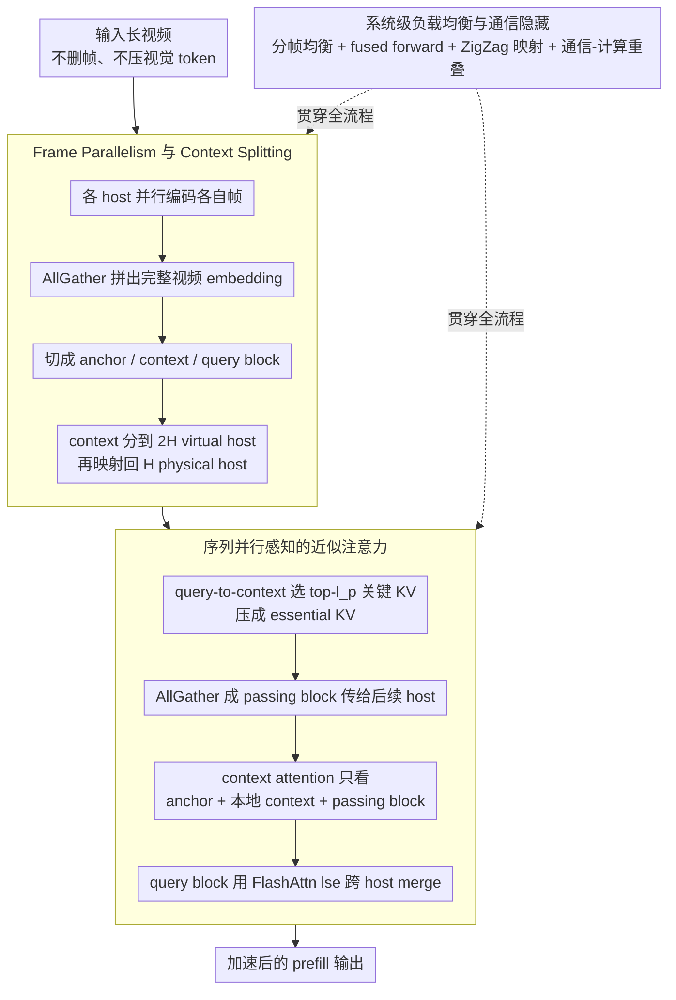

# APB-V: Accelerating Long-Video Understanding via Sequence-Parallelism-aware Approximate Attention

**会议**: ACL2026  
**arXiv**: [2601.21444](https://arxiv.org/abs/2601.21444)  
**代码**: https://github.com/thunlp/APB  
**领域**: 视频理解 / 多模态推理加速  
**关键词**: 长视频理解, 序列并行, 近似注意力, 多GPU推理, KV压缩  

## 一句话总结
APB-V 用面向序列并行的近似注意力和系统级负载均衡加速长视频 LMM 推理，在保留完整视觉 embedding 的同时，在 64 帧 1440p 设置下相对 FlashAttn、ZigZagRing 和 APB 分别达到 12.72×、1.70× 和 1.18× 加速，且没有显著性能损失。

## 研究背景与动机
**领域现状**：长视频理解依赖 LMM 把大量帧编码成视觉 token，再送入长上下文 LLM backbone。随着视频时长、分辨率和帧数增加，prefill 阶段的视觉编码、attention 和 FFN 成本都会快速增长。

**现有痛点**：已有方法主要有两类。一类优化 attention 或 KV cache，但通常只能减轻 LLM backbone 的一部分负担，无法处理视觉编码和 FFN 成本；另一类显式压缩输入 token，例如 token pruning 或 pooling，能减少计算，却容易丢掉细粒度视频证据。论文中特别指出 SlowFast 在实验中虽然有不到 3× 的加速，却会出现约 25% 的准确率下降。

**核心矛盾**：长视频推理既需要更多计算资源来处理更长输入，又不能用粗暴压缩牺牲关键帧和细节证据。单 GPU 优化容易陷入效率-性能 trade-off，多 GPU 序列并行又会遇到通信和负载不均衡瓶颈。

**本文目标**：APB-V 希望通过“增加并行计算 + 抑制二次 attention 成本”同时解决效率和性能问题：不压缩视觉 embedding，而是在多 GPU/多 host 上做近似 attention、通信压缩和系统级调度。

**切入角度**：作者观察到长视频场景天然适合并行：帧级视觉编码彼此独立，LLM 输入序列也可按块拆分。但精确序列并行通信太重，因此需要让每个 host 只交换后续 query 真正需要的关键 KV。

**核心 idea**：用局部 KV 压缩和 passing block 近似全局注意力，在 host 间只传递关键上下文块，同时通过 frame parallelism、ZigZag 负载均衡、fused forward 和通信-计算重叠释放多 GPU 长视频推理性能。

## 方法详解

### 整体框架
APB-V 想在不删一帧、不压一个视觉 token 的前提下加速长视频 LMM 的 prefill。它假设每个 host 都持有一份完整 LMM 副本：输入视频先按帧分发到各 host 并行编码，AllGather 汇总成完整视频 embedding 后，整条输入序列被切成开头的 anchor block、结尾的 query block 和中间一堆 context block；context block 分到 $2H$ 个 virtual host 再映射回 $H$ 个 physical host。每层 attention 里，host 只把本地 context 中对 query 最关键的那部分 KV 压成 passing block 传给后续 host，于是每个 query 实际访问的远端 KV 大幅减少，省下的通信又被算法和系统层尽量和计算重叠掉。

### 关键设计

**1. Frame Parallelism 与 Context Splitting：把帧编码和长序列 prefill 摊到多 host**

长视频的瓶颈在于单 GPU 要同时扛下全部帧的视觉编码和全部 token 的 prefill。APB-V 利用「帧级编码天然彼此独立」这一点，让每个 host 各编码一部分视频帧，再用 AllGather 把视觉 embedding 拼全；随后把序列拆成初始 anchor block $B_a$、末尾 query block $B_{qr}$ 和其余 context block $B^{(h)}$——anchor 给全局前缀，query 是真正要回答的问题，context 是长视频主体证据。这样帧并行和序列并行串接起来，没有任何一张卡需要独自承担整段视频。

**2. Sequence-Parallelism-aware Approximate Attention：只把 query 真正需要的 KV 跨 host 传**

精确序列并行要在 host 间交换全部 KV，通信太重；而 StarAttn 干脆不做 inter-host 通信，又会丢长程依赖。APB-V 走中间路线：每个 virtual host 先用 query-to-context 的 attention score 从本地 context 里挑出最重要的 $l_p$ 个 KV 对，压成 essential KV，再经 AllGather 当作 passing block 传给后续 host。于是 context block 的 attention 只看 anchor、本地 context 和这些压缩后的 passing block，而 query block 的结果靠 FlashAttn 的 lse 做跨 host merge。因为传递的只是与当前问题相关的关键 KV，它既比 StarAttn 更好地保住长程依赖，又比精确并行省下大量通信和计算。

**3. 系统级负载均衡与通信隐藏：把近似 attention 落成真正高吞吐的多 GPU 系统**

光有算法近似还不够——短 query 单独 forward 会变 memory-bound、passing block 长度在 host 间不均衡、跨 host 通信要等待，任何一条都能把加速吃掉。APB-V 配套了三件事：视觉负载按 $F^{(h)}=\lfloor F/H\rfloor+\mathbb{I}[h<F\bmod H]$ 分帧让各 host 帧数尽量齐；fused context-query forward 把短 query 并进 context 一起算，避开 memory-bound；ZigZag 映射把第 $h$ 和第 $2H-1-h$ 个 virtual host 放到同一 physical host，让两端不均衡的 passing block 长度互补抵消；overlapped communication 则让 passing block 的传输和 attention 计算并行跑。算法近似和系统优化配套，才是 APB-V 真正拿到加速的原因。

### 损失函数 / 训练策略
APB-V 是推理加速框架，不训练新 LMM、不引入任务损失。实验里 APB baseline 的 retaining heads 在 NextQA 上训练，而 APB-V 自身主要靠超参控制 anchor length 与 passing length：默认 $l_a=n/64$、$l_p=n/128$，在 8 个 physical host、$2H$ 个 virtual host 下保持与 APB 相近的 compute 量。

## 实验关键数据

### 主实验
APB-V 在 VNBench 和 LongVideoBench 上测试 InternVL3-2B、Qwen2.5VL-3B 和 Qwen2.5VL-7B。下面保留最能体现“性能不显著下降”的核心数字。

| 数据集 / 模型 | FullAttn | APB | APB-V | 结论 |
|---------------|----------|-----|-------|------|
| VNBench / InternVL3-2B Overall | 44.89 | 41.11 | 43.26 | APB-V 接近 FullAttn，明显优于 APB |
| VNBench / Qwen2.5VL-3B Overall | 52.81 | 43.93 | 50.67 | 保留大部分精度，远好于 token pruning 类方法 |
| VNBench / Qwen2.5VL-7B Overall | 58.44 | 49.93 | 56.22 | 长视频合成任务上性能损失较小 |
| LongVideoBench / InternVL3-2B Overall | 55.35 | 55.20 | 55.42 | APB-V 略高于 FullAttn |
| LongVideoBench / Qwen2.5VL-7B Overall | 58.38 | 59.16 | 59.76 | APB-V 在真实长视频上超过 APB 和 FullAttn |

速度方面，在 Qwen2.5-VL-3B 处理 64 帧 1440p 视频时，APB-V 相比 FlashAttn、ZigZagRing 和 APB 分别达到 12.72×、1.70× 和 1.18× 加速。系统消融也显示多个优化都是实打实贡献。

### 消融实验
| 配置 | 16帧 req/s | 32帧 req/s | 56帧 req/s | 说明 |
|------|------------|------------|------------|------|
| APB-V | 1.846 | 0.916 | 0.471 | 完整系统最快 |
| -O | 1.827 | 0.911 | 0.470 | 去掉通信-计算重叠，影响较小 |
| -O-F | 1.646 | 0.854 | 0.450 | 再去掉 fused context-query forward，速度下降 |
| -O-F-Z | 1.618 | 0.813 | 0.415 | 再去掉 ZigZag，负载更不均衡 |
| -O-F-Z-V | 0.381 | 0.189 | 0.107 | 去掉所有系统优化后约慢 4× |
| FlashAttn | 0.226 | 0.092 | 0.042 | 单 GPU 精确 attention 最慢 |

### 关键发现
- 对合成长视频任务，token pruning 类方法（如 SlowFast）会明显损伤 retrieval/counting 等细粒度能力；APB-V 通过保留完整视觉 embedding 避免了这类损失。
- 对真实长视频，APB-V 在 Qwen2.5VL-7B 上 Overall 59.76，高于 FullAttn 的 58.38 和 APB 的 59.16，说明近似 attention 不一定只带来折损，也可能通过系统设置和完整 embedding 保留获得更好 trade-off。
- Passing block 比 anchor block 更关键：在 counting 子任务上，去掉 passing block 的平均准确率从 APB-V 的 30.00 降到 17.33，去掉 anchor 则降到 25.33。
- 多 host 可扩展性较好：H=8 时 APB-V 在 720p、16/56 帧上达到 6.171/2.013 req/s，高于 ZigZagRing 的 5.595/1.666 和 APB 的 4.891/1.766。

## 亮点与洞察
- 论文没有走“少看点视频”的路，而是尽量保留视觉 token，再从 attention 计算层做近似。这对长视频问答很重要，因为答案可能藏在很短的一段字幕、动作或物体里。
- APB-V 把算法和系统问题放在一起解决：只提出近似 attention 不够，还要解决短 query forward 的 memory-bound、passing block 负载不均衡和跨 host 通信等待。
- Case study 中“secret word is Nick”的区域被更频繁选入 passing block，说明 query-aware KV 选择确实能把回答相关证据传播到后续 host，而不是随机压缩上下文。

## 局限与展望
- APB-V 主要面向 decoder-only Transformer-based LMM；卷积网络或非标准架构不兼容。
- 方法依赖多 GPU 推理，单 GPU 上会退化为 FlashAttn，因此不适合资源很有限的部署场景。
- 论文聚焦 TTFT/end-to-end prefill 时间受限的长视频应用，例如监控和自动驾驶；对多轮交互、batch serving 或后续 decoding 阶段的收益还需要更细分析。
- passing length 和 anchor length 仍是需要调的超参。实验显示 passing length 过小会明显伤性能，说明压缩率和证据保留之间仍有边界。

## 相关工作与启发
- **vs FlashAttn / ZigZagRing**: FlashAttn 是单 GPU 精确 attention，ZigZagRing 是更精确的序列并行；APB-V 用近似和压缩换取更好扩展性。
- **vs SlowFast / token pruning**: SlowFast 通过减少视觉 token 加速，但会丢细粒度证据；APB-V 不压缩输入 embedding，更适合需要精确检索的长视频问答。
- **vs StarAttn**: StarAttn 避免 inter-host 通信，但因此长程依赖不足；APB-V 保留压缩通信，使关键 KV 能跨 host 传递。
- **启发**: 长上下文多模态推理的核心不是一味减少 token，而是让“对当前 query 真有用的远端证据”以低成本跨设备流动。

## 评分
- 新颖性: ⭐⭐⭐⭐ 近似 attention 与序列并行结合不算全新，但面向长视频 LMM 的系统化设计很扎实。
- 实验充分度: ⭐⭐⭐⭐⭐ 覆盖两个长视频 benchmark、三种 LMM、多种分辨率/帧数/host 数和丰富消融。
- 写作质量: ⭐⭐⭐⭐ 方法图和系统拆解清晰，部分符号较密，需要结合图表读。
- 价值: ⭐⭐⭐⭐⭐ 对多 GPU 长视频 LMM 部署非常实用，尤其适合高分辨率、长帧序列的 TTFT 加速。

<!-- RELATED:START -->

## 相关论文

- [\[CVPR 2026\] VecAttention: Vector-wise Sparse Attention for Accelerating Long Context Inference](../../CVPR2026/video_understanding/vecattention_vector-wise_sparse_attention_for_accelerating_long_context_inferenc.md)
- [\[CVPR 2025\] SEAL: SEmantic Attention Learning for Long Video Representation](../../CVPR2025/video_understanding/seal_semantic_attention_learning_for_long_video_representation.md)
- [\[ICLR 2026\] VideoNSA: Native Sparse Attention Scales Video Understanding](../../ICLR2026/video_understanding/videonsa_native_sparse_attention_scales_video_understanding.md)
- [\[ICML 2026\] Video-MTR: Reinforced Multi-Turn Reasoning for Long Video Understanding](../../ICML2026/video_understanding/video-mtr_reinforced_multi-turn_reasoning_for_long_video_understanding.md)
- [\[ACL 2026\] TemporalVLM: Video LLMs for Temporal Reasoning in Long Videos](temporalvlm_video_llms_for_temporal_reasoning_in_long_videos.md)

<!-- RELATED:END -->
