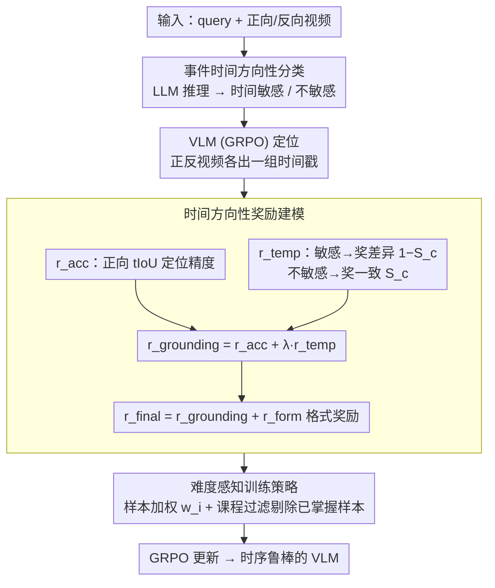

# ArrowGEV: Grounding Events in Video via Learning the Arrow of Time

**会议**: ACL 2026 Findings  
**arXiv**: [2601.06559](https://arxiv.org/abs/2601.06559)  
**代码**: [有](https://arxiv.org/abs/2601.06559)（Code / Model / Data 均公开）  
**领域**: Video Understanding  
**关键词**: 视频事件定位, 时间方向性, 强化学习, 视觉语言模型, 时序理解

## 一句话总结

提出 ArrowGEV，一个受物理学"时间之箭"启发的强化学习框架，通过区分时间敏感和时间不敏感事件来建模视频中的时间方向性，提升 VLM 的事件定位精度和时序理解能力。

## 研究背景与动机

**领域现状**: 视频事件定位（GEV）是视频分析的基础任务，近年来 VLM 凭借端到端推理能力成为主流方法，通过大规模时间戳标注训练、时间 token 嵌入或视频分割适配来实现事件定位。

**现有痛点**: 现有方法仅在正向视频上对齐事件与时间戳，忽略了事件的内在时间结构和方向性。实验表明 VLM 无法区分正向和反向视频中事件语义的变化——例如"拿起杯子"反转后变为"放下杯子"，但模型仍然错误地在反向视频中定位原始事件。

**核心矛盾**: VLM 过度拟合文本时间戳而非视频语义，缺乏对事件时间方向性的理解，导致在需要时序推理的任务上泛化性不足。

**本文目标**: 通过显式建模时间方向性，提升 VLM 的事件定位精度和时序结构理解能力。

**切入角度**: 借鉴物理学中"时间之箭"概念，将事件分为时间敏感（反转改变语义）和时间不敏感（反转不变）两类，设计差异化的奖励信号。

**核心 idea**: 用反向视频作为额外训练信号——对时间敏感事件惩罚反向视频中的定位，对时间不敏感事件强制正反一致性。

## 方法详解

### 整体框架

ArrowGEV 把「时间方向性」做成强化学习的奖励信号：基于 GRPO 框架，每条样本同时喂入正向和反向视频，先判断事件属于哪类时间结构，再据此给正反两个方向的定位结果算差异化奖励。训练后的 VLM 不只是会在正向视频里对齐时间戳，还学会了「这个事件反过来还成不成立」，从而对时序更鲁棒。

### 关键设计

**1. 事件时间方向性分类：先认出事件反转后语义变不变**

现有 VLM 只在正向视频上对齐时间戳，根本没区分「反转会不会改变事件语义」。ArrowGEV 用 LLM 推理给每个 query 打一个类别标签 $c(q)\in\{\text{sensitive},\text{insensitive}\}$：像「开门」是时间敏感的（反转就成了「关门」），而「球在桌上」是时间不敏感的（正放倒放都成立）。这个分类是后续奖励能差异化的前提——两类事件在时间反转下该被怎么对待，本质完全不同。

**2. 时间方向性奖励建模：把定位精度和方向理解塞进一个奖励里**

针对「VLM 过拟合文本时间戳、不懂方向」的痛点，ArrowGEV 设计了统一奖励 $r_{\text{grounding}}=r_{\text{acc}}+\lambda\cdot r_{\text{temp}}$。其中 $r_{\text{acc}}$ 用 tIoU 衡量正向定位准不准，$r_{\text{temp}}$ 则编码方向性：对时间不敏感事件奖励正反一致性（用相似度 $S_c$），对时间敏感事件则奖励正反差异性（$1-S_c$）。这样模型被迫去看视频本身的语义变化，而不是死记时间戳——「开门」在反向视频里就该定位不到，「球在桌上」正反都该对得上。

**3. 难度感知训练策略：随训练进程动态维持学习信号**

RL 训练到后期样本会越来越简单，梯度信号变弱。ArrowGEV 用两手维持难度：一是给每条样本加权 $w_i=\exp((1-\text{avg\_tIoU})/\tau)$，让模型把注意力压到还没学会的困难样本上；二是动态课程过滤，在每个 epoch 末把已经掌握的样本（最差 IoU $>\eta=0.7$）从训练集里移除。两者配合，保证训练全程都在啃真正有信息量的样本。

### 损失函数 / 训练策略

最终奖励在 grounding 奖励之外再加格式奖励：$r_{\text{final}}=r_{\text{grounding}}+r_{\text{form}}(o)$，其中 $r_{\text{form}}$ 要求输出遵循 `<think>...</think><answer>$t_s$ to $t_e$</answer>` 模板。骨干为 Qwen2.5-VL-7B-Instruct，视频按 2 FPS 采样。

## 实验关键数据

### 主实验

| 方法 | Charades-STA R1@0.5 | ActivityNet R1@0.5 | TVGBench R1@0.5 |
|------|-------------------|-------------------|-----------------|
| Gemini-2.5-Pro | 25.5 | 31.9 | 25.7 |
| GPT-5 | 18.3 | 33.0 | 18.8 |
| TimeSuite* | 67.1 | - | - |
| ArrowGEV (本文) | **显著提升** | **显著提升** | **显著提升** |

### TDD 指标（时间方向性理解）

引入 Temporal Directionality Discrepancy (TDD) 指标：$\text{TDD}(m) = \frac{R1@m(\text{fwd}) - R1@m(\text{rev})}{R1@m(\text{fwd})}$。对时间敏感事件 TDD 应接近 1（能区分正反），对时间不敏感事件 TDD 应接近 0（正反一致）。

### 关键发现

- ArrowGEV 在三个 GEV 基准上均显著提升定位精度
- 大幅改善 VLM 对时间方向性的理解（TDD 指标）
- 在 OOD 通用视频理解和推理任务（TempCompass、MVBench、VideoMME 等）上也有提升
- 时间敏感事件在常用基准中占比显著，特别是 Charades-STA

## 亮点与洞察

- "时间之箭"概念从物理学引入视频理解，角度新颖且直觉清晰
- 利用反向视频作为"免费"的训练信号，不需额外标注
- 提出 TDD 指标，首次量化评估模型对事件时间方向性的理解
- 难度感知训练策略（权重调整 + 课程过滤）有效维持学习效率

## 局限与展望

- 事件分类依赖 LLM 推理，可能存在分类噪声
- 仅在 7B 模型上验证，更大模型的效果待探索
- 视频采样率 2 FPS 可能不足以捕捉快速事件
- 未来可探索更细粒度的时间方向性建模

## 相关工作与启发

- GRPO / DeepSeek-R1：RL 训练范式基础
- TimeSuite / ChatVTG：GEV 任务的监督学习方法
- 时间方向性相关的自监督学习（shuffle-and-learn、order prediction）
- 将时间方向性作为视频理解的基本归纳偏置是一个有前景的方向

## 评分

- 新颖性: ⭐⭐⭐⭐⭐ 物理学启发的时间方向性建模，视角独特
- 实验充分度: ⭐⭐⭐⭐ 三个 GEV 基准 + 六个通用基准，消融充分
- 写作质量: ⭐⭐⭐⭐ 动机清晰，pilot study 有说服力
- 价值: ⭐⭐⭐⭐ 揭示了 VLM 时间方向性理解的缺陷，提出有效方案

<!-- RELATED:START -->

## 相关论文

- [\[NeurIPS 2025\] Seeing the Arrow of Time in Large Multimodal Models](../../NeurIPS2025/video_understanding/seeing_the_arrow_of_time_in_large_multimodal_models.md)
- [\[AAAI 2026\] Learning Time in Static Classifiers](../../AAAI2026/video_understanding/learning_time_in_static_classifiers.md)
- [\[CVPR 2026\] Video-CoE: Reinforcing Video Event Prediction via Chain of Events](../../CVPR2026/video_understanding/video-coe_reinforcing_video_event_prediction_via_chain_of_events.md)
- [\[CVPR 2025\] Localizing Events in Videos with Multimodal Queries](../../CVPR2025/video_understanding/localizing_events_in_videos_with_multimodal_queries.md)
- [\[CVPR 2026\] Learning to Refuse: Refusal-Aware Reinforcement Fine-Tuning for Hard-Irrelevant Queries in Video Temporal Grounding](../../CVPR2026/video_understanding/learning_to_refuse_refusal-aware_reinforcement_fine-tuning_for_hard-irrelevant_q.md)

<!-- RELATED:END -->
