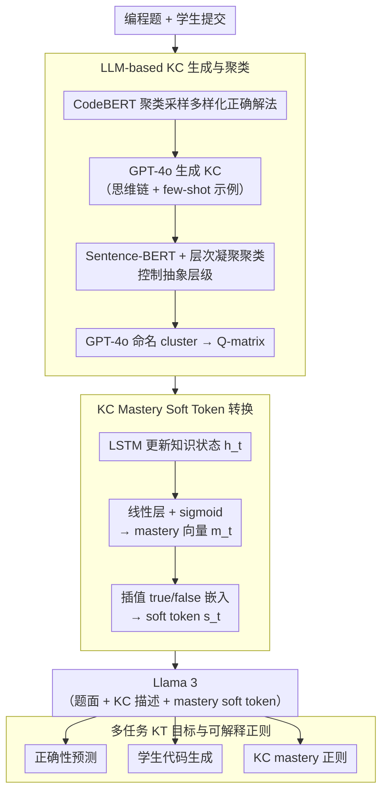

# Automated Knowledge Component Generation and Interpretable Knowledge Tracing in Coding Problems

**会议**: ACL2026  
**arXiv**: [2502.18632](https://arxiv.org/abs/2502.18632)  
**代码**: https://github.com/umass-ml4ed/kcgen-kt  
**领域**: 教育AI / 知识追踪  
**关键词**: Knowledge Component, Knowledge Tracing, 编程教育, LLM, 可解释学生建模  

## 一句话总结
这篇论文用 LLM 自动为开放式编程题生成和聚类 Knowledge Components，并提出 KCGen-KT 将学生在每个 KC 上的掌握度转成 soft token 输入 Llama 3，在 CodeWorkout 和 FalconCode 上同时提升正确率预测与学生代码生成。

## 研究背景与动机
**领域现状**：知识追踪需要估计学生对细粒度知识点的掌握情况，常依赖 Knowledge Components 作为技能标签。传统 KC 通常由教师或领域专家编写，并手工标注到题目上。

**现有痛点**：人工 KC 设计成本高、容易有偏差，而且开放式编程题比选择题更难标注。一个编程题可能有多种正确解法，不同解法涉及不同技能；学生错误也多样，不能像多选题那样只看固定选项。

**核心矛盾**：知识追踪模型需要细粒度、可解释、可迁移的 KC；但越细粒度的 KC，人工设计和标注越昂贵。现有自动 KC 生成多集中在多选题，对开放式学生代码提交支持不足。

**本文目标**：作者希望用 LLM 自动生成编程题所需 KC，并让这些自然语言 KC 描述直接帮助知识追踪模型预测学生未来答题正确性和代码提交，同时保留“学生在哪些 KC 上掌握较弱”的解释。

**切入角度**：论文把 KC 生成和 KT 建模连成一个闭环：先用学生真实正确代码帮助 LLM 找出题目技能，再把技能描述和学生 mastery 作为 LLM 输入的一部分，用于预测下一次作答。

**核心 idea**：用 LLM 生成可读 KC，用聚类控制抽象层级，再把每个学生对 KC 的掌握程度投影成可微 soft text tokens，使 LLM-based KT 同时获得语义知识和可解释学生状态。

## 方法详解

### 整体框架
方法分两段、连成一个闭环。第一段是自动 KC 生成与标注 pipeline：对每道编程题采样多样化的正确学生提交，提示 GPT-4o 生成必要的 KC，再用 Sentence-BERT embedding + 层次凝聚聚类把相似 KC 合并，最后让 GPT-4o 给每个 cluster 命名并把题目映射到 cluster，得到 Q-matrix。第二段是 KCGen-KT 模型：它为每个学生维护一份「在各 KC 上的 mastery 向量」，把 mastery 值转成 soft token，连同下一道题的题面和 KC 描述一起喂给 Llama 3，同时预测「下一次作答是否正确」和「学生可能提交的代码」。

### 关键设计

**1. LLM-based KC Generation and Clustering：从多样化正确解法里抽出可读且粒度可控的 KC**

开放式编程题没法像选择题那样标注——同一题有多种正确思路，只看题干或单个解法会漏掉必要技能，而让 LLM 自由生成又容易产出过细、重复、不可泛化的 KC。本文的做法是先用 CodeBERT embedding 给正确学生代码聚类，从不同代码簇里采样代表性解法（兼作 few-shot 示例），让 GPT-4o 用思维链基于题目和这些多样解法生成 KC；再用 Sentence-BERT 把 KC 描述向量化，经层次凝聚聚类（Hierarchical Agglomerative Clustering, HAC）合并相似技能，最后由 GPT-4o 给每个 cluster 命名、并把题目映射到 cluster 标签得到 Q-matrix。聚类这一步正是用来控制抽象层级，把 LLM 容易发散的细碎技能收敛成稳定、可复用的 KC 集合。

**2. KC Mastery Soft Token Conversion：把连续的掌握度接进 LLM 的文本空间**

LLM 擅长读文本描述，但学生对某个 KC 的「掌握程度」是个连续值，没法当普通文本 token 直接输入。模型先用 LSTM 更新一个 512 维学生知识状态 $h_t$，经线性层 + sigmoid 得到 $k$ 维 mastery 向量 $m_t\in[0,1]^k$；对第 $j$ 个 KC，用 $s_t^j=m_t^j\cdot emb^{true}+(1-m_t^j)\cdot emb^{false}$ 把掌握度插值成一个 soft token。这个 soft token 既保留了「掌握多少」的连续信息、又可微，于是 mastery 状态就能端到端融进 LLM 的表示空间，而不必离散化丢信息。

**3. 多任务 KT 目标与可解释正则：让预测准的同时，画像也讲得通**

光优化预测精度，学到的 hidden state 可能完全不可解释。KCGen-KT 同时挂三个目标：正确性预测拿 Llama 3 的 hidden states 做 sigmoid 分类，代码预测让 Llama 3 token-by-token 生成学生代码，再加一条 KC 正则——用相关 KC mastery 的平均值去预测正确性，强行把「KC 掌握度高 ↔ 答对概率高」绑在一起。总损失为 $\mathcal{L}_{KCGen-KT}=\lambda(\mathcal{L}_{CodeGen}+\mathcal{L}_{CorrPred})+(1-\lambda)\mathcal{L}_{KC}$。这条 KC loss 是可解释性的关键：它逼着 mastery 向量真正对应教育意义上的「学生在哪些技能上弱」，而不是退化成一堆只为拟合的黑箱数字。

### 损失函数 / 训练策略
训练目标三部分：正确性预测的 BCE loss、代码生成的 token-level 负对数似然、以及 KC mastery 与正确性之间的 BCE 正则。模型基于 instruction-tuned Llama 3 8B，用 LoRA 微调 + 8-bit 量化；KCGen-KT 里 Llama 3 学习率 1e-5、LSTM 5e-4、mastery 线性层 1e-4。实验在 5 个随机 train-validation-test split 上重复。

## 实验关键数据

### 主实验
两个数据集都是真实开放式编程提交：CodeWorkout 包含 246 名学生、50 道 Java 题和 10,834 次 first submissions；FalconCode 包含 3,267 名学生、157 道 Python 题和 28,617 次 first submissions。

| 数据集 | 方法 | AUC | F1 | Accuracy | CodeBLEU |
|--------|------|-----|----|----------|----------|
| CodeWorkout | Code-DKT | 0.766 | 0.672 | 0.724 | - |
| CodeWorkout | TIKTOC* | 0.788 | 0.666 | 0.726 | 0.507 |
| CodeWorkout | KCGen-KT (Human KCs) | 0.797 | 0.706 | 0.727 | 0.557 |
| CodeWorkout | KCGen-KT (Generated KCs) | 0.816 | 0.727 | 0.746 | 0.580 |
| FalconCode | Code-DKT | 0.709 | 0.552 | 0.617 | - |
| FalconCode | TIKTOC* | 0.728 | 0.585 | 0.633 | 0.427 |
| FalconCode | KCGen-KT (Human KCs) | 0.752 | 0.599 | 0.700 | 0.473 |
| FalconCode | KCGen-KT (Generated KCs) | 0.771 | 0.645 | 0.712 | 0.498 |

LLM 生成 KC 在两个数据集、正确性预测和代码生成任务上都超过人工 KC，且论文报告相对基线提升具有统计显著性（p < 0.05）。

### 消融实验
| 配置 | AUC | F1 | Accuracy | CodeBLEU | 说明 |
|------|-----|----|----------|----------|------|
| KCGen-KT | 0.812 | 0.723 | 0.724 | 0.569 | CodeWorkout 消融基线 |
| w/o Correct Sol. | 0.789 | 0.674 | 0.704 | 0.529 | 不给正确学生解法，KC 不完整 |
| w/ Incorrect Sol. | 0.773 | 0.651 | 0.700 | 0.516 | 加错误解法反而引入噪声 |
| w/o KC Loss | 0.791 | 0.680 | 0.709 | 0.540 | 可解释 mastery 正则有贡献 |
| w/o ICL Ex. | 0.782 | 0.677 | 0.705 | 0.539 | 少了示例后 KC 更抽象、效果下降 |
| Code → AST | 0.784 | 0.691 | 0.715 | 0.546 | AST 表示不如原始代码文本 |
| Generated Code | 0.807 | 0.706 | 0.721 | 0.557 | LLM 生成解法不如真实学生代码多样 |

### 关键发现
- KC 抽象层级不能过高。CodeWorkout 中 50 个中等粒度 clusters 取得 0.816 AUC、0.727 F1、0.746 Accuracy、0.580 CodeBLEU；压到 10 个高层 KC 后降到 0.794/0.683/0.708/0.557。
- 真实正确学生提交很重要。去掉 correct submissions 或改用 LLM generated code 都会让 KC 覆盖变差，因为真实学生解法包含更丰富的策略多样性。
- Human evaluation 也支持生成 KC 的质量：LLM-generated KCs 的可解释比例为 98.6%，高于 baseline KCs 的 94.6%；KC mapping precision 为 93.2%，baseline 为 92.5%；recall 比较中生成 KC 在 96% cases 被认为覆盖相等或更高。
- 学习曲线分析显示 LLM-generated KCs 更符合 power law of practice：加权 $R^2$ 为 0.21，高于 human-written KCs 的 0.18。

## 亮点与洞察
- 这篇论文的关键不是“用 LLM 打标签”这么简单，而是把标签变成下游 KT 模型真的可用的语义输入，并通过 soft token 保持端到端可训练。
- 采样多样化正确代码是很聪明的设计。开放式编程题的技能集合不只由题干决定，还由可行解法空间决定；真实学生代码比标准答案更能暴露这种空间。
- 生成 KC 反超人工 KC 的结果很有意思：人工标签可能过粗或命名体系旧，而 LLM 能生成更自然、更函数级的技能描述，反而更适合 LLM-based KT。

## 局限与展望
- KC 生成依赖 in-context examples；没有人工示例时，zero-shot 生成会偏抽象，难以得到低层级技能。
- 多 KC 题目缺少可靠 ground-truth 标注，当前 KC correctness labeling 仍需要更多验证。
- 实验限于计算机科学教育，尤其是 Java/Python 编程题；迁移到数学、科学、对话式教学等领域仍需验证。
- 人类评估证明了 KC 可解释和 mapping 质量，但最终价值还要看是否真的改善学生学习结果，需要课堂部署或 A/B 测试。

## 相关工作与启发
- **vs Code-DKT**: Code-DKT 利用学生代码内容做知识追踪，但缺少自然语言 KC 语义和显式 mastery 解释；KCGen-KT 同时使用代码、题目和 KC 描述。
- **vs TIKTOC**: TIKTOC 也用 Llama 3 做生成式 KT，但不显式建模 KC 掌握度；KCGen-KT 的优势来自 KC 语义和 KC loss。
- **vs 人工 KC 标注**: 人工 KC 成本高且粒度可能不适配下游模型；LLM-generated KCs 在本实验中预测表现和可解释评估都更好。
- **启发**: 教育场景中的 LLM 不应只作为答案生成器，也可以作为“知识结构生成器”，帮助构建可解释学生模型。

## 评分
- 新颖性: ⭐⭐⭐⭐ 自动 KC 生成已有相关方向，但与 soft-token LLM KT 结合得比较新颖。
- 实验充分度: ⭐⭐⭐⭐⭐ 两个真实数据集、多个强基线、抽象层级分析、消融、人评和学习曲线都很扎实。
- 写作质量: ⭐⭐⭐⭐ 方法链条清楚，教育动机和模型细节都解释到位。
- 价值: ⭐⭐⭐⭐⭐ 对编程教育、智能 tutoring 和可解释知识追踪都有很强实用价值。

<!-- RELATED:START -->

## 相关论文

- [\[AAAI 2026\] SUGAR: Learning Skeleton Representation with Visual-Motion Knowledge for Action Recognition](../../AAAI2026/video_understanding/sugar_learning_skeleton_representation_with_visual-motion_knowledge_for_action_r.md)
- [\[CVPR 2025\] Seq2Time: Sequential Knowledge Transfer for Video LLM Temporal Grounding](../../CVPR2025/video_understanding/seq2time_sequential_knowledge_transfer_for_video_llm_temporal_grounding.md)
- [\[CVPR 2026\] Towards Spatio-Temporal World Scene Graph Generation from Monocular Videos](../../CVPR2026/video_understanding/towards_spatio-temporal_world_scene_graph_generation_from_monocular_videos.md)
- [\[CVPR 2026\] RAGTrack: Language-aware RGBT Tracking with Retrieval-Augmented Generation](../../CVPR2026/video_understanding/ragtrack_language-aware_rgbt_tracking_with_retrieval-augmented_generation.md)
- [\[CVPR 2026\] Hear What Matters! Text-conditioned Selective Video-to-Audio Generation](../../CVPR2026/video_understanding/hear_what_matters_text-conditioned_selective_video-to-audio_generation.md)

<!-- RELATED:END -->
