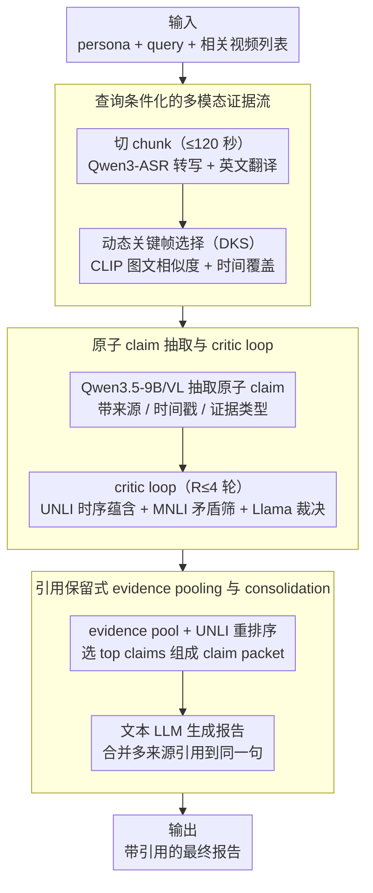

# CRAFT: Critic-Refined Adaptive Key-Frame Targeting for Multimodal Video Question Answering

**会议**: ACL2026  
**arXiv**: [2605.19075](https://arxiv.org/abs/2605.19075)  
**代码**: https://github.com/bhosalems/CRAFT  
**领域**: 视频理解 / 多视频问答  
**关键词**: 多视频问答, 证据归因, 关键帧选择, ASR, critic refinement  

## 一句话总结
CRAFT 是一个面向新闻事件多视频问答的 claim-centric pipeline，它结合动态关键帧选择、ASR 转写、UNLI/MNLI/LLM critic 迭代修正和引用合并，在 MAGMaR-Test 上取得 0.739 macro average、0.810 reference recall 和 0.635 citation F1。

## 研究背景与动机
**领域现状**：多视频问答和 grounded generation 要求系统从一组相关视频中抽取事实，并为每个结论提供可追溯的视频来源。新闻事件场景尤其典型：答案可能分散在多个剪辑、不同语言报道、采访音频和画面文字中。

**现有痛点**：长视频对 VLM 有严重 token/frame budget 压力。统一采样会漏掉稀疏但关键的画面；只看画面又会丢失采访、播报和官方声明等语音证据；即使 relevant frames 被送入模型，VLM 仍可能生成没有视觉或音频支撑的细节。

**核心矛盾**：高分系统必须同时做到“覆盖更多事实”和“每个事实都有正确引用”。单纯提高召回会引入 unsupported claims，单纯保守又会漏掉参考答案中的关键信息。

**本文目标**：作者希望构建一个面向 MAGMaR 2026 oracle task 的多视频 QA 系统，让答案以原子 claim 为中间层，先抽取、验证和排序证据，再生成带引用的最终报告。

**切入角度**：CRAFT 不把 VLM 的初始回答当成最终答案，而是在 claim 级别加入 critic loop。它用 UNLI 做视频-claim temporal entailment，用 DeBERTa-v3 MNLI 筛查 claim 间矛盾，再用 Llama-3.2-3B 判定和给出修复反馈。

**核心 idea**：先把多视频证据拆成可验证的原子 claim，再用专门 critic 修掉弱支撑和矛盾 claim，最后把重复事实合并成带多来源引用的报告。

## 方法详解
CRAFT 的 pipeline 可以理解为“视频证据流构建 → 原子 claim 抽取 → critic 迭代修正 → claim 评分与选择 → 引用保留式生成”。它面向每个 query 和相关视频集合运行，保留从 chunk 到 parent video 的映射，保证最终引用能回到原始视频。

### 整体框架
输入是 persona、query 和相关视频列表。系统先把长视频切成最长 120 秒的 chunk，并为每个视频缓存 ASR 与翻译；然后对每个 query-video pair 用动态关键帧选择得到紧凑视觉输入，再让 Qwen3.5-9B/VL 抽取带来源、时间戳和证据类型的原子 claim。critic loop 对 claim 进行最多 4 轮修正，最后用 UNLI support score 排序 claim，并由文本 LLM 生成最终报告。

### 关键设计

**1. 查询条件化的多模态证据流：让音频和稀疏关键帧都不被漏掉**

多视频新闻问答中，关键证据可能埋在采访音频、画面文字或少数几帧里，uniform sampling 与 visual-only pipeline 都容易漏证据。CRAFT 为此显式构建查询条件化的证据流：视频先按最长 120 秒切 chunk，每个唯一视频只转写一次，主 ASR 用 Qwen3-ASR-1.7B，低资源语言回退 Whisper-large-v3，并对非英语转写做英文翻译。视觉侧用 CLIP 图文相似度给候选帧打分，再做动态关键帧选择（DKS），兼顾与 query 的相关性和时间覆盖。这样音频侧的讲话内容和视觉侧的关键画面都被显式保留，为后续 claim 抽取提供尽量完整的证据底座。

**2. 原子 claim 抽取与 critic loop：把验证粒度下沉到单条事实**

如果只在最终报告级别检查，太粗，无法定位到底哪条事实错了。CRAFT 强制 VLM 输出可单独验证的原子 claim——每个 claim 是单一陈述并带 evidence modality，再交给一个三方分工的 critic loop 逐条修正：UNLI 对 cited video segment 打 temporal entailment 分，低于 $0.05$ 的 claim 视为 unsupported、$0.05$ 到 $0.5$ 视为弱支撑；DeBERTa-v3 MNLI 找出 contradiction probability 超过 $0.5$ 的候选矛盾；Llama-3.2-3B 再确认矛盾并返回 repair hint。loop 最多跑 $R=4$ 轮，claim set 不再变化即提前终止。把 hallucination、时间错配和跨 claim 矛盾在 claim 级尽早清掉，正是后面 precision 能从 0.437 拉到 0.808 的关键。

**3. 引用保留式 evidence pooling 与 consolidation：去重但不丢来源**

MAGMaR 同时评价信息质量和 citation correctness，简单去重会提升简洁性却损伤 citation recall。CRAFT 的做法是：同一 query 下所有 refined claims 先进入 evidence pool，每条仍保留 video id、timestamp、modality 和 claim id；UNLI 重新打分后选 top claims 组成 claim packet；最终文本 LLM 只能使用 packet 中的信息，并把多个支持同一事实的 source identifiers 合并到同一句话上。这样既避免同一事实被重复写多次，又把所有支持来源都挂在结论上，兼顾简洁性和 citation recall。

### 损失函数 / 训练策略
CRAFT 是系统 pipeline，没有端到端训练损失。关键策略是推理时约束和验证：DKS 用图文相似度选择帧，UNLI support score 用于 temporal grounding 和 claim ranking，MNLI 用作高召回矛盾候选筛选，Llama adjudicator 负责二次确认。critic loop 最多运行 $R=4$ 轮，若 claim set 不再变化则提前终止。

## 实验关键数据

### 主实验
| 系统 | MAGMaR Ref-P | MAGMaR Ref-R | MAGMaR Cite-F1 | MAGMaR Avg | WikiVideo Ref-F1 | WikiVideo Cite-F1 | WikiVideo Avg |
|------|--------------|--------------|----------------|------------|------------------|-------------------|---------------|
| Molmo2-8B | 0.623 | 0.541 | 0.457 | 0.518 | 0.661 | 0.552 | 0.607 |
| InternVL-3.5-30B + ASR | 0.761 | 0.722 | 0.600 | 0.672 | 0.831 | 0.727 | 0.779 |
| Gemma-4-31B + ASR | 0.712 | 0.701 | 0.580 | 0.644 | 0.754 | 0.640 | 0.697 |
| CRAFT Baseline | 0.437 | 0.756 | 0.359 | 0.518 | 0.834 | 0.764 | 0.814 |
| + Critic Loop | 0.491 | 0.766 | 0.360 | 0.535 | 0.842 | 0.773 | 0.822 |
| + Atomic Claims | 0.808 | 0.762 | 0.426 | 0.673 | 0.735 | 0.848 | 0.809 |
| + ASR / Full CRAFT | 0.760 | 0.810 | 0.635 | 0.739 | 0.854 | 0.762 | 0.823 |

Full CRAFT 在 MAGMaR-Test 上取得最高 overall average 0.739，并且 reference recall 0.810、citation F1 0.635。WikiVideo 上 average 为 0.823，略高于 baseline 的 0.814，也强于 InternVL/Gemma 的 visual+ASR 变体。

### 消融实验
| 消融 | Ref-P | Ref-R | Ref-F1 | Cite-P | Cite-R | Cite-F1 | Avg | 结论 |
|------|-------|-------|--------|--------|--------|---------|-----|------|
| CRAFT full | 0.760 | 0.810 | 0.783 | 0.935 | 0.512 | 0.635 | 0.739 | 完整系统 |
| Qwen3-Omni-30B-A3B 替代 ASR-based backbone | 0.745 | 0.761 | 0.735 | 0.878 | 0.346 | 0.471 | 0.656 | 直接音频输入不如显式 ASR 转写 |
| Qwen 替代 UNLI | 0.732 | 0.788 | 0.759 | 0.874 | 0.469 | 0.601 | 0.704 | 专门 temporal entailment 对 citation 很重要 |
| Qwen 替代 Llama-3.2-3B adjudicator | 0.763 | 0.812 | 0.787 | 0.937 | 0.516 | 0.619 | 0.732 | 3B adjudicator 已足够 |
| Qwen unified critic，无 MNLI screen | 0.743 | 0.798 | 0.770 | 0.909 | 0.493 | 0.619 | 0.722 | NLI 预筛选提供了泛化 prompt 难替代的信号 |

### 关键发现
- Atomic claim formatting 是 MAGMaR precision 的关键，从 baseline Ref-P 0.437 提升到 0.808。
- ASR 是补足召回和 citation 的核心来源。加入 ASR 后 Ref-R 达到 0.810，Cite-F1 从 0.426 提升到 0.635。
- 显式 ASR transcript 比直接音频条件化更适合 claim-centric verification，因为名字、日期和数字可以被后续文本 verifier 直接检查。
- 低帧预算下 DKS 能提升 precision，例如 MAGMaR reduced-frame DKS 的 Ref-P 为 0.822，高于 uniform 的 0.775，但 recall 可能下降，说明关键帧选择仍有覆盖性问题。
- 辅助生成质量上，CRAFT 在 MAGMaR 的 ROUGE-L/BERTScore/AnsRel 为 0.1839/0.1709/0.6504，在 WikiVideo 为 0.3014/0.2683/0.6664，均高于对比 VLM。

## 亮点与洞察
- 这篇论文最有价值的地方是把 grounded video QA 的中间表示变成 claim，而不是直接生成段落。claim 足够小，才能被模型、NLI 和 entailment scorer 逐条验证。
- ASR 的作用被证明很强。新闻视频里大量事实来自讲话内容，visual-only VLM 很容易漏掉采访和播报信息。
- critic loop 的设计很务实。UNLI、MNLI 和小 LLM 各司其职，不强行让一个大模型包办所有验证。
- citation merging 是很贴合任务指标的工程设计。它避免同一事实重复写多次，同时保留多个支持来源，有利于 citation recall。

## 局限与展望
- 召回和 citation recall 仍然困难。Full CRAFT 在 MAGMaR 上 Cite-R 只有 0.512，说明找到正确事实和把事实指到正确视频仍未完全解决。
- 低资源语言 ASR 仍是脆弱点。系统会过滤低词汇多样性或重复严重的转写，这能减少噪声，但也可能丢掉资源稀缺语言中的有用信息。
- DKS 在低帧预算下会提高 precision，但可能牺牲 recall；未来需要更好地平衡 query relevance 和广覆盖。
- 未来方向包括更强跨视频检索、更鲁棒 multilingual ASR、更精确的 claim-to-video attribution，以及把人类评估反馈纳入系统调优。

## 相关工作与启发
- **vs uniform frame sampling VLM**: 统一采样简单，但长视频中关键帧稀疏，容易漏证据；CRAFT 用 DKS 按 query 选择关键帧。
- **vs Video-RAG pipeline**: 许多 Video-RAG 依赖单一视觉流或最终回答聚合；CRAFT 把 verification 提前到 claim extraction 阶段。
- **vs critic-driven video QA**: 以往 verifier 常作为最终角色检查答案；CRAFT 在每个 query-video claim set 上迭代修正，粒度更细。
- **对后续系统的启发**: 多模态生成任务如果要求引用，应该优先设计可验证中间对象，并让最终生成器只能使用经过验证的 evidence packet。

## 评分
- 新颖性: ⭐⭐⭐⭐ 单个组件多有前例，但把 ASR、DKS、claim critic 和 citation merging 组合成完整系统很扎实。
- 实验充分度: ⭐⭐⭐⭐ 覆盖 MAGMaR 和 WikiVideo，并有多项系统消融；人类评估放在附录，主文更偏自动指标。
- 写作质量: ⭐⭐⭐⭐ 方法流程清楚，指标解释充分；表格较密集，读者需要关注 MAGMaR 和 WikiVideo 设置差异。
- 价值: ⭐⭐⭐⭐ 对需要“回答 + 引用”的视频 RAG / 新闻分析系统很有参考价值，尤其是 claim-centric evidence pipeline。

<!-- RELATED:START -->

## 相关论文

- [\[ICLR 2026\] A.I.R.: Adaptive, Iterative, and Reasoning-based Frame Selection For Video Question Answering](../../ICLR2026/video_understanding/air_enabling_adaptive_iterative_and_reasoning-based_frame_selection_for_video_qu.md)
- [\[CVPR 2026\] GIFT: Global Irreplaceability Frame Targeting for Efficient Video Understanding](../../CVPR2026/video_understanding/gift_global_irreplaceability_frame_targeting_for_efficient_video_understanding.md)
- [\[CVPR 2026\] MovieRecapsQA: A Multimodal Open-Ended Video Question-Answering Benchmark](../../CVPR2026/video_understanding/movierecapsqa_a_multimodal_open-ended_video_question-answering_benchmark.md)
- [\[CVPR 2026\] HERBench: A Benchmark for Multi-Evidence Integration in Video Question Answering](../../CVPR2026/video_understanding/herbench_a_benchmark_for_multi-evidence_integration_in_video_question_answering.md)
- [\[CVPR 2026\] Ego-Grounding for Personalized Question-Answering in Egocentric Videos](../../CVPR2026/video_understanding/ego-grounding_for_personalized_question-answering_in_egocentric_videos.md)

<!-- RELATED:END -->
