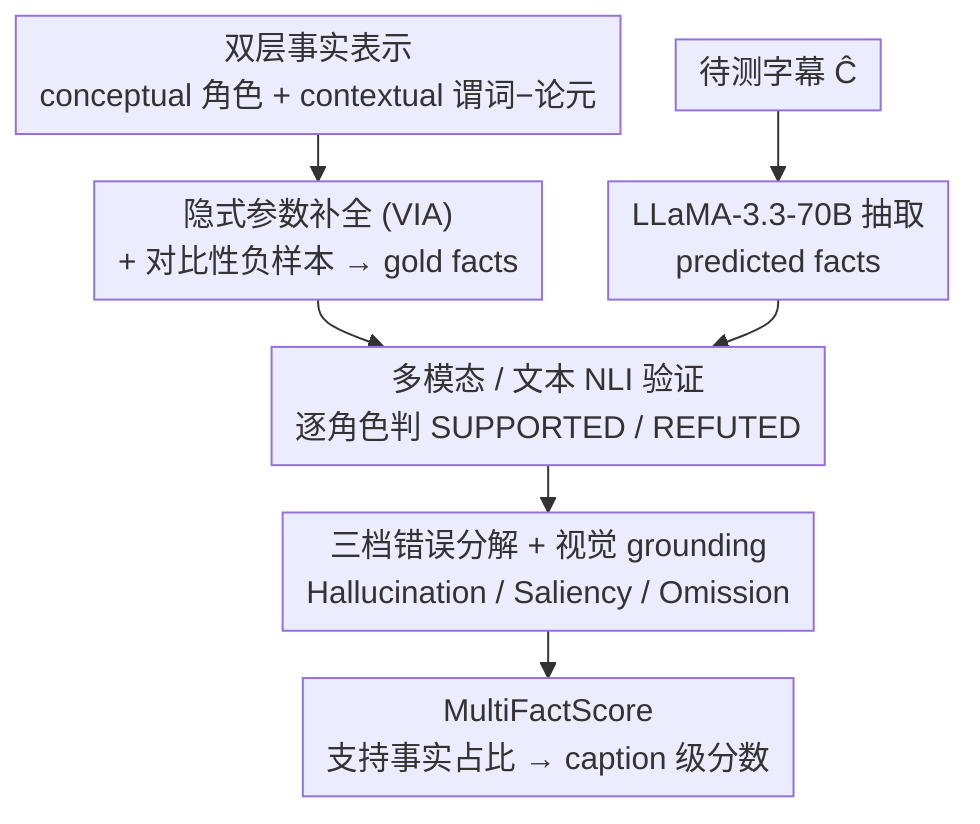

# DualFact: A Multimodal Fact Verification Framework for Procedural Video Understanding

**会议**: ACL 2026 Findings  
**arXiv**: [2604.25584](https://arxiv.org/abs/2604.25584)  
**代码**: https://github.com/OguzCennet/DualFact （有）  
**领域**: 视频理解 / 事实核查 / 评测  
**关键词**: 程序化视频字幕、双层事实、隐式参数补全、多模态 NLI、Hallucination/Saliency/Omission

## 一句话总结
作者把"做饭、家具制作"这类程序化视频字幕的事实评测拆成**双层事实**——conceptual facts（抽象角色，如 Action/Ingredient/Tool/Location）+ contextual facts（视频中可观察的 predicate–argument 关系，如 stir(soup, pot)），配套构建 YouCook3-Fact / CraftBench-Fact 两个标注隐式参数补全 (VIA) 与对比性事实的基准，并提出 MultiFactScore 用多模态/文本 NLI 在角色级别分别核查事实，进而把错误细分为 Hallucination / Saliency / Omission；实验发现 SOTA MLLM 字幕"流畅但事实残缺"，单看字幕会高估 Hallucination 一半左右，只有 video-grounded 评测才能区分 saliency 与真 hallucination。

## 研究背景与动机

**领域现状**：程序化视频字幕（cooking、woodworking、furniture assembly）评测主要靠两类指标——**lexical**（BLEU / ROUGE / METEOR / SPICE）和 **vision–language**（CLIPScore / EMScore / PACScore / UniEval）。也有少量 fact-based 评测（FaithScore / CapMAS / FactVC / FIFA）做"原子命题提取 + 验证"。

**现有痛点**：(i) lexical 指标只看 surface overlap，"add salt to bowl" vs "add salt to pot" 是 high BLEU 但 role 错；(ii) embedding 指标看全局相似度，抓不到 predicate–argument 结构；(iii) 已有 fact-based 评测把事实拍平成无类型命题，无法区分"漏 ingredient" vs "漏 tool" vs "动作角色互换"，更没法处理程序化视频特有的"隐式参数"（"stir it" 中的 it 视觉上能看到但语言上未说）。

**核心矛盾**：程序化视频的"事实"本质上**分两层**——一层是 abstract task semantics（这一步在干嘛、需要什么角色），一层是 grounded predicate–argument structure（视频里到底执行成什么）。把它们混在一起评测，既无法定位错误来源，也无法区分"流畅但漏关键 entity" 与"完全幻觉"。

**本文目标**：(i) 给程序化视频字幕定义一个 role-aware、可解释的事实评测框架；(ii) 显式建模隐式参数；(iii) 把错误分解到 Hallucination / Saliency / Omission 三类，且能通过 video grounding 区分"视觉里有但任务无关 (saliency)" vs "完全没出现过 (hallucination)"。

**切入角度**：作者从语义学借鉴 conceptual–contextual 二分——前者标准化掉 "cut / slice / chop" 这种 paraphrase；后者保留 video 中实际看到的 predicate–argument。把两层分开后，错误类型可以精细到 role 层级。

**核心 idea**：dual-layer fact representation + 隐式参数补全 (VIA) + 对比 negative facts + 多模态 NLI 核查 + 三档错误分解。

## 方法详解

### 整体框架
DualFact 想解决的是：怎么客观评判一段程序化视频字幕到底"说对了几分"。它把整条评测流水线 MultiFactScore 拆成四步串起来——先做数据集（把 YouCook2 重切成 atomic clause、补全隐式参数、人工标注双层事实、自动生成对比负样本，再新建覆盖木工/金工的 CraftBench）；接着用 LLaMA-3.3-70B-Instruct 从待测 caption $\hat{C}$ 抽出 predicted facts $\mathcal{F}_p = \text{LLM}_{\text{extract}}(\hat{C}; \Phi)$；然后让 NLI 验证器在 role 级别逐条判 SUPPORTED/REFUTED；最后用 PaliGemma2-10B 判断每条 fact 是否在视频里真有视觉依据 $G(f_i)$，按 grounding × verifier 标签把错误分到 Hallucination/Saliency/Omission 三档，并汇成 caption 级分数 $\text{MultiFactScore} = |\{f_i \in F : \hat{y}_i = \text{SUPPORTED}\}| / |F|$。整套设计的核心是"分两层事实 + 用视觉区分错误来源"。

### 关键设计

**1. Dual-Layer Fact 表示：把"语义"和"执行"拆成两层独立核查**

已有 fact-based 评测把事实拍平成无类型命题，分不清"漏 ingredient"和"tool 错配"。DualFact 把每一步指令的事实拆成两层：**Conceptual facts** $\mathcal{F}^{con}$ 是抽象的 role–value 赋值，如 Action=cut / Ingredient=tomato / Tool=knife / Location=board，刻意无视字面 paraphrase（"cut/slice/chop" 统一归一成 Action=cut）；**Contextual facts** $\mathcal{F}^{ctx}$ 则保留 predicate–argument 关系，如 cut(tomato, board) 或 stir(mixture, bowl)，要求 entity 在视频里以正确语义角色出现。

这样拆开后，同一 caption 完全可能 conceptual 对而 contextual 错——比如 "pour water into flour" vs "pour flour into water"，两者的 role 类型都没错，错的是 argument 顺序。程序化字幕表面变化大但底层结构稳定，正因如此分层才有意义：它能精确定位错误是出在"role 类型"、"role 内容"还是"argument 顺序"，比 flat fact 提供细得多的诊断信号。

**2. 隐式参数补全 (VIA) + 对比性 Negative Fact 构造：把省略和幻觉区分开**

程序化指令充斥隐式参数——"stir it" 里的 it 视觉上看得见但语言上没说。如果不补全，评测会把"省略了"误判成"幻觉了"。VIA 让标注员根据视频里实际出现的 patient/tool/location 角色，把缺失参数填回去（"stir it" → "stir the soup with a spoon in the pot"），产出 YouCook3-VIA / CraftBench-VIA 变体，共标注 7K+ 个 implicit arguments（Tab.2：YouCook3 train 3759、test 2914；CraftBench train 2132、test 1888）。

负样本则用 few-shot LLM 把 tool/object/location 换成 plausible 替代项（"add salt to bowl" → "add pepper to bowl"），刻意保持句法不变——因为只有"看似合理但其实错"的负例才能真正考验 NLI，琐碎反例没有区分度。值得注意的是，VIA 不只是评测变量：Tab.3 显示加 VIA 后 BLEU 从 5.87 升到 6.51、ROUGE 从 24.16 升到 33.13（YouCook3），说明补全确实让 caption 本身更完整。

**3. Hallucination / Saliency / Omission 三档错误分解 + 视觉 grounding：分清"真错"还是"看到了别的"**

光看 caption，会把"模型其实指认了视频里另一个无关物体"也一律算成幻觉，掩盖了真实的失败模式。DualFact 引入 $G(f_i) \in \{0,1\}$ 表示一条 fact 是否在视频中 visually grounded（由 PaliGemma2 判断），据此把错误三分：**Hallucination** $= \neg G(f_i) \land f_i \in \mathcal{F}^R$（视觉里根本没有，且 verifier 判 refute）；**Saliency** $= G(f_i) \land f_i \in \mathcal{F}^R$（视觉里确实有，但不属于 gold fact）；**Omission** $= e_i \in \mathcal{F}_g^+ \land e_i \notin \mathcal{F}_p$（gold 需要但 caption 完全没提）。

配套三个 eval mode 逐级加视觉信息：cap-only 只看 caption，text-grounded 在 caption 报错后再看视觉，mm-grounded 在多模态 verifier 报错后看视觉。这套分解的实证就摆在 Tab.7：ingredient 的 Hallucination 从 cap-only 的 34.57% 一路降到 cap-grounded 的 16.89%，被剥离出去的 17.68% 其实是 saliency——证明不引入 grounding 就会系统性高估幻觉。

### 损失函数 / 训练策略
- **NLI 训练**：多模态 NLI 用 $(V, f_i)$ pair 训练（positive label SUPPORTED，negative label REFUTED）；textual NLI 直接 prompt 预训练 LLM 不训。
- **Fact extractor**：LLaMA-3.3-70B-Instruct（Unsloth interface），few-shot prompt。
- **Grounding**：PaliGemma2-10B-PT-448 做视觉 grounding 判断。
- **Per-Video Accuracy**：$\text{Acc}(v) = \frac{1}{|T(v)|}\sum_{t \in T(v)}(\frac{1}{|t|}\sum_{i \in t} \mathbb{I}[\hat{y}_i = y_i])$，先 role 内平均、再 role 间平均。
- **MultiFactScore**：在 caption 级别 $\text{MultiFactScore} = |\{f_i \in F : \hat{y}_i = \text{SUPPORTED}\}| / |F|$。

## 实验关键数据

### 主实验
YouCook3-Fact (Tab.6) 在 Qwen2.5-VL 字幕上 NLI 验证准确率：

| Mode | 输入 | Action | Object | Location | Tool | 平均 (Concept) |
|------|------|--------|--------|----------|------|----------------|
| Multimodal | $\mathcal{F}_g^+, \mathcal{F}_g^-, V$ | 92.50 | 81.53 | 90.50 | 86.30 | **88.07** |
| Multimodal | $\mathcal{F}_p, V$ | 94.27 | 93.15 | 92.58 | 94.04 | 93.41 (model-model bias) |
| Textual | $\mathcal{F}_g^+, \mathcal{F}_g^-, C$ | 98.81 | 99.06 | 99.02 | 98.77 | 98.92 |
| Textual | $\mathcal{F}_p, C$ | 55.06 | 27.01 | 40.48 | 35.32 | **39.47** |

| Mode | 输入 | act/ing | act/in | act/on | act/to | act/with | 平均 (Ctx) |
|------|------|---------|--------|--------|--------|----------|------------|
| Multimodal | $\mathcal{F}_g, V$ | 78.68 | 83.43 | 80.35 | 82.67 | 77.80 | 79.89 |
| Textual | $\mathcal{F}_p, C$ | 16.72 | 20.52 | 19.76 | 29.21 | 21.92 | **21.23** |

> Qwen2.5-VL 的 caption 在 gold conceptual fact 上对照只剩 **39.47%** 概念准确率、contextual 只剩 **21.23%**，说明 MLLM 字幕严重缺关键 role。

### 消融实验
错误分解 (Tab.7 YouCook3-Fact)：

| Fact Type | Eval Mode | Omission | Hallucination | Saliency |
|-----------|-----------|----------|---------------|----------|
| Ingredient | cap-only | 65.43 | 34.57 | – |
| Ingredient | cap-grounded | 65.43 | **16.89 (−17.68)** | 17.68 |
| Ingredient | mm-grounded | – | 100.0 | 0.0 |
| Tool | cap-only | 49.80 | 50.20 | – |
| Tool | text-grounded | 53.83 | 37.85 | 8.31 |
| Location | cap-only | 40.03 | 59.97 | – |
| Location | text-grounded | 44.72 | 54.17 | 1.11 |

> "Cap-only" 把任何与 gold 不一致都算 hallucination；引入 visual grounding 后 ingredient 的 hallucination 几乎砍半（17%→saliency）；但 action 类错误 mm-grounded 下 100% 仍是 hallucination，说明动作语义错是更深层失败。

### 关键发现
- **MLLM 字幕"流畅但事实残缺"是普遍现象**：Qwen2.5-VL 在 contextual fact 上准确率仅 ~21%，远低于在 gold facts 上的 verifier 性能 ~94%，证明问题不是 verifier 不行，是 caption 本身缺信息。
- **Cap-only 评测高估 hallucination ~一半**：所有 Ingredient/Tool/Location 类错误，去 grounding 后才能区分"幻觉"vs"看到了别的"；Tab.10 人评同样确认 caption-based 评测把 78% contextual 判错，video-based 只 21% 判错。
- **Conceptual 类错与 Contextual 类错失败模式不同**：conceptual 错通常是"漏 entity / 选错 type"，contextual 错往往是"argument swap / role 错配"；动作类错最难——mm-grounded 下 100% 都是真 hallucination，说明视觉理解的"动作语义"还远不到位。
- **Model–model consistency bias**：用 verifier 核查 model 自己生成的 caption-derived facts，准确率反而比核查 gold facts 更高（多模态 ConCept 88.07 → 93.41）；这警示我们 LLM-as-judge 模式存在系统性偏差。
- **Caption-based conceptual fact 与人评相关性最高**：Tab.11 显示 Spearman ρ = 0.429（vs CIDEr 0.140 / BERTScore −0.05 / EMScore-Text 0.28），说明 dual-layer 设计真的反映人类判断。
- **视频核查仍有 ceiling 问题**：video-based 自动分数饱和（绝对值高但 variance 低），导致 rank correlation 反而比 caption-based 低；评测设计需要进一步处理 ceiling effect。

## 亮点与洞察
- **Conceptual vs Contextual 二分** 是这篇评测论文最大的概念贡献：对所有"程序化任务"评测都适用（cooking、craft、surgery、lab protocol），把"语义"和"执行"分开看是个普适视角。
- **VIA（隐式参数补全）作为一类独立的标注资源**：之前的 video caption dataset 没有系统化处理隐式参数，作者标了 7K+，是社区可复用的资产。
- **Hallucination / Saliency / Omission 三档分解 + 三档 grounding mode** 是评测方法学的 best practice 案例——任何 fact-based metric 都应该把这三档分开报告，而不是合成一个总分。
- **Model–model consistency bias 的实证警告**：verifier 与 captioner 同源时准确率虚高 5–10%，这对所有 LLM-as-judge 工作都有提醒意义。
- **Caption-based 评测"严"，Video-based 评测"宽但饱和"** 的 trade-off 揭示，得到了清晰的 Pearson/Spearman 表格支持——评测设计者必须同时考虑两个 modality。

## 局限与展望
- **覆盖域只有 cooking 和 furniture crafting**：作者承认 generalizability 受限；surgical、scientific lab、industrial 装配等程序化场景都未验证。
- **依赖 fact extraction pipeline 准确性**：作者做了 sensitivity analysis 表明 extraction 噪声 <1.2 分影响有限，但 extraction 用的 LLaMA-3.3-70B 本身也可能引入系统性偏差。
- **只建模 action / object 类事实，不建模 attribute**：size、color、spatial 关系都没纳入；这些恰恰是真实程序化任务里关键的"质量"信息（食材切多厚、木板钻多深）。
- **Video grounding 在复杂场景退化**：occlusion / fine-grained spatial relation 下 PaliGemma2 grounding 自身就不准，导致错误分解的边界模糊。
- **Hallucination 类型未细分**：现在只判"是 hallucination 还是不是"，没区分"轻度幻觉"vs"严重幻觉"vs"概念性幻觉"vs"对象误识"。
- **改进方向**：把 Dual-Layer 扩到 attribute 层级（quantity / spatial / sequence）；把 ceiling effect 用 hard-negative mining 缓解；把 PaliGemma2 换成更强的 spatial grounding model（如 Florence-2 detect）。

## 相关工作与启发
- **vs FaithScore / CapMAS / FactVC / FIFA**：这些 fact-based metric 把事实当 flat untyped 命题；DualFact 显式分 conceptual / contextual 两层并加 role-aware 标签，能定位"漏 ingredient" vs "tool 错配"等细粒度错误。
- **vs CLIPScore / EMScore / PACScore / UniEval**：embedding-based metric 看全局相似度，对 role swap "pour water into flour" vs "pour flour into water" 不敏感；DualFact 通过 predicate–argument 显式判断这类对调。
- **vs BLEU / ROUGE / SPICE**：lexical 指标连 role 都不识别；Tab.11 上 CIDEr 与人评 ρ=0.14，DualFact-Caption-Con ρ=0.43。
- **vs 一般 hallucination benchmark（如 HallusionBench 用于 MLLM）**：HallusionBench 关注 VQA 中的视觉幻觉，不针对 procedural caption；DualFact 是首个针对程序化字幕 + 隐式参数 + role-aware 的事实评测。
- **启发**：dual-layer fact representation 可以迁到任何"叙述带角色"的评测——医疗病历摘要（symptom/treatment/dose）、法律事实摘要（party/action/jurisdiction）、科学实验摘要（reagent/instrument/condition）——都能用 conceptual + contextual 双层分解。

## 评分
- 新颖性: ⭐⭐⭐⭐ "Conceptual + Contextual 双层 + VIA + 三档错误分解" 是评测方法学的清晰创新组合，特别是 saliency 类的显式建模少见。
- 实验充分度: ⭐⭐⭐⭐ 两个数据集 + 多模态 vs 文本 NLI + 错误分解 + 人评 + 与 7 个 baseline 指标相关性，覆盖到位；只在 Qwen2.5-VL 一个 captioner 上跑稍弱。
- 写作质量: ⭐⭐⭐⭐ Tab.1 的 error taxonomy 一目了然，公式与表格组织清晰。
- 价值: ⭐⭐⭐⭐ 给 procedural video 评测提供了 role-aware、可解释的新框架与两个高质量数据集，社区可立刻用；对所有 MLLM 字幕系统提供错误定位工具。

<!-- RELATED:START -->

## 相关论文

- [\[ACL 2026\] VISTA: Verification In Sequential Turn-based Assessment](vista_verification_in_sequential_turn-based_assessment.md)
- [\[CVPR 2026\] DarkAct: A RGB-Thermal Dataset and Fusion Framework for Multimodal Low-Light Action Recognition](../../CVPR2026/video_understanding/darkact_a_rgb-thermal_dataset_and_fusion_framework_for_multimodal_low-light_acti.md)
- [\[CVPR 2026\] VideoITG: Multimodal Video Understanding with Instructed Temporal Grounding](../../CVPR2026/video_understanding/videoitg_multimodal_video_understanding_with_instructed_temporal_grounding.md)
- [\[ACL 2026\] GameplayQA: A Benchmarking Framework for Decision-Dense POV-Synced Multi-Video Understanding of 3D Virtual Agents](gameplayqa_a_benchmarking_framework_for_decision-dense_pov-synced_multi-video_un.md)
- [\[AAAI 2026\] EmoVid: A Multimodal Emotion Video Dataset for Emotion-Centric Video Understanding and Generation](../../AAAI2026/video_understanding/emovid_a_multimodal_emotion_video_dataset_for_emotion-centric_video_understandin.md)

<!-- RELATED:END -->
