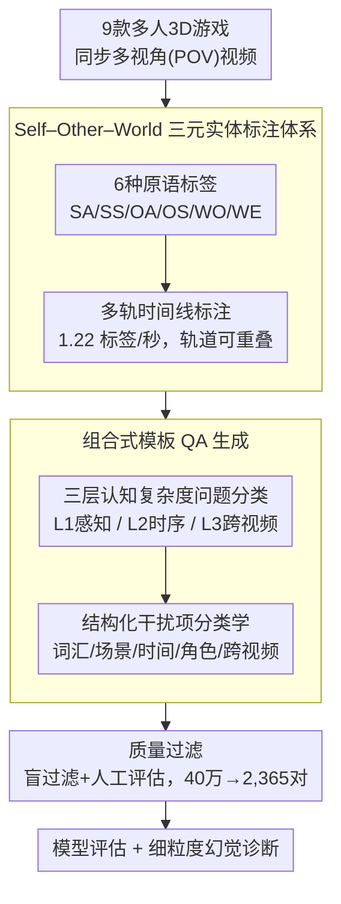

# GameplayQA: A Benchmarking Framework for Decision-Dense POV-Synced Multi-Video Understanding of 3D Virtual Agents

**会议**: ACL 2026  
**arXiv**: [2603.24329](https://arxiv.org/abs/2603.24329)  
**代码**: [项目主页](https://hats-ict.github.io/gameplayqa/)  
**领域**: 视频理解  
**关键词**: 视频问答, 多视角理解, 游戏AI, 幻觉诊断, 多智能体感知

## 一句话总结

提出 GameplayQA，一个基于多人3D游戏视频的端到端基准框架，通过密集时间线标注（1.22标签/秒）和结构化干扰项分类学，系统评估多模态大模型在决策密集、多视角同步场景下的感知和推理能力，揭示前沿模型与人类表现仍有显著差距。

## 研究背景与动机

**领域现状**：多模态大模型（MLLMs）正被广泛部署为3D环境中自主智能体的感知骨干（如机器人、虚拟世界），这要求模型具备快速状态变化感知、动作归属识别和并发多智能体行为推理等能力。

**现有痛点**：当前视频理解基准存在三个关键不足——（1）缺乏具身性和智能体基础，多为慢节奏的被动观察视频，无法测试高频状态转换和密集决策场景；（2）不可诊断幻觉类型，只提供全局性能指标，无法细粒度定位模型失败原因（时序误判？对象捏造？角色混淆？）；（3）缺乏多视频理解评估，几乎全部聚焦于单一视角。

**核心矛盾**：智能体感知需要同时追踪自身状态（Self）、建模其他智能体行为（Other）、感知环境变化（World），但现有基准的标注和评估体系无法覆盖这种多层次、多视角的认知需求。

**本文目标**：构建一个端到端的基准框架，能够评估模型在决策密集3D环境中的感知基础能力，并提供可诊断的错误分析。

**切入角度**：利用多人3D游戏作为"认知沙箱"——状态和结果确定性高、决策节奏快，天然适合评估智能体感知。

**核心idea**：围绕 Self–Other–World 三元实体分解设计标注体系，结合组合式模板QA生成和结构化干扰项分类学，实现从基础感知到跨视频推理的多层次可诊断评估。

## 方法详解

### 整体框架

GameplayQA 要解决的是：现有视频基准多是慢节奏被动观察、只给全局分、还只看单视角，没法考验智能体在快节奏3D环境里的感知。它把多人3D游戏当作"认知沙箱"，搭了一条端到端流水线——先从9款多人3D游戏收集同步多视角视频；再按6种实体类型（SA/SS/OA/OS/WO/WE）做密集多轨时间线标注，密度达 1.22 标签/秒；接着用组合式模板算法从标注里生成 QA，问题按三层认知复杂度组织、每道题再配上结构化干扰项诱导幻觉，初始产出 40 万候选对、降采样到 4K、再质量过滤到最终 2,365 对；最后即可在这套题上评估模型并做细粒度幻觉分析。质量过滤本身分两阶段：先做盲过滤（blind filtering，语言先验过滤）剔掉不看视觉就能答的题，再对 120 道均匀采样题人工评估，约 8% 被标为有缺陷而移除。

### 关键设计

**1. Self–Other–World 三元实体标注体系：把"看到什么"结构化成可诊断的轨道**

3D 多智能体环境里，模型要同时追踪自身状态、建模其他智能体、感知环境变化，但已有基准的标注无法覆盖这种多层次需求。GameplayQA 把可观察事件沿两个轴分类——实体轴（Self/Other/World）和时间属性轴（动作/状态对应智能体，对象/事件对应环境），组合出 6 种原语标签类型（SA/SS/OA/OS/WO/WE）。

每种类型作为一条独立标注轨道，轨道之间允许时间重叠，从而能捕获并发事件。这套划分不是随意的：它直接对应多智能体强化学习的三个核心需求——密集状态-动作追踪（Self）、其他智能体建模（Other）、环境感知（World），因此模型在某一轨道上失分，就能直接读出它缺的是哪一类感知能力。

**2. 三层认知复杂度问题分类：从"看到什么"到"什么时候"再到"多视角如何关联"**

为了区分基础感知和复杂推理，题目按认知复杂度分三层、共 15 个任务类别。L1（单参考感知）测基础的动作/状态/对象识别；L2（时序推理）要求跨实体关联、时间定位、缺失识别、排序和意图推断；L3（跨视频理解）则要在同步多视角之间做引用、排序和视角识别。

这种渐进设计模拟了智能体认知由浅入深的过程，好处是能把模型能力拆开看：实验里准确率随层级单调下降（L1→L2→L3），正说明不同层级确实考的是不同维度的能力，而非笼统的一个总分。

**3. 结构化干扰项分类学（Structured Distractor Taxonomy）：把"答错了"变成"为什么答错"**

传统基准只能告诉你模型选错了选项，定位不到失败原因。GameplayQA 把每个错误选项按它与正确答案的关系归类：词汇干扰项（文本变体）、场景干扰项（合理但未发生的事件）、时间干扰项（在查询时间窗外发生的事件）、角色干扰项（智能体归属互换）、跨视频干扰项（来自其他视角的事件）。

由于干扰项是按失败模式精心构造的，模型选了哪类干扰项就暴露了它的具体短板——是时间定位错、角色混淆、还是语义误解。这让基准从"性能温度计"升级成"诊断工具"，为模型改进指出明确方向。

## 实验关键数据

### 主实验

| 模型 | 总体 | L1 单参考 | L2 时序 | L3 跨视频 |
|------|------|----------|---------|----------|
| 人类 | 80.5 | ~84% | ~77% | ~89% |
| Gemini 2.5 Pro | 71.3 | ~63% | ~60% | ~77% |
| GPT-5 | 67.0 | ~67% | ~64% | ~62% |
| Gemini 3 Flash | 68.2 | ~64% | ~62% | ~63% |
| Qwen3 VL 235B | 63.8 | ~67% | ~62% | ~49% |
| Claude 4.5 Sonnet | 51.3 | ~62% | ~51% | ~42% |

### 消融实验

| 配置 | 总体 | L1 | L2 | L3 |
|------|------|-----|-----|-----|
| 完整视频（基线） | 62.7 | 67.2 | 61.9 | 60.6 |
| 无视频 | 29.4 | 36.0 | 29.1 | 24.2 |
| 随机单帧 | 41.7 | 52.9 | 40.9 | 33.7 |
| 打乱帧序 | 54.8 | 63.1 | 52.6 | 53.4 |

### 关键发现
- 所有模型准确率随认知层次上升持续下降：L1（61.2%）→ L2（56.0%）→ L3（49.4%），验证了三层分类的有效性
- 最难的两个任务：出现次数计数（OccCnt，36.5%）和跨视频排序（X-VOrd，38.8%），说明精确时间追踪是当前模型的根本弱点
- 其他智能体相关（OA: 54.0%, OS: 55.4%）比世界对象（WO: 62.0%）难约8个百分点
- 跨视频和时间干扰项导致最多错误，场景干扰项最容易——模型处理静态视觉输入优于时序和跨视频推理
- 快节奏射击游戏（CS2、Battlefield）错误率最高，慢节奏探索游戏更容易

## 亮点与洞察
- **诊断性极强**：结构化干扰项分类学是本文最大亮点，将"模型答错了"转化为"模型为什么答错了"，为改进提供明确指引
- **框架设计而非静态数据集**：不只是一个基准，而是包含标注协议、QA生成算法和错误分析的完整端到端管道，可扩展到新游戏和新领域
- **认知层级设计合理**：L1→L2→L3 的渐进复杂度有效区分了不同能力维度，揭示模型在时序推理和多视角理解上的系统性弱点
- **多视角同步**：首个在游戏领域提供同步多POV视频QA的基准，填补了多视频理解评估空白

## 局限与展望
- **数据规模较小**：仅2,365道QA对和100个视频，相比一些大规模基准显得有限
- **游戏领域偏向**：主要来自竞技类3D游戏，向其他领域（机器人、自动驾驶）的泛化需要验证
- **标注误差传播**：自动生成标注后人工校验，仍有约8%的质量问题
- 未来方向：扩展到更多游戏类型和非游戏领域、引入开放式问答、增加模型的主动探索评估

## 相关工作与启发
- **vs MarioQA**：开创了游戏领域视频QA但局限于2D平台游戏，GameplayQA 扩展到3D多人游戏且支持多视角
- **vs Ego4D/EgoSchema**：关注第一人称视频理解但缺乏多智能体和多视角维度
- **vs MVU-Eval**：支持多视频理解但不面向智能体场景，缺乏决策密度和诊断性

## 评分
- 新颖性: ⭐⭐⭐⭐ Self-Other-World三元分解和结构化干扰项分类学设计新颖，填补多视角游戏视频QA空白
- 实验充分度: ⭐⭐⭐⭐ 覆盖15+个前沿模型，有消融实验和多维度错误分析，但数据规模偏小
- 写作质量: ⭐⭐⭐⭐⭐ 框架设计清晰，图表丰富，层次分明
- 价值: ⭐⭐⭐⭐ 为多智能体感知评估提供了实用的诊断工具，对具身AI和世界模型研究有启发

<!-- RELATED:START -->

## 相关论文

- [\[CVPR 2025\] MLVU: Benchmarking Multi-task Long Video Understanding](../../CVPR2025/video_understanding/mlvu_benchmarking_multi-task_long_video_understanding.md)
- [\[ACL 2026\] DualFact: A Multimodal Fact Verification Framework for Procedural Video Understanding](dualfact_a_multimodal_fact_verification_framework_for_procedural_video_understan.md)
- [\[ICCV 2025\] 4D-Bench: Benchmarking Multi-modal Large Language Models for 4D Object Understanding](../../ICCV2025/video_understanding/4d_bench_benchmarking_multimodal_llms_for_4d_object_understanding.md)
- [\[AAAI 2026\] UVLM: Benchmarking Video Language Model for Underwater World Understanding](../../AAAI2026/video_understanding/uvlm_benchmarking_video_language_model_for_underwater_world_understanding.md)
- [\[ACL 2026\] Confidence Estimation for LLMs in Multi-turn Interactions](confidence_estimation_for_llms_in_multi-turn_interactions.md)

<!-- RELATED:END -->
