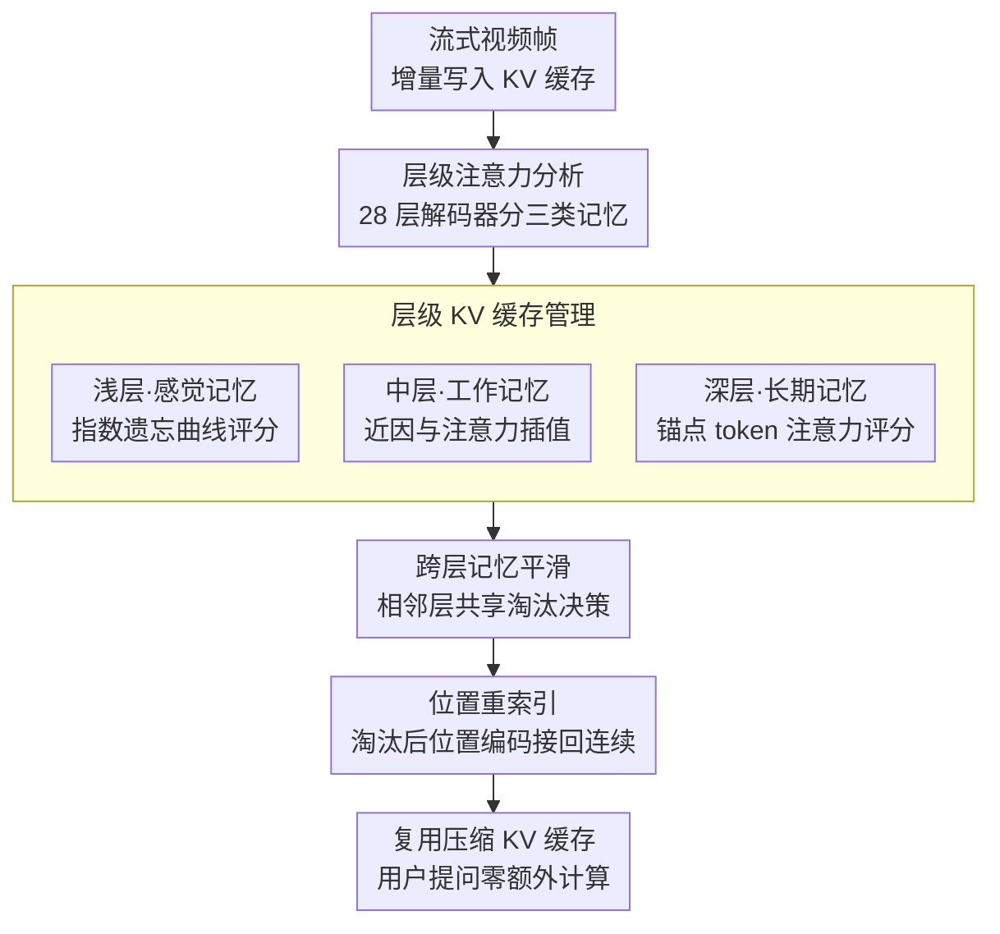

# HERMES: KV Cache as Hierarchical Memory for Efficient Streaming Video Understanding

**会议**: ACL 2026  
**arXiv**: [2601.14724](https://arxiv.org/abs/2601.14724)  
**代码**: [GitHub](https://github.com/haowei-freesky/HERMES)  
**领域**: 视频理解 / 流式推理  
**关键词**: 流式视频, KV缓存管理, 层级记忆, 实时响应, 免训练

## 一句话总结

本文提出 HERMES，基于对 MLLM 解码器层级注意力偏好的机制性分析，将 KV 缓存概念化为层级记忆框架（浅层=感觉记忆、中层=工作记忆、深层=长期记忆），实现免训练的高效流式视频理解，在减少 68% 视频 token 的条件下仍保持或提升准确率，TTFT 延迟仅 <30ms，比前 SOTA 快 10 倍。

## 研究背景与动机

**领域现状**：MLLM 在离线视频理解上取得显著进展，但扩展到流式视频输入仍面临挑战——需要同时维持理解性能、实时响应和低 GPU 内存开销。现有流式方法分为外部记忆（将视频内容存为描述或补丁，查询时检索）和内部记忆（直接在 KV 缓存中管理）。

**现有痛点**：(1) 外部记忆方法在查询到达时需要检索和多模态预填充，延迟高且缺乏端到端连贯性；(2) ReKV 和 LiveVLM 等缓存方法将视频段卸载到 CPU/磁盘，查询时需额外检索操作，延迟仍然显著；(3) 现有方法使用粗粒度的淘汰策略（如 FIFO 统一应用于所有层），忽略了不同层的注意力偏好差异。

**核心矛盾**：KV 缓存天然是模型内在的潜在记忆，适合流式场景的免训练管理，但现有方法未利用层间注意力模式的差异——不同层对视频信息的"记忆方式"不同。

**本文目标**：设计一种基于层级注意力分析的 KV 缓存管理方法，无需训练即可插入现有 MLLM，实现真正的实时流式视频问答。

**切入角度**：对 LLaVA-OV-7B 的 28 层解码器进行注意力可视化分析，发现三种截然不同的层级记忆模式。

**核心 idea**：浅层展现强烈的近因偏好（感觉记忆），用指数衰减管理；深层关注帧级"锚点 token"（长期记忆），用注意力权重管理；中层在两者间过渡（工作记忆），用插值管理。加上跨层平滑和位置重索引确保一致性。

## 方法详解

### 整体框架

HERMES 想解决的是流式视频问答的老大难：既要保住理解性能、又要实时响应、还要 GPU 内存不爆。它的出发点是把 KV 缓存当成模型内在的"潜在记忆"，免训练地直接管理。整条方法围绕一个观察展开——对 LLaVA-OV-7B 的 28 层解码器做注意力可视化，发现不同层的"记忆方式"截然不同：浅层强烈偏好近期帧（感觉记忆）、深层只盯住帧级锚点 token（长期记忆）、中层在两者间过渡（工作记忆）。据此 HERMES 装了三个组件：层级 KV 缓存管理按层类型用不同评分和淘汰策略；跨层记忆平滑防止各层各自淘汰造成不一致；位置重索引在淘汰后修好位置编码。推理时直接复用压缩好的 KV 缓存，用户提问时无需任何额外计算。

### 关键设计

**1. 层级 KV 缓存管理：不同层用不同的"遗忘规则"**

现有缓存方法用粗粒度的统一淘汰策略（如 FIFO 套到所有层），忽略了层间注意力偏好的差异。HERMES 据注意力分析对三类层各给一套 token 重要性评分：浅层用指数遗忘曲线 $S_i^l = \alpha_i^l \cdot e^{-k\Delta t_i}$，越新的 token 越重要；深层用基于伪查询的注意力权重 $S_i^l = \alpha_i^l \cdot W_i^l$，只留锚点；中层则用层依赖权重 $\omega_l$ 在近因分数和注意力分数之间插值 $S_i^l = (1-\omega_l) A_i^l + \omega_l R_i^l$。

这种差异化的根据很直接——注意力可视化已经清楚显示每层的记忆功能不同，一刀切的 FIFO 或纯注意力淘汰没法同时满足浅层"要新鲜"和深层"要锚点"两种相反需求。一个佐证是深层锚点 token 的间隔恰好等于单帧 token 数（196），说明深层确实是在按帧抓关键点。

**2. 跨层记忆平滑（Cross-Layer Memory Smoothing）：别让同一个 token 在各层命运不一**

如果每层独立淘汰，同一帧的信息可能在某些层被保留、另一些层被丢掉，视觉记忆就碎片化了，端到端推理的连贯性也被破坏。HERMES 让相邻层之间共享部分淘汰决策，使同一视频 token 在多层中的保留/淘汰保持一定一致性，从而把分层管理的灵活性和跨层推理的连贯性兼顾起来。

**3. 位置重索引（Position Re-Indexing）：淘汰后把位置编码接回连续**

直接删掉中间的 token 会让位置编码出现跳跃，而 RoPE 这类基于位置的注意力对此敏感，会算出异常。HERMES 在每次淘汰后把保留下来的 token 位置重新映射成连续的 $[0, |M|)$，避免位置不连续带来的注意力错乱，保证压缩后的缓存仍能被正常使用。

### 损失函数 / 训练策略

完全免训练。方法设计借鉴了 Ebbinghaus 遗忘曲线理论和认知心理学的层级记忆模型；计算深层注意力权重时，用一段通用引导提示（generic guidance prompt）充当伪查询。指数遗忘率 $k$ 和插值参数为手动设定的超参。

## 实验关键数据

### 主实验

**流式视频基准（LLaVA-OV-7B）**

| 方法 | StreamingBench | EgoSchema | MVBench | Video-MME | 平均 |
|------|---------------|-----------|---------|-----------|------|
| 全量（无压缩） | 53.2 | 58.1 | 69.3 | 61.8 | 60.6 |
| ReKV | 51.8 | 55.2 | 67.1 | 59.4 | 58.4 |
| StreamMem | 52.1 | 56.8 | 68.5 | 60.1 | 59.4 |
| **HERMES** | **59.3** | **58.9** | **69.8** | **62.4** | **62.6** |

### 消融实验

**效率对比（单 A800 GPU）**

| 方法 | TTFT（ms） | GPU 内存 | token 减少 |
|------|----------|---------|-----------|
| 全量 | ~3000+ | 线性增长 | 0% |
| ReKV | ~1500 | 需 CPU 内存 | ~50% |
| **HERMES** | **<30** | **恒定** | **68%** |

### 关键发现

- HERMES 在减少 68% video token 的条件下，在流式基准上反而提升 11.4%——证明冗余 token 的去除实际改善了推理质量
- TTFT < 30ms 且 GPU 内存恒定，随输入帧数增加无 OOM 风险——查询到达时零额外计算
- 层级记忆模型在多种 MLLM 上泛化——不仅限于 LLaVA-OV
- 浅层注意力的近因偏好符合 Ebbinghaus 遗忘曲线，深层注意力的锚点模式间隔恰好等于单帧 token 数（196）

## 亮点与洞察

- 从认知心理学借鉴的层级记忆概念与 Transformer 层级的注意力模式精确对应——这不仅是类比，而是有定量注意力分析支持的发现
- 零额外延迟的设计对实时应用至关重要——ReKV 等方法虽然减少了存储但查询时仍需检索
- 免训练+即插即用的特性使其可直接应用于现有 MLLM，降低了实用门槛

## 局限与展望

- 层级边界（浅/中/深）的划分依赖于特定模型的分析，不同架构可能需要重新确定
- 伪查询替代真实用户查询可能在特定场景下产生偏差
- 仅在视频流式场景验证，对文本流式或多模态流式的适用性未探索
- 指数遗忘率 $k$ 和插值参数需要手动设定

## 相关工作与启发

- **vs ReKV/LiveVLM**: 需要 CPU 卸载+检索操作，延迟高；HERMES 直接复用 GPU 上的 KV 缓存
- **vs StreamMem**: 利用聊天模板 token 引导压缩但缺乏细粒度管理；HERMES 基于层级注意力分析实现精细管理
- **vs StreamingLLM**: attention sink 机制保留初始 token 但忽略层间差异；HERMES 利用层级特化实现更智能的淘汰

## 评分

- 新颖性: ⭐⭐⭐⭐⭐ 层级记忆概念化和基于注意力分析的差异化管理策略非常新颖
- 实验充分度: ⭐⭐⭐⭐⭐ 多个流式基准+效率分析+注意力可视化+消融
- 写作质量: ⭐⭐⭐⭐⭐ 从机制分析到方法设计的逻辑链非常清晰
- 价值: ⭐⭐⭐⭐⭐ 实时流式视频理解的实用解决方案，TTFT 10 倍加速

<!-- RELATED:START -->

## 相关论文

- [\[CVPR 2026\] FluxMem: Adaptive Hierarchical Memory for Streaming Video Understanding](../../CVPR2026/video_understanding/fluxmem_adaptive_hierarchical_memory_for_streaming_video_understanding.md)
- [\[NeurIPS 2025\] InfiniPot-V: Memory-Constrained KV Cache Compression for Streaming Video Understanding](../../NeurIPS2025/video_understanding/infinipot-v_memory-constrained_kv_cache_compression_for_streaming_video_understa.md)
- [\[CVPR 2026\] MuKV: Multi-Grained KV Cache Compression for Long Streaming Video Question-Answering](../../CVPR2026/video_understanding/mukv_multi-grained_kv_cache_compression_for_long_streaming_video_question-answer.md)
- [\[CVPR 2026\] OASIS: On-Demand Hierarchical Event Memory for Streaming Video Reasoning](../../CVPR2026/video_understanding/oasis_on-demand_hierarchical_event_memory_for_streaming_video_reasoning.md)
- [\[ICCV 2025\] VideoLLaMB: Long Streaming Video Understanding with Recurrent Memory Bridges](../../ICCV2025/video_understanding/videollamb_long_streaming_video_understanding_with_recurrent_memory_bridges.md)

<!-- RELATED:END -->
