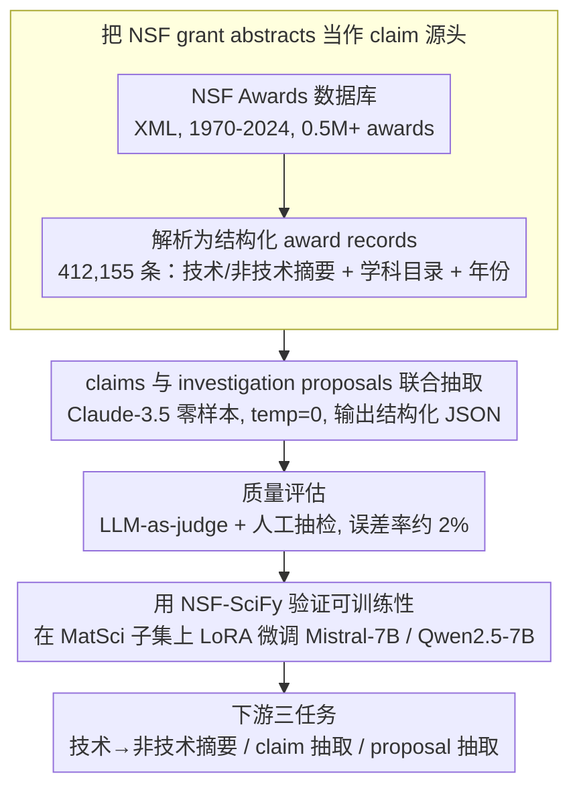

# NSF-SciFy: Mining the NSF Awards Database for Scientific Claims

**会议**: ACL2026  
**arXiv**: [2503.08600](https://arxiv.org/abs/2503.08600)  
**代码**: https://github.com/darpa-scify/NSFSciFy  
**领域**: 科学文本挖掘 / 数据集构建  
**关键词**: 科学 claim 抽取, NSF 奖项摘要, 科学可行性, LoRA 微调, 元科学

## 一句话总结
NSF-SciFy 从 NSF 奖项摘要中抽取 2.8M 科学 claims 和 investigation proposals，构建了比现有科学 claim 数据集大几个数量级的资源，并展示了它能显著提升 claim / proposal 抽取模型。

## 研究背景与动机

**领域现状**：科学 claim verification 已有 SciFACT、PubHEALTH、CLIMATE-FEVER、HealthVer 等数据集，但多数来自论文、新闻或事实核查站点，规模通常从几百到一万多条 claim，且领域偏生物医学、公共健康或气候等特定主题。

**现有痛点**：科学文献增长很快，论文提到科学出版总体年增长率约 4%、翻倍时间约 17 年。靠人工追踪“哪些科学主张被提出、哪些只是待验证的研究计划”越来越不可行。现有数据集不仅规模小，还很少覆盖 grant proposal 中的早期科学主张和未来研究计划。

**核心矛盾**：科学 grant 摘要既包含作者声称为真的知识，也包含“打算去研究”的 future-looking proposal。如果抽取系统不区分这两类陈述，就容易把尚未完成的研究计划误当成已经成立的科学事实；但如果只抽 claim，又会丢掉理解科研活动演化的重要线索。

**本文目标**：作者希望利用 NSF Awards 数据库构建一个跨科学和数学领域的大规模资源，既包含 scientific claims，也包含 investigation proposals，并验证该资源对三个任务是否有用：技术摘要转非技术摘要、claim 抽取、proposal 抽取。

**切入角度**：NSF 奖项摘要有几个天然优势：它覆盖基础研究的广泛领域；经过专家评审；公开可用；并且对近年项目还可能链接到后续论文。它比已发表论文更靠近“科学想法被资助和形成”的源头。

**核心 idea**：用零样本 LLM prompt 从 NSF grant abstracts 中联合抽取 claims 和 investigation proposals，再用这些高精度、大规模弱标注数据训练更小的开源模型。

## 方法详解

NSF-SciFy 的方法不是提出一个复杂模型，而是构建一个可复用的数据生成和评估管线：先抓取 NSF Awards XML 数据库，解析为结构化 award records；再用 Claude-3.5 做联合抽取；接着人工/LLM 辅助评估抽取质量；最后用材料科学子集训练 Mistral-7B 和 Qwen2.5-7B，验证数据对下游任务的训练价值。

### 整体框架

数据源是 NSF Awards database，从 1970 年到 2024 年 9 月，原始 XML 包含超过 0.5M awards。解析后得到 412,155 个可用 awards，构成 NSF-SciFy 主体。论文重点分析两个子集：NSF-SciFy-MatSci，来自 Division of Materials Research；NSF-SciFy-20K，从五个 NSF directorates 中分层采样。

每个记录通常包含 award ID、标题、年份、directorate/division、技术摘要、非技术摘要、claims、investigation proposals，以及近年 award 可用的后续 publications。非技术摘要并非简单复制技术摘要：在 13,025 对技术/非技术摘要中，只有 202 对即 1.5% 的 symmetric BLEU 相似度超过 0.6。

抽取阶段使用 Claude-3.5-Sonnet-20240620，temperature 设为 0。Prompt 要求模型返回 JSON，包括 award ID、技术摘要、非技术摘要、claims 列表和 investigation proposals 列表。作者强调 joint extraction 很重要：如果只抽 claims，模型更容易把 forward-looking investigation statements 误标成已成立 claim。

### 关键设计

**1. 把 NSF grant abstracts 当作 claim 源头：从“已发表”往前挪到“被资助”**

现有科学 claim 数据集几乎都取自论文、新闻或事实核查站点，规模从几百到一万多条，主题还偏生物医学、公共健康、气候这些窄领域，看到的都是已经发表、已成定论的主张。NSF-SciFy 把数据源往源头挪了一步：解析 NSF Awards 数据库的 XML，保留每个 award 的 technical / non-technical 摘要、directorate/division 学科目录、奖项年份，以及近年项目可链接的后续 publications，形成一个能做纵向追踪的科学主张库。grant 摘要捕捉的是研究刚被资助时的知识假设和计划，比只看发表论文更靠近“科学想法被资助和形成”的状态，这也是它能做到 2.8M claims、比 SciFACT（1.4K）大几个数量级的根本原因。

**2. claims 与 investigation proposals 联合抽取：逼模型分清“已知”和“将研究”**

科学摘要里大量句子是“我们将研究 / 开发 / 测试”这种 forward-looking 的语气，如果只抽 claim，模型很容易把这些计划误标成已成立的事实，污染数据质量。NSF-SciFy 用 Claude-3.5-Sonnet-20240620（temperature=0）做零样本抽取，prompt 明确把 claims（作者声称为真）和 investigation proposals（作者计划调查）拆成两类、要求返回结构化 JSON（含 award ID、技术/非技术摘要、claims 列表、proposals 列表）。联合建模 proposal 等于给模型一个安放“计划”的出口，它不必再把动词时态暧昧的句子硬塞进 claim，claim 一侧的纯度因此更高。

**3. 用 NSF-SciFy 验证可训练性：证明它不只是“大”，还能 bootstrap 出可用模型**

数据集大不等于有用，作者用下游训练来证明这批弱标注数据的价值。他们在 NSF-SciFy-MatSci 上去重过滤得到 11,141 条样本，按 8,641 / 500 / 2,000 切成 train / validation / test，用 LoRA 微调 Mistral-7B-instruct-v0.3 和 Qwen2.5-7B-Instruct。如果用 LLM 零样本抽出来的大规模数据，反过来能显著提升更小的开源模型做 claim/proposal 抽取，就说明“LLM 抽取 → 训练小模型”这条 bootstrapping 链路成立——实验里 claim 抽取 F1 接近翻倍，正是这个判断的直接支撑。

### 损失函数 / 训练策略

论文没有提出新的损失函数，而是采用 LoRA 微调 7B 模型。LoRA rank 为 128，`lora_alpha=64`，学习率 $1 \times 10^{-5}$，线性调度；更新 query、key、value、output projection，以及 MLP gate、up、down projections。训练 3 epochs，warmup 100 steps，batch size 2，gradient accumulation 4，在 A100 GPU 上每个 epoch 约 1 小时。

评估上，技术摘要转非技术摘要使用 BERTScore 与 ROUGE；claim/proposal 抽取使用 GPT-4o-mini 定义的 pairwise boolean judge function 计算 precision / recall / F1，并在人类标注样本上验证其判断与人工接近。

## 实验关键数据

### 数据集规模

| 数据集 | awards / abstracts | claims | investigation proposals | 覆盖范围 |
|--------|--------------------|--------|-------------------------|----------|
| NSF-SciFy | 412,155 awards | 2.8M | cache 未给总 proposal 数 | 1970-2024，全科学和数学领域 |
| NSF-SciFy-MatSci | 16,042 awards | 114K | 145K | 材料科学，平均每对摘要约 7 个 claims、9 个 proposals |
| NSF-SciFy-20K | 20,001 awards | 135K | 139K | 五个 directorates：MPS、GEO、ENG、CSE、BIO |
| 训练用 MatSci 子集 | 11,141 samples | 用于任务训练 | 用于任务训练 | train / val / test = 8,641 / 500 / 2,000 |

### 主实验

| 任务 | 模型 | Precision / BERTScore-F1 | Recall | F1 / 其他指标 | 关键结论 |
|------|------|--------------------------|--------|---------------|----------|
| 技术摘要转非技术摘要 | Mistral-7B | BERTScore-F1 0.8561 | - | ROUGE-L 0.1273 | 微调提升较小，说明 base model 已较强 |
| 技术摘要转非技术摘要 | Qwen2.5-7B | BERTScore-F1 0.8437 | - | ROUGE-L 0.1466 | ROUGE-L 高于 Mistral，但整体 Mistral 更强 |
| Scientific claim extraction | Mistral-7B | 0.7450 (+116.7%) | 0.7098 (+59.5%) | 0.7097 (+101.8%) | 微调使 F1 约翻倍 |
| Scientific claim extraction | Qwen2.5-7B | 0.6839 (+107.1%) | 0.6611 (+7.8%) | 0.6541 (+63.3%) | 也显著受益，但弱于 Mistral |
| Investigation proposal extraction | Mistral-7B | 0.7351 (+18.24%) | 0.7539 (+127.24%) | 0.7261 (+90.97%) | proposal 任务同样强依赖微调 |
| Investigation proposal extraction | Qwen2.5-7B | 0.7245 (+70.07%) | 0.6865 (+81.57%) | 0.6827 (+112.60%) | 相对提升大，但绝对 F1 低于 Mistral |

### 质量与误差分析

| 分析项 | 数字 | 说明 |
|--------|------|------|
| 技术/非技术摘要高相似对 | 202 / 13,025 = 1.5% | 说明非技术摘要不是技术摘要简单复写 |
| SVM 区分技术/非技术摘要 | F1 90.99 (SPECTER), 88.42 (STEL), 89.99 (concat) | 两类摘要在内容和风格上都可区分 |
| claim 类别 top-3 | 方法/技术能力 32.8%, 问题/知识空白 21.0%, 观察现象 18.9% | 基于 810 claims / 120 awards 分类 |
| proposal 类别 top-3 | 理论分析/计算建模 36.9%, 实验技术/工具开发 16.8%, 教育训练 12.8% | 基于 833 proposals 分类 |
| Mistral 生成 claims 误差率 | 2.6% | 802 条 claims，人审误差类型包括过度自信、混合信息、过度泛化等 |
| Claude 抽取 claims 误差率 | 2.1% | 主要为 administrative hallucinations |
| Mistral 生成 proposals 误差率 | 2.4% | 主要为无 proposal 时生成、内容不匹配、过度具体化等 |

### 关键发现

- NSF-SciFy 的规模远超既有数据集：SciFACT 只有 1.4K claims，PubHEALTH 11.8K，而 NSF-SciFy-MatSci 单个子集就有 114K claims。
- 对 claim/proposal 抽取，微调收益远大于摘要改写任务，说明 NSF-SciFy 最核心价值在于教模型识别科学陈述结构。
- 抽取 pipeline 以高精度为优先，但 recall 仍偏低；作者把这看作未来多轮抽取、ensemble 和 active annotation 的改进方向。

## 亮点与洞察

- 最有价值的贡献是数据源选择：grant abstracts 是科学 claim 的“上游状态”，能看到研究尚未发表前的主张和计划，这对科学发现追踪和元科学分析很重要。
- 联合抽取 claims 和 proposals 是一个小但关键的设计。很多科学摘要的动词时态和语气很容易让模型混淆“已经知道”和“准备研究”，联合抽取能迫使模型显式分辨。
- 论文没有夸大 zero-shot extraction 的完美性，而是承认它高 precision、低 recall，并通过 fine-tuning 展示数据可继续提升模型。这种 bootstrapping 叙事比较可信。
- 技术/非技术摘要的配对数据也很有价值。它不仅用于 science communication，还能研究同一科研内容如何在专家语体和公众语体之间转换。

## 局限与展望

- **数据源偏美国 NSF**：NSF 约占美国联邦支持基础研究的 25%，覆盖很广，但仍排除了未获资助 proposal、国际基金和非公开申请。
- **高 precision 与低 recall 的取舍**：零样本抽取优先可靠性，导致 claim recall 较低。未来需要多轮抽取、模型 ensemble 或 active annotation 来补足遗漏 claims。
- **LLM-as-judge 还需更多验证**：GPT-4o-mini 评估在样本中与人工高度一致，但跨更多学科、不同 claim 复杂度时仍需社区验证。
- **时间和 publication 链接覆盖不均**：后续 publications 主要近年才更常更新，因此纵向追踪“claim 到论文”的覆盖会有时间偏差。
- **事实核验还没闭环**：数据集中有 claims 和 proposals，但并未直接给出支持/反驳证据或最终真伪标签。真正 claim verification 还需要证据检索和证据标注。

## 相关工作与启发

- **vs SciFACT / SciFACT-Open**: SciFACT 聚焦生物医学论文 claim verification，规模为 1.4K claims；NSF-SciFy 覆盖 grant abstracts，规模达到 2.8M claims，但缺少直接证据标签。
- **vs PubHEALTH / CLIMATE-FEVER / HealthVer**: 这些数据集来自公共健康、气候或新闻事实核查，面向公众话语；NSF-SciFy 更靠近科研资助和科学计划文本。
- **vs 单独 claim extraction**: 本文联合抽取 proposals，减少把未来研究计划当作事实的风险，也为研究“科学计划如何转化为论文成果”提供结构化数据。
- **启发**：许多学术 NLP 数据可以从科研行政文本中挖掘，而不只限于论文正文。基金申请、审稿意见、项目报告都可能包含不同阶段的科学知识状态。

## 评分
- 新颖性: ⭐⭐⭐⭐☆ 数据源和 claim/proposal 联合抽取很有新意；模型方法本身主要是工程化数据构建和微调验证。
- 实验充分度: ⭐⭐⭐⭐☆ 有规模统计、人工质量分析、三项下游任务和误差分析；不足是缺少完整 claim verification 证据链。
- 写作质量: ⭐⭐⭐⭐☆ 论文结构清楚，数字充分；个别表格说明略长，但整体容易复现数据流程。
- 价值: ⭐⭐⭐⭐⭐ 数据资源价值很高，尤其适合科学 claim mining、元科学、science communication 和早期科研趋势分析。

<!-- RELATED:START -->

## 相关论文

- [\[ACL 2026\] APB-V: Accelerating Long-Video Understanding via Sequence-Parallelism-aware Approximate Attention](apb-v_accelerating_long-video_understanding_via_sequence-parallelism-aware_appro.md)
- [\[ACL 2026\] Rethinking the Idiomaticity Decomposability Hypothesis: Evidence from Distributional Learning](rethinking_the_idiomaticity_decomposability_hypothesis_evidence_from_distributio.md)
- [\[ACL 2026\] CRAFT: Critic-Refined Adaptive Key-Frame Targeting for Multimodal Video Question Answering](craft_critic-refined_adaptive_key-frame_targeting_for_multimodal_video_question_.md)
- [\[ACL 2026\] Response-G1: Explicit Scene Graph Modeling for Proactive Streaming Video Understanding](response-g1_explicit_scene_graph_modeling_for_proactive_streaming_video_understa.md)
- [\[ACL 2026\] GameplayQA: A Benchmarking Framework for Decision-Dense POV-Synced Multi-Video Understanding of 3D Virtual Agents](gameplayqa_a_benchmarking_framework_for_decision-dense_pov-synced_multi-video_un.md)

<!-- RELATED:END -->
