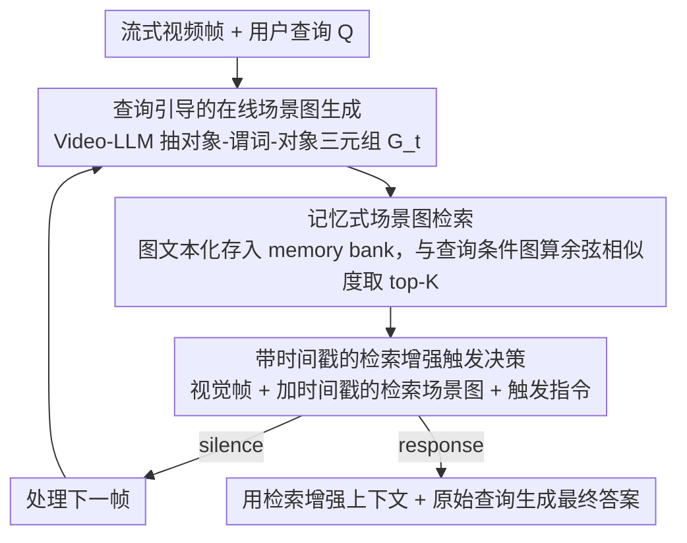

# Response-G1: Explicit Scene Graph Modeling for Proactive Streaming Video Understanding

**会议**: ACL2026  
**arXiv**: [2605.07575](https://arxiv.org/abs/2605.07575)  
**代码**: https://github.com/kadmkbl/Response-G1  
**领域**: 视频理解  
**关键词**: 流式视频理解、主动响应、场景图、检索增强、Video-LLM

## 一句话总结
Response-G1 用查询引导的在线场景图、历史场景图检索和带时间戳的触发提示，把流式视频中的视觉证据和用户查询的响应条件显式对齐，在无需微调的情况下显著提升 Video-LLM 判断“现在是否该回答”的能力。

## 研究背景与动机
**领域现状**：Video-LLM 已经能处理视频问答和长视频理解，Streaming Video Understanding 则进一步要求模型在视频持续到来时增量感知、推理和交互。多数现有系统仍是 reactive：用户在某个时间点提问，模型立刻基于已观察片段回答。

**现有痛点**：现实交互里很多问题是 anticipatory 的，例如“当某个人开始做某件事时告诉我”。这类问题在提问时答案条件可能还没出现，模型必须先保持沉默，等证据满足条件再回答。已有 proactive 方法要么训练 EOS/二分类触发头，依赖细粒度帧级标注；要么用帧差阈值或多 agent prompt，容易忽略查询语义。

**核心矛盾**：主动响应的关键不是“视频有没有变化”，而是“当前累积证据是否满足这个查询隐含的响应条件”。如果视觉证据和查询条件都只隐式存在于 Video-LLM hidden states 或 prompt 里，模型很难稳定对齐它们，也难解释为何此刻触发。

**本文目标**：作者希望设计一个不需要微调和帧级标签的框架，让 Video-LLM 在流式视频中显式建模查询相关证据、检索历史证据，并据此决定 silence/response。

**切入角度**：用户查询通常描述一个由对象、属性和关系组成的目标场景，例如“穿红衣服的男孩正在和别人交谈”。这天然可以表示成 scene graph；如果视频片段也转成 scene graph，就能在同一结构空间里做证据-条件匹配。

**核心 idea**：把流式视频的观察证据和查询条件都转成场景图，通过 top-K 场景图检索把最相关历史证据送回 Video-LLM，再用触发 prompt 做逐帧响应时机判断。

## 方法详解
Response-G1 是一个 fine-tuning-free pipeline。它没有训练新的触发分类器，而是把 Video-LLM 自身用作场景图生成器、文本编码器和最终决策器。方法的关键是把长视频历史压缩成结构化、查询相关、可检索的图记忆，而不是把所有视觉 token 都塞进上下文。

### 整体框架
输入是流式视频帧序列和用户在某个时刻提出的查询，输出是每个时间步的 `silence` 或 `response` 决策，以及触发后的自然语言答案。框架包含三步：先对当前 clip 做查询引导的在线场景图生成，抽取对象-谓词-对象三元组；再把历史场景图存入 memory bank，并与查询条件图计算相似度，检索 top-K 相关片段；最后把视觉 token、带时间戳的检索场景图和触发指令一起输入 Video-LLM，让它判断是否回答；输出 silence 就继续下一帧、输出 response 就生成答案。

### 关键设计

**1. 查询引导的在线场景图生成：把每个 clip 压成只留查询相关细节的结构化证据**

对视频片段无差别地生成场景图，会冒出大量与触发条件无关的 triplet，给后面的检索带来噪声；可要是直接把目标对象塞进 prompt，又会诱导模型“看见”尚未出现的东西、产生 hallucination。Response-G1 取折中：对时间 $t$ 附近的片段 $C_t$，用 Video-LLM 在原始查询 $Q$ 的软指导下生成场景图 $G_t=(O_t,P_t)$，节点是带属性的对象、边是时空关系，整图写成三元组集合 $G_t=\{(o_i,p_{ij},o_j)\}$。查询被注入生成 prompt 作为软条件，让模型优先描述和触发条件有关的对象与关系，从而在相关性和真实性之间取得平衡——消融里 Query-Guidance 的 PO 和事实性都比 Object-Guidance 更好，正源于此。

**2. 记忆式场景图检索：按查询语义而非时间近邻挑历史证据**

主动响应要回答的不是“视频变没变”，而是“到现在为止累积的证据够不够满足查询条件”，这就要求模型能从一长段历史里精准捞出最相关的片段。Response-G1 把每个场景图三元组线性化成自然语言短语、整图拼成 $\Phi_t$ 存入 memory bank；查询也解析成条件图 $G_q$ 并线性化为 $\Phi_q$，让两边保持相同格式。再用 Video-LLM 的文本编码器做 mean pooling 得到图向量 $g_t$ 和查询向量 $g_q$，按余弦相似度检索出 memory bank 里的 top-K 场景图。把查询和视频都先变成 graph text 再比相似度，检索关注的就是对象-关系是否匹配，而不是原始查询文本和视频图之间的格式落差。

**3. 带时间戳的检索增强触发决策：让证据从静态检索结果变成可定位的时间链**

光知道“目标关系出现了”还不够，模型还得知道证据在时间上的先后、以及此刻是否已经足够触发。Response-G1 给检索出的场景图加上文本时间戳（例如 `<2.0s>`）再编进上下文，触发阶段的输入是视觉帧 embedding、这些带时间戳的检索场景图，外加类似 “Should I answer now? Yes or No.” 的指令。若输出 silence 就继续处理下一帧；若输出 response，就用同一组检索增强上下文加原始查询生成最终答案。时间戳把图记忆从一堆静态检索片段升级成可做 temporal grounding 的证据链，这也是消融里去掉 timestamp encoding 后、CRR/PO 这类需要时间定位的任务掉得更明显的原因。

### 损失函数 / 训练策略
Response-G1 不做参数训练，核心是 inference-time pipeline。实验使用 Qwen3-VL-8B 作为 Video-LLM backbone，OVO-Bench 采用默认 1 FPS；StreamingBench 按官方规则采样，短视频 1 FPS，中等长度 0.5 FPS，长视频 0.2 FPS。所有实验在 A100 80GB 上以 FP16 运行。作者还做了延迟分析：原始 Response-G1 embedding 版本每帧约 825ms，对应 1.2 FPS；使用 streaming KV-Cache 后约 473ms，对应 2.1 FPS，满足 1 FPS 设置。

## 实验关键数据

### 主实验
在 OVO-Bench 上，Response-G1 对 open-source streaming Video-LLM 的优势集中体现在 Forward Active Responding，也就是最能体现 proactive 能力的部分。它的整体分数未超过 Gemini 1.5 Pro 等闭源模型，但在开源流式模型中明显领先。

| 模型 | 参数 | Real-Time Visual Perception Avg↑ | Backward Tracing Avg↑ | Forward Active Responding Avg↑ | Overall Avg↑ |
|------|------|----------------------------------|-----------------------|--------------------------------|--------------|
| GPT-4o | - | 63.6 | 58.7 | 53.4 | 58.6 |
| Gemini 1.5 Pro | - | 70.8 | 62.3 | 57.2 | 65.3 |
| TimeChat-Online | 7B | 58.6 | 42.0 | 36.4 | 45.6 |
| StreamAgent | 7B | 61.3 | 41.7 | 45.4 | 49.4 |
| Response-G1 | 8B | 73.6 | 52.1 | 58.2 | 61.3 |

在 StreamingBench 上，Response-G1 在开源模型中取得最高 Overall，并把 proactive output 从约 29 提升到 44。闭源 GPT-4o 的 PO 仍更高，但 Response-G1 显著缩小了开源模型差距。

| 模型 | 参数 | Real-Time Visual Understanding Avg↑ | PO↑ | Overall Avg↑ | 说明 |
|------|------|-------------------------------------|-----|--------------|------|
| GPT-4o | - | 73.3 | 56.9 | 70.5 | 闭源强基线 |
| LLaVA-OneVision | 7B | 71.1 | 29.6 | 66.3 | 强开源 Video-LLM |
| TimeChat-Online | 7B | 75.4 | 28.8 | 70.9 | 开源流式基线 |
| StreamAgent | 7B | 74.3 | 28.9 | 70.2 | 多 agent prompt 基线 |
| Response-G1 | 8B | 77.5 | 44.0 | 73.7 | 开源流式模型中最高 overall 和 PO |

### 消融实验
检索增强和时间戳都有效。去掉 retrieval augmentation 后，主动任务和反应任务同时下降；去掉 timestamp encoding 后，CRR/PO 这类需要时间定位的任务受影响更明显。

| 配置 | OVO ACR↑ | OVO HLD↑ | OVO CRR↑ | Streaming CS↑ | Streaming PR↑ | Streaming PO↑ |
|------|----------|----------|----------|---------------|---------------|---------------|
| w/o Retrieval Augmentation | 66.1 | 28.0 | 55.4 | 83.6 | 79.6 | 36.8 |
| w/o Timestamp Encoding | 74.0 | 33.6 | 60.4 | 87.7 | 82.9 | 43.6 |
| Full | 74.3 | 33.9 | 61.7 | 88.0 | 83.3 | 44.0 |

查询引导也是关键。直接把解析出的对象关系塞进 prompt 会提高相关性，但容易让模型提前“看见”尚未出现的目标；原始查询引导最稳。

| 场景图生成策略 | Streaming PO↑ | OVO REC↑ | OVO SSR↑ | OVO CRR↑ | 解释 |
|----------------|---------------|----------|----------|----------|------|
| w/o Guidance | 38.8 | 34.1 | 66.9 | 59.4 | 生成很多无关 triplet |
| Object-Guidance | 43.6 | 40.2 | 67.9 | 61.3 | 更相关，但有 hallucination 风险 |
| Query-Guidance | 44.0 | 41.9 | 71.1 | 61.7 | 相关性和事实性最平衡 |

### 关键发现
- 显式结构化证据对 proactive timing 特别有用。Response-G1 在 OVO 的 FAR 和 StreamingBench 的 PO 上提升最明显，说明场景图确实帮助模型判断“条件是否满足”。
- 检索不是只为压缩上下文，它还把长视频历史按查询语义重新排序，使触发决策看到的是最相关证据而不是最近证据。
- 图文本格式一致性很重要。论文比较原始查询文本和 query graph text，后者在相似度检索上更好，说明跨模态检索前的表示格式对齐不能忽略。
- KV-Cache 让方法从概念验证接近可实时部署。1.2 FPS 到 2.1 FPS 的延迟结果说明额外 SGG/SGR 成本可控，但仍适合低 FPS 流式理解而非高帧率控制。

## 亮点与洞察
- 论文的强点是把 proactive response timing 具体化为 evidence-condition alignment，而不是笼统地让模型“判断是否该回答”。这个问题重述本身很有价值。
- 场景图在这里不是传统视觉解析模块，而是 Video-LLM 自己生成的开放词表结构记忆。它牺牲了一点严谨性，但换来了无需检测器和无需微调的通用性。
- Query-guided SGG 的消融很有启发：过少指导会有噪声，过强 object guidance 会幻觉，原始查询作为软条件反而最合适。
- 方法也可迁移到机器人/Agent 记忆：把在线感知片段转成结构化事件图，再按任务意图检索历史证据，用于触发动作或回答。

## 局限与展望
- 作者指出，场景图的对象-关系表示不能覆盖所有推理需求，尤其是 why-style 问题、因果解释和隐含动机推理。
- 当前 clip size 固定，可能错过事件边界或把一个语义事件切碎。未来可以用事件级触发或语义变化检测决定何时生成场景图。
- LLM-based open-set SGG 仍有 hallucination 风险。Object-Guidance 的失败案例说明，如果提示过度暗示目标对象，模型可能提前生成不存在的 triplet。
- 方法依赖 Video-LLM 的文本编码和 prompt 遵循能力，换 backbone 后虽有附录验证，但仍可能需要重调 prompt、K 值和采样率。
- 目前主要在 benchmark 的 1 FPS 或更低采样下验证；如果用于自动驾驶或高频机器人控制，延迟和安全性还远远不够。

## 相关工作与启发
- **vs VideoLLM-online / Flash-Vstream**: 这些方法侧重流式视频 token 处理和效率；Response-G1 更关注 query-aware proactive timing，用结构化图记忆补充视觉 token。
- **vs Dispider / StreamBridge**: 这类方法通常训练激活模型或辅助分类头；Response-G1 不依赖帧级触发标注，而是用 prompt 和检索实现触发决策。
- **vs StreamAgent**: StreamAgent 用多 agent prompting 规划响应时机；Response-G1 用场景图把证据和条件显式对齐，解释性更强、PO 提升更明显。
- **vs 传统 scene graph generation**: 传统 SGG 依赖闭集检测器；本文把 Video-LLM 作为开放词表图生成器，更适合真实长尾视频，但也更需要抑制幻觉。

## 评分
- 新颖性: ⭐⭐⭐⭐ 把场景图检索引入 proactive streaming video understanding，问题切入和结构化记忆设计都很清楚。
- 实验充分度: ⭐⭐⭐⭐ 覆盖 OVO-Bench、StreamingBench、消融、案例、延迟和跨架构验证，但高帧率真实部署仍需更多实验。
- 写作质量: ⭐⭐⭐⭐ 方法图和分阶段叙述易懂，表格较完整；部分表格列很多，读数需要仔细对照。
- 价值: ⭐⭐⭐⭐ 对视频助手、具身智能和流式监控场景有实际启发，尤其适合无需微调的开源 Video-LLM 增强。

<!-- RELATED:START -->

## 相关论文

- [\[CVPR 2026\] Towards Spatio-Temporal World Scene Graph Generation from Monocular Videos](../../CVPR2026/video_understanding/towards_spatio-temporal_world_scene_graph_generation_from_monocular_videos.md)
- [\[CVPR 2025\] HyperGLM: HyperGraph for Video Scene Graph Generation and Anticipation](../../CVPR2025/video_understanding/hyperglm_hypergraph_for_video_scene_graph_generation_and_anticipation.md)
- [\[ICML 2025\] Fine-Grained Captioning of Long Videos through Scene Graph Consolidation](../../ICML2025/video_understanding/fine-grained_captioning_of_long_videos_through_scene_graph_consolidation.md)
- [\[AAAI 2026\] Explicit Temporal-Semantic Modeling for Dense Video Captioning via Context-Aware Cross-Modal Interaction](../../AAAI2026/video_understanding/explicit_temporal-semantic_modeling_for_dense_video_captioning_via_context-aware.md)
- [\[CVPR 2026\] FluxMem: Adaptive Hierarchical Memory for Streaming Video Understanding](../../CVPR2026/video_understanding/fluxmem_adaptive_hierarchical_memory_for_streaming_video_understanding.md)

<!-- RELATED:END -->
