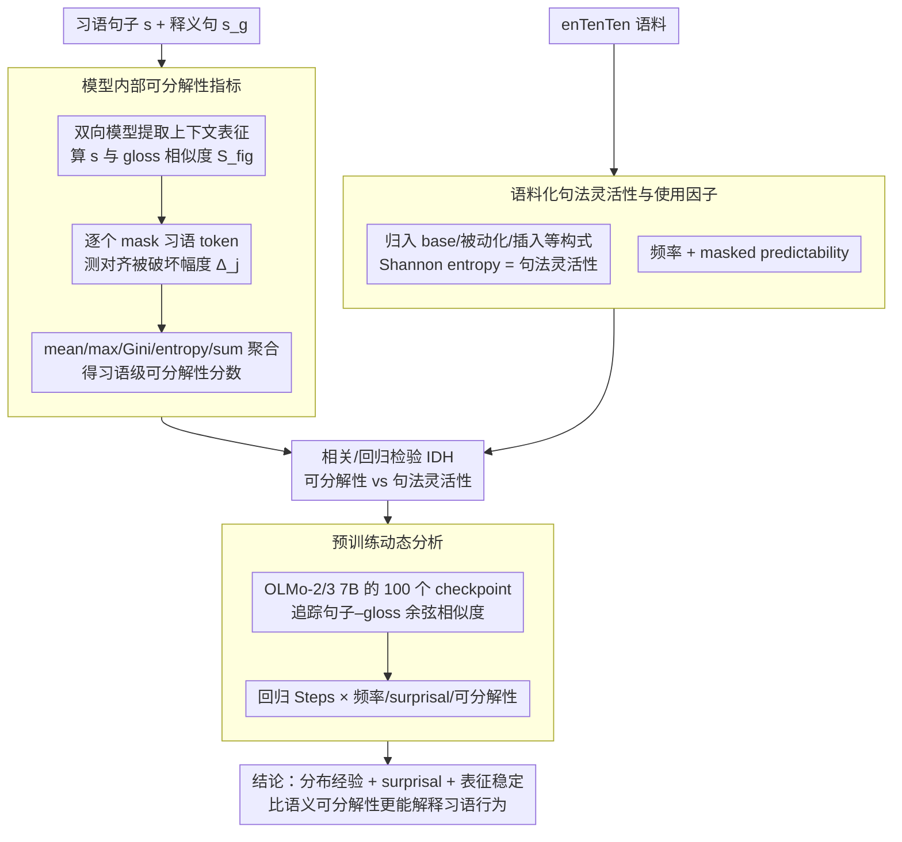

# Rethinking the Idiomaticity Decomposability Hypothesis: Evidence from Distributional Learning

**会议**: ACL2026  
**arXiv**: [2606.03817](https://arxiv.org/abs/2606.03817)  
**代码**: https://github.com/mi-m1/idiom_decomp  
**领域**: NLP理解 / 短语语义 / 语言模型分析  
**关键词**: idiom decomposability, syntactic flexibility, distributional learning, contextual representations, OLMo

## 一句话总结
这篇论文用上下文化语言模型作为“受控的分布式学习者”重新检验 Idiom Decomposability Hypothesis，发现模型派生的可分解性只弱相关于人类判断，并且与句法灵活性呈小而稳定的负相关，说明习语行为更像是由分布经验、surprisal 和表征稳定过程共同塑造。

## 研究背景与动机
**领域现状**：习语研究长期关注 decomposability，即习语中各组成词的字面意义在多大程度上贡献整体隐喻意义。经典 Idiom Decomposability Hypothesis 认为，越可分解的习语越能接受被动化、插入修饰语、名词化等句法变体。

**现有痛点**：这个假设主要依赖人类 decomposability rating 和可接受性判断，但心理语言学研究已经显示这些评分具有任务依赖性、说话人差异和不稳定性。人类判断还混合了世界知识、语义直觉、熟悉度和语言经验，很难单独回答“只靠分布暴露能学到什么”。

**核心矛盾**：如果习语句法行为真的由内部语义结构决定，那么 decomposability 应该稳定预测 syntactic flexibility；如果行为主要来自使用经验，那么频率、predictability 和训练过程中的表征稳定性可能比构成词意义映射更关键。

**本文目标**：作者要用语言模型内部表征构造一个 decomposability 诊断指标，并把它和人类评分、语料中的句法灵活性、频率、predictability 以及预训练动态联系起来，检验 IDH 在 distributional learner 中是否成立。

**切入角度**：上下文化模型只从文本分布中学习，没有显式语义角色标注或人类可接受性判断，因此可以作为一种“只看分布经验”的对照系统。若模型内部仍自然恢复 IDH 预期，说明 IDH 可能有分布学习基础；若没有，则需要重新解释 decomposability 的作用。

**核心 idea**：把习语句子和其释义 gloss 的表征相似度作为整体意义对齐，再通过 leave-one-out mask 估计每个习语词对整体意义的贡献，从而得到模型内部 decomposability 分数，并用它检验语义结构解释是否能预测真实用法。

## 方法详解

### 整体框架
论文的 pipeline 可以分成四步。第一步，对每个含习语的句子 $s$ 和对应 gloss-replaced sentence $s_g$，从 BERT/ModernBERT 等双向 transformer 中提取上下文化表征。第二步，计算完整习语句子与 gloss 的相似度，再逐个 mask 习语 token，观察相似度变化，用 token contribution 聚合出 expression-level decomposability。第三步，从 enTenTen 语料中统计习语在不同 constructional frames 中的出现频率，用 Shannon entropy 衡量 syntactic flexibility，并计算频率和 predictability。第四步，在 BERT/ModernBERT 的静态表征分析之外，追踪 OLMo-2 7B 和 OLMo-3 7B 的 100 个预训练 checkpoint，分析 idiom 表征和 gloss 表征的相似度如何随训练推进而变化。其中第一、二步共同构成可分解性指标，第三、四步分别提供句法灵活性证据和学习轨迹证据，最终汇到对 IDH 的相关/回归检验。

### 关键设计

**1. 模型内部可分解性指标：用表征扰动替代人类评分**

传统检验依赖人类对习语"可分解性"的离线评分，而这些评分混入了熟悉度、世界知识和说话人差异。作者改从模型 hidden-state geometry 直接估计每个组成词对整体隐喻意义的贡献：先算完整句子 $s$ 与其 gloss 句子 $s_g$ 的表征相似度 $S_{fig}$，再对习语 span 中每个 token $j$ 构造 mask 版本 $s^{(-j)}$、算出 $S_{mask}^{(j)}$，把 token 贡献定义为对齐被破坏的幅度 $\Delta_j=|S_{fig}-S_{mask}^{(j)}|$，最后用 mean、maximum、Gini dispersion、entropy 或 sum 等聚合函数把这些 token 贡献汇成习语级 decomposability 分数。

这样设计的直觉是：如果某个组成词真的承载隐喻意义，mask 掉它就该显著拉远句子与 gloss 的对齐；这种"扰动测量"比直接问模型"它是否可分解"更贴近表征机制本身，也让指标可计算、可跨模型复现。

**2. 语料化句法灵活性与使用因子：用真实用法分布检验 IDH**

IDH 声称 decomposability 约束习语能否被动化、插入修饰语等句法变形，所以应当拿语料中的实际用法来检验，而不是再问人类的离线可接受性判断。作者把习语在语料中的出现归到 base form、adverb insertion、adjective insertion、passivization、action nominalization 等 constructional types，用各类型概率的 Shannon entropy $H(i)=-\sum_c p_{i,c}\log_2 p_{i,c}$ 度量句法灵活性——entropy 越高说明习语越能接受多样的句法构式。

为了把灵活性和"纯使用经验"区分开，作者还从 enTenTen 语料统计习语频率、用 masked final-word probability 衡量 predictability，把 frequency 与 predictability 作为独立的 usage factor 一并纳入分析，这样才能判断到底是语义结构还是分布经验在决定句法行为。

**3. 预训练动态分析：看习语表征在训练中何时稳定、被谁驱动**

静态相关性只能说明最终模型的表征长什么样，无法回答 distributional learner 在形成习语表征时更依赖什么。作者在 OLMo-2 7B 与 OLMo-3 7B 的 100 个预训练 checkpoint 上逐步追踪习语句子与 gloss 句子的 cosine similarity，再用线性回归把训练步数和 log frequency、surprisal、decomposability 的交互项建模出来。

通过观察这些交互项的符号与强度，就能看出习语意义表征是在训练早期还是后期稳定、以及频率、predictability、decomposability 三者中哪个对表征稳定过程影响最大——这把传统的静态 probing 往前推进成了"学习轨迹"层面的诊断。

### 损失函数 / 训练策略
本文不训练新的模型，核心是诊断评估。使用的双向模型包括 BERT-base/large 的 cased/uncased 版本、ModernBERT-base/large；预训练动态分析使用 OLMo-2-1124-7B 和 OLMo-3-1025-7B 的 100 个 checkpoint。主要统计工具包括 Spearman rank correlation、回归分析、bootstrap confidence interval、partial correlation、Pearson correlation 和 VIF。作者还比较多种相似度函数，包括 cosine、CKA 和 Wasserstein distance，并报告最贴近人类评分的配置。

## 实验关键数据

### 主实验
| 分析问题 | 样本/模型 | 关键结果 | 解释 |
|----------|-----------|----------|------|
| 人类 decomposability vs syntactic flexibility | Bulkes & Tanner 与 IMPLI 重叠的 90 个习语 | 无显著关系 | 人类 decomposability rating 不能稳定预测语料中的句法灵活性 |
| 模型 decomposability vs 人类评分 | BERT-large uncased, final layer, Wasserstein + sum | $r(90)=.24$, $p=.005$ | 模型和人类有弱正相关，但重叠有限 |
| 模型 decomposability vs syntactic flexibility | IMPLI 527 个样本 | 最大相关约 $r(527)=-.16$, $p=.0002$ | 关系小且经常为负，与 IDH 的正相关预期相反 |
| PP idioms 分组 | 127 个 PP 类习语 | $\rho=-0.24$, $p=0.01$ | 介词短语习语中可分解性越高，实际句法灵活性反而越低 |
| VP idioms 分组 | 284 个 VP 类习语 | $\rho=-0.02$, $p=0.68$ | IDH 最关心的动词短语习语没有显著关系 |

### 消融实验
| 分析配置 | 关键指标 | 说明 |
|----------|---------|------|
| Human ratings: frequency | coef = -0.20, z = -2.26, p = 0.02 | 语料频率越高，人类越倾向于把习语判断为更不可分解 |
| Human ratings: predictability | coef = -0.52, z = -0.33, p = 0.73 | predictability 对人类 decomposability rating 不显著 |
| BERT-large cased: frequency | coef = -0.29, z = -4.07, p < .001 | 模型派生 decomposability 也与频率显著负相关 |
| Bootstrap CI | 95% CI = [0.07, 0.40] | 最佳模型-人类相关不太可能完全由采样噪声造成，但不确定性较大 |
| VIF | 所有值接近 1 | frequency、predictability、decomposability 之间不存在严重多重共线性 |

### 关键发现
- 数据规模上，IMPLI 包含 527 个样本、382 个独特习语；Bulkes & Tanner 子集包含 90 个习语。模型总共覆盖 8 个：6 个双向 encoder 和 2 个 OLMo 7B causal LM。
- 预训练动态里，steps 与三个属性的交互都显著为负：Steps x Frequency 为 -0.0008、z = -24.69；Steps x Surprisal 为 -0.0007、z = -22.301；Steps x Decomposability 为 -0.0010、z = -36.367，且 decomposability 的训练依赖效应最大。
- 频率不是唯一解释。论文结论强调 frequency alone 不能解释 idiom representations 的形成，surprisal 和 decomposability 都参与表征稳定过程。

## 亮点与洞察
- 这篇论文的强点是把一个传统语言学假设转成了可计算、可跨模型复现的表征诊断问题，而不是只在 LLM 上跑一个分类任务。
- leave-one-out mask + gloss similarity 的设计很巧妙：它把“组成词是否贡献整体隐喻意义”落实为对表征对齐的扰动，既保留了 decomposability 的理论含义，又能在模型内部测量。
- 最有意思的发现是负相关：如果可分解性真的支持句法变形，应该看到正相关；但模型和语料都没有给出这个结果，说明高频整体化存储、构式限制和分布 predictability 可能比传统语义可分解性更有解释力。
- 预训练动态分析把静态 probing 往前推进了一步：它不只问最终表征是否相关，还问这种相关性在模型学习过程中何时变强、何时衰减。

## 局限与展望
- 作者承认 decomposability 指标只是可能的 operationalization 之一，不能声称已经穷尽这个复杂语言学概念。
- 预训练动态分析用 BERT-large 派生的 decomposability 去预测 OLMo 的学习过程，这会引入架构偏差；理想情况下应直接在目标模型上计算，但 causal LM 不适合使用相同的双向 mask 诊断。
- 实验只覆盖英语习语，不一定能推广到形态更丰富、习语结构不同的语言。
- 当前 syntactic flexibility 的语料统计依赖预设 constructional frames，若习语有更细的构式变体或语域差异，entropy 指标可能仍会压缩掉一部分信息。
- 论文主要分析相关性和回归关系，还没有直接测试这些 decomposability 指标是否能改进下游习语识别、翻译或释义模型。
- 后续可以研究架构无关的 decomposability 指标，以及跨语言、跨语料和生成式模型内部状态上的习语表征稳定过程。

## 相关工作与启发
- **vs Idiom Decomposability Hypothesis**: IDH 预测 decomposability 与 syntactic flexibility 正相关，本文在人类评分和模型派生指标上都没有找到稳健支持，甚至观察到负相关。
- **vs usage-based / constructionist accounts**: 使用经验理论强调频率、predictability 和构式分布；本文的频率负效应和预训练动态结果更接近这一路解释。
- **vs 传统人类 norming 研究**: 人类评分能捕获主观语义透明度，但混入了熟悉度和经验；本文用模型作为 controlled distributional learner，把“分布暴露能解释什么”单独拿出来看。
- **启发**: 语言模型分析不只适合做 benchmark，也适合做语言学理论检验；关键是把理论变量转化为可解释的内部表征操作。

## 评分
- 新颖性: ⭐⭐⭐⭐⭐ 用模型内部表征重审 IDH 的角度很有辨识度，理论问题和方法设计结合得好。
- 实验充分度: ⭐⭐⭐⭐☆ 覆盖多模型、多层、多指标和预训练 checkpoint，但跨语言和架构无关性还不足。
- 写作质量: ⭐⭐⭐⭐☆ 语言学背景讲得清楚，结果解释谨慎；公式和附录较多，阅读门槛略高。
- 价值: ⭐⭐⭐⭐☆ 对习语处理、语言模型可解释性和 NLP 支持语言学理论检验都有启发，尤其适合后续做跨语言短语语义研究。

<!-- RELATED:START -->

## 相关论文

- [\[CVPR 2026\] Rethinking Occlusion Modeling for UAV Tracking](../../CVPR2026/video_understanding/rethinking_occlusion_modeling_for_uav_tracking.md)
- [\[CVPR 2025\] ViTED: Video Temporal Evidence Distillation](../../CVPR2025/video_understanding/vited_video_temporal_evidence_distillation.md)
- [\[CVPR 2026\] FlexHook: Rethinking Two-Stage Referring-by-Tracking in RMOT](../../CVPR2026/video_understanding/rethinking_two-stage_referring-by-tracking_in_referring_multi-object_tracking_ma.md)
- [\[ICML 2026\] Foresee-to-Ground: From Predictive Temporal Perception to Evidence-Driven Reasoning](../../ICML2026/video_understanding/foresee-to-ground_from_predictive_temporal_perception_to_evidence-driven_reasoni.md)
- [\[CVPR 2026\] HERBench: A Benchmark for Multi-Evidence Integration in Video Question Answering](../../CVPR2026/video_understanding/herbench_a_benchmark_for_multi-evidence_integration_in_video_question_answering.md)

<!-- RELATED:END -->
