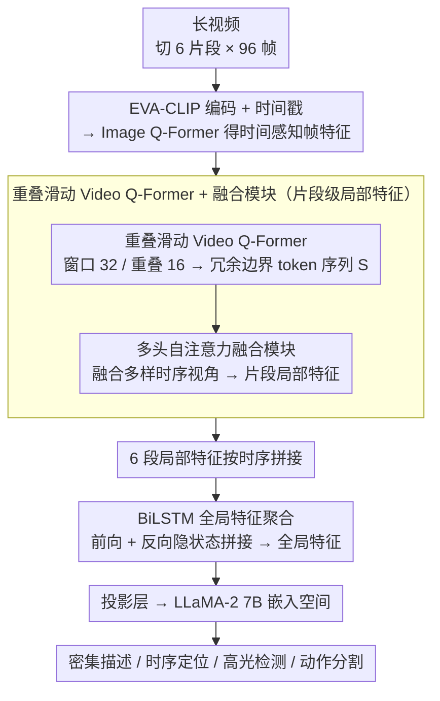

# TemporalVLM: Video LLMs for Temporal Reasoning in Long Videos

**会议**: ACL 2026  
**arXiv**: [2412.02930](https://arxiv.org/abs/2412.02930)  
**代码**: 无  
**领域**: 图像分割  
**关键词**: 视频大语言模型, 时间感知编码, BiLSTM, 长视频理解, 工业装配数据集

## 一句话总结

本文提出 TemporalVLM，通过时间感知的片段编码器（重叠滑动 Video Q-Former + 融合模块）提取局部细粒度时间特征，再用 BiLSTM 聚合全局长程依赖，首次在 Video LLM 中引入 LSTM，在密集视频描述、时序定位、高光检测和动作分割四项任务上超越先前方法。

## 研究背景与动机

**领域现状**：Video LLM 通过将视频编码器与 LLM 结合实现视频理解。现有方法通常将视频映射为固定数量的 token，导致长视频性能下降，且将帧和时间戳分别编码，在时序推理上表现不佳。

**现有痛点**：(1) 将整个视频视为单个片段并使用固定 token 数量，丢失长视频的细粒度信息；(2) 使用池化或查询聚合获取全局特征，无法捕获长程时序依赖；(3) 帧和时间戳的分离编码导致时间不敏感。

**核心矛盾**：长视频的时序推理需要同时具备局部细粒度理解（单个事件的精确定位）和全局语义理解（事件间的时序关系），但现有架构无法兼顾两者。

**本文目标**：设计一种"由粗到细"的视频编码器，同时提取时间感知的局部特征和全局特征。

**切入角度**：将长视频分割为多个短片段，在片段级别用时间感知编码器提取局部特征，再用 BiLSTM 跨片段聚合全局特征——结合了片段级细粒度和序列级长程建模。

**核心 idea**：重叠滑动窗口 + 融合模块实现时间感知的局部编码，BiLSTM 实现双向长程聚合——首次将 LSTM 引入 Video LLM。

## 方法详解

### 整体框架

输入视频分为 C=6 个片段，每个片段采样 96 帧。时间感知片段编码器：帧经 EVA-CLIP 编码后与时间戳联合通过 Image Q-Former 得到时间感知帧特征，再通过重叠滑动 Video Q-Former 和融合模块得到局部特征。BiLSTM 模块：将所有片段的局部特征按时序连接，通过双向 LSTM 聚合全局特征。最终特征经投影层映射到 LLaMA-2 7B 的嵌入空间。

### 关键设计

**1. 重叠滑动 Video Q-Former + 融合模块：在片段内榨出时间感知的局部特征**

现有方法（如 TimeChat）用非重叠窗口处理帧特征，窗口边界互不交叠，时序视角单一。本文针对"局部细粒度信息丢失"的痛点，改用窗口大小 $q=32$、重叠 $o=16$ 的滑动 Video Q-Former 扫过帧特征，相邻窗口共享一半内容，因而产生一串带冗余边界 token 的特征序列 $\mathbf{S}$——这些 token 空间上冗余但时序上互补。

随后对 $\mathbf{S}$ 施加多头自注意力融合模块，把不同窗口对同一时段的多样时序视角融合成上下文感知的片段嵌入。这样一来，本来被当作"缺陷"的重叠冗余反而成了融合模块可利用的多样性来源，生成的片段级特征比非重叠窗口更丰富、更细粒度。

**2. BiLSTM 全局特征聚合：用递归结构跨片段捕获双向长程依赖**

池化或查询聚合会把片段间的先后顺序压平，Transformer 在固定上下文下的位置编码也不如递归结构贴合时序，这正是现有方法捕不到长程时序依赖的原因。本文把所有片段的局部特征按时间顺序拼成序列，分别送入前向和反向 LSTM，再把两个方向的隐状态拼接 $\mathbf{h}_t = [\mathbf{h}_t^f, \mathbf{h}_t^b]$ 作为全局特征。

这是首次把 LSTM 引入 Video LLM——递归的归纳偏置天然适合建模"事件接着事件"的时序结构。消融实验确认 BiLSTM 一致优于平均池化、线性层、单向 LSTM 和 Transformer，说明在这个场景里递归结构的优势并未被注意力取代。

**3. IndustryASM 数据集：补上工业制造场景长视频时序分割的基准空白**

现有时序分割数据集偏向烹饪活动或来自网络的多镜头剪辑，与真实工业流水线的连续单镜头录像差距大。作者构建 IndustryASM，含 4851 个视频、平均时长 105 秒、覆盖 47 种工业装配任务，由工业工程师做帧级动作分割标注，标注一致率达 92%。

这个数据集既贴近实际制造应用，又提供连续单镜头的长视频，正好用来检验 TemporalVLM 在真实长程时序推理上的能力，弥补了 Video LLM 评测一直偏离工业场景的缺口。

### 一个完整示例：一段工业装配视频如何被编码

以一段 105 秒的装配视频为例：先均匀切成 $C=6$ 个片段、每段采样 96 帧。每帧经 EVA-CLIP 编码后，与时间戳一起送入 Image Q-Former，得到带时间感知的帧特征。接着重叠滑动 Video Q-Former（窗口 32、重叠 16）扫过这 96 帧，相邻窗口各覆盖一半，吐出一串带冗余边界 token 的序列 $\mathbf{S}$；融合模块把这些互补视角压成该片段的局部特征。6 个片段各自走完这一流程后，6 段局部特征按时间顺序拼接，送入 BiLSTM 前向、反向各跑一遍，拼出贯穿整段视频的全局特征。最后这组特征经投影层映射进 LLaMA-2 7B 的嵌入空间，由 LLM 完成密集描述、时序定位等下游推理——局部细粒度与全局长程依赖在这条链上被逐层补齐。

### 损失函数 / 训练策略

使用标准的自回归交叉熵损失（Eq. 8）。LLM 和图像编码器冻结，仅微调 BiLSTM、投影层和 LoRA。在 8×A100 上训练。

## 实验关键数据

### 主实验

**密集视频描述（YouCook2）+ 时序定位（Charades-STA）零样本对比**

| 方法 | SODA_c | CIDEr | R@1(IoU=0.5) |
|------|--------|-------|-------------|
| VideoChat-Embed | 0.2 | 0.6 | 3.2 |
| TimeChat | — | — | — |
| LongVLM | 0.8 | 2.5 | 13.9 |
| **TemporalVLM** | **最优** | **最优** | **最优** |

### 消融实验

**全局聚合方式对比**

| 聚合方式 | 说明 |
|---------|------|
| 平均池化 | 丢失时序信息 |
| 线性层 | 无序列建模 |
| 单向 LSTM | 只有前向信息 |
| Transformer | 固定位置编码不如递归 |
| **BiLSTM** | **双向长程依赖，最优** |

### 关键发现

- TemporalVLM 在所有四项时序推理任务上超越先前方法
- BiLSTM 作为全局聚合模块一致优于所有替代方案
- 重叠窗口 + 融合模块比非重叠窗口显著提升
- 在 IndustryASM 工业数据集上也有效，证明实际应用价值
- 首次证明 LSTM 在 Video LLM 中有独特优势，不应被 Transformer 完全替代

## 亮点与洞察

- "回归 LSTM"的选择反直觉但有效——在时序建模中递归结构的归纳偏置优于通用注意力
- 重叠窗口产生的冗余信息反而成为融合模块的多样性来源——将缺陷转化为优势
- IndustryASM 数据集填补了工业场景的重要空白

## 局限与展望

- 固定分 6 个片段可能不适合所有视频长度，自适应分段策略值得探索
- BiLSTM 的序列化处理限制了并行性，SSM/Mamba 等可能更高效
- 仅使用 LLaMA-2 7B，未评估更大或更新的 LLM
- IndustryASM 的泛化性——47 种装配任务是否覆盖工业场景的多样性

## 相关工作与启发

- **vs TimeChat**: 后者用非重叠 Video Q-Former 且无全局聚合，TemporalVLM 的重叠+融合+BiLSTM 全面超越
- **vs LongVLM**: 后者也分片段但用池化聚合全局特征且不利用时间戳，TemporalVLM 的时间感知编码和 BiLSTM 聚合更有效

## 评分

- 新颖性: ⭐⭐⭐⭐ 首次在 Video LLM 中引入 BiLSTM，重叠融合设计新颖
- 实验充分度: ⭐⭐⭐⭐ 4 任务 + 详细消融 + 新数据集
- 写作质量: ⭐⭐⭐⭐ 架构图清晰，与先前方法的对比直观
- 价值: ⭐⭐⭐⭐ IndustryASM 数据集和 BiLSTM 发现对社区有价值

<!-- RELATED:START -->

## 相关论文

- [\[CVPR 2026\] Thinking with Drafts: Speculative Temporal Reasoning for Efficient Long Video Understanding](../../CVPR2026/video_understanding/thinking_with_drafts_speculative_temporal_reasoning_for_efficient_long_video_und.md)
- [\[CVPR 2026\] Learning Transferable Temporal Primitives for Video Reasoning via Synthetic Videos](../../CVPR2026/video_understanding/learning_transferable_temporal_primitives_for_video_reasoning_via_synthetic_vide.md)
- [\[AAAI 2026\] R-AVST: Empowering Video-LLMs with Fine-Grained Spatio-Temporal Reasoning in Complex Audio-Visual Scenarios](../../AAAI2026/video_understanding/r-avst_empowering_video-llms_with_fine-grained_spatio-temporal_reasoning_in_comp.md)
- [\[ICML 2026\] Video-MTR: Reinforced Multi-Turn Reasoning for Long Video Understanding](../../ICML2026/video_understanding/video-mtr_reinforced_multi-turn_reasoning_for_long_video_understanding.md)
- [\[CVPR 2026\] MS-Temba: Multi-Scale Temporal Mamba for Understanding Long Untrimmed Videos](../../CVPR2026/video_understanding/ms-temba_multi-scale_temporal_mamba_for_understanding_long_untrimmed_videos.md)

<!-- RELATED:END -->
