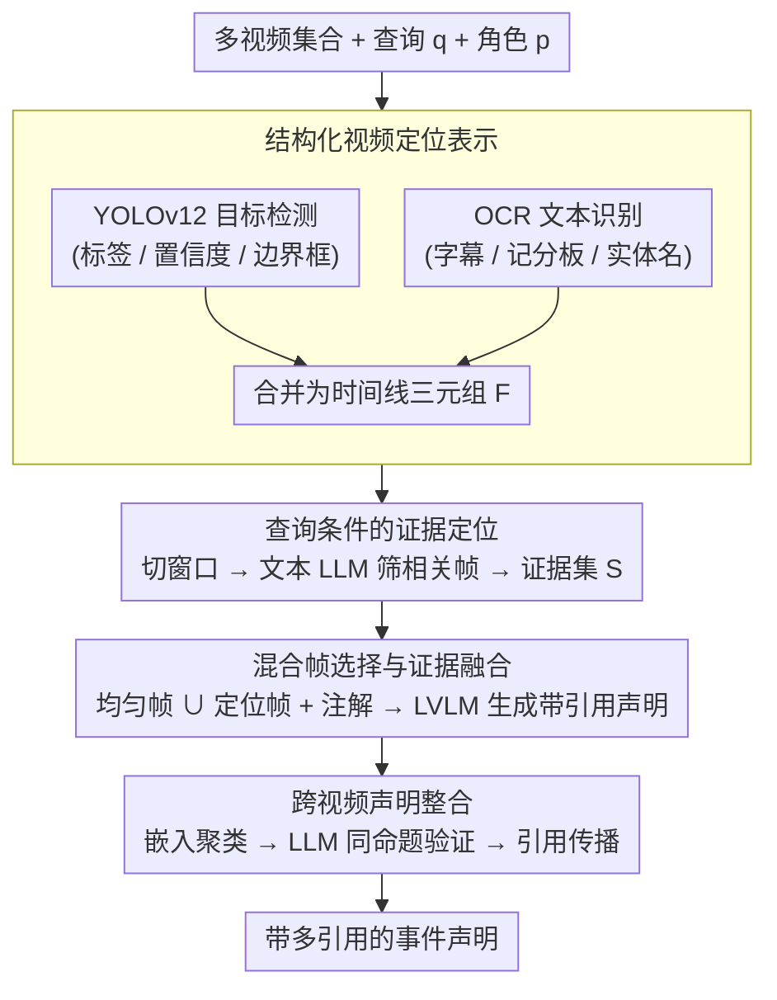

# TRACE：基于证据定位的多视频事件理解与声明生成

**会议**: ACL 2026  
**arXiv**: [2605.16740](https://arxiv.org/abs/2605.16740)  
**代码**: https://github.com/pengyu965/TRACE  
**领域**: 视频理解  
**关键词**: 多视频事件理解、证据定位、声明生成、视频引用、视觉语言模型

## 一句话总结

TRACE 通过"先定位后推理"的管道，先用 OCR 和目标检测构建文本可搜索的视频时间线，再用文本 LLM 进行查询条件的证据定位，最后由 LVLM 生成带引用的声明，在多视频事件理解任务上达到 SOTA，F1 从 0.705 提升到 0.811。

## 研究背景与动机

**领域现状**：多视频事件理解要求模型不仅识别视觉内容，还要在长视频语料库中定位和归属离散分布的证据片段。最近的大视觉语言模型（LVLM）在通用视频理解上表现强劲，但在这一场景下存在两个核心瓶颈。

**现有痛点**：直接用 LVLM 处理原始视频面临三个困难。其一，模型倾向于关注视觉显著性较强的内容（如主人物、背景景观），而忽视查询相关的具体证据（新闻抄写员显示的伤亡数字、转播字幕显示的投票总数、记分板数据）。其二，即使是最新的 LVLM 也因上下文窗口限制而被迫对长视频进行激进的时间采样，导致包含关键信息的短暂片段被遗漏——例如新闻滚动条一闪而过却容纳了重要统计数据。其三，这类模型难以精确定位"事件相关"的时刻。

**核心矛盾**：关键在于，事件视频中充满了可被廉价提取的结构化语义信号（转播字幕、检测到的物体类别、OCR 文本），但现有 LVLM 管道大多未能充分利用它们。增大 LVLM 上下文窗口本身无法解决问题，因为挑战不在"看更多帧"，而在"识别哪些帧重要"。

**本文目标**：设计一个能在长、异质视频集合中精确定位证据并生成带引用属性的声明的系统。关键需求包括：(1) 在文本空间高效进行证据定位，避免逐帧调用 LVLM；(2) 利用 OCR 和检测信号引导 LVLM 聚焦于证据片段；(3) 跨多视频整合证据和引用，避免重复计数。

**切入角度**：事件视频中的 OCR 文本（转播下三行、记分板、图形覆盖）通常比原始视觉外观本身更语义精确。这些信号可通过 YOLOv12 目标检测和 OCR 廉价提取，为后续推理提供可解释的文本序列化表示。

**核心 idea**：采用"先定位后推理"范式。不让 LVLM 同时进行证据发现和生成，而是先构建文本可搜索的视频时间线（via OCR + detection），用文本 LLM 进行查询条件的证据定位，再在指导下进行 LVLM 生成和引用整合。

## 方法详解

### 整体框架

TRACE 管道由四个阶段串联组成。**第一阶段** 对每个输入视频构建结构化定位表示：对采样帧运行 YOLOv12 目标检测和 OCR 文本识别，生成时间戳-检测-OCR 的三元组时间线。**第二阶段** 将该时间线分割为固定大小的窗口，序列化为文本，与用户查询和角色信息一起送入文本 LLM，由 LLM 判断每个窗口的帧集合中哪些帧相关。**第三阶段** LVLM 接收混合帧集合（均匀采样帧 + 证据定位帧）和结构化的定位注解，生成带引用的查询条件声明。**第四阶段** 跨多视频的声明通过语义嵌入聚类和 LLM 验证进行去重与引用传播，把分散在不同视频里指向同一事实的证据合并成带多引用的结论。

### 关键设计

**1. 结构化视频定位表示：把长视频翻译成文本可搜索的时间线**

直接让 LVLM 处理原始帧，会因上下文预算被迫激进采样，导致新闻滚动条一闪而过那种关键短片段被漏掉。TRACE 改用轻量信号把视频"文本化"：对均匀采样的帧跑 YOLOv12 检测和 OCR，检测输出为 $(l_i, c_i, \mathbf{b}_i)$ 三元组（$l_i$ 是 COCO-80 标签、$c_i$ 是置信度、$\mathbf{b}_i$ 是边界框），物体共现（同时检测到人、麦克风、讲台）即可直接推断"新闻发布会"这类场景而不必另跑场景分类器；OCR 则抓出转播字幕、记分板数字、实体名称等文字。两条流合并成时间线 $\mathcal{F}=\{(t, \mathcal{D}_t, \mathcal{T}_t)\}_{t=0}^T$。

这一步的价值在于：事件视频里 OCR 文本往往比视觉外观更语义精确，而检测和 OCR 都能廉价提取。把视频序列化成可读文本后，后续的查询条件定位就能交给快速的文本 LLM 完成，无需在每帧上调用昂贵的视觉编码。

**2. 查询条件的证据定位：在文本空间先做低成本初筛**

事件视频充满结构化语义信号，但 LVLM 容易被视觉显著的主人物、背景景观吸引，反而忽略查询真正需要的伤亡数字、投票总数等证据。TRACE 把时间线切成 $C$ 帧的非重叠窗口 $\{\mathcal{F}_j\}$，将每个窗口序列化为含时间戳、检测对象、OCR 字符串的紧凑文本，连同查询 $q$ 和角色 $p$ 送入文本 LLM；LLM 输出该窗口里相关帧的子集 $\mathcal{S}_j$ 及其支撑的检测/OCR 证据，所有窗口取并集 $\mathcal{S}=\bigcup_j \mathcal{S}_j$ 即该视频的查询相关关键帧。

整个定位完全在文本空间进行、不碰视觉编码，因此比密集 LVLM 推理快数个数量级。它的作用是让文本 LLM 学会查询与信号之间的语义桥接（例如把 "vote count" 和 OCR 里的百分号关联起来），先把无关帧滤掉，把宝贵的 LVLM 上下文容量留给真正的证据时刻。

**3. 混合帧选择与证据融合：既保全局覆盖又聚焦证据，生成带引用的声明**

只用定位帧有风险——一旦定位出错就彻底丢掉相关内容；只用均匀采样又会稀释证据。TRACE 把两者并起来作为 LVLM 的视觉输入 $\mathcal{I}_v = \mathcal{I}_{\text{unif}} \cup \{\hat{i}_s : t_s \in \mathcal{S}\}$，其中 $\mathcal{I}_{\text{unif}}$ 是 $N_{\text{unif}}=100$ 个线性间隔帧作"全局时间保险"。关键细节是帧索引以显式位置元数据传入（而非密集秩 $0,1,\dots,N-1$），以保留 LVLM 旋转位置嵌入中正确的时间间隔，避免文本注解与视觉令牌的时间轴漂移。最终把混合帧、查询、角色、结构化定位注解、ASR 转录五条证据流拼成单一提示交给 LVLM 生成。

均匀帧保底、定位帧聚焦、显式时间元数据做跨模态对齐，三者配合让 LVLM 既不漏全局又能集中视觉容量在证据片段上，从而产出引用准确的声明。

**4. 跨视频声明整合：把分散证据合并成一条带多引用的结论**

同一事实常分散在多段视频里被反复说到，单纯做文本去重会把这些重复声明压掉、连带丢掉支撑来源。TRACE 把整合视为跨视频证据归并问题：先把生成的声明编码进语义嵌入空间做保守的相似度聚类，候选簇再交给 LLM 在"同一命题（same-proposition）"的严格判据下验证，从而区分真正的同义改写和表面相似但事实不同的声明；每个簇保留信息最完整的那条作为代表，并把簇内所有成员的支撑视频引用取并集传播过去。

这一步的价值在于"合并证据而非压制声明"：显式地把指向同一事实的多个来源汇到一条结论上，引用召回因此大幅提升，又避免了激进生成式合并带来的精度损失。消融显示，嵌入相似度聚类（Embed-Sim）比纯 LLM 聚类更稳，尤其在引用 F1 上。

### 一个完整示例：一条新闻查询如何被定位并归属

设查询是"统计某次投票的总票数"，输入是多段长新闻视频。TRACE 先对每段视频均匀采帧跑 YOLOv12 + OCR，得到形如"$t=42$s：检测到 person/microphone/podium，OCR='YES 312 / NO 188'"的时间线三元组。接着把时间线切成 $C$ 帧窗口、序列化成文本，连同查询和角色送进文本 LLM——LLM 发现含百分号和计票数字的那几帧与"投票总数"语义相关，只把这些帧选进证据集 $\mathcal{S}$，其余风景空镜被滤掉。然后 LVLM 拿到 $100$ 个均匀帧加上这批定位帧（每帧带显式时间戳），结合 OCR 注解和 ASR 转录，生成"该投票总票数为 500"的声明并标注它来自哪段视频的哪个时刻。最后跨多段视频的声明经嵌入相似度聚类 + LLM 验证去重，把分散在不同视频里指向同一事实的证据合并成一条带多引用的结论，避免重复计数。

## 实验关键数据

### 主实验

在 MAGMaR 2026 Oracle Track 验证集（8 个事件主题）上的定量对比：

| 方法 | Avg. F1 | 信息精度 | 信息召回 | 信息 F1 | 引用精度 | 引用召回 | 引用 F1 |
|------|---------|---------|---------|---------|---------|---------|---------|
| Qwen3.5-9B | 0.472 | 0.437 | 0.756 | 0.554 | 0.875 | 0.251 | 0.390 |
| Qwen3-VL-8B | 0.723 | 0.870 | 0.802 | 0.835 | 0.930 | 0.452 | 0.608 |
| Qwen3-VL-30B（基线） | 0.705 | 0.883 | 0.731 | 0.800 | 0.990 | 0.440 | 0.609 |
| **TRACE（完整）** | **0.811** | **0.863** | **0.876** | **0.869** | **0.939** | **0.628** | **0.753** |

TRACE 相比最强基线（Qwen3-VL-30B）提升 Avg. F1 +0.106（+15%）。特别地，引用召回从 0.440 提升到 0.628（+42.7%），表明定位引导使模型能够发现并属性化来自多个视频的证据。

### 消融实验

| 配置 | 关键帧增强 | 聚类策略 | Avg. F1 | 信息 F1 | 引用 F1 |
|------|-----------|---------|---------|---------|---------|
| 无定位指导 + LLM 聚类 | ✗ | LLM | 0.802 | 0.859 | 0.745 |
| 无定位指导 + 嵌入相似度聚类 | ✗ | Embed-Sim | 0.808 | 0.868 | 0.748 |
| 有定位指导 + LLM 聚类 | ✓ | LLM | 0.804 | 0.867 | 0.741 |
| 完整模型 | ✓ | Embed-Sim | **0.811** | **0.869** | **0.753** |

### 关键发现

- **定位指导是主要贡献者**：所有四个变体都显著超越基线（Avg. F1 ≥0.802 vs 0.705），表明结构化定位是改进的主要驱动力。
- **嵌入相似度聚类更精准**：在两种帧选择设置下，Embed-Sim 聚类都优于纯 LLM 聚类，尤其在引用 F1 上差异更明显。
- **定位帧提供补充收益**：添加定位帧在 LLM 聚类下使信息召回从 0.858 提升到 0.885，但在 Embed-Sim 下改进有限，提示文本定位已在提示层面捕获了大部分证据上下文。
- **跨数据集泛化**：在 WikiVideo（52 个查询）上，TRACE 达到 0.879 Avg. F1（vs Qwen3-VL-30B 的 0.854），引用召回优势显著（0.838 vs 0.792）。

## 亮点与洞察

- **"先定位后推理"范式创新**：将多视频事件理解重新表述为证据定位问题，而非直接生成。这种分解使得轻量级文本 LLM 可承担低成本初级过滤，大幅降低 LVLM 的推理成本并减少上下文浪费。这个思路可迁移到任何需要长上下文精确定位的任务。
- **OCR 作为高精度语义信号的重用价值**：传统 LVLM 常忽视转播字幕、记分板等结构化文本，TRACE 表明这些信号往往比视觉外观本身对事件理解更有信息量。
- **文本空间的证据定位高效性**：通过在文本空间执行复杂的查询对齐，系统避免了对每个可能的关键帧都进行视觉编码。实践中，这可使定位阶段比密集 LVLM 推理快 50+ 倍。

## 局限与展望

**作者承认的局限**：(1) YOLO 检测器限于 COCO-80 词汇表，无法识别许多新闻查询的领域特定实体。(2) 管道中各阶段非可微且串联，定位错误会向后传播无法恢复。(3) 跨视频聚类基于嵌入相似度和 LLM 验证，在语义相近但事实不同的声明间可能产生误分。

**自己发现的局限**：(1) 在短视频集合上（如 WikiVideo），定位收益因均匀采样已足够密集而有限。(2) ASR 转录质量对长视频上下文有较大影响，但论文未讨论如何处理低质转录。(3) 生成声明的长度和详细度与输入帧数量呈正相关，易过度冗长。

**改进思路**：(1) 集成开放词汇检测器（如 GroundingDINO）扩展实体覆盖。(2) 设计反向传播或强化学习方案端到端优化定位和生成。(3) 对定位阶段引入自适应采样策略，根据事件速率动态调整窗口和采样率。

## 相关工作与启发

- **vs 长上下文 LVLM（Video-LLaVA / VideoChat / Qwen3-VL）**：这些工作通过记忆压缩、自适应帧选择改进 LVLM 的视觉容量，但都假设提高内存后 LVLM 能更好地自动定位证据。TRACE 的洞察是，问题不在容量，而在于 LVLM 在原始视觉内容上的关注偏差。
- **vs 检索增强生成（Retrieval-Augmented Generation）**：RAG 系统在生成前检索相关文档。TRACE 采用类似分解，但在多模态域上：用轻量级结构化信号而非密集嵌入进行检索。
- **vs 模块化多模态推理（Visual Programming / ViperGPT）**：这些工作通过分解感知和推理为专门的模块来改进多模态推理。TRACE 推广了这一思路：将证据发现作为专门的定位模块。

## 评分

- 新颖性: ⭐⭐⭐⭐ 将"先定位后推理"范式应用于多视频事件理解是创新的，但检索增强生成和模块化推理的基本思想已为人知。
- 实验充分度: ⭐⭐⭐⭐⭐ 在两个基准上进行了详细评估，消融实验清晰分解了各组件贡献。
- 写作质量: ⭐⭐⭐⭐ 论文组织清晰，图表信息量大，方法描述详尽。
- 价值: ⭐⭐⭐⭐⭐ 达到了 MAGMaR 2026 官方排行榜 SOTA，特别在引用召回上的大幅改进（+42.7%）具有实际价值。

<!-- RELATED:START -->

## 相关论文

- [\[ACL 2026\] ArrowGEV: Grounding Events in Video via Learning the Arrow of Time](arrowgev_grounding_events_in_video_via_learning_the_arrow_of_time.md)
- [\[ACL 2026\] HERMES: KV Cache as Hierarchical Memory for Efficient Streaming Video Understanding](hermes_kv_cache_as_hierarchical_memory_for_efficient_streaming_video_understandi.md)
- [\[ACL 2026\] Confidence Estimation for LLMs in Multi-turn Interactions](confidence_estimation_for_llms_in_multi-turn_interactions.md)
- [\[ACL 2026\] DualFact: A Multimodal Fact Verification Framework for Procedural Video Understanding](dualfact_a_multimodal_fact_verification_framework_for_procedural_video_understan.md)
- [\[ACL 2026\] Probing for Reading Times](probing_for_reading_times.md)

<!-- RELATED:END -->
