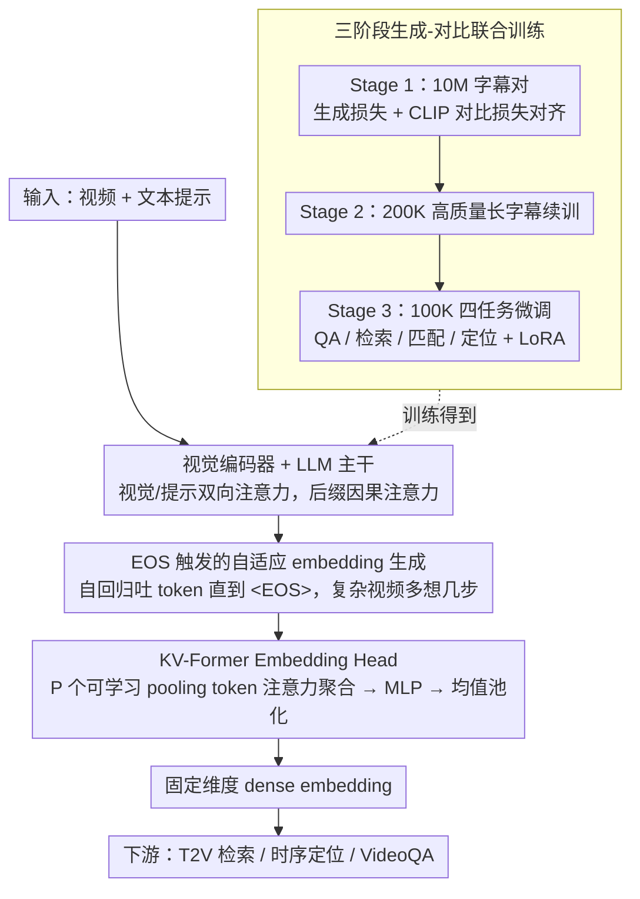

# ViLL-E: Video LLM Embeddings for Retrieval

**会议**: ACL 2026  
**arXiv**: [2604.12148](https://arxiv.org/abs/2604.12148)  
**代码**: 无  
**领域**: 视频理解  
**关键词**: 视频检索, 视频LLM, embedding生成, 对比学习, 时序定位

## 一句话总结
提出 ViLL-E，首个同时支持文本生成和 embedding 生成的 Video LLM 统一架构，通过三阶段生成-对比联合训练和自适应 KV-Former embedding head，在视频检索和时序定位上逼近专家模型，同时保持 VideoQA 竞争力。

## 研究背景与动机

**领域现状** Video LLM（如 VideoLLaVA、VideoChat2）在视频问答和字幕生成等文本生成任务上表现出色，但在需要 embedding 匹配的任务（如文本到视频检索 T2V、时序定位 Moment Retrieval）上远落后于专用模型（如 QD-DETR、SigLIP、VidLA）。

**现有痛点** 当前视频理解需要维护两套独立模型栈：Video LLM 处理生成任务，专用 dual-encoder 处理检索任务。这不仅增加了部署复杂度，还无法在两类任务间共享表示学习。NLP 领域已有研究表明 LLM 可以通过对比微调转化为强检索模型（如 GRIT、E5），但视频领域尚无此类工作。

**核心矛盾** Video LLM 的自回归生成架构天然不适合产生 dense embedding，但专用 embedding 模型又缺乏 LLM 的推理和生成能力。如何在单一模型中统一这两种能力是关键挑战。

**本文目标** 设计一个统一的 VideoLLM 架构，既能生成文本回答，又能产生高质量的视频/文本 embedding，在检索、定位和 QA 任务上都达到竞争性能。

**切入角度** 在 PaliGemma 多模态 LLM 基础上增加可学习的 embedding head，通过三阶段联合训练策略（大规模预训练→高质量预训练→多任务微调）同时优化生成和判别能力。

**核心 idea** 关键创新在于 EOS 触发的自适应 embedding 生成机制——模型先自回归生成可变数量的 token，这些 token 被送入 embedding head 聚合为 dense embedding。这允许模型对复杂视频"思考更久"，对简单视频快速返回。

## 方法详解

### 整体框架
ViLL-E 基于 PaliGemma-3B 多模态 LLM，包含视觉编码器、LLM 主干和新增的 embedding head。视觉 token 和输入提示使用双向注意力，自回归生成的后缀使用因果注意力。当遇到 `<EOS>` token 时，所有生成的 token 被收集并送入 embedding head 产生 dense embedding。训练分为三个阶段：大规模对比-生成联合预训练、高质量数据续训、多任务微调。

### 关键设计

**1. KV-Former Embedding Head：把变长 token 序列聚合成固定维度 embedding**

Video LLM 的自回归输出长度不定，而检索需要的是一条固定维度的 dense 向量，二者之间缺一个聚合器。ViLL-E 没有直接对输出 token 做 mean pooling，而是设计了 KV-Former：以 LLM 的输出 token 作为 query，引入 $P$ 个可学习的 key/value（称为 "pooling tokens"）当作字典，通过注意力自适应加权聚合，再经 MLP 投影和均值池化得到最终 embedding。相比 Q-Former 输出长度固定、必须截断或补齐变长输入，KV-Former 天然吃得下任意长度的 token 序列；相比简单 mean pooling 或 self-attention，那 $P$ 个 pooling token 给了模型一块独立于生成任务的瓶颈容量，让 embedding 表示不被生成目标"带偏"，同时参数开销很小。

**2. EOS 触发的自适应 embedding 生成：让模型按视频复杂度决定"想多久"**

固定步数的 embedding 提取对所有视频一视同仁，复杂视频来不及分析、简单视频又浪费算力。ViLL-E 改成在提取 embedding 之前先自回归生成 token，直到吐出 `<EOS>` 才停，生成多少 token 随视频复杂度自然浮动——内容繁杂的视频会多生成几步"思考"token 再聚合，简单视频则快速收敛。这等于把"该思考多久"这个决策交还给模型本身，在效率和表示质量之间取得比固定步数更好的平衡。

**3. 三阶段生成-对比联合训练：从对齐到精炼再到多任务解锁**

要在同一个模型里同时养出生成能力和判别能力，单阶段训练既容易顾此失彼、原始字幕又太短撑不起细粒度表示。ViLL-E 拆成三段递进：Stage 1 在 10M Shutterstock 视频-字幕对上联合优化 next-token prediction（生成）和 CLIP 式对比损失（embedding），先建立基础的视频-语言对齐；Stage 2 在 200K 条 Claude-3-Sonnet 生成的高质量长字幕上续训，用详细描述弥补原始字幕过短的问题；Stage 3 在 100K 样本上做四任务微调（QA、检索、匹配、定位），解锁下游能力。消融实验里去掉预训练后检索分数从 62.8 跌到 49.3，证实每个阶段都不是摆设。

### 损失函数 / 训练策略
四种任务对应四种损失：(1) 检索任务用 CLIP 式 in-batch contrastive loss；(2) 字幕/QA 用 next-token prediction loss；(3) 匹配任务用二分类交叉熵；(4) 时序定位用 contrastive loss + 滑动窗口 hard negative mining（IoU < 0.2 的片段作为负样本）。微调阶段使用 LoRA 保证参数效率，视觉投影模块和 embedding head 全量训练。

## 实验关键数据

### 主实验

| 任务/数据集 | 指标 | ViLL-E | 之前最强 VideoLLM | 专家模型 |
|------------|------|--------|------------------|---------|
| ActivityNet (定位) | R@1,IoU=0.5 | **39.4** | 31.2 (LLaVA-ST) | 33.2 (QD-DETR) |
| Charades-STA (定位) | R@1,IoU=0.5 | **51.5** | 44.8 (LLaVA-ST) | 57.3 (QD-DETR) |
| MSR-VTT (检索) | R@1 | **62.5** | N/A | 58.0 (VidLA) |
| DiDeMo (检索) | R@1 | **61.4** | N/A | 61.1 (VidLA) |
| MSR-VTT QA | Acc | **65.2** | 63.2 (ST-LLM) | - |
| Composed Retrieval (零样本) | R@1 | **53.1** | - | 47.5 (SOTA) |

### 消融实验

| 配置 | MSR QA | MSR Retr. | ANet Loc. | 说明 |
|------|--------|-----------|-----------|------|
| G+C+M (完整) | 65.1 | 62.8 | 39.4 | 三种监督信号联合 |
| G+C (无匹配) | 63.9 | 60.3 | 39.1 | 匹配损失对检索有帮助 |
| G only (仅生成) | 61.3 | 25.1 | 28.7 | 无对比学习时检索崩溃 |
| C only (仅对比) | 45.5 | 54.7 | 29.3 | 无生成损失时 QA 大幅下降 |
| 无预训练 | 55.9 | 49.3 | 32.3 | 预训练对检索至关重要 |

### 关键发现
- ViLL-E 在时序定位上比专用 VideoLLM 平均提升 77%（8+ 百分点），在视频检索上超越 fine-tuned 专家模型达 4%
- 生成和对比训练互补：联合训练在两类任务上都优于单独训练
- 零样本新任务能力：组合视频检索超 SOTA 5%，长文本检索超 SOTA 2%
- KV-Former 设计在所有 embedding head 变体中表现最优
- 两阶段检索（embedding 检索 + LLM 重排序）比单阶段 R@1 额外提升 2%

## 亮点与洞察
- 首次证明单一 VideoLLM 可以同时做好生成任务和 embedding 任务，打破了"两套模型栈"的范式
- 自适应 embedding 生成机制优雅地解决了视频复杂度差异问题
- 三阶段训练策略的设计合理，每个阶段各有明确目标且消融实验支撑充分
- 解锁了之前 VideoLLM 无法完成的新任务（组合检索、长文本检索）

## 局限与展望
- 基于 PaliGemma-3B，参数量较小，缺乏多轮对话能力
- 训练数据主要为英文，可能损失多语言能力
- 未与最新的通用 VideoLLM（如 Qwen2.5-VL-72B）对比，模型规模差距较大
- 未来可扩展到更大 backbone 并加入音频模态

## 相关工作与启发
- NLP 领域的 GRIT 和 E5 证明了 LLM 可以被改造为强检索模型，本文将这一思路成功扩展到视频领域
- VLM2Vec、GME 等并发工作仅限于图像，ViLL-E 是首个视频领域的统一方案
- 对"能否用单一大模型替代多个专用模型"的讨论提供了肯定的实验证据

## 评分
- 新颖性: ⭐⭐⭐⭐ 首个统一生成+embedding的VideoLLM，KV-Former设计巧妙
- 实验充分度: ⭐⭐⭐⭐⭐ 8个benchmark、详细消融、多种零样本新任务验证
- 写作质量: ⭐⭐⭐⭐ 结构清晰，图表信息丰富
- 价值: ⭐⭐⭐⭐ 为视频理解领域的模型统一化提供了可行路径

<!-- RELATED:START -->

## 相关论文

- [\[CVPR 2025\] Seq2Time: Sequential Knowledge Transfer for Video LLM Temporal Grounding](../../CVPR2025/video_understanding/seq2time_sequential_knowledge_transfer_for_video_llm_temporal_grounding.md)
- [\[CVPR 2025\] M-LLM Based Video Frame Selection for Efficient Video Understanding](../../CVPR2025/video_understanding/m-llm_based_video_frame_selection_for_efficient_video_understanding.md)
- [\[CVPR 2025\] VideoRefer Suite: Advancing Spatial-Temporal Object Understanding with Video LLM](../../CVPR2025/video_understanding/videorefer_suite_advancing_spatial-temporal_object_understanding_with_video_llm.md)
- [\[ICCV 2025\] TimeExpert: An Expert-Guided Video LLM for Video Temporal Grounding](../../ICCV2025/video_understanding/timeexpert_an_expert-guided_video_llm_for_video_temporal_grounding.md)
- [\[ICML 2026\] Revisiting Uncertainty: On Evidential Learning for Partially Relevant Video Retrieval](../../ICML2026/video_understanding/revisiting_uncertainty_on_evidential_learning_for_partially_relevant_video_retri.md)

<!-- RELATED:END -->
