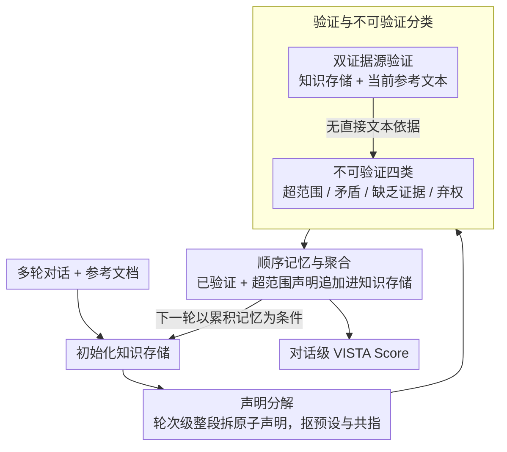

# VISTA: Verification In Sequential Turn-based Assessment

**会议**: ACL 2026  
**arXiv**: [2510.27052](https://arxiv.org/abs/2510.27052)  
**代码**: [https://github.com/ashleylew/VISTA](https://github.com/ashleylew/VISTA)  
**领域**: 视频理解  
**关键词**: 幻觉检测, 对话事实性, 声明级验证, 顺序一致性追踪, 多轮对话

## 一句话总结

VISTA 提出了一个基于声明级分解和顺序一致性追踪的多轮对话事实性评估框架，将不可验证内容细分为主观、矛盾、缺乏证据和弃权四类，在四个对话基准和八个 LLM 上显著优于 FActScore 和 LLM-as-Judge 基线。

## 研究背景与动机

**领域现状**：幻觉检测是对话 AI 系统部署的主要障碍。现有方法如 FActScore 将文本分解为原子事实再逐一验证，LLM-as-Judge 则直接用 LLM 做整体判断，在单轮评估场景中取得了一定进展。

**现有痛点**：现有指标存在两个核心缺陷——(1) 将每次生成视为孤立文本，忽略了对话的顺序性和语用特征，前面的声明会约束后续内容；(2) 将所有不可验证内容（主观表达、弃权回答等）一律视为幻觉，无法区分"真正的错误"和"合理的不确定性"。

**核心矛盾**：对话中的事实性是一个动态演变的属性而非文本的静态特征，但现有评估方法将其视为静态正确性问题。

**本文目标**：(1) 将幻觉检测重新定义为顺序声明验证过程；(2) 对不可验证内容进行细粒度分类；(3) 在对话的 RAG 场景中实现跨轮次的事实一致性追踪。

**切入角度**：借鉴语言学中"共同基础"（common ground）和话语表示理论的思想，将事实可靠性建模为在对话过程中逐步构建的动态过程，通过维护一个不断积累的知识存储来实现跨轮次验证。

**核心 idea**：用结构化的多阶段管道（声明分解→验证→不可验证分类→顺序记忆）替代单体式判断，将对话事实性从"单点检测"升级为"轨迹追踪"。

## 方法详解

### 整体框架

VISTA 是一个顺序评估管道，按对话轮次顺序处理每个助手回复。输入是多轮对话和参考文档，输出是每个声明的验证类别和对话级的事实性分数。管道包含五个步骤：初始化知识存储 → 声明分解 → 验证 → 不可验证分类 → 顺序记忆与聚合。其中验证与不可验证分类同属一个贡献阶段，顺序记忆把每轮结果回写进知识存储、形成跨轮回环。

### 关键设计

**1. 声明分解（Claim Decomposition）：在轮次级别拆原子声明，显式抠出预设和共指**

FActScore 先把回复按句子切开再逐句拆事实，这一步会把隐含信息和跨句共指的内容漏掉。VISTA 不做句子预拆分，而是在轮次级别操作：把完整回复整段喂进去、以对话历史作上下文，用 few-shot 模板（$n=6$）生成一个编号声明列表，并显式处理预设推理和共指消解——例如"我不知道刺绣是一种针法技术"会被拆成"刺绣是一种针法技术"和"助手不知道刺绣是一种针法技术"两条声明。这种整段拆解保住了对隐含/共指内容的召回：实验里把 FActScore 的句子拆分步骤直接移除，反而让它涨分（DeepSeek +11.4%，GPT-4o +4.4%），反向印证了句子预拆分是召回的累赘。

**2. 验证与不可验证分类（Verification & Categorization）：双证据源验证，再把"不可验证"细分四类**

FActScore 只对着静态参考文档验证，逮不住跨轮次的矛盾；LLM-as-Judge 又把所有不可验证内容一锅端成幻觉。VISTA 在验证阶段同时查两个证据源——(a) 此前轮次积累的已验证与超范围声明集合，(b) 当前轮次的参考文本，只有存在直接文本依据才标 VERIFIED。剩下的不可验证声明再进一步归入四类：超范围（Out-of-Scope，主观/经验性内容）、矛盾（Contradicted，被参考材料或先前事实明确反驳）、缺乏证据（Lacking Evidence，可能为真但无支撑）、弃权（Abstention，表达不确定或拒绝回答）。这四类把"真正的错误"和"合理的不确定性"分开，给出比单一"幻觉/非幻觉"更有诊断价值的标签。

**3. 顺序记忆与聚合（Sequential Memory & Aggregation）：维护一块跨轮累积的事实记忆**

对话中一条声明的对错常常依赖前面轮次建立的信息，把每轮当孤立文本就会把正确的跨轮引用误判成"缺乏证据"。VISTA 让每轮的已验证声明和超范围声明追加进一个运行中的知识存储，形成动态事实记忆：后续轮次的验证以它为条件——已验证声明强化先前信息，矛盾声明则指示事实漂移。比如某轮把 Elvis Presley 称作"摇滚之王"，只有记得前面轮次已经建立过这一身份，才不会误报。评估结束时聚合全部声明级结果，得到对话级的 VISTA Score。这块记忆在矛盾检测上贡献最大：加入完整对话历史后，DeepSeek 的矛盾检测从 60.0% 升到 77.0%，GPT-5 从 54.2% 升到 86.0%。

### 损失函数 / 训练策略

VISTA 不需要训练——它是一个基于提示的评估框架，通过结构化提示模板在各阶段调用 LLM 完成子任务。支持零样本和少样本配置，并提供模型无关的统一接口。

## 实验关键数据

### 主实验

**自动评估（不可验证轮次检测准确率 %）**

| 数据集 | 模型 | VISTA | FActScore | LLM-as-Judge |
|--------|------|-------|-----------|--------------|
| AIS | GPT-4o | **63.00** | 56.80 | 56.80 |
| BEGIN | GPT-4o | **83.20** | 65.80 | 70.40 |
| FaithDial | DeepSeek | **81.70** | 63.75 | 55.45 |
| FADE | Llama-70B | **65.10** | 56.65 | 62.28 |
| FaithDial | Qwen-32B | **75.73** | 58.41 | 35.89 |
| BEGIN | Mistral-7B | **72.00** | 53.80 | 57.40 |

**人工评估（对齐共识标签）**

| 模型 | 轮次准确率 | 声明准确率 | Macro F1 |
|------|-----------|-----------|----------|
| GPT-5 | 92.51 | 81.53 | 69.09 |
| GPT-4o | 91.19 | 75.68 | 62.41 |
| DeepSeek | 92.51 | 79.73 | 67.15 |

### 消融实验

| 配置 | FaithDial 准确率 | 说明 |
|------|-----------------|------|
| VISTA (完整) | 81.70 | 完整模型 |
| 移除积累声明 | 81.74 | 影响微小，大部分声明可从当前文档验证 |
| 移除对话历史 | 77.24 | 下降 4.5%，对话上下文对分解至关重要 |
| 零样本 | 70.17 | 下降 11.5%，少样本示例对对话现象建模很重要 |

### 关键发现

- VISTA 的优势主要来自对话上下文化和少样本示例，而非积累声明机制——这与 FaithDial 中大部分声明可从当前参考文档验证有关
- 在矛盾检测任务上，加入完整对话历史后性能大幅提升（DeepSeek 从 60.0% 到 77.0%，GPT-5 从 54.2% 到 86.0%），积累声明是关键推动力
- 人工标注者与原始数据集标签在 26.4% 的轮次上存在分歧，其中 86.7% 是原始标注将不可验证内容错误标记为可验证——表明声明级分解提高了标注质量
- 弃权识别准确率达 90.6%，表明 VISTA 能可靠地区分拒绝回答和幻觉

## 亮点与洞察

- 将对话事实性建模为动态过程而非静态属性的范式转变，与语言学中共同基础理论的对齐非常优雅——这是一个理论驱动的系统设计
- 声明级分解不仅提升了自动评估准确率，还改善了人工标注一致性（Krippendorff's α = 0.832），这个"副产品"可能比主要结果更有实用价值
- 四类不可验证分类的设计思路可直接迁移到其他 NLG 评估任务，如摘要、翻译的忠实度评估

## 局限与展望

- 当前使用的四个基准数据集中矛盾和弃权案例较少，VISTA 在这些场景下的鲁棒性验证不充分
- 积累声明机制在短对话中效果有限，需要更长的多轮对话基准来充分展示其价值
- VISTA 依赖 LLM 执行各阶段子任务，存在级联错误问题——声明分解的错误会传播到后续验证
- 仅关注 RAG 场景，未处理开放域事实验证

## 相关工作与启发

- **vs FActScore**: 两者都做声明级分解验证，但 FActScore 在单文档上孤立验证，VISTA 增加了对话上下文和跨轮次追踪
- **vs LLM-as-Judge**: LLM-as-Judge 提供整体判断但缺乏可解释性，VISTA 通过结构化管道提供声明级诊断

## 评分

- 新颖性: ⭐⭐⭐⭐ 将对话事实性建模为动态过程是有意义的视角转变，但各组件（分解、验证）并不新颖
- 实验充分度: ⭐⭐⭐⭐⭐ 四个基准、八个模型、人工评估、消融分析、矛盾/弃权专项测试，覆盖全面
- 写作质量: ⭐⭐⭐⭐⭐ 动机推导清晰，实验逻辑严谨，理论与实践结合紧密
- 价值: ⭐⭐⭐⭐ 提供了一个比 FActScore 更适合对话场景的评估框架，但实际部署成本较高

<!-- RELATED:START -->

## 相关论文

- [\[ACL 2026\] Confidence Estimation for LLMs in Multi-turn Interactions](confidence_estimation_for_llms_in_multi-turn_interactions.md)
- [\[ACL 2026\] DualFact: A Multimodal Fact Verification Framework for Procedural Video Understanding](dualfact_a_multimodal_fact_verification_framework_for_procedural_video_understan.md)
- [\[CVPR 2026\] VISTA: Video Interaction Spatio-Temporal Analysis Benchmark](../../CVPR2026/video_understanding/vista_video_interaction_spatio-temporal_analysis_benchmark.md)
- [\[CVPR 2026\] SkillSight: Efficient First-Person Skill Assessment with Gaze](../../CVPR2026/video_understanding/skillsight_efficient_first-person_skill_assessment_with_gaze.md)
- [\[CVPR 2026\] MDS-VQA: Model-Informed Data Selection for Video Quality Assessment](../../CVPR2026/video_understanding/mds-vqa_model-informed_data_selection_for_video_quality_assessment.md)

<!-- RELATED:END -->
