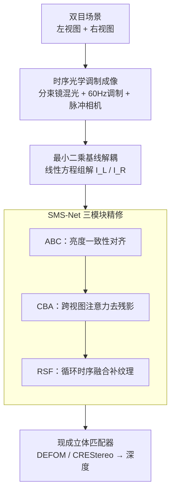

# 240FPS Stereo Vision from Monocular Mixed Spikes

**会议**: CVPR 2026  
**论文**: [CVF Open Access](https://openaccess.thecvf.com/content/CVPR2026/html/Xiaokaiti_240FPS_Stereo_Vision_from_Monocular_Mixed_Spikes_CVPR_2026_paper.html)  
**代码**: https://github.com/yongqiye00/MonoSpikeStereo  
**领域**: 3D视觉  
**关键词**: 脉冲相机, 立体视觉, 时序光学调制, 双目解耦, 高帧率深度

## 一句话总结
用一台单目脉冲相机把左右两路视图光学混合到同一传感器、并对其中一路做 60 Hz 周期调制，再通过"最小二乘基线解耦 + SMS-Net 深度精修"两阶段，从混合脉冲流里重建出 240FPS 的双目视频，在保持单目硬件紧凑、数据高效的同时把深度估计精度做到接近"理论上界"。

## 研究背景与动机

**领域现状**：立体视觉系统大致分三类——单目（靠数据先验直接出深度，硬件最简）、双目/多目（架两台以上相机，精度高）。要同时兼顾"硬件紧凑、精度、数据效率"，一条路线是用平面镜把多个视角投到单传感器的不同子区域（catadioptric stereo）。

**现有痛点**：① 单目方法严重依赖数据驱动先验，遇到训练分布外的场景就崩；② 双目/多目精度高但硬件复杂、相机越多数据吞吐越大，在竞技体育、自动驾驶、航空航天这类高速场景下高帧率需求会进一步拖垮数据效率；③ 平面镜分区投影那条路需要做极线校正（epipolar rectification），而校正依赖"场景近似平面"的假设，非平面场景会引入几何畸变、掉精度；④ 另有一路把两视图"混叠"投到同一传感器（避免几何畸变），但要从混合信号里解耦双目视频，只能靠对有限视差做全局约束，信息不够。

**核心矛盾**：混叠成像虽然避免了几何畸变，但混合信号 $I^L+I^R$ 本身欠定——单帧里两路是叠在一起的，没有额外线索就无法分离。要想解耦，必须给其中一路注入可观测的、随时间变化的"标记"，而这要求相机帧率足够高才能采到这些时序变化。普通数字相机帧率太低，做不到。

**切入角度**：作者注意到新型脉冲相机（spike camera）读出频率高达 40,000 Hz、输出 1-bit 数据，天然适合捕捉高速时序变化、且数据高效。于是给其中一路视图加一个 60 Hz 周期衰减的 LCD 调制器，让两路在时间维度上"可区分"——调制带来的时序变化就成了解耦双目的强线索。

**核心 idea**：用"时序光学调制 + 单目脉冲相机"把双目几何编码进混合脉冲流，再用一个线性方程组（最小二乘）做快速基线解耦、用一个深度网络精修残差，从而以单目硬件拿到 240FPS 双目视频。

## 方法详解

### 整体框架
方法要解决的核心问题是：**如何从一台相机采到的混合脉冲流里，反解出干净的左右两路视频**。整条管线分两阶段：先用一个解析的线性系统做"又快又粗"的基线解耦（Sec 3.1），再用学习型网络 SMS-Net 把基线结果里的伪影擦掉、补回丢失的纹理（Sec 3.2），最后把重建好的双目对喂给现成的立体匹配器（DEFOM-Stereo / CREStereo）估深度来验证质量。

成像端：来自一路视图的光经平面镜反射、再经分束镜与另一路直射光混合，落到脉冲相机上；其中被反射的那一路中间夹了一个 LCD 调制器，对它做 60 Hz 周期透过率衰减，另一路保持不调制。脉冲相机把这个混合场景记录成时间上极其稠密的脉冲序列。因为脉冲足够密，可以认为相邻若干帧之间运动可忽略，于是每个调制周期内能列出多组线性独立的观测方程，解出 4 对双目帧——4 对 × 60 Hz = 240FPS。

### 关键设计

**1. 时序光学调制 + 脉冲相机：把双目几何"编码"进单传感器的混合脉冲流**

混叠成像最大的麻烦是欠定——单帧里 $I^L$ 和 $I^R$ 叠在一起、无从分离。作者的破局点是给其中一路加时序"指纹"：保持左视图不调制、对右视图用 LCD 做 60 Hz 周期衰减 $f(t)$，再用读出频率高达 40 kHz 的脉冲相机去采。脉冲相机每个像素异步积分光生电子，累积到阈值 $Q$ 就触发一个脉冲并清零，因此在时间窗 $T_w$ 内积累的电子满足成像模型 $Q+\Delta Q=\int_{t_{i-1}}^{t_i}\alpha[I^L(t)+I^R(t)f(t)]\,dt$，其中 $\alpha$ 是光电转换系数。关键在于 $f(t)$ 随时间变化，使得不同时间区间的观测彼此线性独立——这正是把"一个欠定的混合"变成"一个可解的方程组"的物质基础。相比已有用两台脉冲相机做立体的方案，这里只用一台相机就拿到了双目线索，硬件更紧凑、数据更省。

**2. 最小二乘基线解耦：用脉冲的时间稠密性把解耦化成线性方程组**

有了时序指纹还不够，还得有高效的求解办法。作者利用脉冲"时间极稠密"这一点，假设相邻时间窗之间运动可忽略，从而把光强近似为常数 $I^L(t)\approx I^L,\ I^R(t)\approx I^R$。代入成像模型后得到对每个像素、每个时间窗的线性方程 $Q+\eta_i=\alpha\big(I^L\Delta t_i+I^R F_i\big),\ i=1,\dots,n$，其中 $\Delta t_i=t_i-t_{i-1}$、$F_i=\int_{t_{i-1}}^{t_i}f(t)\,dt$ 是调制函数在该窗内的积分，$\eta_i$ 是包含采样离散误差 $\Delta Q_i$ 与残余强度不一致 $\epsilon_i$ 的复合误差项。$Q$、$f(t)$、$\alpha$、各触发时刻 $\{t_i\}$ 都已知，未知数只有 $I^L$、$I^R$ 两个，于是用最小二乘求解：

$$\min_{I^L,I^R}\sum_{i=1}^{n}\Big(Q-\alpha\big[I^L\Delta t_i+I^R F_i\big]\Big)^2 + \lambda\big[(I^L)^2+(I^R)^2\big]$$

末项是 $\lambda=1\times10^{-3}$ 的 $\ell_2$ 正则，保证数值稳定。这套解法极轻量：在 i9-13900KF 上构建线性系统平均 0.093 s、求解只要 0.0151 s，足以支撑日常场景的实时解耦。但"运动可忽略"的假设会在真实运动下露馅，导致三类瑕疵：相邻帧亮度分布不一致、双视图间的跨视残影、被调制视图的纹理损失——这恰好成了第二阶段网络要修的三件事。

**3. SMS-Net：三个模块各修一种伪影，把基线结果精修成高质量双目视频**

针对基线那三类瑕疵，SMS-Net 用三个功能正交的模块分别对症下药，端到端训练。

*ABC（Adaptive Brightness Consistency，自适应亮度一致性）* 治"亮度不一致"。调制带来的亮度抖动是周期性的，只要重建窗口跨整数个调制周期 $T_f$，这些抖动会自相抵消。于是构造亮度一致性引导图 $M_t=\frac{Q}{T_f}\sum_{k:t_k\in(t-T_f,t]}1$（在一个完整调制周期内累积脉冲）。模块从基线帧和 $M_t$ 各自抽多尺度特征 $F^L_t,F^R_t,F^M_t$，以 $F^M_t$ 为共享参考，对左右特征做基于全局通道均值/标准差的仿射对齐 $\bar F^L_t=\gamma^L_t\cdot F^L_t+\beta^L_t$，其中 $\gamma,\beta$ 由两层 $1\times1$ 卷积从拼接统计量预测得到，从而把两路亮度拉回一致。

*CBA（Collaborative Binocular Augment，协同双目增强）* 治"跨视残影"。作者观察到残影在两视图里位置相反——左图里护栏残影出现在行人右侧，右图里却在左侧，这种空间不一致正好是去残影的线索。CBA 在每个特征尺度套用 Stereo Cross-Attention Module（SCAM），沿对应极线计算跨视图注意力，让两路互相"借"对方的干净信息来抹掉自己的残影。

*RSF（Recurrent Stereo Fusion，循环立体融合）* 治"纹理损失"（消融里贡献最大的模块）。被调制视图在低透过相位会丢纹理，靠当前帧补不回来，得从历史帧借。RSF 用循环结构维护一个状态队列：先学空间偏移 $\Delta$ 和调制掩码 $m$、用可变形卷积把历史状态对齐到当前时刻 $\tilde S^L_{t-i}=\mathrm{DeformConv}(S^L_{t-i},\Delta,m)$；再用 Guided Temporal Attention（GTA）把对齐后的历史状态与当前特征做时序注意力 $\theta_p=\mathrm{softmax}(Q_pK_p^\top/\sqrt{dim})$、$\hat y_p=\sum_i\theta_{p,i}V_{p,i}$，最后经 ECA 通道注意力增强、SCAM 跨视融合、共享解码器输出精修后的双目对 $\hat I^L_t,\hat I^R_t$。三个模块叠起来，把又快又脏的基线结果提升成可直接喂给立体匹配器的高质量视频。

### 损失函数 / 训练策略
SMS-Net 端到端训练，损失为左右两路的 $\ell_1$ 重建误差 $L=\|\hat I^L_t-I^L_{gt}\|_1+\|\hat I^R_t-I^R_{gt}\|_1$。AdamW 优化器，初始学习率 $1\times10^{-4}$、余弦退火，batch size 12，训练 300 epoch，单卡 RTX 4090。由于没有现成数据集，作者用 TartanAir（含 KITTI 子集）构造合成数据：对双目视频做光流插帧、对右视图施加 $f(t)$ 调制并与左视图混合 $I_{mix}(t)=I^L_{gt}(t)+I^R_{gt}(t)f(t)$，再过脉冲相机仿真生成混合脉冲流训练；另自建一套含平面镜 + 分束镜 + LCD 调制器 + 脉冲相机的真实硬件平台采测试数据。

## 实验关键数据

### 主实验：下游深度估计（TartanAir / KITTI）
把重建的双目对喂给现成立体匹配器（DEFOM、CREStereo）估深度，与单目方法对比。GT-* 行是用真值灰度图作输入的"上界"，不参与最优/次优评比。

| 方法 | TartanAir AbsRel↓ | TartanAir RMSE↓ | TartanAir δ1↑ | KITTI AbsRel↓ |
|------|------|------|------|------|
| Base-DEFOM（基线解耦） | 0.1695 | 2.5187 | 0.8795 | 0.4477 |
| **Refine-DEFOM（本文精修）** | **0.0940** | **1.7852** | **0.9202** | **0.4288** |
| GT-DEFOM（上界） | 0.0498 | 1.5839 | 0.9438 | 0.4219 |
| Spike-T（脉冲单目） | 0.9675 | 8.2092 | 0.2731 | 0.8000 |
| STIR-DepthPro（帧单目） | 0.1085 | 2.2625 | 0.8573 | 0.4409 |

精修后的 Refine-DEFOM 在 TartanAir 上 AbsRel 从基线 0.1695 降到 0.0940（近乎接近上界 0.0498），δ1 升到 0.9202，全面碾压脉冲单目 Spike-T，并优于帧单目 DepthPro；单目方法在远景上精度明显退化。

### 消融实验：ABC / CBA / RSF 三模块（TartanAir，PSNR-Left / SSIM-Left / EPE）
| 配置 | PSNR↑(L) | SSIM↑(L) | EPE↓ | 说明 |
|------|------|------|------|------|
| Baseline | 26.53 | 0.857 | 13.71 | 仅最小二乘解耦 |
| +ABC | 32.13 | 0.953 | 11.44 | 单加亮度一致性 |
| +CBA | 28.90 | 0.958 | 11.40 | 单加跨视去残影 |
| +RSF | 32.00 | 0.975 | 10.25 | 单加循环时序融合（单模块最强） |
| +ABC+RSF | 36.20 | 0.977 | 10.07 | 两模块最强组合 |
| **Ours（ABC+CBA+RSF）** | **36.97** | **0.978** | **10.08** | 完整模型 |

### 关键发现
- **RSF 贡献最大**：单加 RSF 就把 PSNR 从 26.53 拉到 32.00、EPE 从 13.71 降到 10.25，说明"用历史帧补被调制视图的纹理损失"是最吃重的一环。
- **三模块互补、任意两两组合优于单模块**：完整模型在图像质量（PSNR 36.97 / SSIM 0.978 / LPIPS 0.024）和视差精度（Bad 3.0、EPE）上整体最佳，验证三者协同。
- **基线本身已很能打**：仅最小二乘解耦 + 立体匹配器就能出不错的深度图，精修进一步把结果推到接近上界——这让方法在算力受限场景也有一个轻量可用的退化版本。
- ⚠️ 消融表中完整模型的 EPE（10.08）在 TartanAir 上略高于 +ABC+RSF（10.07）和 +CBA+RSF（9.98），但综合 PSNR/SSIM/Bad 3.0 等多数指标完整模型最优；CBA 主要价值在去跨视残影的视觉质量而非单看 EPE。

## 亮点与洞察
- **把"硬件+物理建模+深度学习"串成一条线**：用 LCD 调制给一路视图打时序"水印"，再借脉冲相机的超高时间分辨率把欠定的混叠解耦变成可解的线性方程组——这种"用物理可观测量化解病态问题"的思路很优雅，比纯靠网络硬学先验更稳。
- **两阶段解耦设计可复用**：解析基线（快、可解释、近实时）+ 学习精修（补残差）的范式，可迁移到其他"信号混叠/复用"重建任务（如编码曝光、时分复用成像）。
- **三类瑕疵 → 三个正交模块**：把"运动可忽略"假设破裂后的三种具体瑕疵（亮度抖、跨视残影、纹理损失）一一对应到 ABC/CBA/RSF，模块职责清晰、消融可解释，是很好的工程化范例。
- **跨视残影"左右相反"这个观察**很巧：它把"残影"从噪声变成了可利用的几何线索，直接催生了 CBA 的跨视注意力设计。

## 局限与展望
- **作者承认**：当前 LCD 调制器受物理与工作原理限制只能跑到约 60 Hz，因此 240FPS 是上限；更快的调制器才能解耦到更高帧率。
- **下游对比存在不对称性**（作者自己点明）：缺乏开源的视频解耦基线，只能把单目方法适配成单视图输入来比，比较并不完全对等；结论主要靠"精修后深度精度提升"间接佐证。
- **"运动可忽略"假设**在极高速、剧烈运动场景仍可能失效，虽有 RSF 补救，但本质上是事后修复而非建模运动本身。
- **真实数据规模与多样性**：训练靠 TartanAir/KITTI 合成 + 脉冲仿真，真实数据只用于测试，sim-to-real 的域差距在更复杂光照/材质下的鲁棒性有待验证。⚠️ 论文未给真实数据上的定量指标，仅有定性结果。

## 相关工作与启发
- **vs 平面镜分区立体（Nene & Nayar / Gluckman & Nayar）**：他们把多视角投到传感器不同子区域、靠极线校正分离，依赖平面场景假设、非平面会几何畸变；本文走混叠路线避免几何畸变，并用时序调制 + 脉冲相机解决混叠解耦的欠定问题。
- **vs 混叠投影（Pachidis & Lygouras）**：同样把两视图混叠到一个传感器，但他们只能靠有限视差的全局约束分离，信息不足；本文给一路加时序调制，提供了强得多的解耦线索。
- **vs 双脉冲相机立体（Li et al. / Wang et al. / Gao et al.）**：它们用两台以上脉冲相机做立体/深度，硬件复杂、成本高；本文单台脉冲相机 + 时序调制器就达到可竞争的精度，显著降低系统集成复杂度。
- **vs 脉冲单目深度 Spike-T（Zhang et al.）**：纯单目脉冲在低纹理/重复纹理区域因缺乏几何线索而崩（实验中 AbsRel 0.97、δ1 仅 0.27）；本文恢复出真正的双目对，再交给立体匹配器，从根上解决歧义。

## 评分
- 新颖性: ⭐⭐⭐⭐⭐ "时序光学调制 + 脉冲相机 + 线性解耦"是少见且自洽的跨学科组合，从成像端就重构了立体视觉的取数方式。
- 实验充分度: ⭐⭐⭐⭐ 合成（TartanAir/KITTI）+ 真实硬件双线验证、三模块消融完整；但真实数据缺定量、下游对比承认不对称。
- 写作质量: ⭐⭐⭐⭐⭐ 物理建模、公式推导与模块动机层层递进，三类瑕疵对应三模块的叙事非常清晰。
- 价值: ⭐⭐⭐⭐ 在硬件紧凑/数据高效的约束下逼近双目精度，对高速立体感知（体育、自动驾驶、航空）有实际吸引力，但受限于调制器帧率与硬件定制化。

<!-- RELATED:START -->

## 相关论文

- [\[CVPR 2026\] MonoVLM: Monocular 3D Visual Grounding with Vision Language Models](monovlm_monocular_3d_visual_grounding_with_vision_language_models.md)
- [\[CVPR 2026\] GaussianFluent: Gaussian Simulation for Dynamic Scenes with Mixed Materials](gaussianfluent_gaussian_simulation_for_dynamic_scenes_with_mixed_materials.md)
- [\[CVPR 2026\] SPE-MVS: Spatial Position Encoding Enhanced Multi-View Stereo with Monocular Depth Priors](spe-mvs_spatial_position_encoding_enhanced_multi-view_stereo_with_monocular_dept.md)
- [\[CVPR 2026\] Lite Any Stereo: Efficient Zero-Shot Stereo Matching](lite_any_stereo_efficient_zero-shot_stereo_matching.md)
- [\[CVPR 2026\] PIP-Stereo: Progressive Iterations Pruner for Iterative Optimization based Stereo Matching](pip-stereo_progressive_iterations_pruner_for_iterative_optimization_based_stereo.md)

<!-- RELATED:END -->
