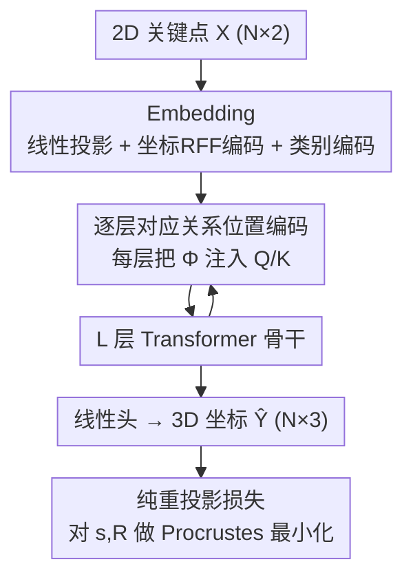

# 2D-LFM: Lifting Foundation Model without 3D Supervision

**会议**: CVPR 2026  
**论文**: [CVF Open Access](https://openaccess.thecvf.com/content/CVPR2026/html/Dabhi_2D-LFM_Lifting_Foundation_Model_without_3D_Supervision_CVPR_2026_paper.html)  
**代码**: [2dlfm.github.io](https://2dlfm.github.io)  
**领域**: 3D视觉  
**关键词**: 2D-to-3D lifting, 非刚体结构恢复, 位置编码, 基础模型, 无3D监督

## 一句话总结
只用 2D 关键点（不碰任何 3D 真值），通过在 Transformer **每一层**都注入「对应关系位置编码」，训出第一个跨类别的 2D→3D 提升基础模型，在物体级几何上反而超过 VGGT 等依赖 RGB 深度的大模型（Pascal3D+ 8.1mm vs VGGT 89.4mm）。

## 研究背景与动机
**领域现状**：VGGT、DUSt3R、MASt3R 这类视觉基础模型靠互联网级数据训练，从 RGB 恢复稠密深度和相机几何已经做得相当准，给人一种"RGB 三维重建基本解决了"的印象。

**现有痛点**：这些模型抓的是**场景级**几何（每个像素的深度），却抓不住**物体级**结构——也就是由一个物体的关键点/骨架定义的细粒度空间关系。论文用一张图说明：VGGT 预测的场景深度很准，但把 2D 关键点沿预测深度反投影回 3D 后，得到的是被压扁的肢体、塌陷的姿态（MPJPE >100mm），而真正的物体结构（8.1mm）完全没恢复出来。

**核心矛盾**：问题不在分辨率而在**表征**——基于外观的特征无法消歧一个物体各部件之间的深度关系。更深一层，把 2D 关键点提升到 3D 这件事，经典 SfM/NRSfM 已经证明**对应关系（correspondence，即知道每个视角下哪个点是哪个语义部件）是必要条件**；可现代基础模型反而把这条经典原理丢掉了。而要让 Transformer 跨类别可扩展，通常会用置换等变（permutation-equivariant）架构，这恰恰**摧毁了 token 的身份**。于是出现一个两难：MLP 方法（PAUL、C3DPO）能做 2D-only 学习但每个类别要单独建网、无法扩展；Transformer 方法（3D-LFM）能跨类别扩展但必须要 3D 监督。

**本文目标**：训一个既只需 2D 监督、又能跨 45+ 类别共享的提升基础模型。

**核心 idea**：把经典 SfM 里"按对应关系组织各视角观测"的归纳偏置，**以位置编码的形式注入 Transformer 的每一层**，从而在保持置换可扩展性的同时把 token 身份一直维持住。

## 方法详解

### 整体框架
输入是一个物体的一组 2D 关键点观测 $\mathbf{X}\in\mathbb{R}^{N\times2}$（$N$ 通常只有 10~25 个点），输出是它们的 3D 坐标 $\hat{\mathbf{Y}}\in\mathbb{R}^{N\times3}$，整个训练**不使用任何 3D 真值**——这正是经典的非刚体结构恢复（NRSfM），本文把它放到基础模型尺度上重做。流程上：先把 2D 点投影成 token 并叠加坐标位置编码与类别编码，送进 $L$ 层 Transformer；与标准 Transformer 唯一的不同是，每一层注意力里都把「对应关系位置编码」$\boldsymbol{\Phi}$ 加进 Query/Key；最后线性投影出 3D 坐标，用纯重投影损失（带 Procrustes 对齐）监督。

### 关键设计

**1. 置换等变带来的不可辨识性，用「逐层对应关系位置编码」破解**

论文先给出一个反直觉的负面结论（命题 1，置换等变下的不可辨识性）：如果模型 $f_\theta$ 是置换等变的，且数据分布和 2D 损失都对关键点索引的置换不变，那么对任意置换 $\boldsymbol{\Pi}$ 都存在另一组参数 $\tilde\theta$ 使得 $\mathcal{L}_{2D}(\tilde\theta)=\mathcal{L}_{2D}(\theta^\star)$ 且 $f_{\tilde\theta}(\mathbf{X})=\boldsymbol{\Pi}f_{\theta^\star}(\mathbf{X})$。直白说：纯 2D 监督**根本无法分辨"哪个 token 对应哪个语义部件"**，所有置换解损失一模一样，于是标准 Transformer 学出来的 3D 结构是退化的（>150mm）。

标准 Transformer 只在输入处加一次位置编码 $\mathbf{Z}_0=\mathrm{Embed}(\mathbf{X})+\boldsymbol{\Phi}$，但注意力的逐层混合会迅速把位置信息冲刷掉，重新恢复置换对称、让非刚体结构学不出来。本文的做法是把 $\boldsymbol{\Phi}$ 注入**每一层**注意力的 Q、K：

$$\mathbf{Q}_\ell=\mathbf{Z}_\ell\mathbf{W}_Q+\boldsymbol{\Phi},\quad \mathbf{K}_\ell=\mathbf{Z}_\ell\mathbf{W}_K+\boldsymbol{\Phi},\quad \mathbf{V}_\ell=\mathbf{Z}_\ell\mathbf{W}_V$$

这样每一层的注意力分数都保持空间感知，token 身份被持续重申，从根本上绕开命题 1 的不可辨识性。消融显示这是全文最关键的一步：输入处只加一次（ViT 式）→ 100.3mm 完全失败；首尾两层加 → 92.1mm；隔层加 → 26.1mm；**每层都加 → 8.1mm**。

**2. 解析式 RFF 位置编码：用 CDF 反演确定性地铺频率**

关键点数量很少（$N\in[10,25]$），标准 ViT 的频率排布 $\omega_k=10000^{-2k/D}$ 频率分辨率不够，难以区分相邻 token。受随机傅里叶特征（RFF）启发，本文不随机采频率，而是**确定性地反演高斯谱密度的 CDF** 来覆盖频谱：

$$\omega_k=\sigma\cdot\mathrm{erf}^{-1}(2k/D)$$

相比蒙特卡洛 RFF 采样，这组结构化傅里叶模态方差显著更小，能用更少特征拿到更丰富的位置编码（$\sigma=2.5$ 实测最佳）。有意思的是，作者还试了图拉普拉斯位置编码（直接注入骨架拓扑），结果发现：在每层注入的前提下，无拓扑先验的 RFF（11.2mm/38.1mm）已经非常接近用真实骨架结构的 Graph Laplacian（9.3mm/35.8mm）。结论是**"怎么注入"比"注入什么"更重要**——一旦满足了对应关系这个必要条件，具体编码类型就退居其次。

**3. 纯重投影损失 + 掩码，实现跨类别统一训练**

没有 3D 真值，监督信号只能来自 2D 重投影。Embedding 阶段把 2D 点投影到 $D$ 维并叠加坐标级 RFF 编码 TPE 与可学习类别编码 $\mathbf{e}_c$：$\mathrm{Embed}(\mathbf{X})=\mathbf{X}\mathbf{W}_{\mathrm{proj}}+\mathbf{b}_{\mathrm{proj}}+\mathrm{TPE}(\mathbf{X})+\mathbf{e}_c$。多类别时把所有类别补齐到 $N_{\max}$、用掩码 $\mathbf{M}_c$ 只对有效点算损失，且损失里对尺度 $s$ 和旋转 $\mathbf{R}$ 取最小（即 Procrustes 对齐，用 SVD 求解）：

$$\mathcal{L}_{2D}=\min_{s,\mathbf{R}}\|\mathbf{M}_c\odot(\mathbf{X}-s\mathbf{P}\mathbf{R}\hat{\mathbf{Y}}^\top)\|_F^2$$

由于 Transformer 权重在所有类别间共享、只有位置编码随类别变化，低数据类别能"借用"高数据类别学到的几何先验，跨类别知识迁移自然涌现。

### 损失函数 / 训练策略
只有上面那个重投影损失。优化用 Adam（lr=$10^{-4}$, wd=$10^{-4}$），batch 64，类别均衡采样；单类别模型 50~100 epoch 收敛，45+ 类别模型 100~150 epoch。骨干 6~24 层、8~16 头、$D=256\sim1024$ 随数据规模缩放；全模型约 25M 参数，与 3D-LFM 相当，逐层 PE 注入只增加 <2% FLOPs、<3% 训练时间。

## 实验关键数据

### 主实验
打破"监督 vs 可扩展"两难（MPJPE↓，Procrustes 对齐后，单位 mm）：

| 方法 | 2D-only | 多类别 | Pascal3D+ | Human3.6M |
|------|---------|--------|-----------|-----------|
| C3DPO（MLP, 2D监督） | ✓ | ✗ | 15.0 | 95.6 |
| PAUL（MLP, 2D监督） | ✓ | ✗ | 9.4 | 88.3 |
| 3D-LFM（Transformer, 需3D） | ✗ | ✓ | 5.2 | 46.3 |
| VGGT（场景深度反投影） | ✓ | ✓ | 89.4 | 107.8 |
| ViT 式输入处加 PE（2D-only） | ✓ | ✓ | 92.3 | 52.4 |
| **2D-LFM（逐层 Fourier）** | ✓ | ✓ | **8.1** | **30.9** |

亮点：2D-LFM 在 Human3.6M 上（30.9mm）甚至优于需要 3D 监督的 3D-LFM（46.3mm），且把 VGGT 这种场景级大模型在物体几何上甩开一个数量级。

### 消融实验
| 配置 | Pascal3D+ | Human3.6M | 说明 |
|------|-----------|-----------|------|
| 输入处加 PE（ViT 式） | 100.3 | 63.4 | 完全失败 |
| 首尾两层加 | 92.1 | 71.2 | 边界条件帮助有限 |
| 隔层加（每 2 层） | 26.1 | 34.5 | 明显劣于每层 |
| **每层加（本文）** | **8.1** | **33.1** | 持续重申对应关系 |
| RFF 型 PE | 11.2 | 38.1 | 无拓扑先验 |
| Graph Laplacian 型 PE | 9.3 | 35.8 | 用真实骨架，仅微弱领先 |

### 关键发现
- **注入位置 > 编码类型**：从 >100mm 到 8.1mm 的巨大落差全靠"每层注入"，而 RFF 与 Graph Laplacian 仅差约 2mm——一旦满足对应关系这个必要条件，编码类型就次要了。
- **基础模型涌现**：单一统一模型联合训练比逐类别单独训练平均提升 59.1%，低数据类别受益最大——bottle（1601 样本）从 100mm 降到 7.2mm（提升 92.8%）、chair（949 样本）提升 85.1%、drosophila（80 样本）提升 92.3%。
- **深度可扩展**：性能随层数稳定提升，4 层 15.3mm → 12 层 9.3mm → 24 层 8.1mm；标准 ViT 因对应关系随深度褪色而无法享受这种深度收益。

## 亮点与洞察
- **用一条理论命题钉死动机**：命题 1 把"标准 Transformer 为何在 2D-only 提升上灾难性失败"从经验观察上升为不可辨识性证明，让"每层注入 PE"成为有理论支撑的必要条件，而非调参 trick。
- **极简改动、极大收益**：相对标准 Transformer 只改了"把 Φ 加进每层 Q/K"，<2% FLOPs，却把误差从 >100mm 压到 8.1mm，这种"一行改动撬动数量级"的设计非常优雅。
- **挑战"基础模型已解决 3D"的叙事**：稀疏 2D 关键点 + 语义对应，在物体级几何上反超稠密 RGB 深度大模型，提醒社区场景级与物体级是两件事。
- **可迁移思路**：「在每层重申结构性归纳偏置以对抗注意力混合的对称化」这一招，或可迁到任何需要保持 token 身份的集合级 Transformer 任务（如分子图、点云配准、跟踪）。

## 局限与展望
- **依赖已知的 2D 关键点对应**：方法吃的是已检测且已对应好的关键点，关键点检测本身的误差/缺失如何端到端传播，论文主要在 mask 遮挡点层面处理，未深入。
- **类别有轻微退化**：45+ 类别联合训练时少数类别会小幅掉点，long-tail 极端稀有类的稳定性仍待加强。
- **评测口径**：MPJPE 都在 Procrustes 对齐后报告，去除了尺度与旋转，绝对度量尺度下的表现未充分展示；与 VGGT 的对比是"反投影可见点"的设定，跨范式比较需谨慎看待。

## 相关工作与启发
- **vs 3D-LFM**：同样用 Transformer 跨类别提升，但 3D-LFM 需要完整 3D 监督；本文只用 2D 监督，靠逐层对应关系 PE 补上缺失的结构信号，在 Human3.6M 上反超。
- **vs PAUL / C3DPO**：都是 2D 监督，但 MLP 方案每类别要单独建网、手调瓶颈维度，无法扩展；本文用统一 Transformer 一网打 45+ 类别。
- **vs VGGT / DUSt3R**：它们从 RGB 估稠密场景深度，强在场景级几何；本文证明对物体级结构，稀疏 2D 关键点 + 显式对应关系比稠密深度更可靠。

## 评分
- 新颖性: ⭐⭐⭐⭐⭐ 首个 2D-only 跨类别提升基础模型，且用不可辨识性命题给出理论根据
- 实验充分度: ⭐⭐⭐⭐ 多 benchmark + 系统消融（注入位置/编码类型/深度），但绝对尺度评测略弱
- 写作质量: ⭐⭐⭐⭐⭐ 动机—理论—方法—验证逻辑链非常清晰
- 价值: ⭐⭐⭐⭐⭐ 重新点亮"2D 关键点提升"这一被忽视范式，对物体级 3D 理解有启发

<!-- RELATED:START -->

## 相关论文

- [\[CVPR 2026\] Depth Any Panoramas: A Foundation Model for Panoramic Depth Estimation](depth_any_panoramas_a_foundation_model_for_panoramic_depth_estimation.md)
- [\[CVPR 2026\] EvObj: Learning Evolving Object-centric Representations for 3D Instance Segmentation without Scene Supervision](evobj_learning_evolving_object-centric_representations_for_3d_instance_segmentat.md)
- [\[ICLR 2026\] Stroke3D: Lifting 2D Strokes into Rigged 3D Model via Latent Diffusion Models](../../ICLR2026/3d_vision/stroke3d_lifting_2d_strokes_into_rigged_3d_model_via_latent_diffusion_models.md)
- [\[CVPR 2026\] JRM: Joint Reconstruction Model for Multiple Objects without Alignment](jrm_joint_reconstruction_model_for_multiple_objects_without_alignment.md)
- [\[CVPR 2026\] Tracking-Guided 4D Generation: Foundation-Tracker Motion Priors for 3D Model Animation](tracking-guided_4d_generation_foundation-tracker_motion_priors_for_3d_model_anim.md)

<!-- RELATED:END -->
