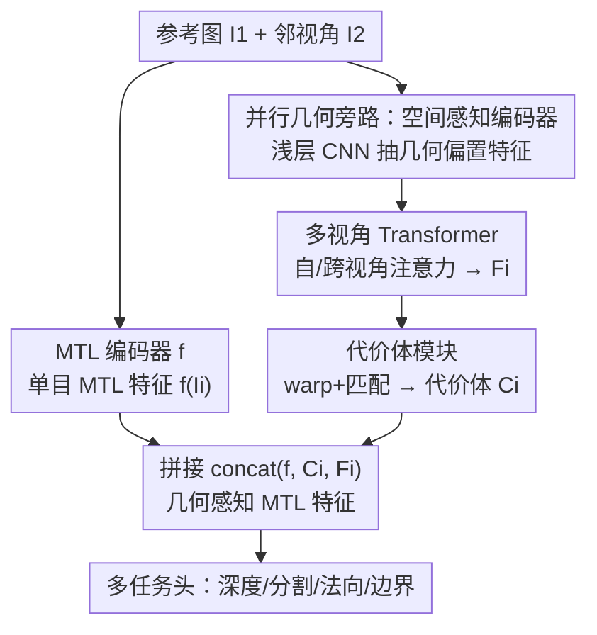

# 3D-Aware Multi-Task Learning with Cross-View Correlations for Dense Scene Understanding

**会议**: CVPR 2026  
**代码**: https://github.com/WeiHongLee/CrossView3DMTL  
**领域**: 3D视觉 / 多任务学习  
**关键词**: 多任务学习, 跨视角相关, 代价体, 几何一致性, 稠密预测

## 一句话总结
给标准多任务学习（MTL）网络挂一条轻量、与任务无关的"几何旁路"——跨视角模块 CvM（空间感知编码器 + 多视角 Transformer + 代价体），把相邻视角之间的几何对应作为几何一致性注入共享特征，让单网络同时预测深度/分割/法向/边界时更"懂 3D"，在 NYUv2、PASCAL-Context 上即插即用地涨点（∆MTL 最高 +3.09）。

## 研究背景与动机
**领域现状**：多任务学习希望用一个共享编码器 + 多个轻量任务头同时做深度估计、语义分割、表面法向、边界检测等稠密任务，省参数又能利用任务间的归纳偏置。主流改进集中在"怎么更好地在 2D 图像空间里共享/交互特征"——任务专属注意力、跨任务注意力、专家混合、prompt、多教师蒸馏等。

**现有痛点**：这些方法几乎都是"把 2D 图像映射到高维特征 + 逐像素监督"，学到的特征是**非结构化**的，缺少对场景几何的显式约束。结果是同一场景不同视角下的预测彼此矛盾（如窗帘分割左右视角不一致），任务之间的关系也变得"噪声化"，反过来拖累性能（论文 Fig.1(c) 上排）。

**核心矛盾**：稠密场景理解本质上需要 3D 几何一致性，但纯 2D 逐像素监督无法提供"同一场景跨视角应当一致"这条关键几何线索。已有的两条 3D-aware 路线各有硬伤：3DMTL 用可微渲染做 3D 正则，却**没有直接把多视角几何线索抽出来融进共享表征**；MuvieNeRF 把多任务重述成多视角合成，但**推理时仍需多视角 + 相机参数**，落地受限。

**本文目标**：在不牺牲"单图推理、架构无关"的前提下，把跨视角几何一致性真正灌进 MTL 的共享特征里。

**切入角度**：作者借鉴多视角重建（MVSplat、DepthSplat、VGGT）的成熟经验——**代价体（cost volume）** 是建立跨视角稠密对应、编码几何的有效手段。那能不能把代价体当作"几何先验"挂到 MTL 编码器旁边，让所有任务共享？

**核心 idea**：用一条与 MTL 主干**并行**的轻量几何旁路 CvM 重建跨视角相关（cost volume），把它和原始单目 MTL 特征拼接后再送任务头；训练可用单/多视角，推理只需单图（缺视角时复制自身当邻视角）。

## 方法详解

### 整体框架
方法要解决的是"标准 MTL 学出来的特征没有 3D 几何一致性"。整体做法是：保留原有的共享 MTL 编码器 $f(\cdot)$（深度/分割/法向/边界各一个轻量任务头），在它**旁边并联**一条几何旁路——跨视角模块 CvM $g(\cdot)$，专门负责从成对视角里抽几何、建立跨视角相关。

给定参考图 $I_1$ 和它的一个邻视角 $I_2$（默认 $V=2$），两条路同时走：主干 $f$ 各自抽出单目 MTL 特征 $f(I_1)$、$f(I_2)$；旁路 $g$ 则依次做三件事——(i) 空间感知编码器 $s(\cdot)$ 抽几何偏置特征，(ii) 多视角 Transformer $m(\cdot)$ 做自/跨视角注意力交换信息得到跨视角增强特征 $F_i$，(iii) 代价体模块 $e(\cdot)$ 把 $F_i$ 沿深度假设 warp + 匹配，构出代价体 $C_i$。最后把 $f(I_i)$、$C_i$、$F_i$ 三者拼接成"几何感知 MTL 特征" $\tilde{F}_{I_i}=\mathrm{concat}(f(I_i),C_i,F_i)$，再喂各任务头出预测。整个 $g$ 在所有任务间共享，只引入约 5M 参数（占 MTL 编码器总量约 1.5%）。

### 关键设计

**1. 并行的空间感知编码器：把"抓几何"从"做任务"里解耦出来**

最直接的做法是直接拿 MTL 编码器特征去做跨视角匹配，但作者论证这会让"单目 MTL"和"跨视角匹配"两件目标互相干扰，训练更难、也难推广到别的 MTL 主干（消融 Tab.5 验证）。痛点在于：MTL 编码器的特征是为"出任务预测"优化的，几何信息被任务语义稀释了。本设计因此另起一条与主干**完全独立**的空间感知编码器 $s(\cdot)$——实现成一个浅层 ResNet 式 CNN（类似 MVSplat），对所有视角抽 1/8 分辨率、128 维的下采样特征 $\{s(I_i)\}$。之所以用 CNN 而非改 MTL 主干，是因为 CNN 对空间局部结构有更强的归纳偏置，能产出更"干净"的几何特征；而且这条旁路不动 MTL 编码器，天然**架构无关**、能插到任意 MTL 骨干上。消融里它优于"直接用 MTL 特征 / MTL+LoRA / MTL+Adapter"三种替代方案。

**2. 多视角 Transformer：用自/跨视角注意力把对应关系建起来、消歧遮挡与无纹理区**

光有单视角的空间特征还不够，跨视角的"哪个像素对哪个像素"需要显式建立。本设计在 $s(\cdot)$ 之后接一个多视角 Swin Transformer $m(\cdot)$，由若干层 self-attention（视角内）和 cross-attention（视角间）交替堆叠，对每个视角计算它与邻视角的注意力，从而聚合互补线索、在遮挡和无纹理表面这类困难区域消歧。为了在大分辨率稠密任务上保持算力可控，注意力沿用 Swin 的**局部窗口**设计，但在所有尺度和视角上重复，兼顾几何一致性与可扩展性。输出是一组跨视角增强特征 $\{F_i\}=m(\{s(I_i)\})$，既几何感知又供后续建代价体。当邻视角多于 2 个（$V>3$）时，只对相机距离最近的 top-2 邻视角做 cross-attention，平衡性能与开销。

**3. 可微代价体：把学到的对应关系固化成显式、可微的 3D 几何表征**

跨视角增强特征 $F_i$ 还是"隐式"的对应，本设计把它转成一个**深度参数化的代价体**来显式编码几何一致性。具体：在逆深度空间均匀采 $L$ 个候选深度面 $\{d_1,\dots,d_L\}$（默认 $L=128$，深度范围 0.0001–10）；对每个候选深度 $d$，用相机内参与相对位姿把邻视角 $I_j$ 的特征 warp 到参考视角，得到 $\hat{F}^{(d)}_{j\to i}$；再对参考特征与 warped 特征做逐像素点积相似度匹配，并在所有邻视角上取平均：

$$C_i^{(d)} = \frac{1}{V-1}\sum_{j\neq i}^{V} \frac{F_i \cdot \hat{F}^{(d)}_{j\to i}}{\sqrt{K}}$$

其中 $K$ 是通道维、用于归一化。这样每个视角得到一个 $C_i\in\mathbb{R}^{H\times W\times L}$ 的代价体，在所有任务间共享。代价体的好处是把"跨视角几何一致性"从抽象注意力变成了沿深度假设的显式匹配体积——这正是多视角立体（MVS）里被反复验证有效的几何先验，且全程可微、能端到端训练。最终它与 $F_i$、$f(I_i)$ 拼接，几何线索就显式地进入了每个任务的预测。

**4. 单视角复制策略：让"需要两视角"的旁路在只有单图时也能跑且更鲁棒**

CvM 至少要两视角输入，但很多 MTL 数据集/推理场景只有单图。本设计用一个简单技巧——把单视角图**复制一份当作邻视角**，使旁路照常前向；训练单视角数据集时同样这么做，实验（Tab.2/Tab.3）显示依旧有效。作者的解释是：在两张完全相同的视角上训练 CvM，反而能阻止它去捕捉"同一视角之间的虚假相关"，从而提升鲁棒性——所以即便没有真多视角，CvM 也帮 MTL 编码器避免学到 noisy/spurious 的视角相关，反而涨点。这条设计是"架构无关 + 单图推理"承诺能成立的关键。

### 损失函数 / 训练策略
训练目标就是把几何感知特征 $\tilde{F}_{I_i}$ 送任务头后，最小化所有任务的逐像素损失（分割用交叉熵、深度用 L1 等），并联合优化 $f$、各任务头 $\{h_t\}$ 以及整条旁路 $g=e\circ m\circ s$：

$$\min_{f,\{h_t\},g}\ \frac{1}{NV}\sum_{\{(I_i,\mathcal{Y}_i)\}\in\mathcal{D}}\ \sum_{y_t\in\mathcal{Y}_i}\ell_t\big(h_t(\tilde{F}_{I_i}),y_t\big)$$

多视角设定下，NYUv2 额外用 RGB-D 视频帧（仅深度标注），相机相对位姿用 COLMAP 估计。骨干统一用 ViT-L；CvM 的多视角 Transformer 用 6 层自/跨视角注意力。

## 实验关键数据

### 主实验
NYUv2 多视角设定（训练用单视角图 + 视频帧，测试用单视角）。∆MTL 为相对各 baseline 的平均任务增益：

| 方法 | Seg.(mIoU)↑ | Depth(RMSE)↓ | Normal(mErr)↓ | Boundary(odsF)↑ | ∆MTL↑ |
|------|------|------|------|------|------|
| DINOv3 w/o video | 63.68 | 0.4113 | 15.53 | 80.10 | 0.00 |
| DINOv3（+video） | 64.03 | 0.3954 | 15.35 | 80.52 | 1.52 |
| 3DMTL\*（DINOv3 骨干复现） | 64.25 | 0.3952 | 15.24 | 80.15 | 1.68 |
| **Ours**（DINOv3+CvM） | **65.27** | **0.3836** | 15.35 | **81.69** | **3.09** |

\*3DMTL 无开源代码，作者用 DINOv3 骨干复现。相对单图 DINOv3 baseline，本文 +3.09；相对多视角 DINOv3 仍 +1.57；对比 3DMTL，分割 +1.0、边界 +1.5、深度 RMSE 0.3952→0.3836。

单视角设定与 SOTA 对比（NYUv2，∆MTL 以单任务 STL 为基线），即插即用挂到三种主干上都涨：

| 方法 | Seg.↑ | Depth↓ | Normal↓ | Boundary↑ | ∆MTL↑ |
|------|------|------|------|------|------|
| RADIO | 59.32 | 0.4698 | 17.46 | 79.41 | 8.95 |
| RADIO+**Ours** | 60.26 | 0.4619 | 17.34 | 80.36 | **10.20** |
| SAK | 63.18 | 0.4313 | 16.25 | 79.43 | 14.05 |
| SAK+**Ours** | 63.12 | 0.4044 | 16.22 | 80.56 | **15.63** |
| DINOv3 | 63.68 | 0.4113 | 15.53 | 80.10 | 16.33 |
| DINOv3+**Ours** | 64.98 | 0.3909 | 15.27 | 81.58 | **18.66** |

PASCAL-Context 上同样对 RADIO/SAK/DINOv3 全任务一致涨点（DINOv3+Ours ∆MTL 2.52→3.71，边界 76.30→79.29）。深度平均提升约 4.29%、边界 F 分平均 +1.2，几何密集型任务收益最明显。

### 消融实验
代价体 $C$ 与跨视角增强特征 $F$ 的拆解（NYUv2，∆MTL 以 STL 为基线）：

| 配置 | Seg.↑ | Depth↓ | Boundary↑ | ∆MTL↑ | 说明 |
|------|------|------|------|------|------|
| Ours w/o CV & CF | 64.03 | 0.3954 | 80.52 | 17.57 | 退化为标准 MTL 基线 |
| Ours w/o CF | 64.86 | 0.3853 | 81.18 | 18.65 | 只加代价体 |
| Ours w/o CV | 64.69 | 0.3856 | 81.57 | 18.69 | 只加跨视角特征 |
| **Ours（full）** | **65.27** | **0.3836** | **81.69** | **19.05** | 代价体 + 跨视角特征 |

空间感知特征提取方式对比（∆MTL）：直接用 MTL 编码器 18.84 < +LoRA 18.87 < +Adapter 18.98 < **独立 CNN（Ours）19.05**，验证"独立浅层 CNN 抓几何"优于改造 MTL 主干。

### 关键发现
- **代价体是主力，跨视角特征是补充**：只加代价体就把 ∆MTL 从 17.57 抬到 18.65（+1% 以上）；再叠跨视角特征到 19.05，两者互补——代价体给显式几何，跨视角特征给消歧后的上下文。
- **解耦的几何旁路是对的**：用独立 CNN 抽空间特征比把 LoRA/Adapter 塞进 MTL 编码器更好，印证"别让几何匹配去干扰单目任务学习"的核心论点。
- **深度候选数 L 与视角数 V 都有性价比拐点**：L 从 128→512 略涨（19.05→19.25）但算力激增，故选 128（与 MVSplat/DepthSplat 一致）；视角 $V=2$（19.05）已足够，$V=3$ 略好（19.20）、$V=4$ 反降（18.63）。⚠️ L=256/384 出现 18.62/18.46 的回落，单调性不强，以原文表格为准。
- **极轻量**：CvM 仅约 5M 参数（占 300–350M MTL 编码器的约 1.5%），却带来稳定增益，几何密集任务（深度/边界）收益最大。

## 亮点与洞察
- **把 MVS 的代价体"搬家"到 MTL**：不是发明新几何模块，而是识别出"代价体=可共享的几何先验"，并以并行旁路方式无侵入注入——架构无关、即插即用，这种"借成熟组件解决相邻领域问题"的思路很值得复用。
- **解耦 = 不打架**：坚持几何旁路与任务主干分离，用 CNN 的空间归纳偏置抓几何、用 ViT 主干抓语义，避免两个目标在同一参数空间里互相稀释——消融数据直接支撑了这个直觉。
- **单图复制当邻视角"反而更稳"**：一个看似 hack 的工程技巧被解释成"防止学到同视角虚假相关"，让"训练要双视角、推理只需单图"这条实用承诺成立，是落地友好度的关键。
- 迁移性：这套"主干 + 并行几何旁路 + 显式代价体 + 拼接"的范式，可推广到任何需要几何一致性的稠密预测组合（如视频分割+深度、SLAM 前端多任务头）。

## 局限与展望
- 作者承认：方法面向**静态场景**，动态环境（运动物体、相机运动）会带来额外挑战，未来要做 motion-aware 扩展。
- 多视角训练依赖 COLMAP 估计相对位姿，位姿质量会影响 warp/代价体；论文未充分讨论位姿噪声鲁棒性。⚠️
- 单视角推理靠"复制自身"获得邻视角，本质上没有真正的视差信息，几何线索来自训练阶段的归纳偏置；在纹理极弱或大视差场景的增益边界未明确给出。
- 改进思路：用多视角生成/数据增强造更丰富的"伪邻视角"（作者已列为 future work）；对动态区域做光流/运动补偿后再建代价体。

## 相关工作与启发
- **vs 3DMTL**：3DMTL 用可微渲染做 3D 正则注入 3D-awareness，但不直接抽多视角几何线索融进共享表征；本文直接用代价体显式建跨视角相关并拼进特征，分割/边界/深度均更优，且同样单图可推理。
- **vs MuvieNeRF**：MuvieNeRF 把多任务重述为多视角合成、NeRF 内嵌跨视角+跨任务注意力，但推理需多视角 + 相机参数，落地受限；本文推理只需单图、无需相机参数。
- **vs MVSplat / DepthSplat / VGGT**：这些是多视角重建/3D 表征方法，目标是建场景或合成视图，并非为单图输入的多任务稠密预测设计；本文借用其代价体思想，但落点在"为 MTL 共享表征注入几何结构"。

## 评分
- 新颖性: ⭐⭐⭐⭐ 把 MVS 代价体作为可共享几何先验并行注入 MTL，组合新颖、问题定位准，但单个组件多为现成。
- 实验充分度: ⭐⭐⭐⭐ 两数据集、三主干、单/多视角、组件/特征提取/L/V 多维消融齐全；动态场景与位姿鲁棒性未覆盖。
- 写作质量: ⭐⭐⭐⭐ 动机推导清晰、图文对应、解耦论点有消融支撑。
- 价值: ⭐⭐⭐⭐ 架构无关、单图推理、仅 +1.5% 参数即稳定涨点，工程落地友好。

<!-- RELATED:START -->

## 相关论文

- [\[CVPR 2026\] Learning Multi-View Spatial Reasoning from Cross-View Relations](learning_multi-view_spatial_reasoning_from_cross-view_relations.md)
- [\[CVPR 2026\] Mamba Learns in Context: Structure-Aware Domain Generalization for Multi-Task Point Cloud Understanding](mamba_learns_in_context_structure-aware_domain_generalization_for_multi-task_poi.md)
- [\[CVPR 2026\] StableMTL: Repurposing Latent Diffusion Models for Multi-Task Learning from Partially Annotated Synthetic Datasets](stablemtl_repurposing_latent_diffusion_models_for_multi-task_learning_from_parti.md)
- [\[CVPR 2026\] Towards Foundation Models for 3D Scene Understanding: Instance-Aware Self-Supervised Learning for Point Clouds](towards_foundation_models_for_3d_scene_understanding_instance-aware_self-supervi.md)
- [\[CVPR 2026\] Curvature-Aware Captioning: Leveraging Geodesic Attention for 3D Scene Understanding](curvature-aware_captioning_leveraging_geodesic_attention_for_3d_scene_understand.md)

<!-- RELATED:END -->
