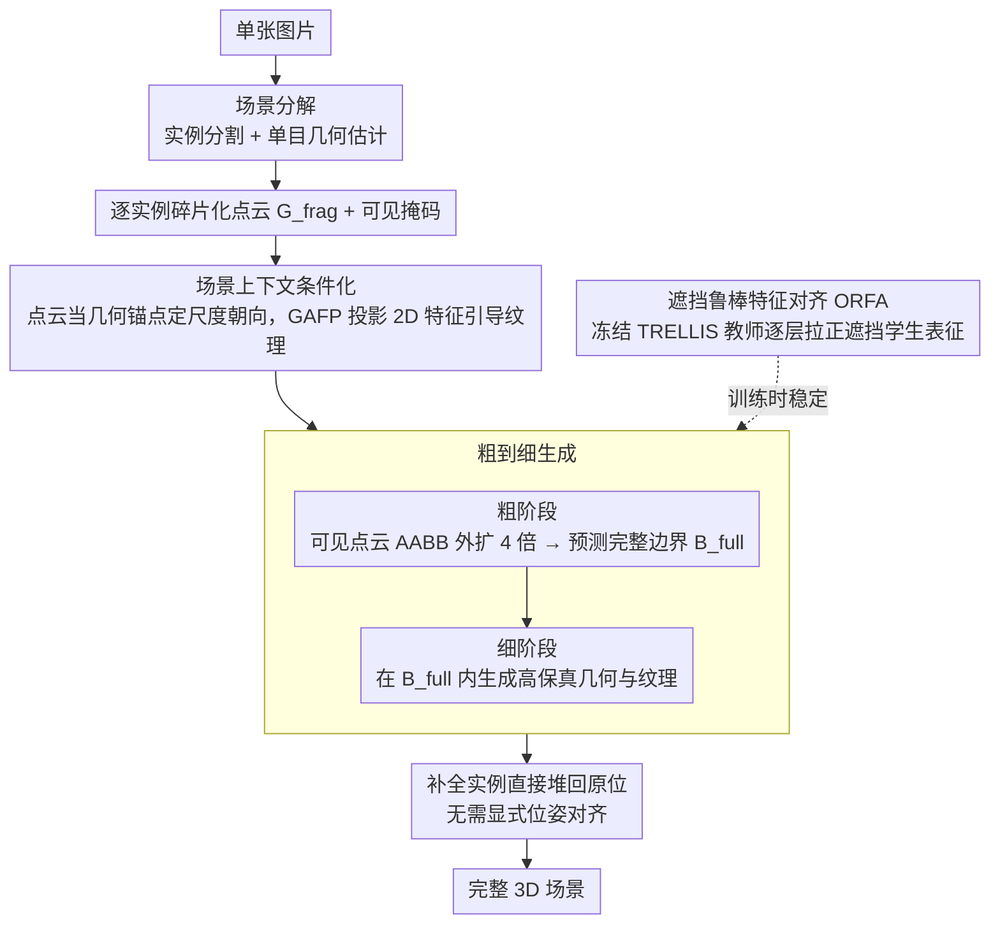

# 3D-Fixer: Coarse-to-Fine In-place Completion for 3D Scenes from a Single Image

**会议**: CVPR 2026  
**arXiv**: [2604.04406](https://arxiv.org/abs/2604.04406)  
**代码**: [项目页](https://zx-yin.github.io/3dfixer) (即将公开)  
**领域**: 3D视觉  
**关键词**: 单图3D场景生成, 就地补全, 粗到细补全, 遮挡鲁棒, 大规模场景数据集

## 一句话总结
提出"就地补全"（in-place completion）新范式，将预训练物体级生成先验扩展到场景级，直接在原始位置对碎片化几何进行补全，无需显式位姿对齐，同时构建110K规模场景级数据集 ARSG-110K，大幅超越 MIDI 和 Gen3DSR 等基线。

## 研究背景与动机
**领域现状**：从单张图片生成组合式3D场景是机器人、AR/VR等领域的核心任务。

**现有方法两大流派及痛点**：
   - **前馈生成**（如MIDI, SceneGen）：端到端高效但泛化性差，且多实例注意力复杂度随物体数二次增长。
   - **分而治之**（如Gen3DSR）：生成/检索单个物体再优化位姿对齐——泛化性好但优化过程耗时且易累积误差。

**核心矛盾**：如何在保持泛化性的同时避免耗时的位姿对齐？

**关键观察**：几何估计模型已能准确恢复可见部分的3D几何，其中既包含空间布局也包含各实例的可见部分。因此可以直接在原位补全不可见部分，无需先生成再对齐。

**核心idea**：不做"生成+对齐"，而是"就地补全"——以碎片化几何为空间锚点，用物体级生成先验在原位补全完整3D资产。

## 方法详解

### 整体框架
3D-Fixer 要解决的问题是：从一张图片恢复出一个由多个完整物体组成的3D场景，但不走"先逐个生成物体、再优化位姿把它们拼回去"的老路。它的核心观察是，现成的几何估计模型已经能把画面里可见的部分准确地恢复成3D点云——这些点云虽然残缺（被遮挡的部分缺失），但已经天然带有正确的空间布局、尺度和朝向。于是整条管线变成：单张图片先经场景分解（实例分割 + 单目几何估计）得到每个实例的碎片化点云；然后逐实例做"就地补全"，以碎片点云作为空间锚点，用物体级生成先验在原位把缺失部分长出来；补全分粗、细两步推进，先定边界再填几何与纹理；最后把补全好的实例直接堆回原位，就得到了完整场景，全程不需要任何显式的位姿对齐。

### 关键设计

**1. 场景上下文条件化：把残缺的3D观测直接当成生成条件，消除2D输入固有的尺度与朝向歧义**

物体级生成模型原本只看一张2D图，无从判断这个物体在场景里到底多大、朝哪个方向，补出来容易飘。3D-Fixer 的做法是把几何估计已经恢复出的碎片点云 $G_{\text{frag}}$ 连同它的可见掩码一起喂进去，当作3D空间锚点——点云本身就编码了真实的尺度和方向，相当于给生成过程钉了几个桩。为了应对不同实例残缺程度不一带来的几何畸变，几何条件用深度比率嵌入的自注意力处理局部结构，再用全局特征的交叉注意力补充上下文。纹理则走另一条专门的通路 GAFP（几何对齐特征投影）：把 MoGe v2 输出的高分辨率2D图像特征，按可见点云的3D体素坐标投影回去，建立"哪个像素对应哪个体素"的精确空间对应，再逐层注入到 DiT 块里引导纹理生成。这样几何管尺度朝向、纹理管外观细节，两条强约束都来自显式3D信息，而不是让模型从单张2D图里硬猜。

**2. 粗到细生成：先在保守包围盒里猜出完整边界，再在边界内填高保真几何，把"物体到底有多大"和"物体长什么样"解耦**

重遮挡场景里最棘手的是边界歧义——你只看见一把椅子的椅背，根本不知道完整椅子向前伸多远，可见部分可能只占完整物体的一小块。如果让模型一步到位地直接生成完整几何，它既要猜尺寸又要填细节，往往两头都做不好。3D-Fixer 把这件事拆成两步：粗阶段先算可见点云的轴对齐包围盒 AABB，把它向外扩张4倍得到一个足够宽松、肯定能装下完整物体的保守包围盒 $B_{\text{exp}}$，然后在这个范围内预测出物体真正的完整边界 $B_{\text{full}}$；细阶段再在这个已经收紧的精确边界内，生成高分辨率、高保真的几何与纹理。先定范围再填内容，各司其职，遮挡再重也不至于把尺寸估崩。

**3. 遮挡鲁棒特征对齐（ORFA）：用未遮挡的教师把遮挡学生的中间表征拉回正轨，缓解"物体级先验没见过遮挡"的域差**

借来的物体级先验（基于 TRELLIS）是在干净、无遮挡的物体数据上训练的，可一搬到场景里，输入全是被切掉一半的碎片，这种域差会让训练剧烈震荡。ORFA 的解法是搭一对师生：冻结的预训练 TRELLIS 当教师，喂它干净的完整图像；可训练的场景分支当学生，喂它真实的遮挡输入；然后逐层把学生的中间表征往教师那边对齐，用余弦相似度作为对齐目标

$$\mathcal{L}_{\text{AL}} = -\mathbb{E}\Big[\frac{1}{N}\sum_{n=1}^{N} \text{sim}(\mathbf{h}_s, \mathbf{h})\Big]$$

其中 $\mathbf{h}_s$、$\mathbf{h}$ 分别是学生与教师在同一层的特征。教师始终看着"物体本该长什么样"，学生即便输入残缺也被牵着保持稳定的表征，从而把遮挡带来的训练不稳定压下去。

### 一个完整示例：补全一把被桌子挡住下半身的椅子

假设场景里有一把椅子，画面中只露出椅背和半边坐垫，下方被桌子挡住。场景分解先把这把椅子切出来，几何估计给出它可见部分的碎片点云 $G_{\text{frag}}$——只有上半截，但尺度和朝向都是对的。补全时，这段碎片点云连同掩码作为几何锚点输入；同时 MoGe v2 的图像特征按这些可见体素的坐标投影进来当纹理条件。粗阶段先算可见点云的 AABB（只框住椅背那一小块），向外扩4倍得到一个明显偏大的 $B_{\text{exp}}$，模型在其中预测出椅子真正的完整边界 $B_{\text{full}}$（向下延伸到椅腿应有的位置）。细阶段在这个收紧的边界里把椅腿、完整坐垫的几何长出来，纹理也顺着可见部分的木纹/布料延续下去。整个过程椅子始终待在它原本的位置和朝向上，补完直接就位，无需再做任何对齐。

### 损失函数 / 训练策略
- 基础损失：Flow Matching 损失 $L_{\text{FM}}$，驱动几何与纹理生成
- 对齐损失：$L_{\text{AL}}$，教师-学生中间特征的余弦相似度（即 ORFA）
- 架构：在 TRELLIS 基础上扩成双分支——冻结的原始分支保留物体级先验，可训练的场景分支负责适配遮挡输入

## 实验关键数据

### 主实验

| 数据集 | 指标 | 3D-Fixer | MIDI | Gen3DSR | 提升(vs MIDI) |
|--------|------|------|------|---------|------|
| MIDI testset | CD_S ↓ | **0.069** | 0.080 | 0.123 | +13.8% |
| MIDI testset | FS_S ↑ | **78.67** | 50.19 | 40.07 | +56.8% |
| MIDI testset | CD_O ↓ | **0.032** | 0.103 | 0.157 | +68.9% |
| MIDI testset | FS_O ↑ | **94.39** | 53.58 | 38.11 | +76.2% |
| MIDI testset | 推理时间 | **30s** | 40s | 9min | 更快 |

### 消融实验

| 配置 | 关键指标 | 说明 |
|------|---------|------|
| 无 ORFA | CD_O 上升 | 遮挡导致训练不稳定 |
| 无粗到细 | 边界预测失败 | 难以处理重遮挡 |
| 无几何条件 | 尺度/方向歧义 | 2D条件不足 |
| 无 GAFP | 纹理质量下降 | 缺乏精确空间对应 |

### 关键发现
- 物体级CD从0.103降至0.032（降幅69%），说明就地补全避免了对齐累积误差
- F-Score从53.58升至94.39，近乎完美的几何恢复
- 推理30秒，比Gen3DSR快18倍，比MIDI还快
- 可泛化到复杂场景、真实世界场景和室外场景

## 亮点与洞察
- **范式创新**："就地补全"巧妙利用几何估计的可见部分作为空间锚点，完全避开了位姿对齐这个错误累积源
- **ARSG-110K**：110K场景、180K+资产、300万张标注图片，是目前最大的场景级数据集
- **粗到细解耦**：将尺度预测和几何生成分离是处理遮挡时的优雅设计

## 局限与展望
- 依赖几何估计模型（MoGe v2）的质量，估计失败则整个管线失败
- 当前仅处理刚性物体，可变形物体（如布料、人体）未覆盖
- ARSG-110K 为合成数据，与真实场景仍有域差
- 多实例并行补全时的遮挡关系推理可能不够精细

## 相关工作与启发
- 对比 MIDI（多实例扩散）和 Gen3DSR（分而治之），3D-Fixer 在两者之间找到了更优的折中
- 几何基础模型（MoGe v2, UniDepth）的进步使"就地补全"这一范式变得可行
- 这种"利用部分观测锚定生成"的思路可推广到其他生成任务

## 评分
- 新颖性: ⭐⭐⭐⭐⭐ "就地补全"范式新颖，ORFA训练策略精妙
- 实验充分度: ⭐⭐⭐⭐ 多数据集对比+消融完整
- 写作质量: ⭐⭐⭐⭐ 结构清晰，问题定义精准
- 价值: ⭐⭐⭐⭐⭐ 范式+数据集双重贡献，实用价值高

<!-- RELATED:START -->

## 相关论文

- [\[ICLR 2026\] Generalizable Coarse-to-Fine Robot Manipulation via Language-Aligned 3D Keypoints](../../ICLR2026/3d_vision/generalizable_coarse-to-fine_robot_manipulation_via_language-aligned_3d_keypoint.md)
- [\[CVPR 2026\] Human Interaction-Aware 3D Reconstruction from a Single Image](human_interaction-aware_3d_reconstruction_from_a_single_image.md)
- [\[CVPR 2025\] Wonderland: Navigating 3D Scenes from a Single Image](../../CVPR2025/3d_vision/wonderland_navigating_3d_scenes_from_a_single_image.md)
- [\[CVPR 2026\] Pano3DComposer: Feed-Forward Compositional 3D Scene Generation from Single Panoramic Image](pano3dcomposer_feed-forward_compositional_3d_scene_generation_from_single_panora.md)
- [\[CVPR 2026\] CrowdGaussian: Reconstructing High-Fidelity 3D Gaussians for Human Crowd from a Single Image](crowdgaussian_reconstructing_high-fidelity_3d_gaussians_for_human_crowd_from_a_s.md)

<!-- RELATED:END -->
