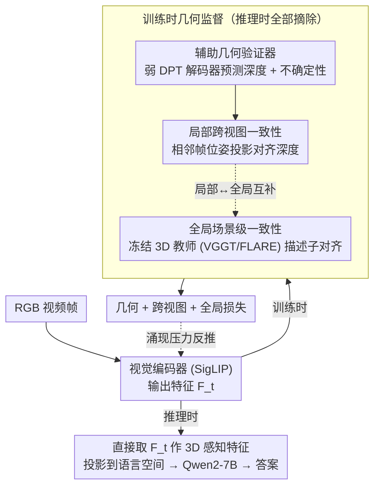

# 3D-IDE: 3D Implicit Depth Emergent

**会议**: CVPR 2026  
**arXiv**: [2604.03296](https://arxiv.org/abs/2604.03296)  
**代码**: [GitHub](https://github.com/ChushanZhang/3D-IDE)  
**领域**: 3D视觉 / 多模态VLM  
**关键词**: 3D场景理解, 多模态大语言模型, 隐式几何涌现, 深度估计, 推理时零开销

## 一句话总结
提出"隐式几何涌现原则"（IGEP），通过训练时的轻量级几何验证器和全局3D教师进行特权监督，使视觉编码器在仅输入RGB视频时即具备3D感知能力，推理时零延迟开销，在多个3D场景理解基准上超越同类方法。

## 研究背景与动机
**领域现状**：将MLLM用于3D场景理解是热点方向。现有方法主要有两条技术路线注入几何感知。

**现有痛点（三难困境）**：
   - **显式3D坐标注入**（如Video-3D LLM）：依赖深度图和相机位姿等3D输入，推理时必须有3D传感器；且坐标经过下采样和体素化导致"双重信息损失"。
   - **外部3D编码器**（如VID-LLM, VG-LLM）：引入大参数量3D基础模型（如VGGT ~1B参数），增加推理延迟和参数量；且2D和3D编码器在不同目标下训练，特征空间不对齐。

**核心问题**：能否学到一个仅用RGB视频推理、但足够强大的3D感知表征？

**关键insight**：将3D感知视为编码器特征的"涌现属性"——通过训练时的几何监督压力迫使编码器内化3D结构，推理时无需任何额外输入。

**核心idea**：弱验证器 + 强约束 = 3D感知涌现在共享编码器中。

## 方法详解

### 整体框架
这篇论文想回答一个问题：能不能让视觉编码器在只看 RGB 视频的情况下，自己"长出"3D 感知能力，从而摆脱推理时对深度图、相机位姿或外部 3D 编码器的依赖？它的做法是把 3D 感知当成训练压力下的**涌现属性**：推理路径极简——RGB 视频帧经 SigLIP 视觉编码器得到特征 $F_t$，直接当作 3D 感知特征 $F_t^{3D} \equiv F_t$ 投影到语言空间，交给 Qwen2-7B 推理；而所有几何监督模块只在训练时挂在编码器旁边施加约束，推理时全部摘掉。关键在于训练时如何给编码器"加压"，这正是下面三个设计要解决的。

### 关键设计

**1. 辅助几何验证器：用一个故意做弱的解码器逼编码器自己内化几何**

如果要让编码器学会 3D，最直接的想法是接一个强大的深度预测头。但本文反其道而行——在视觉 token 上接一个**轻量级、从零训练**的 DPT 风格解码器，预测逐像素深度图 $\hat{D}_t$ 和不确定性图 $\hat{\Sigma}_{D,t}$，几何损失同时约束数据保真度、深度梯度一致性和不确定性正则：

$$\ell_p = \|\hat{\Sigma}_{D,p} \odot (\hat{D}_p - D_p^{gt})\| + \|\hat{\Sigma}_{D,p} \odot (\nabla\hat{D}_p - \nabla D_p^{gt})\| - \alpha \log \hat{\Sigma}_{D,p}$$

之所以刻意把验证器做成低容量，是基于信息瓶颈的考量：验证器本身没能力把深度算准，要让深度预测成立，3D 信息就必须早一步被编码进共享特征里，于是"算深度"的负担被反推到编码器身上，形成持续的涌现压力。实验里这一反直觉设计得到验证——从零训练的弱验证器反而比预训练的强深度模型效果更好，因为强验证器会把几何活儿自己包办，编码器就偷懒了。

**2. 局部跨视图一致性：用相邻帧的几何关系约束单帧深度**

单帧深度监督只看一张图，学到的几何可能在换视角后就站不住。为此本文随机采样相邻帧 $t'$，借助已知的相对位姿把 $\hat{D}_{t'}$ 投影回帧 $t$ 的视角，要求投影深度与本帧预测对得上：

$$\mathcal{L}_{\text{cross-view}} = \frac{1}{|\Omega_{t' \to t}|} \sum_{p \in \Omega_{t' \to t}} \|\hat{D}_{t,p} - \hat{D}_{t' \to t, p}\|_1$$

这等于把多视图几何约束直接灌进编码器特征，逼它学到的深度具备视角不变性，而不是每帧各自为政。

**3. 全局场景级一致性：用冻结的 3D 基础模型当教师传播全局信号**

跨视图损失只覆盖被采样到的那几对相邻帧，约束是局部的、零散的，整段视频的全局几何一致性还没人管。本文再引一个冻结的 3D 基础模型（VGGT/FLARE）当教师，取它的全局描述子，要求编码器输出的描述子与之方向对齐：

$$\mathcal{L}_{\text{global}} = 1 - \cos(f_a, f_b)$$

教师只在训练时提供监督，把场景级的一致性信号从局部帧对扩散到整个序列，与跨视图损失形成"局部对齐 + 全局对齐"的互补。

### 损失函数 / 训练策略
$$\mathcal{L}_{\text{total}} = \mathcal{L}_{ce} + \mathcal{L}_{\text{geometry}} + \mathcal{L}_{\text{cross-view}} + \mathcal{L}_{\text{global}}$$
- 推理时移除验证器和3D基础模型，零额外延迟
- SigLIP 编码器端到端微调，Qwen2-7B 语言骨干
- 8× H100 GPU，32帧采样

## 实验关键数据

### 主实验

| 基准 | 指标 | 3D-IDE (仅RGB) | Video-3D LLM* (仅RGB) | Video-3D LLM (有3D输入) |
|------|------|------|----------|------|
| ScanRefer | Acc@0.25 | **60.9** | 53.7 | 58.1 |
| ScanRefer | Acc@0.5 | **54.5** | 47.8 | 51.7 |
| Multi3DRefer | F1@0.25 | **59.8** | 46.0 | 58.0 |
| Multi3DRefer | F1@0.5 | **54.9** | 42.4 | 52.7 |
| ScanQA | EM | 29.8 | 29.5 | 30.1 |
| SQA3D | EM | **59.2** | 58.6 | 58.6 |

*注：3D-IDE 仅用RGB推理即超越使用显式3D输入的 Video-3D LLM。

### 消融实验

| 配置 | ScanRefer Acc@0.25 | Multi3DRef F1@0.25 | 说明 |
|------|---------|---------|------|
| 基线（无辅助损失） | 53.7 | 46.0 | RGB-only底线 |
| + 全局损失 | 56.9 | 55.6 | +3.2/+9.6 |
| + 全局 + 几何(从零) | 59.8 | 58.7 | 从零验证器略优于预训练 |
| + 全局 + 几何 + 跨视图 | **60.9** | **59.8** | 三者互补 |

### 关键发现
- 仅RGB推理超越使用GT 3D输入的方法：ScanRefer +2.8, Multi3DRef +1.8
- 参数减少12.86%，推理延迟降低55.28%（对比VG-LLM-8B）
- 移除3D输入后，Video-3D LLM性能断崖式下降（Scan2Cap从83.8降至31.5），证明现有方法对3D输入的依赖是"拐杖"
- 弱验证器（从零训练）= 强验证器（预训练），验证了信息瓶颈设计合理

## 亮点与洞察
- **"涌现"视角新颖**：将3D感知作为训练压力下的涌现属性，而非显式输入，哲学上与大模型"涌现能力"一致
- **信息瓶颈设计精妙**：弱验证器迫使编码器承担3D推理，而非将其外包给专门模块
- **推理零开销**是巨大实用优势：部署时只需普通RGB视频管线
- **"双重信息损失"分析** 深刻揭示了显式坐标注入的根本缺陷

## 局限与展望
- 训练仍需GT深度图和相机位姿，对数据要求高
- 验证器和全局教师的损失权重需要调参
- 在 Scan2Cap 上性能略逊于显式3D输入方法（-4.8 CIDEr）
- 当前仅验证在室内ScanNet场景，室外泛化性待验证

## 相关工作与启发
- 与显式方法（Video-3D LLM, 3DRS）和双编码器方法（VID-LLM, VG-LLM）形成清晰的三路对比
- "训练时特权信息"的思想可推广：任何昂贵但有价值的信号都可以用作训练时约束
- 信息瓶颈原理在3D视觉中的应用值得深入探索

## 评分
- 新颖性: ⭐⭐⭐⭐⭐ 隐式涌现原则是根本性的重新思考
- 实验充分度: ⭐⭐⭐⭐ 5个基准+几何分析+消融完整
- 写作质量: ⭐⭐⭐⭐⭐ 理论动机严谨，三难困境分析清晰
- 价值: ⭐⭐⭐⭐⭐ 推理零开销的3D感知对部署意义重大

<!-- RELATED:START -->

## 相关论文

- [\[CVPR 2026\] I-Scene: 3D Instance Models are Implicit Generalizable Spatial Learners](i-scene_3d_instance_models_are_implicit_generalizable_spatial_learners.md)
- [\[CVPR 2026\] NTK-Guided Implicit Neural Teaching](ntk-guided_implicit_neural_teaching.md)
- [\[CVPR 2026\] SMVRT: Implicit Human 3D Modeling Using Sparse Multi-View Volumetric Reconstruction with Transformer Fusion](smvrt_implicit_human_3d_modeling.md)
- [\[CVPR 2026\] IDESplat: Iterative Depth Probability Estimation for Generalizable 3D Gaussian Splatting](idesplat_iterative_depth_probability_estimation_for_generalizable_3d_gaussian_sp.md)
- [\[CVPR 2026\] Depth Any Panoramas: A Foundation Model for Panoramic Depth Estimation](depth_any_panoramas_a_foundation_model_for_panoramic_depth_estimation.md)

<!-- RELATED:END -->
