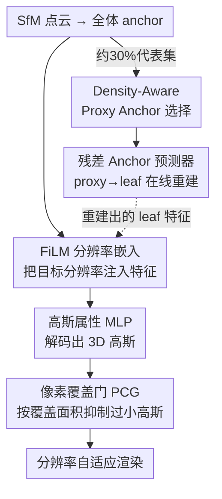

# 3D Gaussian Splatting at Arbitrary Resolutions with Compact Proxy Anchors

**会议**: CVPR 2026  
**论文**: [CVF Open Access](https://openaccess.thecvf.com/content/CVPR2026/html/Jeong_3D_Gaussian_Splatting_at_Arbitrary_Resolutions_with_Compact_Proxy_Anchors_CVPR_2026_paper.html)  
**代码**: https://github.com/JungMinKyun/ARCA-GS (有)  
**领域**: 3D视觉  
**关键词**: 3D 高斯泼溅、任意分辨率渲染、抗锯齿、Anchor 压缩、FiLM 调制

## 一句话总结
本文在 Scaffold-GS 的 anchor 框架上，用 FiLM 把"目标分辨率"注入 anchor 特征、再加一个"像素覆盖门"按采样率动态激活高斯，实现连续任意分辨率下的无锯齿渲染；同时只存约 30% 的 proxy anchor、用残差预测器在线重建其余 leaf anchor，把存储压到 Scaffold-GS 的一半左右而质量不降。

## 研究背景与动机
**领域现状**：3D-GS 把场景表示为一堆各向异性 3D 高斯，可实时渲染；Scaffold-GS 进一步把高斯组织成 anchor（每个 anchor 存一个 latent 特征，再用 MLP 按需解码出若干高斯），大幅压缩了显存。这是当前 anchor-based 高斯泼溅的主流路线。

**现有痛点**：这些方法都是**在固定分辨率下训练**的。一旦在部署时（AR/VR、数字孪生里连续缩放）以训练时没见过的分辨率渲染，就会出现锯齿、阶梯状边缘和模糊——因为投影后的 2D 高斯覆盖面积和像素采样率不再匹配。已有的多分辨率抗锯齿方法要么靠 test-time 的尺度相关滤波（Mip-Splatting、SA-GS），要么干脆**为不同分辨率各存一套高斯**（Multi-scale 3D-GS），后者直接把显存撑爆。

**核心矛盾**：保真度和存储之间存在 trade-off。想在任意分辨率都清晰 → 要么存多套尺度专属高斯（费内存），要么靠滤波（不够 adaptive）；想省内存压缩 anchor → 压缩往往对连续分辨率变化很脆弱，一缩放质量就崩。

**本文目标**：拆成两个子问题——(1) 让**同一套 anchor** 能根据目标分辨率自适应地生成高斯（连续抗锯齿，不存多套）；(2) 在此基础上把 anchor 数量进一步砍掉而不丢细节。

**切入角度**：抗锯齿的本质是让投影 2D 高斯的覆盖面积匹配像素采样率。既然 Scaffold-GS 的高斯是从 anchor 特征"按需解码"出来的，那只要把分辨率信息编码进 anchor 特征、再在解码端按覆盖面积做门控，就能让同一个 anchor 对不同分辨率吐出不同的高斯，而无需为每个尺度单独存储。

**核心 idea**：把分辨率当作一个连续条件，用 FiLM 调制 anchor 特征 + 像素覆盖门控生成"分辨率自适应高斯"；再用 proxy/leaf anchor 的编码-解码结构（受 PointMAE 启发）把存储压缩掉。

## 方法详解

### 整体框架
方法建立在 Scaffold-GS 的 "anchor → 高斯" 结构上。输入是 SfM 点云离散化得到的全体 anchor，每个 anchor 存特征 $f$、scale、offset。本文先把全体 anchor 划成两类：约 30% 作为 **proxy anchor**（红，实际存储的代表集），其余作为 **leaf anchor**（灰，训练后不再存储、推理时重建）。

渲染时，对每个 anchor，先用 **FiLM 分辨率嵌入** 把目标分辨率信息注入特征，得到分辨率自适应特征 $\hat f_v$；这些特征喂进高斯属性 MLP 解码出 3D 高斯，再经 **像素覆盖门 (PCG)** 按目标分辨率下的投影覆盖面积过滤掉太小的高斯，得到"分辨率自适应 3D 高斯"。存储侧由 **残差 anchor 预测器** 负责：训练阶段二里它学会从近邻 proxy anchor 重建 leaf anchor 特征，于是 leaf anchor 的特征不必落盘。

训练分两阶段：Stage 1 跟标准 Scaffold-GS 一样，用全体（proxy+leaf）anchor 生成高斯、渲染图与 GT 比对来训练；Stage 2 在 anchor 集冻结（growing & pruning 结束）后，再联合训练 proxy anchor 和残差预测器，让预测器能从 proxy 重建 leaf。

### 关键设计

**1. FiLM 分辨率嵌入：把"目标分辨率"连续地写进 anchor 特征**

痛点很直接——固定分辨率训练的 anchor，特征里根本没有"现在要渲多大"这个信息，换分辨率就失配。本文用 **Feature-wise Linear Modulation (FiLM)** 把分辨率作为条件注入。具体地，对 anchor 取它的位置 $x_v$ 和缩放比 $\xi$，先做位置编码再过一个小 MLP，产出一对 FiLM 参数：

$$[\gamma_v, \beta_v] = \mathrm{MLP}\big(\mathrm{PE}(x_v, \xi)\big)$$

然后对原始 anchor 特征 $f_v$ 做逐元素仿射调制：

$$\hat f_v = (1 + \gamma_v) \odot f_v + \beta_v$$

这里 $(1+\gamma)$ 的恒等初始化让网络一开始能保留原特征、再慢慢学出分辨率相关的偏移。调制后的 $\hat f_v$ 才送进高斯属性 MLP。妙处在于：Scaffold-GS 本来就有一个基于不透明度阈值 $\tau$ 的过滤（只渲不透明度 > $\tau$ 的高斯），现在不同分辨率诱导出不同的 $(\gamma_v,\beta_v)$，于是同一个阈值在不同分辨率下会**自动选出不同的高斯子集**——同一套 anchor 因此能对任意分辨率吐出合适的高斯。消融里也验证了：FiLM 调制比"直接把分辨率 embedding 加到特征上"在全分辨率区间都更稳，尤其抑制了低分辨率过度平滑和高分辨率欠表达。

**2. 像素覆盖门 PCG：让投影高斯的覆盖面积对齐像素采样率来抗锯齿**

光靠 FiLM 改特征还不够精确。抗锯齿的物理本质是：投影 2D 高斯的覆盖面积应该和像素大小匹配，太小的高斯（小于一个像素）在低分辨率下就是噪点，会造成锯齿和闪烁。PCG 直接对覆盖面积做软门控。先算出分辨率 $\xi$ 下投影 2D 高斯的覆盖面积：

$$A_{\xi,v} = \pi \rho^2 \sqrt{\det\big(\Sigma^{2D}_{\xi,v}\big)}$$

这来自一个事实：2D 高斯的等值线是 Mahalanobis 半径 $\rho$ 的椭圆，面积为 $\pi(\rho\sigma_1)(\rho\sigma_2)=\pi\rho^2\sqrt{\det(\Sigma_{2D})}$（$\sigma_1,\sigma_2$ 是主轴标准差）。论文固定 $\rho=1$。然后用一个 sigmoid 门：

$$g_{pix}(A_{\xi,v}) = \frac{1}{1 + \exp\big(-\kappa(A_{\xi,v}-\eta)\big)}$$

$\eta$ 是可调的覆盖阈值，$\kappa$ 控制过渡陡峭程度。当覆盖面积 $A_{\xi,v} > \eta$ 时门趋近 1（保留不透明度），否则趋近 0（压制）。最终的有效不透明度是 $\tilde\alpha_{\xi,v} = \alpha_{\xi,v}\cdot g_{pix}(A_{\xi,v})$。关键不是它"长得像后处理滤波"，而是它**在训练里联合学习**：消融（Table 4）显示，只在 test-time 套用 PCG（post-hoc）反而会掉点（DeepBlending 平均 PSNR 从 29.465 掉到 28.147），而联合训练能涨到 29.905——说明 PCG 的收益来自训练期学到的"分辨率感知抗锯齿先验"，而非简单的运行时筛选。

**3. Density-Aware Proxy Anchor + 残差预测器：只存代表 anchor，其余在线重建**

前两个设计解决了"分辨率自适应"，但 anchor 还是全存着，内存仍有压缩空间。本文借鉴 PointMAE 的 masked 重建思路：把 anchor 划成网格，每个 cell 内按密度感知地随机选约 **30%** 作为 proxy anchor（存储），剩下的当 leaf anchor（不存、按需重建）。重建由 **残差 anchor 预测器**（一个几层全连接 + 激活的 MLP）完成：对每个 leaf anchor 特征 $\hat f^q_i$，找最近的 proxy anchor $\hat f^k_i$，算出从 proxy 到 leaf 的距离 $\Delta x_i$ 和单位方向 $\vec d_i$，编码后和 proxy 特征拼接输入预测器，输出残差 $\Delta f_i$，重建特征为 $\tilde f^q_i = \hat f^k_i + \Delta f_i$。训练时每次迭代只均匀采样 20% 的 leaf 来跑预测器（其余 leaf 用原始特征），渲染用的是 proxy + 重建 leaf + 未采样 leaf 混合而成的 $F_{mix}$。这样 leaf anchor 的特征完全不必落盘，存储显著下降，而 Mip-NeRF360 上显存从 Scaffold-GS 的 78.9MB 压到 41.6MB、anchor 数从 208K 降到 67.2K，质量却更好——核心理由是预测器逼着每个 proxy anchor 编码更丰富的信息（提升单 anchor 表达力），而非像 Context-GS/TC-GS 那样只是改 anchor 结构省内存。

### 损失函数 / 训练策略
两阶段。Stage 1 只用标准 3D-GS 渲染损失：$L_{base} = (1-\lambda_{SSIM})L_{L1} + \lambda_{SSIM}L_{SSIM}$。anchor 的 growing & pruning 在此阶段进行（每 100 次迭代 refine）。当 anchor 集固定后（约 1k 次迭代起），进入 Stage 2 启用预测器，加一个重建损失对齐预测 leaf 特征与目标：

$$L_{recon} = \frac{1}{|\tilde F^\in_q|}\sum_i \Big(\|\tilde f^q_i - \hat f^q_i\|_2^2 + 0.1\cdot[1-\cos(\tilde f^q_i, \hat f^q_i)]\Big)$$

即 L2 距离 + 余弦相似度项。Stage 2 总损失 $L_{Stage2} = L_{base} + \lambda_{recon}L_{recon}$。实现上：每次迭代随机把输入图缩放到原分辨率的 10%–100%（强制 resolution-agnostic 训练）；训练 30k 次迭代；不透明度阈值 $\tau=1/255$；去掉了 Scaffold-GS 的 feature bank 和 appearance embedding；$\lambda_{recon}$ 在 20k 前取 0.1、之后取 0.01。

## 实验关键数据

### 主实验
在 21 个场景（Mip-NeRF360 7 个、Tanks&Temples 2 个、DeepBlending 2 个、NeRF-Synthetic 8 个）上评测，所有方法都用 10%–100% 随机采样分辨率训练，并把各方法的高斯数量调成大致相当来公平比较"质量-内存" trade-off。报告 PSNR/SSIM/LPIPS。下表摘 Mip-NeRF360 与 DeepBlending 的 10% 与 100% 两端 + 内存。

| 数据集 | 分辨率 | 指标 | 3D-GS | Scaffold-GS | Mip-Splat | 本文 |
|--------|--------|------|-------|-------------|-----------|------|
| Mip-NeRF360 | 10% | PSNR | 21.781 | 24.681 | 28.044 | **29.742** |
| Mip-NeRF360 | 100% | PSNR | 26.471 | 26.498 | 26.542 | **26.710** |
| Mip-NeRF360 | — | MEM | 220.9MB | 78.9MB | 185.8MB | **41.6MB** |
| DeepBlending | 10% | PSNR | 28.747 | 27.185 | 28.262 | **30.472** |
| DeepBlending | 100% | PSNR | 27.613 | 29.276 | 27.861 | **29.332** |
| DeepBlending | — | MEM | 162.1MB | 56.2MB | 135.7MB | **31.1MB** |

低分辨率（10%）是提升最猛的地方：Mip-NeRF360 上比 Scaffold-GS 高 5 个 PSNR、SSIM 0.812→0.932；高分辨率端也保持持平或略优。同时内存约为 Scaffold-GS 的一半。Table 2（仅 anchor-based 方法）进一步显示，在 Tanks&Temples 上本文 anchor 数 67.2K vs Scaffold-GS 208K、NeRF-Synthetic 上 7.0K vs 25.7K，平均质量反而更高——单 anchor 表达力更强。

### 消融实验

| 配置 | Mip-NeRF360 平均 PSNR | 说明 |
|------|----------------------|------|
| No $E_\xi$（无分辨率嵌入） | 27.199 | 不注入分辨率信息，全程失配 |
| + $E_\xi$（直接相加） | 28.036 | 简单把 embedding 加到特征上 |
| + FiLM$_\xi$（本文） | **28.183** | FiLM 仿射调制，全分辨率区间最稳 |

| 配置（DeepBlending 平均） | PSNR | SSIM | LPIPS | 说明 |
|---------------------------|------|------|-------|------|
| Scaffold-GS | 29.465 | 0.886 | 0.201 | 基线 |
| Scaffold-GS + PCG（post-hoc 仅测试期） | 28.147 | 0.837 | 0.279 | 只在测试期套 PCG，反而掉点 |
| Ours（联合训练 PCG） | **29.905** | **0.906** | **0.194** | PCG 必须在训练中学习 |

### 关键发现
- **PCG 必须联合训练**：post-hoc 套用 PCG 比基线还差（PSNR 掉约 1.3），联合训练才涨——说明其价值在于训练期学到的分辨率感知抗锯齿先验，不是运行时筛选器。
- **分辨率自适应是真"动态"**：Fig.4 显示激活高斯数随分辨率单调变化——低分辨率激活少（大投影脚印让小高斯冗余/不稳），高分辨率激活多（还原高频细节），与抗锯齿直觉一致。
- **FiLM > 简单相加**：调制中间特征能同时稳住低/高分辨率，缓解过度平滑与欠表达。
- **proxy/leaf 重建是质量与内存双赢**：anchor 数大幅下降的同时质量不降反升，因为预测器逼 proxy anchor 编码更丰富信息，而非单纯压结构。

## 亮点与洞察
- **把"分辨率"当连续条件用 FiLM 注入**：不是为每个尺度存一套高斯，而是让同一套 anchor 通过条件调制吐出尺度自适应高斯——抗锯齿和内存压缩可以一举两得，这个视角很干净。
- **PCG 的覆盖面积公式有清晰几何含义**：$A=\pi\rho^2\sqrt{\det(\Sigma_{2D})}$ 直接把"高斯有多大"和"像素采样率"挂钩，门控只是把这个物理约束变成可微的软选择，可迁移到任何需要按采样率过滤 primitive 的渲染管线。
- **proxy→leaf 残差重建借自 PointMAE**：用方向+距离编码做近邻重建，把"存全部 anchor"变成"存代表 + 在线推断"，这套编码-解码压缩思路对其他 anchor/point 表示也通用。
- **post-hoc vs 联合训练的对照实验很有说服力**：直接证明了"看起来像后处理的模块"其实需要端到端学习才有效，避免读者误以为可以即插即用。

## 局限性 / 可改进方向
- 作者承认：预测器在线重建 leaf anchor 会带来**额外推理计算**，未来需降低这部分开销。
- proxy 比例固定在约 30%、采样 leaf 比例 20% 是经验值，论文未充分讨论这些超参对不同场景复杂度的敏感性。
- 评测分辨率上限是 100%（原分辨率），对超分辨率（>100% 上采样）这类外推场景是否仍无锯齿未验证。
- ⚠️ 覆盖面积、门控等公式据 CVF 版本转录，个别符号（如 $\Delta x_i$ 与距离记号）原文略有不一致，以原文为准。

## 相关工作与启发
- **vs Mip-Splatting / Analytic-Splatting**：它们在投影时做滤波/面积积分来抗锯齿，是尺度相关的滤波；本文不靠滤波，而是把分辨率写进 anchor 特征让生成端自适应，且无需为不同尺度维护多套高斯，内存优势明显（Mip-Splat 185.8MB vs 本文 41.6MB）。
- **vs Multi-scale 3D-GS**：后者为多分辨率训练分层并**额外存多套高斯**，推理时激活子集；本文是连续单套表示，存储省得多。
- **vs Context-GS / TC-GS（anchor 压缩）**：它们主要改 anchor 结构（上下文模型 / tri-plane）来省内存，但不增强 anchor 表达力；本文用 proxy+残差预测器最大化单 anchor 表达力，在更少 anchor 下质量更好。
- **vs PointMAE / GMAE 等编码-解码**：本文不是自监督预训练，而是把 masked 重建思路用作"存代表点、在线补全"的存储压缩机制，且与分辨率自适应耦合。

## 评分
- 新颖性: ⭐⭐⭐⭐ FiLM 注入分辨率 + 覆盖门控 + proxy/leaf 残差压缩的组合在任意分辨率高斯泼溅里较新颖，单个组件多有前作影子但整合干净。
- 实验充分度: ⭐⭐⭐⭐ 21 场景 4 数据集、10%–100% 全区间评测、三个组件分别消融、post-hoc 对照都到位，缺超分辨率外推。
- 写作质量: ⭐⭐⭐⭐ 框架图清晰、公式完整、消融论证有力；个别符号转录略乱。
- 价值: ⭐⭐⭐⭐ 直击 AR/VR 连续缩放部署的真实痛点，内存减半且低分辨率质量大幅提升，实用性强。

<!-- RELATED:START -->

## 相关论文

- [\[CVPR 2026\] Proxy-GS: Unified Occlusion Priors for Training and Inference in Structured 3D Gaussian Splatting](proxy-gs_unified_occlusion_priors_for_training_and_inference_in_structured_3d_ga.md)
- [\[CVPR 2026\] Prune Wisely, Reconstruct Sharply: Compact 3D Gaussian Splatting via Adaptive Pruning and Difference-of-Gaussian Primitives](prune_wisely_reconstruct_sharply_compact_3d_gaussian_splatting_via_adaptive_prun.md)
- [\[CVPR 2026\] Urban-GS: A Unified 3D Gaussian Splatting Framework for Compact and High-Fidelity Aerial-to-Street Reconstruction](urban-gs_a_unified_3d_gaussian_splatting_framework_for_compact_and_high-fidelity.md)
- [\[ICCV 2025\] A3GS: Arbitrary Artistic Style into Arbitrary 3D Gaussian Splatting](../../ICCV2025/3d_vision/a3gs_arbitrary_artistic_style_into_arbitrary_3d_gaussian_spl.md)
- [\[CVPR 2026\] CGHair: Compact Gaussian Hair Reconstruction with Card Clustering](cghair_compact_gaussian_hair_reconstruction_with_card_clustering.md)

<!-- RELATED:END -->
