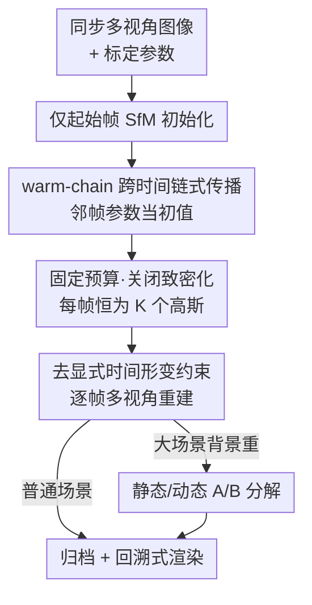

# 3D Gaussian Splatting for Efficient Retrospective Dynamic Scene Novel View Synthesis with a Standardized Benchmark

**会议**: CVPR 2026  
**arXiv**: [2605.12437](https://arxiv.org/abs/2605.12437)  
**代码**: 论文称 Code / API / Datasets 可在对应链接获取（原文未给出明确仓库地址）  
**领域**: 3D视觉  
**关键词**: 动态3DGS, 回溯式新视角合成, 同步多视角, warm-start, 标准化基准

## 一句话总结
在体育这类**同步多相机**采集场景下，作者主张"每一时刻的场景已经被多视角几何约束得很死"，因此**砍掉**动态 3DGS 里常见的时间形变约束，只靠"起始帧 SfM 初始化 + 逐帧 warm-start 链式传播 + 固定高斯预算（不致密化）"就能做到高质量、低显存、可随机回放的回溯式动态新视角合成（NVS），并配套一个 Blender 数据生成 API 把 NeRF/3DGS 的坐标系与数据格式统一成可复现基准。

## 研究背景与动机

**领域现状**：动态场景的新视角合成是体育回放、表演分析、沉浸式转播的核心需求——既要能从任意视角渲染，又要能"回到过去任意一帧"高质量重看。NeRF 和 3DGS 把静态/动态 NVS 推到了实用边缘，其中 3DGS 因为显式几何、可实时光栅化而格外受欢迎。为了把 3DGS 扩到动态场景，主流做法（4DGS、Dynamic 3D Gaussians、space-time Gaussian 等）都在引入**时间耦合**：规范空间形变场（canonical deformation）、时间潜变量、多体刚性约束，用来跨帧维持运动连贯。

**现有痛点**：这些时间耦合公式是为"相机和物体都在平滑运动"设计的，复杂、训练慢、显存随序列增长；而且每个实现的相机坐标系、时间同步、训练划分、导出格式都不一样，做一次公平比较前往往要先花大量精力对齐数据格式。

**核心矛盾**：在**体育这种典型的同步多视角（synchronized multi-view, MV）采集**里，相机被固定在平台上、严格时间同步、且已标定。这种情况下，任意时刻 $t$ 的场景在投影几何的多视角刚性原理下其实**已经是良定（well-posed）的**——空间一致性由标定 + 多视角监督逐帧保证。那么还有必要再背上一套时间形变模型吗？这正是本文要质疑的点。

**本文目标**：(1) 在同步 MV 设定下，验证"不加显式时间耦合"能否做出高质量、显存可控、可随机访问的回溯式动态 NVS；(2) 提供一个统一坐标约定、即开即用的动态 MV 数据生成与基准框架，消除复现摩擦。

**切入角度**：既然每帧已被几何约束得很死，相邻帧运动又局部平滑，那就不必为每帧从零重建，也不必学跨帧形变——直接让每一帧从邻帧收敛好的高斯参数"热启动"接着优化即可。

**核心 idea**：用"warm-start 链式传播 + 固定高斯预算（关掉致密化）"替代"时间形变约束"，在同步多视角下做高效回溯式动态 NVS。

## 方法详解

### 整体框架
本文方法（表格中记作 TA-3DGS）针对 $N$ 台**已标定、时间同步**的相机：每个离散时刻 $t$ 给出一组 RGB 图像 $\mathcal{I}_t=\{I_t^{(i)}\}_{i=1}^N$ 和已知相机参数 $\pi_i=(K_i,R_i,\mathbf{t}_i)$；目标是对任意查询时刻 $t$ 和任意虚拟视角 $\pi^\star$ 渲染出 $\hat{I}_t^\star$，并支持在时间维度上**随机访问回放**。

整体流程是一条沿时间推进的链：起始帧用 SfM 点云初始化并优化收敛 → 后续每一帧从邻帧收敛参数 warm-start、在**固定 $K$ 个高斯、不致密化**下做几帧优化 → 全程**不加任何显式时间形变约束**（空间一致性交给标定和多视角监督）→ 对大场景再用静态/动态 A/B 分解省算力 → 把每帧参数 $\Theta_t^\star$ 归档成 $\mathcal{A}=\{\mathcal{G}_1,\dots,\mathcal{G}_T\}$，回放时按时刻加载渲染。下图是这条 NVS pipeline（论文的第二个贡献——Blender 基准 API——是并行的工具侧产出，不在此图内，见关键设计第 5 点）。

### 关键设计

**1. 去显式时间耦合的逐帧建模：把"跨帧连贯"交还给多视角几何**

这是全文的灵魂论点，针对的痛点是：4DGS / Dynamic 3DGS 等为维持帧间连贯而引入的形变场、规范模板、时间潜变量，在高度动态场景里容易"绷不住"（论文 Fig.2 指出其约束在剧烈运动下会 break down），且复杂又慢。作者的反向操作是：在同步 MV 下，每帧的优化目标只是一个**纯多视角重建损失**

$$\mathcal{L}_t(\Theta_t)=\sum_{i=1}^{N}\mathcal{L}_{\mathrm{img}}\!\left(\hat{I}^{(i)}_t(\Theta_t),\,I^{(i)}_t\right)+\lambda_{\mathrm{reg}}\,\mathcal{R}(\Theta_t),$$

其中 $\mathcal{L}_{\mathrm{img}}$ 用稳健光度损失（$\ell_1$/Charbonnier，可选 SSIM），正则项 $\mathcal{R}(\Theta_t)=\sum_k(\|\mathbf{s}_{t,k}\|_2^2+\alpha_{t,k}^2+\|\mathbf{b}_{t,k}\|_2^2)$ 只是防退化的轻量项，并对尺度 $\mathbf{s}_{t,k}$ 做裁剪。式中**没有任何**跨时间的形变或规范时间项。为什么能这么做：标定 + 多视角监督已经逐帧把空间几何钉死，时间连贯性会自然地由"邻帧初值（设计 2）"带出来，而不需要显式建模，从而绕开了形变模型的复杂度和不稳定。

**2. 仅起始帧 SfM 初始化 + warm-chain 跨时间链式传播：用邻帧收敛参数当初值**

针对"每帧从零重建太贵、且引入不必要的随机性"这一痛点。做法分两步：(a) 只在起始时刻 $t_0$（通常 $t_0=1$）用 SfM 点云 $\mathcal{P}_{t_0}$ 初始化——从重建点云里采/选 $K$ 个点设为高斯均值 $\boldsymbol{\mu}_{t_0,k}\leftarrow\mathbf{p}_k$，尺度/四元数/不透明度设常值，外观 SH 系数则把点投到可见视角、对观测颜色取中位数聚合（零阶 SH 设为聚合 RGB、高阶置零）。(b) 之后**不再做 SfM**，而是 warm-chain：前向链 $\Theta_t^{(0)}\leftarrow\Theta_{t-1}^\star$（也可反向 $\Theta_t^{(0)}\leftarrow\Theta_{t+1}^\star$），每帧只在此初值上优化固定步数。之所以有效，是因为体育运动在相邻帧间局部平滑，邻帧的收敛高斯离当前帧最优解已经很近，几千步就能收敛（实验里每帧仅 8,000 步），把每帧训练成本压得很低且稳定。

**3. 固定预算、关闭致密化的时间索引表示：每帧恒为 $K$ 个高斯**

针对"warm-chain 一旦开着致密化，高斯会沿时间不断累积、显存和归档体积失控"的痛点。每个时刻把场景表示成固定大小的各向异性高斯集合 $\mathcal{G}_t=\{g_{t,k}\}_{k=1}^K$，协方差按 $\Sigma_{t,k}=R(\mathbf{q}_{t,k})\,\mathrm{diag}(\mathbf{s}_{t,k}^2)\,R(\mathbf{q}_{t,k})^\top$ 分解。与标准 3DGS 不同，作者**全程禁用 densification/splitting**，强制 $|\mathcal{G}_t|=K,\ \forall t$。这样带来三个可预测性：恒定显存与归档大小、恒定渲染吞吐、以及每帧恒定的训练算力——这正是"长体育事件可随机回放归档"所需要的。消融（Table 3）显示：开着致密化（S1）5 帧内高斯从约 188K 涨到约 850K、显存 5×；而本文 S2 固定 100K、单帧约 23.65MB 全程不变。

**4. 静态/动态 A/B 分解：大背景场景里只重优化动的那部分**

针对带大量背景信息的大场景（如整座球场）逐帧优化全图太贵的痛点。把场景拆成静态分量 A（球场+背景，只重建一次）和动态分量 B（移动球员，逐帧建模）。为了从全图里抠出 B，对每个视角拿 GT 图像与"只渲染 A"的结果做 RGB 差分 → 阈值化 → 形态学细化得到残差掩码；再把 B 的高斯投到所有视角，用**多视角投票**只保留被各视角残差掩码一致支持的高斯，以抑制背景泄漏、保留运动一致的动态点；可选再加 3D 轴对齐包围盒（AABB）规则平滑合并边界。渲染时把 A 与筛后的 B 合并成单一 3DGS。这样把逐帧需要优化的模型体量大幅缩小（A 训 30000 步、B 仅 5200 步）。作者也指出：A/B 在两者相机参数一致、光照相近时效果最好，否则残差掩码会变噪。

**5. 标准化动态多视角数据生成框架（论文第二大贡献）：用 Blender 统一坐标与格式**

针对"动态 NVS 评测各家数据约定不一、比较前要反复对齐坐标系/格式"的复现痛点。作者基于 Blender 做了一个参数化的数据生成 API：支持半球、全球、椭圆环、以及体育场（环形+分块相机、可选门线视角）等多种相机布局，导出时间对齐的图像序列 + 标定元数据。关键工程点是"Blender 只用于建模，导入/导出统一归到 OpenCV/COLMAP 风格的 world-to-camera 约定（用显式坐标轴转换矩阵），内参采用左上原点约定"，从而消除 NeRF 与 3DGS 代码库间的坐标歧义。它兼容 Instant-NGP、NeRF Synthetic、TACV、COLMAP poses-only 等下游格式，并提供三种深度/点云模式（COLMAP+surface、COLMAP+depth、depth-only）；训练/验证/测试划分按相机名后缀确定性分配，使同一相机集复用时划分**跨时间不变**——这对动态 NVS 的可控基准至关重要。

### 损失函数 / 训练策略
- 单帧目标即式 $\mathcal{L}_t$：多视角光度损失（$\ell_1$/Charbonnier + 可选 SSIM）+ 轻量正则 $\mathcal{R}$（尺度/不透明度/外观 L2）+ 尺度裁剪；无任何时间项。
- 每帧 warm-start 后只优化固定步数；主实验里起始帧与所有后续帧均用相同 100,000 点初始化、各训练 8,000 步。
- 全程禁用致密化，$|\mathcal{G}_t|=K$；大场景 A/B 分解时 A 训 30000 步、B 训 5200 步。
- 实现：PyTorch 2.5.1 + CUDA 11.8，主实验用单卡 A40（50GB），天气球场数据集用 H100。

## 实验关键数据

### 主实验
在三个同步多视角合成动态数据集（D-WS 跳舞/走/站三主体、S-PK 点球、S-MP 多球员）上，与 D-NeRF、D-3DGS、4DGS、ST-GS、TACV 等对比，指标为 PSNR↑ / LPIPS↓。本文方法（TA-3DGS）每帧固定高斯、仅 8K 步。

| 数据集 | 指标 | 本文 TA-3DGS | 次优(TACV) | 4DGS | 说明 |
|--------|------|------|----------|------|------|
| D-WS | PSNR↑ | **42.50** | 34.28 | 28.17 | 比次优高 +8.2 dB |
| D-WS | LPIPS↓ | **0.0110** | 0.0275 | 0.0800 | 感知误差减半以上 |
| S-PK | PSNR↑ | **44.59** | 33.81 | 26.25 | +10.8 dB |
| S-PK | LPIPS↓ | **0.0023** | 0.0282 | 0.0450 | 约 1/12 |
| S-MP | PSNR↑ | **43.84** | 31.85 | 26.20 | +12.0 dB |
| S-MP | LPIPS↓ | **0.0023** | 0.0392 | 0.0610 | 约 1/17 |

注：本文 PSNR/LPIPS 大幅领先，但显存并非最小——如 D-WS 上本文约 4.94GB，而 4DGS 仅 21MB、TACV 3.1GB；本文的卖点是"在固定高斯预算 + 极少迭代（8K vs TACV 16.5–19K）下拿到最佳画质且单帧成本/显存可预测"，训练时间也比 TACV 快（D-WS 2.76h vs 5.25h）。

天气球场数据集（Cloudy/Snow/Sunny SoccerField，1920×1080，A/B 分离重建，H100）：

| 数据集 | PSNR↑ | LPIPS↓ | 合并时间 | 总显存(A+B 过滤后) |
|--------|------|--------|---------|---------|
| Cloudy SoccerField | 28.15 | 0.370 | 0.92h | 886MB |
| Snow SoccerField | 35.00 | 0.270 | 0.66h | 478MB |
| Sunny SoccerField | 28.51 | 0.337 | 1.46h | 888MB |

### 消融实验
在 Snow SoccerField 上对比三种设定：S1（warm+致密化）、S2（warm+不致密化，本文）、S3（每帧 GT 点云初始化，理想但不现实的参考）。

| 配置 | 第1帧→第5帧高斯数 | 单帧体积 | 趋势 | 结论 |
|------|------|---------|------|------|
| S1 Warm+Densify | 188K → 846K | 44.6 → 200.1 MB | 持续膨胀 | 5 帧内显存 5×，长序列不可行 |
| S2 Warm+NoDensify（本文） | 100K（恒定） | 23.65 MB（恒定） | 平稳 | 容量/算力/存储全程可预测 |
| S3 GT Init | ~188K/帧 | ~44.7 MB | 稳定 | 画质好但需每帧 LiDAR/COLMAP，不现实 |

画质权衡（Table 4，前 5 帧最终合并渲染）：S1 的 PSNR 从 28.39 升到 31.25、LPIPS 从 0.395 降到 0.325；S2 的 PSNR 从 27.23 缓升到 28.22、LPIPS 0.426→0.400。

### 关键发现
- **致密化是显存失控的元凶**：S1 画质确实更好，但完全是靠不断膨胀的高斯数量堆出来的（5 帧 5× 显存），对长序列回溯归档不可行；S2 用固定预算换来全程恒定的成本与"温和但稳定"的画质提升，是更实用的折中。
- **同步多视角下"去时间耦合"不掉点反而更好**：在三个标准动态数据集上，本文不加任何时间形变约束就把 PSNR 拉到 42–44 dB、显著超过带时间耦合的 4DGS/ST-GS/D-3DGS，印证了"每帧已被多视角几何约束得很死"的核心假设。
- **A/B 分解适用条件**：当 A、B 共享相机参数且光照相近时残差掩码干净、效果最好；否则掩码会变噪，是工程上要注意的边界。

## 亮点与洞察
- **"做减法"式创新**：别人忙着给动态 3DGS 加时间形变场，本文反其道把它**整个删掉**，论证在同步多相机这一特定但常见（体育）的场景里几何约束已经够用——一个由问题设定驱动、而非堆模块的洞察，很"啊哈"。
- **可预测性即工程价值**：固定高斯预算让显存、归档大小、渲染吞吐、单帧训练成本全部恒定，这对"长达数小时体育事件的随机回放归档"是刚需，比单纯刷 PSNR 更落地。
- **warm-chain 思想可迁移**：任何"相邻状态局部平滑、采集端几何强约束"的序列重建（监控、手术录像、固定机位演出）都能借鉴"邻帧收敛参数当初值 + 不致密化"来省算力、控显存。
- **基准工具是被低估的贡献**：把 Blender 建模与 OpenCV/COLMAP 导出约定强行统一、按相机名做时间不变的数据划分，直接降低了动态 NVS 领域"比较前先对齐格式"的隐性成本。

## 局限与展望
- **强依赖标定与同步**（作者承认）：内参/外参小误差、卷帘快门、亚帧不同步都会造成多视角不一致，且 warm-chain 会让误差沿时间累积；方法面向静态相机机位，对运动/变焦/连续变内参相机未直接处理。
- **初始化敏感**（作者承认）：只在首帧用点云初始化，若初始点云太稀疏或有偏（反光、无纹理、基线太短），固定预算的 warm-chain 难以补回缺失几何。
- **显存不占优**：固定预算虽可预测，但绝对显存（GB 级）远大于 4DGS（MB 级）；卖点是画质与可预测性而非轻量，资源受限部署需权衡。
- **评测仍以合成数据为主**：三个主数据集与天气球场均为 Blender 合成，真实赛场（噪声、动态曝光、人群遮挡）下的表现有待验证。
- **A/B 分解偏工程启发式**：残差掩码靠 RGB 差分+形态学+多视角投票，缺乏对阈值/投票超参的系统分析。

## 相关工作与启发
- **vs 4DGS / ST-GS / Dynamic 3D Gaussians**：它们用规范形变场/时间潜变量/多体刚性显式建模跨帧连贯，适合相机与形状平滑变化；本文在同步 MV 设定下**完全去掉**时间耦合，靠 warm-chain + 多视角几何拿到更高 PSNR/LPIPS 且单帧成本可预测，代价是依赖标定同步、且显存绝对值更大。
- **vs 标准 3DGS [26]**：复用其可微光栅化与各向异性高斯表示，但**禁用致密化、固定 $K$**，把"自适应增点提质"换成"固定预算保证可归档/可预测"。
- **vs MCMC-GS / QUEEN**：前者改进不完美初始化下的鲁棒性、后者做动态高斯压缩；本文走的是"用问题设定（同步 MV）规避复杂性"的路线，而非在通用动态场景里硬抗。
- **vs Nerfstudio / CMU Panoptic Studio**：Nerfstudio 平台优秀但限于刚性场景，Panoptic 提供高质量真实多视角但缺合成动态场景的标准化生成管线；本文的 Blender API 填的正是"可复现合成动态基准"这一空缺。

## 评分
- 新颖性: ⭐⭐⭐⭐ 反直觉地"删掉时间耦合"并论证其在同步 MV 下成立，观点鲜明；但单个组件（warm-start、固定预算）多为已有技术的重组。
- 实验充分度: ⭐⭐⭐ 主结果领先明显、消融把"致密化导致显存爆炸"讲得很清楚；但全为合成数据，缺真实赛场与对标定/同步误差的鲁棒性实验。
- 写作质量: ⭐⭐⭐⭐ 动机—假设—方法逻辑链清晰，公式与算法完整；个别表述与排版略糙。
- 价值: ⭐⭐⭐⭐ 给"体育长序列回溯回放"提供了显存/算力可预测的实用方案，配套标准化基准对社区复现有长期价值。

<!-- RELATED:START -->

## 相关论文

- [\[CVPR 2026\] PhysGaia: A Physics-Aware Benchmark with Multi-Body Interactions for Dynamic Novel View Synthesis](physgaia_a_physics-aware_benchmark_with_multi-body_interactions_for_dynamic_nove.md)
- [\[CVPR 2026\] Physically Inspired Gaussian Splatting for HDR Novel View Synthesis](physically_inspired_gaussian_splatting_for_hdr_novel_view_synthesis.md)
- [\[CVPR 2026\] Dynamic-Static Decomposition for Novel View Synthesis of Dynamic Scenes with Spiking Neurons](dynamic-static_decomposition_for_novel_view_synthesis_of_dynamic_scenes_with_spi.md)
- [\[CVPR 2026\] Splatent: Splatting Diffusion Latents for Novel View Synthesis](splatent_splatting_diffusion_latents_for_novel_view_synthesis.md)
- [\[CVPR 2026\] RF4D: Neural Radar Fields for Novel View Synthesis in Outdoor Dynamic Scenes](rf4dneural_radar_fields_for_novel_view_synthesis_in_outdoor_dynamic_scenes.md)

<!-- RELATED:END -->
