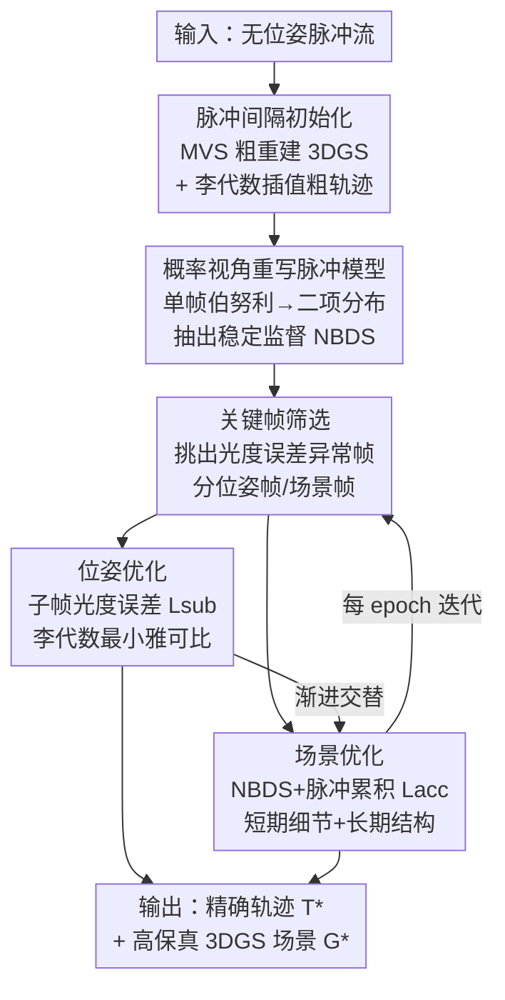

# Nope-SGS：从无位姿脉冲流重建 3D 高斯

**会议**: CVPR 2026  
**论文**: [CVF Open Access](https://openaccess.thecvf.com/content/CVPR2026/html/Guo_3D_Gaussian_Splatting_from_Unposed_Spike_Stream_CVPR_2026_paper.html)  
**代码**: 待确认  
**领域**: 3D视觉  
**关键词**: 3D高斯, 脉冲相机, 位姿无关重建, 高速场景, 神经渲染  

## 一句话总结
本文提出 Nope-SGS，第一个无需相机位姿先验、直接从脉冲相机（spike camera）原始脉冲流重建高速 3D 场景的框架：通过把脉冲成像重新建模成二项分布、从单帧不稳定脉冲里恢复出稳定的归一化监督信号（NBDS），再配合关键帧筛选与渐进式优化，同步求解相机轨迹与 3D 高斯，PSNR 最高比 SOTA 高 7.4dB、ATE 低 40%，且是脉冲方法里最快的。

## 研究背景与动机

**领域现状**：3D Gaussian Splatting（3DGS）凭借显式表达和实时渲染成为 3D 重建主流，但它强依赖两样东西——清晰图像和精确相机位姿。在高速运动场景里，普通曝光相机会因为快门积分产生严重运动模糊，位姿（一般靠 COLMAP/SfM 估）也很难拿准。为此，一批工作引入脉冲相机：这是一种仿生传感器，每个像素持续对入射光积分，积满阈值就发一个脉冲并复位，输出一条时间分辨率极高的 0/1 二值流，天然不怕运动模糊。

**现有痛点**：脉冲方法虽然甩掉了"需要清晰图"的包袱，却仍然卡在"需要精确位姿"上。原因有两点：(a) 脉冲相机单帧信息是二值的，纹理细节稀薄且极不稳定，直接喂给 COLMAP/VGGT 这类位姿估计器，特征提取会失败、位姿估歪甚至彻底崩；(b) 脉冲重建通常需要远多于曝光相机的帧数，计算量陡增。而已有的"位姿无关 3DGS"（CF-3DGS、Instantsplat、ZeroGS 等）全是为慢速、清晰图设计的，硬套到高速脉冲场景或简单拼接，效果都很差。

**核心矛盾**：脉冲流"时间分辨率高但单帧信号极不稳定"——既想用它躲开运动模糊，又会被它的不稳定性毁掉位姿估计。问题根子在于：单帧脉冲是伯努利采样的二值信号，方差大、无稳定纹理，无法当作可靠的光度监督来联合优化位姿和场景。

**本文目标**：彻底去掉脉冲 3D 重建对精确位姿先验的依赖，端到端地从无位姿脉冲流里同时恢复出准确相机轨迹和高质量 3DGS 场景，并且要快。

**切入角度**：作者从脉冲相机的物理成像机制重新审视——每个像素存在一个服从均匀分布的随机初始电压 $V_x$，这使得不同时刻、相邻像素的脉冲在统计上相互独立。既然单帧脉冲是伯努利分布，那把时空上若干脉冲聚合起来，就近似一个二项分布，其期望正比于真实光强、方差还很小。

**核心 idea**：用"概率视角重写脉冲模型 + 从二项分布里抽出稳定监督信号（NBDS）"代替"直接拿不稳定单帧脉冲做监督"，在此之上用关键帧 + 渐进式优化联合求解位姿与场景。

## 方法详解

### 整体框架

Nope-SGS 的输入是一段无位姿的原始脉冲流，输出是精确的相机轨迹 $T^*$ 和高质量的 3D 高斯场景 $G^*$。整个流程分三步走：先**初始化**——从稀疏的脉冲间隔（spike interval）粗重建一套 3DGS 和一条粗糙轨迹；再用**概率视角重写的脉冲模型**把不稳定单帧脉冲转成稳定的 NBDS 监督信号；最后把 NBDS 喂进一个**渐进式优化框架**，用关键帧筛选交替优化相机位姿（Sec 3.4）和场景（Sec 3.5），把粗糙轨迹细化成平滑运动路径、把粗场景磨成高保真重建。

形式上，优化目标是从初始估计 $\{G, T\}$ 收敛到 $\{G^*, T^*\} = \arg\min_{G,T} \mathcal{L}(G, T)$。关键在于"用什么监督信号 $\mathcal{L}$"和"怎么加速"，这正是后面几个设计要回答的。

### 关键设计

**1. 概率视角重写脉冲模型，抽出归一化二项分布脉冲 NBDS：从不稳定单帧脉冲里榨出稳定监督**

这是全文的地基。单帧脉冲是二值的 $S \in \{0,1\}^{H \times W \times N}$，方差大、无纹理，直接当监督会把位姿和场景都带歪。作者的关键观察是：脉冲相机每个像素存在随机初始电压 $V_x \sim U[0, \phi]$，于是脉冲累积变成 $A(x,t) = (\int_0^t L_C(x,\tau)d\tau + V_x) \bmod \phi$。这个随机初始电压让单帧某像素的输出可建模为伯努利分布 $s(x,y,k) \sim B(1, p(x,y,k))$，其中发放概率 $p = (\int_t^{t+T} L_C(x,\tau)d\tau)/\phi$ 正比于该时间窗内的光强。

由于 $V_x$ 带来了像素间的时间独立性，把 $M$ 个相邻像素（假设它们光强近似相同 $p$）在时间上求和，就得到一个近似二项分布 $B[n,p]$。对它取平均后，期望 $E(x/N) = p_i = (\int_t^{t+T} L_C^i d\tau)/\phi$ 恰好近似真实光强，而方差被压到 $\sigma^2(x/N) \approx p(1-p)/n$——聚合越多，方差越小。作者把这个 $[0,1]$ 连续值结果定义为**归一化二项分布脉冲（NBDS）** $\hat{S} \in [0,1]^{H \times W}$。NBDS 等于在不引入偏置的前提下，把抖动剧烈的二值脉冲变成了一张去噪后的灰度纹理图，可以当作可靠的光度监督，这一步是后面位姿/场景优化能跑起来的前提。

**2. 子帧光度误差 + 关键帧筛选：稳住相机位姿优化、把它提速 10 倍**

有了 NBDS，位姿优化的基本目标是最小化光度误差 $\mathcal{L}_{nbds}^k = |\hat{C}(P_\theta^k) - \hat{S}_{gt}^k|$，其中 $\hat{C}$ 是高斯渲染结果做平均池化后与 NBDS 对齐。但单纯这样仍不够稳，作者再用已优化的轨迹去校准当前待优化轨迹，引入**子帧光度误差**：

$$\mathcal{L}_{sub}^k = |(\hat{C}(P_\theta^k) - \hat{C}(P^{k-n})) - (\hat{S}_{gt}^k - \hat{S}_{gt}^{k-n})|$$

这个差分形式做了两件事：一是用相邻帧之差抵消共有噪声、进一步稳住监督信号；二是在边缘等关键位置放大误差、同时降低优化器对普通渲染误差的过度关注。只要时间间隔 $n$ 足够大，$\hat{S}^k$ 和 $\hat{S}^{k-n}$ 的独立性就能保证。优化时用李代数推导最小雅可比，让梯度维度对齐系统自由度、消除冗余、提升效率。

**关键帧筛选**则解决"用全部帧优化位姿既不可行也没必要"的问题：先按 $\mathcal{L}_{nbds}$ 算所有帧的光度误差（几秒内完成），挑出显著高于均值的帧 $F_{key} = \{f^k | \mathcal{L}_{nbds}^k > \delta \cdot \text{mean}(\mathcal{L}_{nbds})\}$。光度误差由"高斯错"和"位姿错"两部分构成，于是再用 $\mathcal{L}_{sub}$ 筛出主要由位姿误差导致的帧 $F_{pose}$ 专做位姿优化，而 $F_{scene} = F_{pose} \cap F_{key}$ 用于场景优化。消融显示，加上关键帧后位姿优化提速约 10 倍而质量几乎不掉——说明它精准锁定了"位姿错的那些帧"。

**3. NBDS + 脉冲累积双损失的场景优化：短期细节与长期结构互补**

单靠 NBDS 做场景优化会有纹理失真，因为它偏重短期细节、丢了高频结构。作者借鉴 SpikeGS，引入**脉冲累积**机制保留高频结构信息：$I_{acc}(t_1, t_N) = (\phi/N)\sum_{t_i} S(P_i)$，即把 $N$ 帧脉冲累加，并通过可微渲染生成多张合成帧 $C_{acc}$ 与之对齐。最终场景损失把两者组合：

$$\mathcal{L}_{final} = \lambda_{acc}\mathcal{L}_{acc} + \lambda_{nbds}\mathcal{L}_{nbds}$$

其中 $\mathcal{L}_{acc}$ 负责长期时序建模（结构）、$\mathcal{L}_{nbds}$ 负责短期细节保留，每个分量内部都同时包含光度约束和结构约束 $\mathcal{L}_* = (1-\lambda_1)\|C_* - I_*\|^2 + \lambda_1 \text{SSIM}(C_*, I_*)$。两者互补：NBDS 加速收敛、恢复几何细节，累积损失稳住长期结构。这种把位姿优化（用 $\mathcal{L}_{sub}$）和场景优化（用 $\mathcal{L}_{final}$）交替进行的**渐进式优化**，正是把"严重不准的初始位姿"逐步转成稳定配置的关键——而这对 SpikeGS、USP-Gaussian 这类依赖位姿先验的方法是做不到的，位姿一歪它们的渲染就出现严重视差。

### 损失函数 / 训练策略
位姿估计用子帧损失 $\mathcal{L}_{sub}$，场景重建用 $\mathcal{L}_{final} = \lambda_{acc}\mathcal{L}_{acc} + \lambda_{nbds}\mathcal{L}_{nbds}$，每个分量内部为光度 + SSIM 结构损失的加权。超参：$n=32$、$M=16$、$\delta=1.0$，其余与原版 3DGS 一致。渐进式优化每个 epoch 做 500 次位姿优化迭代 + 1000 次场景优化迭代，初始化约 1 分钟，全程在单张 NVIDIA A800 上完成。

## 实验关键数据

### 主实验

在 Tanks and Temples 与 Deblur-NeRF 上对比新视角合成（NVS）与位姿估计，Nope-SGS 在所有指标上全面领先。Tanks 上平均 PSNR 比所有 baseline 的最优值高 7.4dB、SSIM 高 30%、LPIPS 低 64%。

| 数据集 | 指标 | 本文(Ours) | 最强 baseline | 对比 |
|--------|------|------|----------|------|
| Tanks | PSNR↑ | **30.184** | 22.375 (Spikerecon+CF-3DGS) | +7.4dB(对均值最优) |
| Tanks | SSIM↑ | **0.911** | 0.703 (Spikerecon+Instant) | 明显领先 |
| Tanks | LPIPS↓ | **0.122** | 0.339 (SpikeGS+Colmap) | 大幅降低 |
| Tanks | ATE↓ | **0.003** | 0.012 (SpikeGS+VGGT) | ~40% 量级更优 |
| Deblur-NeRF | PSNR↑ | **28.058** | 24.143 (SpikeGS+VGGT) | +3.9dB |
| Deblur-NeRF | ATE↓ | **0.030** | 0.055 (Spikenerf) | 更优 |

真实数据（无 GT，用无参考 IQA）上同样领先：

| 数据集 | NIQE↓ | IL-NIQE↓ |
|--------|-------|----------|
| Nope-SGS (Ours) | **5.72** | **44.97** |
| USP-Gaussian | 7.86 | 67.42 |
| SpikeGS | 9.93 | 87.92 |

深度估计（用 DepthAnythingV2 伪深度对齐评估）：Ours 的 $\delta_1=67.11$、AbsRel=0.31，远超 Instantsplat（$\delta_1=52.15$）和 SpikeGS（$\delta_1=18.92$）。效率上比此前脉冲 SOTA 快约 3 倍。

### 消融实验

在 Tanks and Temples 上逐项验证（Key.=关键帧，Time=每 epoch 平均优化时间）：

| ID | 配置 | PSNR↑ | ATE↓ | Time/min | 说明 |
|------|------|---------|------|------|------|
| Ours | 全模型($\mathcal{L}_{sub}$+Key.+$\mathcal{L}_{nbds}$+$\mathcal{L}_{acc}$) | **30.184** | **0.003** | **3.0** | 完整 |
| IV | 位姿用 $\mathcal{L}_{pho}$ 替 $\mathcal{L}_{sub}$ | 28.59 | 0.007 | 11.5 | 去子帧损失，ATE 翻倍、慢约 3.8× |
| V | 位姿用 $\mathcal{L}_{nbds}$ 替 $\mathcal{L}_{sub}$ | 29.69 | 0.004 | 9.0 | 仍不如子帧损失 |
| VI | 去掉关键帧(w/o Key.) | 29.62 | 0.003 | 45.3 | 质量几乎不掉但慢约 15× |
| I | 场景去 $\mathcal{L}_{nbds}$+$\mathcal{L}_{acc}$ | 22.42 | - | - | 场景监督几乎全废 |
| II | 场景去 $\mathcal{L}_{acc}$（留 $\mathcal{L}_{nbds}$） | 26.44 | - | - | 缺长期结构 |
| III | 场景去 $\mathcal{L}_{nbds}$（留 $\mathcal{L}_{acc}$） | 29.16 | - | - | 缺短期细节、收敛慢 |

### 关键发现
- **子帧损失 $\mathcal{L}_{sub}$ 是位姿优化的核心**：相比 $\mathcal{L}_{pho}$ 和 $\mathcal{L}_{nbds}$，它带来约 33% 更低的 ATE 和约 3 倍更快的收敛，说明差分式监督既稳住了信号又加速了优化。
- **关键帧不是为了精度而是为了速度**：去掉关键帧（ID VI）质量几乎不变（PSNR 29.62 vs 30.184），但时间从 3.0 暴涨到 45.3 分钟（约 15×），证明它精准命中了"需要修的那批帧"。
- **NBDS 与累积损失互补缺一不可**：只留一个（ID II/III）PSNR 都掉，全去（ID I）直接崩到 22.42——NBDS 管细节和收敛速度，累积损失管长期结构。

## 亮点与洞察
- **把"传感器噪声"变成"统计可用信号"**：随机初始电压 $V_x$ 原本是脉冲相机的麻烦，作者反手用它论证像素间独立性，从而把单帧伯努利聚合成低方差二项分布——这种"从物理噪声里反推稳定监督"的思路很漂亮，且作者声称这是对所有脉冲相机工作都通用的新视角。
- **差分式子帧损失一举两得**：相邻帧相减既消共有噪声又放大边缘误差，把"稳监督"和"重关键位置"两个目标用一个公式统一了，可迁移到其他不稳定传感器（如事件相机）的位姿优化。
- **"位姿错的帧"和"场景错的帧"分开筛**：用 $\mathcal{L}_{nbds}$ 与 $\mathcal{L}_{sub}$ 把光度误差拆成位姿误差和高斯误差两类，分别喂给位姿/场景优化，这种误差归因式的关键帧划分让优化资源花在刀刃上。

## 局限与展望
- NBDS 的二项近似依赖"相邻 $M$ 像素光强近似相同"和"时间间隔 $n$ 足够大保证独立性"这两个假设，在纹理剧烈变化或极快运动区域可能不成立 ⚠️（属笔者推断）。
- 方法仍是逐场景从头优化（每 epoch 500+1000 次迭代），虽比脉冲 SOTA 快 3 倍，但相比前馈式重建仍偏慢，难以做到实时。
- 深度评估用的是 DepthAnythingV2 伪深度而非真实 GT，几何精度结论的可信度受限于伪深度质量。
- 改进思路：可探索把概率脉冲模型与前馈式重建（如 VGGT 风格）结合，跳过逐场景优化；或把 NBDS 的方差自适应（按 $p(1-p)/n$ 动态调聚合窗）做进监督权重。

## 相关工作与启发
- **vs CF-3DGS / Instantsplat（位姿无关 3DGS）**：它们用渐进式高斯生长或立体先验去掉位姿依赖，但只为慢速、清晰图设计，遇到高速运动模糊和脉冲流就崩；本文专门为脉冲流定制了监督信号与关键帧策略，是第一个真正"无位姿 + 脉冲 + 高速"三者兼得的方法。
- **vs SpikeGS / USP-Gaussian（脉冲 3D 重建）**：它们仍依赖 COLMAP/VGGT 给的精确位姿，位姿一歪渲染就出现严重视差；USP-Gaussian 虽缓解了位姿不准但仍需较准的先验、且只能处理灰度。本文彻底去掉位姿先验，并能处理 RGB 脉冲流。
- **vs EF-3DGS / IncEventGS（事件相机无位姿重建）**：事件相机靠阈值触发、信息有损、纹理稀薄；脉冲相机能捕获更丰富纹理，配上 NBDS 后监督质量更高，重建保真度更好。

## 评分
- 新颖性: ⭐⭐⭐⭐⭐ 首个无位姿脉冲 3D 重建框架，概率视角重写脉冲模型对整个脉冲相机领域有通用价值。
- 实验充分度: ⭐⭐⭐⭐⭐ 4 个数据集 + NVS/位姿/深度/效率全覆盖，消融把每个损失和关键帧都拆开验证。
- 写作质量: ⭐⭐⭐⭐ 方法推导清晰，但部分附录公式细节（NBDS 证明、雅可比）需查附录才能完整。
- 价值: ⭐⭐⭐⭐⭐ 直击高速场景"位姿难拿"的痛点，还放出了新一代脉冲相机数据集，落地与后续研究价值都高。

<!-- RELATED:START -->

## 相关论文

- [\[CVPR 2026\] SGS-Intrinsic: Semantic-Invariant Gaussian Splatting for Sparse-View Indoor Inverse Rendering](sgs-intrinsic_semantic-invariant_gaussian_splatting_for_sparse-view_indoor_invers.md)
- [\[ECCV 2024\] SGS-SLAM: Semantic Gaussian Splatting for Neural Dense SLAM](../../ECCV2024/3d_vision/sgs-slam_semantic_gaussian_splatting_for_neural_dense_slam.md)
- [\[CVPR 2026\] From None to All: Self-Supervised 3D Reconstruction via Novel View Synthesis](from_none_to_all_self-supervised_3d_reconstruction_via_novel_view_synthesis.md)
- [\[CVPR 2026\] PhysHO: Physics-Based Dynamic 3D Gaussian Human and Object from Monocular Video](physho_physics-based_dynamic_3d_gaussian_human_and_object_from_monocular_video.md)
- [\[CVPR 2026\] PhysIR-Splat: Physically Consistent Thermal Infrared Radiative Transfer in 3D Gaussian Splatting](physir-splat_physically_consistent_thermal_infrared_radiative_transfer_in_3d_gau.md)

<!-- RELATED:END -->
