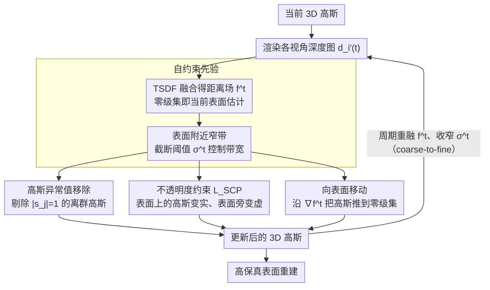

# 3D Gaussian Splatting with Self-Constrained Priors for High Fidelity Surface Reconstruction

**会议**: CVPR 2026  
**arXiv**: [2603.19682](https://arxiv.org/abs/2603.19682)  
**代码**: [https://github.com/takeshie/GSPrior](https://github.com/takeshie/GSPrior)  
**领域**: 3D视觉  
**关键词**: 3D Gaussian Splatting, 表面重建, TSDF, 自约束先验, 几何约束

## 一句话总结
提出自约束先验（Self-Constrained Prior），通过融合当前3D高斯渲染的深度图构建TSDF距离场，以此为先验对高斯施加几何感知约束（异常值移除、不透明度约束、向表面移动），实现高保真表面重建，在NeRF-Synthetic和DTU上达到SOTA。

## 研究背景与动机

**领域现状**：3DGS在新视角合成中速度和视觉保真度均优于NeRF，但几何恢复精度仍有明显不足。现有方法要么用多视图一致性约束深度、要么用隐式场约束高斯运动、要么依赖数据驱动的预训练先验。

**现有痛点**：这些策略要么无法直接在3D高斯上施加约束，要么不能以几何感知的自适应方式工作。依赖外部先验的方法在复杂或未见场景上泛化性差，导致伪影和几何质量下降。

**核心矛盾**：渲染质量需要高自由度的高斯表示，但几何精度需要严格的几何约束。如何不依赖外部先验，在两者之间找到平衡？

**本文切入点**：观察到当前渲染的深度图本身就蕴含表面估计信息，可以融合为TSDF距离场作为"自约束先验"，无需外部数据驱动先验。

**核心idea**：从渲染深度图自动生成TSDF距离场，定义表面附近的窄带，在窄带内对高斯施加三种几何约束，并周期性更新先验、逐步缩小窄带实现coarse-to-fine优化。

## 方法详解

### 整体框架
论文想解决的是 3DGS「看得好、量不准」的老问题：高斯表示自由度高、渲染漂亮，但几何精度始终差一截，而以往要修这个毛病要么得引入外部数据驱动的先验、要么得额外学一个隐式场来牵着高斯走。本文换了个思路——既然当前这组高斯渲染出来的深度图本身就估出了一张粗糙的表面，那就把它当成「自己约束自己」的先验。整条流水线是一个闭环：用当前高斯渲染各视角深度图 $\{d_i'(t)\}$，把它们融合成一张 TSDF 距离场栅格 $f^t$，零级集就是当前估计的表面；随后在这张距离场指引下对高斯做三件几何上的事——剔除离群点、按到表面的距离拉不透明度、把高斯往表面推；优化推进一段后再用更新过的深度重融一次 $f^t$、并把约束作用的窄带收窄一点，于是先验越来越准、约束越来越紧，整体呈 coarse-to-fine 收敛。

### 关键设计

**1. 自约束先验：把渲染深度融成 TSDF 距离场，自己给自己当先验**

外部先验在复杂或没见过的场景上泛化差，是几何质量掉点的主因。本文索性不借外力，直接对当前渲染出的各视角深度 $\{d_i'(t)\}$ 做 TSDF 融合，得到距离场 $f^t = \mathcal{F}(\{d_i'(t)\})$，它的零级集就是这一刻对表面的估计。距离场在零级集两侧划出一条窄带，有符号距离被归一化到 $[-1, 1]$，截断阈值 $\sigma^t$ 决定窄带的物理宽度——后续所有几何约束都只在这条窄带里生效。关键在于这个先验不是一次性的：优化每推进一段就用最新、更一致的多视图深度重融一次 $f^t$，同时把 $\sigma^t$ 调小让窄带收窄。先验自身在变准、约束作用范围在收紧，几何精度就靠这个自举循环一点点抬上去，而不用任何外部数据。

**2. 高斯异常值移除：把跑到窄带外的离群高斯直接删掉**

漂在表面之外的离群高斯会污染深度渲染，反过来又让融出来的 $f^t$ 变脏。处理方式很直接：在每个高斯中心 $\mu_j$ 处对距离场插值，读出它的有符号距离 $s_j = f^t(\mu_j)$；只要 $|s_j| = 1$，说明这个高斯已经压在窄带边界（也就是离表面太远），就把它剔除。删掉这批离群点后高斯分布更紧凑地贴住表面，下一轮渲染的深度也更干净，等于把先验和约束都往好的方向推了一把。

**3. 不透明度约束：按到表面的距离，逼表面上的高斯变实、表面旁的高斯变虚**

这是本文的核心创新，目的是逼出一条清晰的表面界线。借着距离场，窄带内的高斯被分成压在表面上的子集 $\mathcal{N}_{on} = \{g_j : |s_j| \leq \delta^t\}$ 和偏离表面的子集 $\mathcal{N}_{off} = \{g_j : \delta^t < |s_j| \leq 1\}$，前者被督促把不透明度推到 1、后者被压向 0：

$$L_{SCP} = \frac{1}{M}\left(\sum_{g_k \in \mathcal{N}_{on}} \varepsilon_k (o_k - 1)^2 + \sum_{g_{k'} \in \mathcal{N}_{off}} \varepsilon_{k'} o_{k'}^2\right)$$

其中距离加权 $\varepsilon_j = 1/(1+|s_j|)^2$ 让越靠近表面的高斯权重越大，约束自动聚焦在表面带上。和 GOF / GSDF 那种「直接学一个从 SDF 到不透明度的映射」不同，这里没有去拟合固定函数，而是借实时更新的距离场施加几何感知、随窄带收窄而自适应的软约束，所以能跟着优化过程不断收紧表面。

**4. 向表面移动：用距离场梯度把高斯整体推到表面上**

光靠不透明度还不够把位置摆正，还得让高斯几何上就站到表面附近。距离场的梯度天然指向「离开表面最快的方向」，于是用有限差分算出 $\nabla f^t(\mu_j)$，再沿它把高斯往零级集投：

$$\mu_j \leftarrow \mu_j - s_j \cdot \nabla f^t(\mu_j)$$

$s_j$ 是带符号的，所以位于表面两侧的高斯会被分别拉回。这一步不塞进梯度反传的迭代优化里、而是作为一次显式的位置更新，在密度增加（densification）之后执行——这样比让它参与连续优化更稳定，不会和 RGB/深度等其它损失互相拉扯。

### 损失函数 / 训练策略

完整目标函数：$L = L_{RGB} + \lambda_1 L_{Depth} + \lambda_2 L_{NS} + \lambda_3 L_{NM} + \lambda_4 L_{SCP}$

- $L_{RGB}$：MAE + SSIM + NCC 的渲染误差
- $L_{Depth}$：射线上深度分布一致性约束
- $L_{NS}$：渲染法向与深度推导法向一致性
- $L_{NM}$：基于单应矩阵的跨视图几何一致性
- $L_{SCP}$：自约束先验的不透明度约束

超参数：$\lambda_1=0.01, \lambda_2=0.1, \lambda_3=0.1, \lambda_4=0.01$

约束调度：每迭代施加 $L_{SCP}$；密度增加后先执行向表面移动，再执行异常值移除。

## 实验关键数据

### 主实验（NeRF-Synthetic）

| 方法 | 类别 | CD$_{L1}$(×100)↓ | PSNR↑ |
|------|------|-------------------|-------|
| NeuS | 隐式 | 2.33 | 30.20 |
| NeRO | 隐式 | 1.92 | 27.48 |
| VolSDF | 隐式 | 2.86 | 27.96 |
| 2DGS | 显式 | 2.26 | 33.07 |
| GS-UDF | 显式 | 2.25 | 33.37 |
| GS-Pull | 显式 | 2.31 | 33.29 |
| PGSR | 显式 | 2.18 | 34.05 |
| QGS | 显式 | 2.04 | 30.41 |
| **Ours** | 显式 | **1.87** | **34.21** |

DTU数据集平均CD：**0.50**（PGSR为0.53，QGS为0.54，2DGS为0.80），训练时间42min。

### 消融实验（DTU Mean CD）

| 配置 | Mean CD |
|------|---------|
| 完整模型 | **0.50** |
| 无自约束先验 $f^t$ | 性能下降 |
| 无 $L_{SCP}$ 约束 | 不透明度约束缺失导致精度受损 |
| 不进行周期更新 | 固定先验无法适应优化过程 |
| 无异常值移除 | 离群高斯影响渲染 |
| 无向表面移动 | 高斯未聚焦于表面 |

从可视化来看：移除约束显著减少离群高斯→移动约束进一步将高斯聚焦到表面→完整模型综合效果最优。

### 关键发现
- 本文在Chamfer距离上同时超越所有隐式和显式方法，且PSNR最高（34.21），几何精度和渲染质量双优
- TNT数据集F1=0.51（显式方法最高），Mip-NeRF360上渲染指标也有竞争力
- 训练时间42min，相比隐式方法（>12h）效率优势明显

## 亮点与洞察
- **自约束范式**：首次将渲染结果的TSDF作为约束信号来源，避免对外部先验的依赖。这一"自监督几何约束"的思想可迁移到其他显式/隐式表示方法
- **距离加权的非对称约束**：权重函数 $\varepsilon_j = 1/(1+|s_j|)^2$ 让约束自动关注表面附近的高斯，表面上督促高不透明度、表面附近督促低不透明度，比对称约束更有效
- **渐进式细化策略**：周期性更新先验+逐步缩小带宽，类似课程学习，避免过早的严格约束影响优化

## 局限与展望
- 主要在非透明场景上验证，对透明或半透明材质的效果未知
- TNT上的性能相比NeRF-Synthetic略低，大规模场景的TSDF融合精度可能有限
- 早期训练阶段深度图质量较差可能误导优化，虽有周期更新缓解但初始化策略仍可优化
- 可探索多尺度TSDF金字塔结构、与隐式表示的联合学习、以及向动态场景的扩展

## 相关工作与启发
- **vs GS-Pull/GS-UDF**: 它们需要额外学习隐式场（UDF）来约束高斯，而本文直接从渲染深度生成先验，无需额外学习模块
- **vs PGSR**: PGSR用多视图depth-normal一致性约束，本文融合多视图深度形成统一TSDF先验，约束方式更几何感知
- **vs SuGaR/2DGS**: 它们约束高斯为2D平面元(surfel)，本文保持3D高斯自由度，用TSDF先验而非形状约束

## 评分
- 新颖性: ⭐⭐⭐⭐ 自约束先验思想新颖，但TSDF融合本身是成熟技术
- 实验充分度: ⭐⭐⭐⭐⭐ 四个标准基准、充分消融、定量+定性结果完整
- 写作质量: ⭐⭐⭐⭐ 逻辑清晰，公式推导完整
- 价值: ⭐⭐⭐⭐⭐ 解决3DGS核心痛点（几何精度），方法可迁移性强

<!-- RELATED:START -->

## 相关论文

- [\[CVPR 2026\] Neural Gabor Splatting: Enhanced Gaussian Splatting with Neural Gabor for High-frequency Surface Reconstruction](neural_gabor_splatting.md)
- [\[CVPR 2026\] HyperGaussians: High-Dimensional Gaussian Splatting for High-Fidelity Animatable Face Avatars](hypergaussians_high-dimensional_gaussian_splatting_for_high-fidelity_animatable_.md)
- [\[CVPR 2026\] InstantHDR: Single-forward Gaussian Splatting for High Dynamic Range 3D Reconstruction](instanthdr_singleforward_gaussian_splatting_for_hi.md)
- [\[AAAI 2026\] SparseSurf: Sparse-View 3D Gaussian Splatting for Surface Reconstruction](../../AAAI2026/3d_vision/sparsesurf_sparse-view_3d_gaussian_splatting_for_surface_reconstruction.md)
- [\[CVPR 2026\] AnchorSplat: Feed-Forward 3D Gaussian Splatting with 3D Geometric Priors](anchorsplat_feed-forward_3d_gaussian_splatting_with_3d_geometric_priors.md)

<!-- RELATED:END -->
