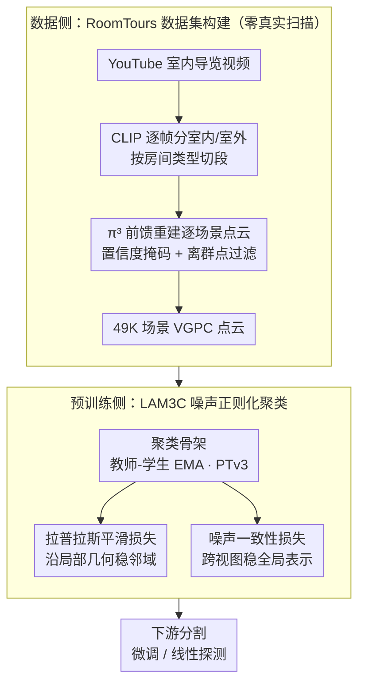

# 3D sans 3D Scans: Scalable Pre-training from Video-Generated Point Clouds

**会议**: CVPR 2026  
**arXiv**: [2512.23042](https://arxiv.org/abs/2512.23042)  
**代码**: [https://github.com/ryosuke-yamada/lam3c](https://github.com/ryosuke-yamada/lam3c)  
**领域**: 3D视觉 / 自监督学习  
**关键词**: 3D自监督学习, 视频生成点云, Sinkhorn-Knopp聚类, 噪声正则化, 室内场景理解

## 一句话总结
提出LAM3C框架，首次证明从无标注网络视频（房产导览等）重建的视频生成点云(VGPC)可替代真实3D扫描进行3D自监督预训练，通过拉普拉斯平滑损失和噪声一致性损失稳定噪声点云上的表示学习，配合自建RoomTours数据集(49K场景)在室内语义和实例分割上匹配甚至超越使用真实扫描的方法。

## 研究背景与动机

**领域现状**：2D视觉基础模型(DINOv2等)受益于海量无标注图像(17亿+)取得了显著成功，但3D数据受限于3D扫描的高昂设备和人工成本——目前最大的室内场景数据集仅约5K个独特场景。

**现有痛点**：即使Sonata等最先进的3D-SSL方法混合真实和合成数据，训练规模也仅~140K样本（其中真实3D扫描仅18K）。这种有限的数据规模使3D-SSL无法达到2D视觉同等的成功水平。数据瓶颈是3D自监督学习进步的根本限制。

**核心矛盾**：3D场景数据稀缺且获取昂贵 vs 3D-SSL需要大规模数据才能像2D-SSL一样成功。

**关键观察**：YouTube等平台上有海量的室内导览视频（房产广告、公寓展示）。近期前馈式3D重建模型（如π³和VGGT）可从多视图图像直接推断3D结构，质量可媲美传统SfM/MVS方法。

**核心idea**：(1) 从网络视频重建大规模视频生成点云(VGPC)数据集RoomTours(49K场景)——完全不使用真实3D扫描；(2) 设计噪声正则化的聚类预训练框架LAM3C——使在不完美/噪声点云上的表示学习变得可行且稳定。

## 方法详解

### 整体框架
这篇论文想绕开"3D 扫描太贵、场景太少"这个死结：与其花钱采集真实扫描，不如把 YouTube 上海量的室内导览视频（房产广告、公寓展示）当成免费的 3D 数据矿，用前馈重建模型把视频直接变成点云来做预训练。难点在于这种"视频生成点云"(VGPC)天然带噪——相机抖动处模糊、墙壁地板会重叠、还有大片缺失区域，标准的 3D 自监督聚类一上来就会被噪声带崩。

整条流水线分两半。前半是数据侧：用关键词搜来的导览视频先经 CLIP 逐帧分出室内/室外、再按房间类型切段，然后送进 π³ 前馈重建逐场景生成带颜色的点云，过滤离群点后得到 49,219 个场景的 RoomTours 数据集——全程不碰任何真实扫描。后半是预训练侧：在这些噪声点云上用教师-学生聚类做表示学习，并额外挂两个针对噪声的正则项（拉普拉斯平滑稳局部、噪声一致性稳全局），最后把学到的 PTv3 backbone 拿去做下游分割的微调或线性探测。

### 关键设计

**1. RoomTours 数据集构建：把无标注网络视频变成大规模 3D 点云**

3D-SSL 的瓶颈是数据——最大的室内场景集也才约 5K 个独特场景。本文的破局点是把 YouTube 导览视频当数据源：先用多城市关键词("city, real-estate, walk-through")搜频道、手动筛选后再自动按时长和元数据过滤掉 CG/无人机/短视频，攒到 3,462 支视频，并补上 RealEstate10k、YouTube House Tours、HouseTours。接着用 CLIP 对每帧做零样本分类区分室内/室外，对室内帧再按场景类型（客厅/卧室/卫生间）检测边界来切段，并做 0.5 秒的时间一致性平滑避免抖动误切。每段视频送进 π³ 前馈重建（均匀采样帧、单精度混合前向），再用置信度掩码、边缘抑制和离群点移除清理，输出带颜色的 3D 点云。最终得到 49,219 个 VGPC 场景，平均约 5 分钟/场景。它们视觉上已经接近真实扫描，但仍保留相机抖动区域的模糊、墙面地面的重叠以及缺失区域——正是后面正则化要对付的噪声来源。

**2. LAM3C 聚类骨架：在噪声点云上做教师-学生表示学习**

预训练采用教师-学生架构，教师由学生的 EMA 缓慢更新。基础的聚类目标由三项组合而成：

$$\mathcal{L}_{clustering} = w_u\mathcal{L}_{unmask} + w_m\mathcal{L}_{mask} + w_r\mathcal{L}_{roll}$$

其中 unmask 项把学生的局部特征对齐到教师的全局特征（靠 kNN 匹配建立对应），mask 项把教师全局特征蒸馏到学生的掩码全局特征，roll-mask 项交换全局视图以保证跨视图一致，三者权重为 4:2:2。这套聚类沿用了 Sonata 式的多级思路，但如果直接照搬到 VGPC 上，点级嵌入会因为噪声剧烈波动、训练直接发散——这正是下面两个正则项要解决的，它们也是 LAM3C 区别于既有 3D-SSL 的核心。

**3. 拉普拉斯平滑损失：沿局部几何把噪声点"拉回"邻居**

第一类不稳定来自局部：噪声点的嵌入和它空间上的邻居差得很远。本文在 VGPC 上建 kNN 图，给每条边按距离加权

$$w_{ij} = \exp\!\left(-\|p_i-p_j\|^2/\sigma^2\right)$$

$\sigma$ 自适应取 kNN 距离的中位数，再用这个权重鼓励空间邻近点产生相似嵌入：

$$R_{Lap} = \sum_{(i,j)\in E} w_{ij}\|z_i-z_j\|^2$$

距离过远的邻居会被截断以增强鲁棒性，实际实现还用 Huber 惩罚替代 L2 来抗离群。妙处在于权重 $w_{ij}$ 随距离指数衰减：真正的噪声点往往离正常邻居更远、权重更小，因此它对损失的拉扯被自动削弱，特征沿局部几何被平滑而不会被坏点带跑。

**4. 噪声一致性损失：同一点在不同噪声视图下要给出同一答案**

第二类不稳定来自全局：同一个场景换一种增强、换一份噪声，表示就漂了。本文对同一 VGPC 生成两个增强视图 $x^{(a)}, x^{(b)}$，分别喂给 EMA 教师和学生，要求 kNN 对应点集 $\mathcal{P}$ 上的嵌入一致：

$$R_{cons} = \frac{1}{|\mathcal{P}|}\sum_{(i,j)\in\mathcal{P}}\big\|g_{EMA}(x^{(a)})_j - f_\theta(x^{(b)})_i\big\|^2$$

这等于强迫模型对"同一个点、不同噪声实现"输出稳定表示，把全局表示锚住。它和拉普拉斯平滑正好互补——后者靠局部几何关系稳住邻域，前者靠跨视图一致性稳住整场，两者都只用点与点之间的关系结构，不依赖任何手工的室内场景先验，所以能泛化到任意不完美点云。最终目标把三者合在一起：

$$\mathcal{L}_{total} = \mathcal{L}_{clustering} + \lambda R_{Lap} + \mu R_{cons}$$

训练时 $\lambda$ 从 2e-4 线性增到 3e-3（让正则化逐步加强，避免一开始压得太死），$\mu$ 固定 0.05。

### 损失函数 / 训练策略
backbone 用 PTv3（Base/Large 两档），预训练最长跑 437K 步，聚类同时用掩码全局视图和未掩码局部视图做多级对齐。总损失即上面的 $\mathcal{L}_{total}$，由聚类项加两个噪声正则项构成。

## 实验关键数据

### 主实验（室内语义分割mIoU，PTv3 Base, 100 epochs）

| 方法 | 预训练数据 | ScanNet LP | ScanNet FT | ScanNet200 FT | S3DIS FT |
|------|-----------|:---:|:---:|:---:|:---:|
| PTv3 (无预训练) | - | 16.1 | 74.7 | 32.0 | 67.8 |
| MSC | 真实7K | 21.8 | 78.2 | 33.4 | 69.9 |
| Sonata (仅真实15K) | 真实15K | 69.4 | 78.5 | 35.3 | 75.2 |
| Sonata (全部) | 真实18K+合成121K | **72.5** | 79.4 | 36.8 | **76.0** |
| LAM3C (16K VGPC) | **零真实** | 58.9 | 75.6 | 32.8 | 71.9 |
| LAM3C (49K VGPC) | **零真实** | 66.0 | 77.7 | 35.1 | 72.9 |
| **LAM3C* (49K, Large)** | **零真实** | 69.5 | **79.5** | 35.9 | 75.5 |

LAM3C*(PTv3 Large+437K步)不使用任何真实3D扫描即在ScanNet FT上达79.5%，**匹配Sonata(18K真实+121K合成)的79.4%**。

### 实例分割结果
S3DIS实例分割上LAM3C超越仅使用真实扫描训练的Sonata-real。

### 消融实验（ScanNet LP/FT，PTv3 Base）

| 配置 | ScanNet LP | ScanNet FT | 说明 |
|------|:---:|:---:|------|
| 仅聚类损失 | 不稳定 | 不稳定 | VGPC噪声导致学习崩溃 |
| +拉普拉斯平滑 | +大幅提升 | +提升 | 局部特征稳定化 |
| +噪声一致性 | +进一步提升 | +提升 | 全局表示稳定化 |
| 16K VGPC | 58.9 | 75.6 | 数据规模影响 |
| **49K VGPC** | **66.0** | **77.7** | 数据量增3倍→LP提升7 mIoU |

### 关键发现
- **零真实扫描即可匹配/超越使用真实扫描的方法**：这是最核心的发现——VGPC作为3D-SSL的替代数据源不仅可行，而且在规模+模型容量够大时可匹配SOTA
- **数据规模至关重要**：16K→49K VGPC在线性探测上提升7个mIoU——3D-SSL也遵循"数据越多越好"的规律
- **两个正则化缺一不可**：仅聚类损失在VGPC上训练不稳定，拉普拉斯平滑和噪声一致性各自独立贡献且互补
- ScanNet 10%标注微调下LAM3C性能即超越使用真实扫描训练的方法（图1左验证）
- 实例分割上LAM3C同样具有竞争力

## 亮点与洞察
- **"3D无需3D扫描"的范式突破**：根本性地改变了3D预训练的数据获取路径。YouTube视频是几乎无限的3D数据源——49K只是开始，100K+甚至更大规模完全可行
- **噪声正则化的通用设计**：拉普拉斯平滑(基于点云局部几何结构)+噪声一致性(基于跨视图全局一致)不依赖室内场景先验，可泛化到任何不完美点云的自监督学习
- **前馈重建模型的新应用**：π³/VGGT等模型原本用于重建本身，LAM3C首次将其输出作为3D-SSL的预训练数据——扩大了重建模型的应用范围
- **对2D-3D关系的新理解**：视频蕴含的3D几何信息足以支撑3D表示学习，这为2D-3D联合预训练提供了新思路

## 局限与展望
- VGPC的噪声和缺失区域仍限制性能上界——更好的前馈重建模型(如VGGT的后续版本)可能进一步提升质量
- RoomTours仅覆盖室内场景——室外场景的VGPC质量可能更差（大尺度、动态物体多、光照变化大）
- 视频收集依赖YouTube搜索关键词→数据分布可能偏向特定地域和房产类型
- 更大规模(100K+)的VGPC数据集和更长训练schedule可能释放更多潜力
- 可探索视频中的时间信息（相邻帧的时间一致性）作为额外预训练信号

## 相关工作与启发
- **vs Sonata**: Sonata依赖真实+合成3D扫描(18K+121K)，LAM3C完全不用3D扫描→可扩展性更强。当规模和模型容量足够时性能匹配
- **vs PointContrast/MSC**: 早期3D-SSL方法受限于更小数据规模(1K-7K真实扫描)
- **vs PPT**: PPT使用合成数据且带监督信号，LAM3C纯自监督
- **vs π³/VGGT重建模型**: 这些是3D重建工具，LAM3C首次将重建产物作为3D-SSL预训练数据
- **启发**：多模态（2D视觉+3D几何）联合预训练可能是下一步——视频帧的2D特征和重建的3D结构互补

## 评分
- 新颖性: ⭐⭐⭐⭐⭐ "3D无需3D扫描"的范式突破，pipeline完整创新
- 实验充分度: ⭐⭐⭐⭐⭐ 4个数据集、语义+实例分割、线性探测+微调、数据规模消融、正则化消融
- 写作质量: ⭐⭐⭐⭐⭐ 动机清晰、pipeline描述完整、可视化直观
- 价值: ⭐⭐⭐⭐⭐ 解除了3D数据瓶颈，对3D视觉领域有范式影响

<!-- RELATED:START -->

## 相关论文

- [\[CVPR 2026\] Vista4D: Video Reshooting with 4D Point Clouds](vista4d_video_reshooting_with_4d_point_clouds.md)
- [\[CVPR 2026\] Low-Rank Test-Time Training for Pre-Trained Point Cloud Models](low-rank_test-time_training_for_pre-trained_point_cloud_models.md)
- [\[CVPR 2026\] E-RayZer: Self-supervised 3D Reconstruction as Spatial Visual Pre-training](e-rayzer_self-supervised_3d_reconstruction_as_spatial_visual_pre-training.md)
- [\[CVPR 2026\] Learning to Infer Parameterized Representations of Plants from 3D Scans](learning_to_infer_parameterized_representations_of_plants_from_3d_scans.md)
- [\[CVPR 2026\] GaussianGrow: Geometry-aware Gaussian Growing from 3D Point Clouds with Text Guidance](gaussiangrow_geometry-aware_gaussian_growing_from_3d_point_clouds_with_text_guid.md)

<!-- RELATED:END -->
