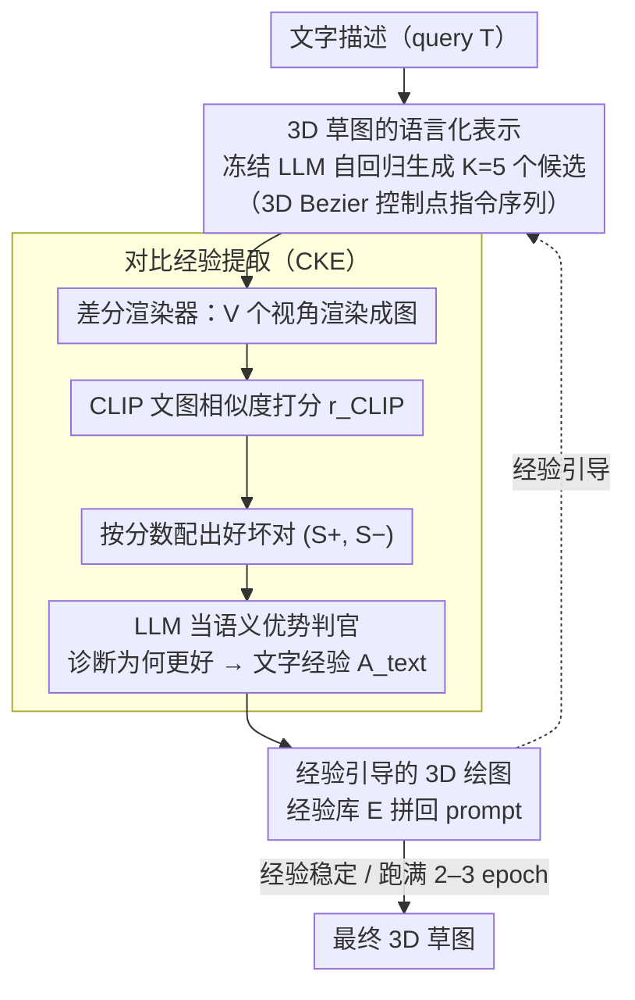

# 3DrawAgent: Teaching LLM to Draw in 3D with Early Contrastive Experience

**会议**: CVPR 2026  
**arXiv**: [2604.08042](https://arxiv.org/abs/2604.08042)  
**代码**: 无（基于LLM API）  
**领域**: 3D视觉 / 生成式AI  
**关键词**: 3D草图生成, LLM, 免训练, 对比经验优化, Bezier曲线

## 一句话总结
提出免训练的 3DrawAgent 框架，让冻结的 LLM 通过"对比经验优化"（contrastive experience optimization）自我学习3D空间推理，以自回归方式生成语言驱动的3D Bezier草图，无需参数更新即可达到接近有训练方法的水平。

## 研究背景与动机
**领域现状**：语言驱动的2D草图生成已有进展（如SketchAgent），但3D草图生成仍未被探索。现有3D形状生成方法（扩散/神经隐式方法）需要显式几何监督或大量训练。

**现有痛点**：
   - 扩散式3D草图方法（Diff3DS, Dream3DVG）依赖 SDS 优化，计算密集
   - SketchAgent 仅限2D坐标空间，无法推理深度和投影
   - Training-free GRPO 依赖标量奖励或GT参考，不适用于开放式创作任务

**核心idea**：LLM 本身具有强大的序列推理能力，通过精心设计的 in-context prompt + 自我对比反馈，可以"教"LLM 进行3D绘图，完全无需梯度更新。

## 方法详解

### 整体框架
3DrawAgent 要解决的问题是：在不更新任何参数的前提下，让一个冻结的 LLM 学会从文字描述画出 3D 草图。它的做法是把"画 3D 草图"翻译成 LLM 擅长的文本生成任务——LLM 自回归地吐出一串 3D Bezier 曲线的控制点，差分渲染器把这串曲线从多个视角渲染成图，再用 CLIP 和 LLM 自己给这些图打分、挑出好坏样本。整套流程的关键不在某一次生成，而在于它把"好在哪、坏在哪"的判断结果沉淀成一个不断增长的经验库，下一轮生成时把这些经验塞回 prompt，于是 LLM 一轮比一轮画得好——梯度被"读经验"替代了。

### 关键设计

**1. 3D 草图的语言化表示：把几何问题搬进 LLM 熟悉的文本空间**

3D 形状生成通常要做跨模态转换（文本→几何监督→渲染），而 LLM 的强项是序列推理。这个设计干脆让 LLM 始终在文本里工作：每一笔都写成一条结构化指令 $a_t = \text{draw\_bezier}[(\mathbf{P}^{(0)}, \mathbf{P}^{(1)}, \mathbf{P}^{(2)}, \mathbf{P}^{(3)})]$，其中每个控制点 $\mathbf{P}^{(k)} \in \mathbb{R}^3$ 是一个三维坐标，整张草图就是一段动作序列 $\mathcal{A} = \{a_1, \dots, a_N\}$。为了让 LLM 输出合法、可渲染的坐标，prompt 里要写清角色指令、输出格式规范、数据类型约束、坐标系定义、一个 GT 示例和边界规则。这样 LLM 既不用学新模态，也不用接几何解码器，画图退化成它本来就会的"按格式续写"。

**2. 对比经验提取（CKE）：用成对好坏样本代替梯度和奖励标量**

这是全文核心。免训练的 GRPO 类方法要么依赖标量奖励、要么需要 GT 参考，对开放式创作并不适用。CKE 把它推广到成对对比设置：对每个查询先采 $K=5$ 个候选草图，用 CLIP 在 $V$ 个视角上算文图相似度作为质量分

$$r_{\text{CLIP}} = \frac{1}{V}\sum_{v=1}^{V} \cos\!\big(E_I(I_v),\, E_T(\mathcal{T})\big)$$

然后按分数配出对比对 $(\mathcal{S}_i^+, \mathcal{S}_j^-)$（满足 $r_i > r_j$），交给 LLM 当"语义优势判官"去分析为什么这张比那张好——是曲率更连续、还是结构更对称。LLM 输出的文字诊断 $A^{\text{text}}$ 被沉淀进经验库 $\mathcal{E} \leftarrow \text{Update}(\mathcal{E}, A^{\text{text}})$。整个回路既不需要 GT 3D 草图、也不需要反向传播，更不需要结构化的 group rollout，全部靠 LLM 自己读图、自己讲理由完成。

**3. 经验引导的 3D 绘图：把沉淀的经验当 prompt 喂回去，让改进可累积**

光提取经验不够，还要让它影响下一轮生成。这里把经验库 $\mathcal{E}$ 直接拼进 context window 作为额外 prompt 段，生成分布变成以经验为条件 $o = p_\theta(o \mid \mathcal{T}, \mathcal{E})$。经验里编码的是可迁移的几何原则（曲率连续性、对称拓扑保持等），不绑定具体物体，所以随着轮次积累，LLM 会逐步把这些 3D 感知策略内化成默认行为——这正是"无梯度也能进步"的来源。

### 一个完整示例：从一句描述到逐轮变好

以"画一把椅子"为例走一遍。第 0 轮经验库为空，LLM 凭裸 prompt 画，CLIP-ST 只有 0.5735，画出的腿和靠背比例失衡。进入 CKE：这一轮采 5 个候选，CLIP 把它们排序，挑出最高分和最低分配成一对喂给 LLM 当判官，LLM 诊断出"低分那张四条腿不等长、坐面没闭合"，把"保持腿对称、坐面拓扑闭合"写进经验库。第 1 轮带着这条经验再画，分数跳到 0.6461；第 2 轮经验进一步覆盖控制点精度和格式自检，分数到 0.6643 的峰值。但到第 3 轮，LLM 开始"过度推理"、对经验过拟合，分数回落到 0.6428——这也是为什么实践中跑 2–3 个 epoch 就停。

### 损失函数 / 训练策略
- **完全免训练**：冻结 LLM（DeepSeek-V3.2-Exp / Gemini-2.5Pro），全程无参数更新
- 对比提取时温度 0.7 鼓励候选多样性，推理生成时温度 0.3 追求质量稳定
- 经验提取约 2–3 个 epoch 到最佳，之后因 LLM 过度推理而轻微下降
- 仅需单张 RTX 3090（主要算力消耗在 LLM API 调用）

## 实验关键数据

### 主实验

| 方法 | 需训练 | CLIP-ST (类别) | AES (类别) | CLIP-ST (细粒度) | AES (细粒度) |
|------|--------|------|------|------|------|
| Diff3DS | ✓ | 0.648 | 3.791 | 0.650 | 3.770 |
| Dream3DVG | ✓ | 0.660 | 4.150 | 0.670 | 4.174 |
| **3DrawAgent (Gemini)** | **✗** | **0.649** | **4.161** | **0.669** | **4.175** |

### 消融实验

| 配置 | Ep0 | Ep1 | Ep2 | Ep3 | 说明 |
|------|-----|-----|-----|-----|------|
| 无CKE（基线） | 0.5735 | - | - | - | 无经验底线 |
| 有CKE | 0.5735 | 0.6461 | **0.6643** | 0.6428 | 先升后降 |
| K=2 | 0.5735 | 0.5947 | 0.6493 | - | 对比不足 |
| K=5（默认） | 0.5735 | 0.6461 | **0.6643** | - | 最优平衡 |
| K=10 | 0.5735 | 0.6135 | 0.5612 | - | 噪声过多 |
| 无GT | 0.5735 | 0.6461 | **0.6643** | - | 不依赖GT |
| 有GT | 0.5735 | 0.6648 | 0.6552 | - | 初期更快但持续性略差 |

### 关键发现
- 免训练方法接近甚至媲美需训练的方法：CLIP-ST仅差0.001，AES接近
- CKE 有效：从0.5735提升到0.6643（+15.8%）
- 不需要GT参考：自监督信号（CLIP）足够有效
- 用户研究：46.66%偏好率显著领先 Dream3DVG（36.67%）和 Diff3DS（16.67%）
- 经验分析显示清晰的学习进程：基本形状构建 → 空间感知 → 控制点精度 → 格式自验证

## 亮点与洞察
- **新范式**：LLM 不仅是生成器也是评判者，通过自我批评实现自我提升，无需任何训练
- **经验进化有趣**：从几何正确性到空间表达力再到格式自验证，呈现出类人的学习曲线
- **实用性强**：仅需 LLM API + 单GPU，门槛极低
- 200次rollout的统计分析揭示了LLM生成3D内容的行为模式

## 局限与展望
- 经验在2-3 epoch后因"过度推理"出现性能下降，如何持续提升？
- 生成质量受限于 LLM 本身的空间推理能力上限
- Bezier曲线表示能力有限，复杂拓扑难以表达
- 对比评估依赖CLIP，而CLIP在3D草图评估上可能不够精确
- 生成速度受LLM API延迟限制

## 相关工作与启发
- 直接将 SketchAgent 的2D草图范式扩展到3D，是自然且优雅的推广
- Training-free GRPO → 对比经验优化的推广值得关注，可能适用于其他创作任务
- LLM作为3D空间推理器的潜力值得深入挖掘

## 评分
- 新颖性: ⭐⭐⭐⭐⭐ 免训练3D草图生成+对比经验优化，全新范式
- 实验充分度: ⭐⭐⭐⭐ 消融细致，统计分析有深度
- 写作质量: ⭐⭐⭐⭐ 方法清晰，但部分细节在附录
- 价值: ⭐⭐⭐⭐ 启发性强，但3D草图应用相对小众

<!-- RELATED:START -->

## 相关论文

- [\[CVPR 2026\] NTK-Guided Implicit Neural Teaching](ntk-guided_implicit_neural_teaching.md)
- [\[CVPR 2026\] ArtLLM: Generating Articulated Assets via 3D LLM](artllm_generating_articulated_assets_via_3d_llm.md)
- [\[AAAI 2026\] UniC-Lift: Unified 3D Instance Segmentation via Contrastive Learning](../../AAAI2026/3d_vision/unic-lift_unified_3d_instance_segmentation_via_contrastive_learning.md)
- [\[AAAI 2026\] NURBGen: High-Fidelity Text-to-CAD Generation through LLM-Driven NURBS Modeling](../../AAAI2026/3d_vision/nurbgen_high-fidelity_text-to-cad_generation_through_llm-driven_nurbs_modeling.md)
- [\[NeurIPS 2025\] Enhancing Multilingual LLM Pretraining with Model-Based Data Selection](../../NeurIPS2025/3d_vision/enhancing_multilingual_llm_pretraining_with_model-based_data_selection.md)

<!-- RELATED:END -->
