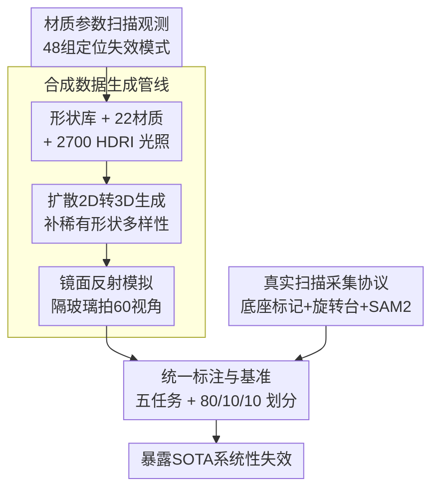

# 3DReflecNet: A Large-Scale Dataset for 3D Reconstruction of Reflective, Transparent, and Low-Texture Objects

**会议**: CVPR 2026  
**arXiv**: [2605.10204](https://arxiv.org/abs/2605.10204)  
**代码**: 无（论文称将随数据集与基线一起发布，仓库地址未在正文给出）  
**领域**: 3D视觉 / 数据集与基准  
**关键词**: 3D重建, 反光透明物体, 物理渲染, 多视图基准, 数据集

## 一句话总结
3DReflecNet 构建了一个超过 22 TB、含 12 万+ 合成实例与 1000+ 真实扫描、共 700 万+ 多视图帧的混合数据集，专门针对反光 / 透明 / 弱纹理这三类「打破光度一致性假设」的难材质，并配套五大任务基准；实验系统性地暴露出当前 SOTA 重建方法在这些材质上的崩溃式失效。

## 研究背景与动机

**领域现状**：多视图 3D 重建是机器人、AR/VR、自动驾驶、数字内容生产的底层能力。NeRF 系列与近年的 3D Gaussian Splatting（3DGS）把纹理充分、漫反射（Lambertian）表面的重建质量与渲染效率推到了很高水平。

**现有痛点**：一旦遇到镜面反射、透明折射或弱纹理表面，这些方法就大面积失效——同一点在不同视角下颜色/外观不一致，重建结果出现 floater、几何错位、渲染伪影。问题不在工程实现，而在两条几乎所有 SfM/MVS 流水线都默认成立的底层假设：（i）光度一致性（同一表面点在各视角下外观不变），（ii）跨视角可区分的外观特征。反光让外观随视角变（受 BRDF 支配），弱纹理让对应匹配缺少高频特征，透明则更彻底——折射直接破坏了多视图三角化所依赖的对极几何约束。

**核心矛盾**：算法假设（视角不变的类 Lambertian 表面）与真实光传输（视角相关、透射、折射）之间存在根本性错配。但现有数据集恰恰回避了这个错配：DTU、CO3D、MVImgNet 主打漫反射纹理物体；OpenMaterial 虽引入了基于实测折射率的物理渲染，却**纯合成、无真实噪声与运动、任务覆盖窄**。于是社区既缺乏量化「方法到底差在哪」的标尺，也缺乏训练「物理感知」新方法的素材。

**本文目标**：造一个同时满足「材质难、规模大、合成-真实混合、任务全」的数据集与基准，把这些系统性失效模式量化地摆出来。

**切入角度**：作者先做了一个控制变量实验（48 组材质参数扫描）证明失效是「系统性的、可被材质参数预测的」，而非偶发个例——这给「专门为难材质建数据集」提供了动机依据。

**核心 idea**：用「物理渲染合成 + 扩散生成补形状多样性 + 商用设备真实扫描」三路混合造数据，并把反光（隔玻璃拍）、透明、弱纹理这三类难材质显式纳入，配五任务标准基准，逼出现有方法的失效边界。

## 方法详解

### 整体框架
3DReflecNet 的「方法」其实是一条**数据集构建 + 基准评测**的流水线。两大子集——合成集与真实扫描集——通过统一的资产创建与标注流程汇入同一个基准。合成集在 Blender 里用物理渲染（PBR）把形状库与扩散生成的形状配上 22 种材质、2700+ HDRI 光照渲成照片级多视图；真实集用 iPhone 16 Pro 在旋转平台上扫描真实难材质物体。两者最终都被切成标准的「训练/验证/测试 = 80%/10%/10%」划分，喂给五个任务的基准：图像匹配、SfM、新视图合成（NVS）、反光去除、重打光。

### 关键设计

**1. 材质参数扫描：先量化「失效到底由什么驱动」**

数据集论文最怕「只堆素材、不讲为什么这些素材重要」。作者用一个干净的控制变量实验回答这个问题：固定一个模型，系统扫描四个关键 PBR 参数——metallic（0 或 1）、roughness（0–0.9）、IOR 折射率（1.0–1.9）、transmission（0 或 1），共 48 种配置；每组用 50 张带前景掩码的多视图训练 3DGS，在 10 张留出视图上算 PSNR。结论是失效**可被材质参数预测**，呈三种模式：① 光滑反光（roughness=0）的金属只有约 19 dB PSNR，而高粗糙度非金属约 35 dB，相差约 45%；② 低粗糙度让对应匹配「饿」于纹理线索，roughness 从 0.0 升到 0.9 时 PSNR 提升约 5 dB；③ 透明是最严重模式，平均带来 5.82 dB（约 19.3% 质量）下降，且折射率越大越糟——透明物体 PSNR 从 IOR=1.0 的 19.9 dB 升到 IOR=1.9 的 27.9 dB，证实折射越强越破坏对极几何。这个观测是整个数据集的立论基础：失效不是边角案例，而是源于过度简化的光传输模型的系统性问题。

**2. 统一资产创建管线：物理渲染 + 扩散生成双源补形状**

合成侧要同时保证「光学真实」与「形状多样」。作者一方面从扫描库与 3D 资产库收集 10K+ 高质量形状（覆盖艺术、工业、自然域），用 Blender 的 PBR 引擎渲染：22 种材质归为 Diffuse / Transparent / Metallic / Glossy-Textured / Glossy-Low-Texture 五组，配 2700+ HDRI 环境贴图（室内外、不同时段、不同天气）再加 1–2 个上半球点光源模拟局部照明；每个实例渲 60 个多视角、$1000\times1000$ 分辨率 RGB，并附点云/网格、分割掩码、稠密深度图、表面法向图等完整真值。另一方面，为了突破固定形状库的天花板，作者额外造了一条**扩散驱动的 2D→3D 生成**支线：把真实图片和 GPT-4o 生成的 2D 参考图，经估计法向与深度→重建网格→规整到标准位姿，生成 2K+ 日常物体形状，再丢进同一套 PBR+HDR 渲染流程。每个物体与不同材质/光照配对，最终堆出 120K+ 合成实例。

**3. 多视角镜面反射模拟：在物体和相机之间架一块玻璃**

镜面反射是「视角相关外观」最典型的难例，但以往工作（去反射数据）大多只在单角度、有限光照下隔玻璃拍一张。作者把这个 setup 扩成多视图：在物体与相机之间放一块玻璃板，玻璃反射周围环境，从 **60 个不同角度、数百种光照**下采集，系统化地生成复杂的视角相关反射效果。这样得到的数据天然违反光度一致性——同一物体点的成像里叠加了随视角漂移的环境反射，正是用来压测图像匹配 / SfM / NVS 的素材。

**4. 真实采集协议：把「位姿估计」从「难材质物体」上剥离**

真实扫描的核心难点是：反光/弱纹理物体本身缺乏稳定、视角不变的特征，标准相机位姿估计直接失败，没有可靠位姿就没有真值。作者的巧办法是把位姿估计任务和物体解耦：把目标物体放在一个**高度细节化的底座**上，底座充当稳定的跟踪标记，整套装置再放上旋转平台，保证平滑稳定的 360° 拍摄轨迹（iPhone 16 Pro，$1080\times1920$，30 FPS）。处理时先用 RealityScan 跟踪底座纹理估出鲁棒相机位姿，再用 SAM 2 把底座和背景分割掉。于是「难物体」也拿到了准确位姿，而它本身完全不参与位姿求解。最终真实集含 300+ 形状、>50 种材质、1000+ 实例。

**5. 五任务标准基准：把失效变成可比较的数字**

数据集要有用，必须配「怎么评」。作者在合成+真实场景上建了五个任务的基准并给出标准评测与基线：（i）光度不一致下的图像匹配（用 AUC@5°/10°/20°）；（ii）非 Lambertian / 弱纹理表面的 SfM（评相机参数恢复，刻意去掉背景防止背景特征「作弊」，逼方法只靠物体本征特征）；（iii）复杂材质下的 NVS（按五类材质分组报 PSNR）；（iv）反光与高光去除；（v）物体重打光。表面重建额外用 Chamfer Distance 评。这套基准的价值在于：它把「方法在难材质上更差」从定性印象变成了跨材质、跨任务的可对比数字。

### 一个完整示例：一件透明玻璃杯如何进入数据集并暴露问题
以一件透明物体为例走一遍流程：先从形状库（或扩散生成）取得网格 → 在 Blender 里赋予 Transparent 材质（高 transmission、给定 IOR）、配一张室外 HDRI + 点光 → 渲出 60 视角、$1000\times1000$ 的 RGB 加深度/法向/掩码真值 → 进入 NVS 基准按 80/10/10 划分。在评测里，3DGS 等方法在它身上只能拿到约 17–21 dB PSNR（远低于漫反射的 36+ dB），因为透射、折射、焦散彻底破坏了颜色一致性原则。这一条数字就直接落到 Table 4 的 Transparent 列，成为「现有方法在透明物体上崩溃」的证据。

## 实验关键数据

> 这是数据集/基准论文，「实验」即用主流方法在各任务上的基准结果，结论是「现有 SOTA 普遍失效」。

### 数据集规模与对比

| 维度 | 合成集 | 真实集 |
|------|--------|--------|
| #Shapes | 12K+ | 300+ |
| #Materials | 22 | >50 |
| #Lighting | 2700+ | 5 |
| #Instances | 120K+ | 1000+ |
| #Views/实例 | 60 | 100+ |
| #Frames | 7M+ | 120K+ |

相比同类数据集，3DReflecNet 是唯一同时勾选「Transparent + Reflection + Low-Texture + Relighting + PBR + 含真实数据」全部维度的：OpenMaterial（1001 实例）有反光但纯合成、任务窄；NeRO 仅 8 个实例；ABO/Objaverse 规模大却缺物理可信材质模拟。

### 图像匹配基准（Table 3，AUC↑；括号内斜体为 MegaDepth 上的对照）

| 方法 | AUC@5° | AUC@10° | AUC@20° |
|------|--------|---------|---------|
| SuperPoint + SuperGlue | 15.2 (49.7) | 31.0 (67.1) | 39.9 (80.6) |
| LoFTR | 19.8 (52.8) | 35.6 (69.2) | 39.2 (81.2) |
| ELoFTR | 21.3 (56.4) | 36.2 (72.2) | 41.9 (83.5) |
| ROMA（最佳） | **32.1 (62.6)** | **47.5 (76.7)** | **59.1 (86.3)** |

即便最强的 ROMA，在 3DReflecNet 上 AUC@5° 也只有 32.1，而它在 MegaDepth 上是 62.6——同一方法掉了近一半，说明难材质下建立准确对应有多难。

### 新视图合成（Table 4，分材质 PSNR↑）

| 方法 | Diffuse | Transparent | Metallic | Glossy-Textured | Glossy-Low-Tex |
|------|---------|-------------|----------|-----------------|----------------|
| Instant-NGP | 36.12 | 19.20 | 25.59 | 34.01 | 26.52 |
| 3DGS | 36.99 | 20.20 | 27.02 | 34.10 | 27.62 |
| Splatfacto | 37.32 | 21.31 | 28.61 | 34.21 | 28.01 |
| 2DGS | 36.77 | 17.12 | 28.46 | 34.42 | 27.97 |

所有方法在 Diffuse 上都 >36 dB，但到 Transparent 直接跌到 ~17–21 dB；Metallic、Glossy-Low-Texture 因强镜面反射也明显下滑。

### 表面重建（Table 5，Chamfer Distance↓）

| 方法 | Diffuse | Transparent | Metallic | Glossy-Textured | Glossy-Low-Tex |
|------|---------|-------------|----------|-----------------|----------------|
| 2DGS | 0.060 | 0.142 | 0.121 | 0.086 | 0.098 |
| PGSR | 0.062 | 0.502 | 0.412 | 0.162 | 0.228 |

Diffuse 上几何可靠三角化误差很小，但 PGSR 在 Transparent 上 CD 飙到 0.502（约为 Diffuse 的 8 倍），印证非 Lambertian 表面的几何崩溃。

### 关键发现
- **失效可被材质参数预测**：48 组扫描显示透明平均掉 5.82 dB（19.3%），光滑金属相对高粗糙非金属掉约 45%；折射率越高越差（透明 19.9→27.9 dB 随 IOR 1.0→1.9）。
- **透明是最致命模式**：它同时破坏光度一致性与「光直线传播」的几何假设，折射使对极约束失效，导致 NVS 与表面重建几乎全线崩。
- **弱纹理「饿死」匹配**：低粗糙度缺高频特征，roughness 0→0.9 带来约 5 dB PSNR 回升，说明纹理线索对对应匹配至关重要。
- **合成与真实结论一致**：反光去除、重打光、真实数据上 SOTA 同样表现差（细节在附录），佐证该基准的物理真实性，而非合成域特有的伪难度。

## 亮点与洞察
- **先证伪、再建库**：用 48 组干净的参数扫描把「难材质会失效」从口号变成可量化、可预测的规律，给数据集立了硬动机——这是数据集论文最该学的「motivation 要有数据支撑」。
- **隔玻璃拍 + 多视角**是个低成本却高保真的反光制造法：不需要复杂光场设备，把单角度去反射 setup 扩到 60 视角就拿到了视角相关反射素材，可直接迁移到任何想造「视角相关外观」数据的场景。
- **位姿与物体解耦的采集协议**最实用：用「高细节底座当跟踪标记 + 旋转台 + RealityScan 估位姿 + SAM 2 抠物体」绕开「难物体本身无法估位姿」的死结，是把难材质物体搬进真实数据集的通用工程范式。
- **扩散 2D→3D 补形状多样性**：用 GPT-4o 造 2D 参考再生成 3D，把数据集从「固定形状库」扩成「可生成式扩展」，并顺带留下文本描述/标签（Qwen3-VL 标注），为 text-to-3D 等生成任务埋了接口。

## 局限与展望
- **基准只跑现有方法、未提出新模型**：论文定位是「暴露失效 + 立标尺」，没有给出针对难材质的重建新算法，物理感知方法仍是 future work。
- **真实集相对小且光照单一**：真实集 #Lighting 仅 5，远不及合成集的 2700+，真实域的光照多样性是短板；真实位姿依赖底座标记，对「无法放底座」的物体不适用。
- **部分任务结果被压进附录**：反光去除、重打光、真实数据评测只在正文一句话带过，正文主要呈现匹配/SfM/NVS/表面重建，完整可比性需查 Suppl.。
- **扩散生成资产的几何真值可信度**：扩散 2D→3D 生成的网格本身可能含几何误差，作为「真值」评测重建时需谨慎。
- **改进思路**：可在此基准上引入 BRDF 感知 / 偏振 / 物理可微渲染先验的重建方法，并把材质参数扫描扩成「难度可控的课程式评测」。

## 相关工作与启发
- **vs OpenMaterial**：OpenMaterial 用实测折射率做物理渲染，是难材质合成数据的重要一步，但纯合成、无真实噪声与运动、任务窄（主要 NVS/几何）。本文同时给合成+真实，覆盖五任务，且显式纳入弱纹理与多视角反光。
- **vs DTU / Tanks and Temples / BlendedMVS**：这些经典 MVS 基准几何已知但以漫反射为主，无法暴露非 Lambertian 失效；3DReflecNet 把材质复杂度作为一等公民。
- **vs NeRO / MV Reflectance**：聚焦反光但物体多样性极小（NeRO 仅 8 个实例），难以支撑大规模基准；本文规模大两到三个数量级。
- **vs Objaverse / ABO**：形状/外观规模巨大，但缺乏物理可信的材质-光照模拟与统一多视图真值；本文以「物理真实 + 任务全」换「极致规模」。

## 评分
- 新颖性: ⭐⭐⭐⭐ 不是新算法，但「难材质 + 合成真实混合 + 五任务基准 + 用参数扫描立动机」的组合在数据集层面有清晰增量。
- 实验充分度: ⭐⭐⭐⭐ 覆盖匹配/SfM/NVS/表面重建多任务、多方法、分材质细评；扣分在反光去除/重打光/真实数据被压进附录。
- 写作质量: ⭐⭐⭐⭐ 动机—观测—构建—基准的逻辑链清晰，失效模式量化到位。
- 价值: ⭐⭐⭐⭐⭐ 难材质重建是真实痛点，22 TB 规模 + 五任务标准基准对推动物理感知 3D 视觉很有抓手价值。

<!-- RELATED:START -->

## 相关论文

- [\[CVPR 2026\] OLATverse: A Large-scale Real-world Object Dataset with Precise Lighting Control](olatverse_a_large-scale_real-world_object_dataset_with_precise_lighting_control.md)
- [\[CVPR 2026\] SpatialVID: A Large-Scale Video Dataset with Spatial Annotations](spatialvid_a_large-scale_video_dataset_with_spatial_annotations.md)
- [\[CVPR 2026\] Opti-NeuS: Neural Reconstruction for Dual-Layered Transparent and Opaque Objects](opti-neus_neural_reconstruction_for_dual-layered_transparent_and_opaque_objects.md)
- [\[CVPR 2026\] Ego-1K: A Large-Scale Multiview Video Dataset for Egocentric Vision](ego-1k_--_a_large-scale_multiview_video_dataset_for_egocentric_vision.md)
- [\[CVPR 2026\] SceneScribe-1M: A Large-Scale Video Dataset with Comprehensive Geometric and Semantic Annotations](scenescribe-1m_a_large-scale_video_dataset_with_comprehensive_geometric_and_sema.md)

<!-- RELATED:END -->
