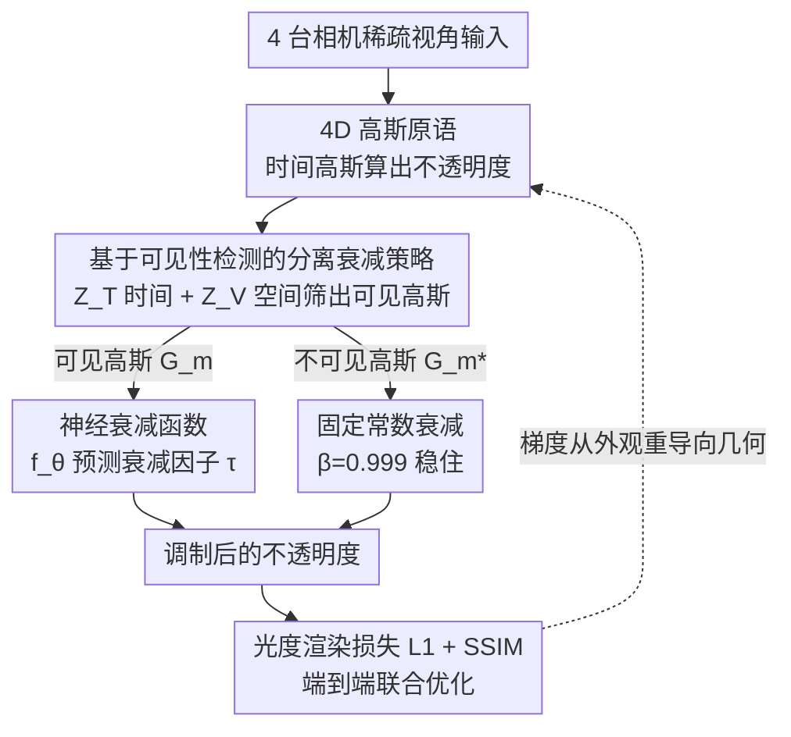

# 4C4D: 4 Camera 4D Gaussian Splatting

**会议**: CVPR 2026  
**arXiv**: [2604.04063](https://arxiv.org/abs/2604.04063)  
**代码**: [项目页](https://junshengzhou.github.io/4C4D)  
**领域**: 3D视觉  
**关键词**: 4D高斯溅射, 稀疏视角, 动态场景重建, 神经衰减函数, 几何-外观平衡

## 一句话总结
提出 4C4D 框架，通过神经衰减函数（Neural Decaying Function）自适应控制高斯不透明度衰减，解决稀疏（仅4个相机）4D高斯溅射中几何与外观学习的不平衡问题，在多个数据集上达到SOTA。

## 研究背景与动机
**领域现状**：4D动态场景的新视角合成需要密集相机阵列（数十到数百台），限制了日常使用。3DGS/4DGS在密集视角下表现出色。

**现有痛点**：极稀疏视角（如4台相机）下，4DGS严重失败。原因在于**优化偏差**：拟合外观（颜色）相对容易，但恢复准确几何（深度）在监督不足时极其困难。当前高斯公式无法平衡两者。

**核心矛盾**：稀疏视角下空间监督不足 → 几何学习不足 → 过拟合训练视点外观 → 新视点严重伪影。

**关键观察**：4DGS在训练视点上能准确复现外观，但深度几何一塌糊涂（见Fig.3），说明问题不在模型容量而在优化偏差。

**核心idea**：引入可学习的不透明度衰减函数，将优化梯度重新导向几何学习。

## 方法详解

### 整体框架
4C4D 想解决的是：只有 4 台相机时，4DGS 会把全部精力花在拟合训练视角的颜色上，几何（深度）几乎学不动，于是新视角一换就崩。它的做法不改 3D 表示本身，而是在每个 4D 高斯的不透明度上挂一个**可学习的衰减因子**，借此改变优化时梯度的流向。整条管线是：4D 高斯原语先按原本的时间高斯算出不透明度，神经衰减函数 $f_\theta$ 读入每个高斯的属性预测一个衰减因子 $\tau$ 去调制它，再叠加一层"只对当前可见高斯生效"的分离策略，最后仍用普通的光度渲染损失把衰减函数和 4D 高斯一起端到端优化。

### 关键设计

**1. 神经衰减函数：用一个轻量网络调制不透明度，把梯度从外观引回几何**

稀疏视角下监督太弱，外观（颜色）容易拟合、几何（深度）难恢复，4DGS 默认会走"最省力"的路——把训练视角的颜色背下来，结果几何一塌糊涂。这里的关键观察是：不透明度恰好是 4DGS 里几何学习的枢纽参数，谁该被看见、谁该被遮挡都由它决定。于是 4C4D 用一个轻量神经网络 $f_\theta$ 读入每个高斯的位置、不透明度、旋转，预测一个衰减因子 $\tau = f_\theta(x, y, z, o, r)$，再乘到原本的时间高斯不透明度上：

$$o(\tilde{t}) = \tau \cdot \exp\left(-\frac{1}{2}\frac{(\tilde{t} - \mu_t)^2}{\Sigma_{4,4}}\right) \cdot o$$

多出来的这个可学习自由度，让反向传播时梯度不再只盯着外观误差，而是更多地流向位置、尺度这些几何参数，从而把几何与外观的优化重新拉平。

**2. 基于可见性检测的分离衰减策略：只让当前看得见的高斯参与学习，看不见的稳住别动**

直接把衰减函数套到所有高斯上会出问题：某一帧某一视角的渲染只会给当前可见的高斯回传梯度，那些这一刻既不在视野内、时间跨度又对不上的高斯如果也跟着被调制，反而会扭曲优化。4C4D 先做一步可见性检测筛出当前真正参与渲染的高斯集合 $G_m = Z_V(\tilde{v}, \sigma, Z_T(\tilde{t}, s_t, G))$，其中 $Z_T$ 按时间可见性滤掉时间跨度不含当前时间步的高斯，$Z_V$ 再按空间可见性滤掉中心落在当前视角之外的高斯。随后对两类高斯分别处理：

$$\tau(g) = \begin{cases} f_\theta(x,y,z,o,r) & \text{if } g \in G_m \\ \beta=0.999 & \text{if } g \in G_m^* \end{cases}$$

可见高斯交给神经衰减函数去精确学习，不可见高斯则统一给一个接近 1 的小常数衰减 $\beta=0.999$，让它们保持稳定、不被无意义的梯度带偏——这和 AbsGS 对不可见高斯的处理观察是一致的。

### 损失函数 / 训练策略
- 仅用标准光度渲染损失（L1 + SSIM），不引入额外的几何监督
- 神经衰减函数与 4D 高斯端到端联合优化
- 4D 高斯沿用 4DGS 的时间属性（$\mu_t$、$s_t$）和 4D 球谐系数

## 实验关键数据

### 主实验

| 数据集 | 指标 | 4C4D | 4DGS | 4DGaussians | Ex4DGS | 提升(vs最优) |
|--------|------|------|------|-------------|--------|------|
| Neural3DV | PSNR↑ | **22.29** | 20.60 | 20.82 | 19.33 | +1.47 |
| Neural3DV | LPIPS↓ | **0.146** | 0.244 | 0.190 | 0.239 | +23.2% |
| ENeRF-Outdoor | PSNR↑ | **24.32** | 23.52 | 18.21 | 21.89 | +0.80 |
| ENeRF-Outdoor | LPIPS↓ | **0.121** | 0.151 | 0.456 | 0.263 | +19.9% |
| Mobile-Stage | PSNR↑ | **22.36** | 22.15 | 20.15 | 17.85 | +0.21 |
| Mobile-Stage | LPIPS↓ | **0.121** | 0.180 | 0.226 | 0.260 | +32.8% |

### 消融实验

| 配置 | PSNR↑ | DSSIM1↓ | LPIPS↓ | 说明 |
|------|-------|---------|--------|------|
| 无神经衰减 | 22.60 | 0.097 | 0.147 | 固定衰减不足 |
| 无可见性检测 | 24.49 | 0.075 | 0.127 | 不区分可见/不可见 |
| 完整模型 | **24.68** | **0.070** | **0.115** | 两者互补 |
| 常数衰减 | 24.31 | 0.075 | 0.125 | 不如可学习衰减 |
| 指数衰减 | 24.32 | 0.077 | 0.135 | 手工函数次优 |
| 幂函数衰减 | 24.35 | 0.074 | 0.124 | 仍不如神经网络 |
| **神经衰减（ours）** | **24.68** | **0.070** | **0.115** | 自动学最优策略 |

### 关键发现
- 4个相机即可实现高保真4D重建，对比Dense array方法大幅降低采集门槛
- 神经衰减 vs 常数衰减：PSNR +0.37, LPIPS -0.010，说明自适应衰减优于固定策略
- 可见性分离策略贡献：PSNR +0.19, LPIPS -0.012
- 在室外复杂场景（ENeRF-Outdoor）中改善最为显著
- 自采数据集 Dyn4Cam（4台GoPro，<1500美元）可生成时间一致的4D动态

## 亮点与洞察
- **问题分析深刻**：明确指出4DGS稀疏视角失败的根因是几何-外观优化不平衡，而非模型容量
- **解决思路优雅**：不改3D表示，仅通过不透明度调制重导梯度方向，显著受益
- **实用价值高**：4台GoPro（<1500美元）即可完成4D采集，真正走向消费级
- **可见/不可见高斯的分离处理**是一个容易被忽略但非常重要的细节

## 局限与展望
- 4个视角仍有遮挡盲区，严重自遮挡场景难以处理
- 神经衰减函数增加了一些计算开销
- 未探索与深度先验（如MiDaS）结合的可能性
- Dyn4Cam 无法提供定量评估（无GT测试视角）

## 相关工作与启发
- 与 AbsGS 在不可见高斯常数衰减上的观察一致
- MVDream 的视图膨胀注意力思路可能也适用于此场景
- 将"梯度重导向"思路应用于其他不平衡优化问题（如NeRF的稀疏视角问题）

## 评分
- 新颖性: ⭐⭐⭐⭐ 核心思想清晰但不算颠覆性
- 实验充分度: ⭐⭐⭐⭐⭐ 4个数据集、详细消融、自采数据集，非常扎实
- 写作质量: ⭐⭐⭐⭐ 问题分析到位，方法简洁
- 价值: ⭐⭐⭐⭐ 消费级4D采集意义重大

<!-- RELATED:START -->

## 相关论文

- [\[CVPR 2026\] GP-4DGS: Probabilistic 4D Gaussian Splatting from Monocular Video via Variational Gaussian Processes](gp-4dgs_probabilistic_4d_gaussian_splatting_from_monocular_video_via_variational.md)
- [\[CVPR 2026\] FastEventDGS: Deformable Gaussian Splatting for Fast Dynamic Scenes from a Single Event Camera](fasteventdgs_deformable_gaussian_splatting_for_fast_dynamic_scenes_from_a_single.md)
- [\[CVPR 2026\] SV-GS: Sparse View 4D Reconstruction with Skeleton-Driven Gaussian Splatting](sv-gs_sparse_view_4d_reconstruction_with_skeleton-driven_gaussian_splatting.md)
- [\[CVPR 2026\] Mark4D: Temporally-Consistent Watermarking for 4D Gaussian Splatting](mark4d_temporally-consistent_watermarking_for_4d_gaussian_splatting.md)
- [\[CVPR 2026\] RetimeGS: Continuous-Time Reconstruction of 4D Gaussian Splatting](retimegs_continuous-time_reconstruction_of_4d_gaussian_splatting.md)

<!-- RELATED:END -->
