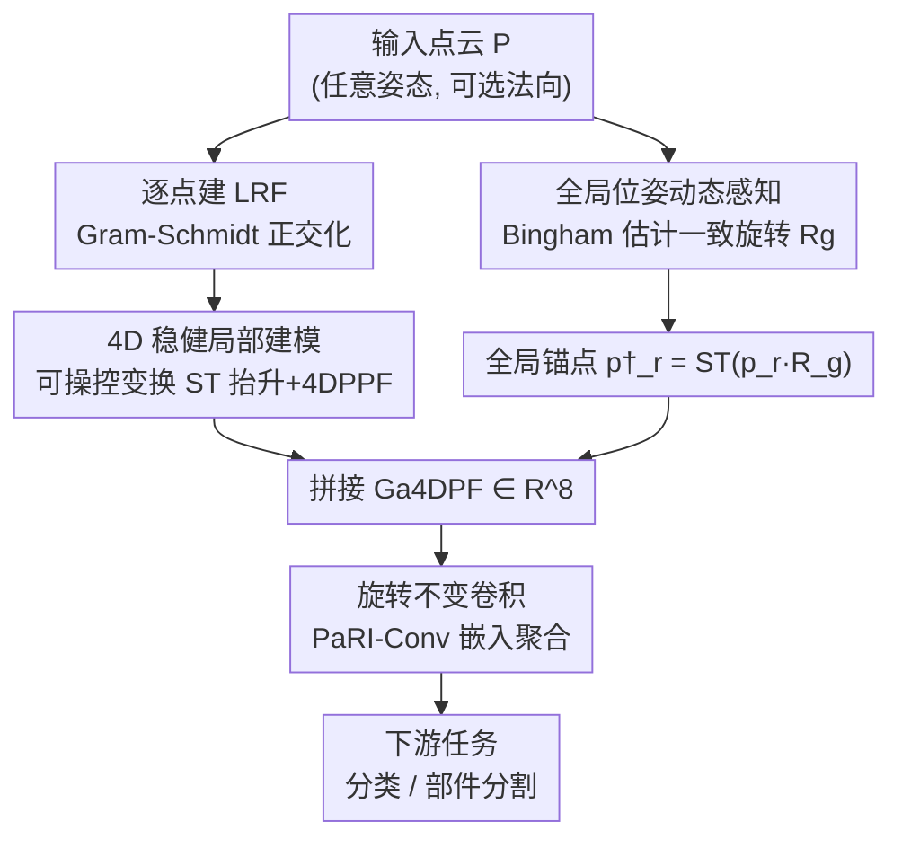

# 4D Local Modeling Toward Dynamic Global Perception for Ambiguity-free Rotation-Invariant Point Cloud Analysis

**会议**: CVPR 2026  
**论文**: [CVF Open Access](https://openaccess.thecvf.com/content/CVPR2026/html/Guo_4D_Local_Modeling_Toward_Dynamic_Global_Perception_for_Ambiguity-free_Rotation-Invariant_CVPR_2026_paper.html)  
**代码**: https://github.com/jiaxunguo/ga4dpf （有）  
**领域**: 3D视觉  
**关键词**: 旋转不变, 点云分析, 等变到不变, 球面神经元, Bingham分布  

## 一句话总结
针对旋转不变（RI）点云表征里"局部对称结构难以区分 + 全局位姿信息被丢弃"两大歧义，本文提出 Ga4DPF：用可学习的可操控变换把点云**等变地抬升到 4D 空间**构造稳健局部点对特征，再用 **Bingham 分布动态估计一个一致的全局旋转**给每个点挂一个全局锚点，在 ModelNet40 / ScanObjectNN / ShapeNetPart 上以更低的参数量和 FLOPs 取得 SOTA。

## 研究背景与动机
**领域现状**：现实里点云常以任意姿态被采集，而 PointNet/DGCNN 这类模型隐含假设输入已对齐到规范朝向，遇到任意旋转性能会崩（PointNet++ 在 z/SO(3) 协议下从 89.3% 暴跌到 28.6%）。为摆脱对齐依赖，主流走"旋转不变表征"路线：给每个点建一个局部参考系（LRF），再编码邻域内的相对几何关系，典型代表是 **点对特征 PPF**——记录点对之间的距离和若干夹角，这些量在旋转下天然不变。

**现有痛点**：基于刚性 LRF 的局部 RI 编码有两个结构性歧义。其一是**局部歧义**：不同空间排布的点对可能算出几乎相同的 RI 描述子，在对称/重复结构（飞机左右机翼）上尤其严重，手工构造的刚性坐标系还对噪声扰动敏感。其二是**全局歧义**：局部参考系本质上把全局位姿信息丢掉了，而恰恰是全局位姿才能区分"局部长得一样、全局位置不同"的结构。论文用感受野形式化了这点——存在对称旋转 $R_{sym}$ 使一对对称点的感受野满足 $\Gamma(p_{right}) = \Gamma(p_{left})R_{sym}$，于是网络对二者输出完全相同的特征，全局信息彻底丢失。

**核心矛盾**：旋转**等变**表征保留了完整几何结构信息但不能直接用于需要朝向无关预测的任务；旋转**不变**表征能直接用却因为"把方向信息抹掉"而损失了判别力。两类方法各有所长，却很少被统一。

**切入角度**：受"等变表征比不变表征保留更多结构信息"这一理论观察启发，作者主张先构造一个保结构的**等变**表征、再从中导出**不变**表征，而不是一上来就把方向信息抹掉。

**核心 idea**：用可学习的可操控球面神经元把点云抬升到 4D 再做点对特征（解决局部歧义），同时用 Bingham 分布动态学一个全局参考旋转给每个点配全局锚点（解决全局歧义），二者拼成 Ga4DPF 这一"既稳健又带全局感知"的 RI 描述子。

## 方法详解

### 整体框架
Ga4DPF 的输入是任意姿态的点云 $P\in\mathbb{R}^{N\times3}$（可选带法向），输出是逐点的旋转不变特征，喂给下游分类 / 部件分割头。整条 pipeline 由两条并行支路汇入一个旋转不变卷积：**局部支路**先为每个参考点建 LRF，再用一个可学习的可操控变换 $ST$ 把 3D 点和坐标轴抬升到 4D，在 4D 空间算点对特征 4DPPF；**全局支路**用 Bingham 分布在四元数球面上建模"该选哪个全局旋转"的不确定性，采样估计出一个全局一致的旋转 $R_g$，把参考点旋转后再抬升成全局锚点 $p^\dagger_r$。两支路拼成 8 维的 Ga4DPF，由 PaRI-Conv 风格的旋转不变卷积逐层嵌入聚合。整个框架不改变下游 RI 学习管线，可直接插进 DGCNN（分类）或 AdaptConv（分割）骨干。

### 关键设计

**1. 4D 稳健局部建模：把点对抬升到 4D 空间消解对称歧义**

痛点是 3D 的 PPF 对对称点对会算出相同描述子。作者的做法是先给每个参考点 $p_r$ 用 Gram–Schmidt 建一个局部坐标系 $L_r=\{\partial^1_r,\partial^2_r,\partial^3_r\}$（$\partial^1_r$ 取法向、$\partial^2_r$ 取邻域质心指向参考点的方向），然后引入**可操控 3D 球面神经元**（steerable spherical neuron）：它由一个可学习的 5 维球面决策面 $S$ 和位于正四面体顶点的三个旋转副本组成，拼成一个 $4\times5$ 的滤波器组 $B(S)$，把 5 维嵌入点映射到 4 维。这个滤波器组满足等变条件 $V_R\,B(S)\,P = B(S)\,RP$，意味着抬升操作 $ST:\mathbb{R}^{N\times3}\to\mathbb{R}^{N\times4}$ 是**旋转等变**的——抬升不破坏几何结构，只是换到了更高维。

在 4D 空间里重新定义点对特征：

$$4\text{DPPF}(p'_r, p'_j) = (\,\|d\|^2,\ \cos\alpha_1,\ \cos\alpha_2,\ \cos\alpha_3\,)$$

其中 $d=p'_j-p'_r$，三个角分别是抬升后基向量 $\Delta^1_r$、$\Delta^1_j$ 与 $d$ 之间的夹角。形式上它和经典 3D PPF 长得一样，但论文用 **Theorem 1（消歧保证）** 证明了关键区别：在 3D 里若参考点落在旋转轴上，绕轴旋转邻居点时 PPF 保持不变（产生歧义）；而在 4D 里，$p'_r$ 一般不再是诱导旋转 $V_R(\theta)$ 的特征向量，于是 $\|d(\theta)\|^2$ 和各夹角都随 $\theta$ 变化，$4\text{DPPF}(p'_r,p'_j)\neq 4\text{DPPF}(p'_r,p'_j(\theta))$（$\theta\neq0$，除去零测度退化集）。这就是 4D 抬升"天然消歧"的数学来源。整个抬升完全可学习，比手工设计的刚性坐标系更有弹性、对噪声更稳。

**2. 全局位姿动态感知：用 Bingham 分布给每个点挂一个全局锚点**

局部 4DPPF 再稳也受限于局部感受野，区分不了"局部相同、全局不同"的对称结构。作者给每个参考点额外挂一个**全局锚点** $p^\dagger_r = ST(p_r R_g;S)$，把 Ga4DPF 扩成 8 维：

$$\text{Ga4DPF}(p_r) = \big(\,4\text{DPPF}(p'_r,p'_j),\ 4\text{DPPF}(p^\dagger_r,p'_j)\,\big)\in\mathbb{R}^8$$

锚点引入后感受野不再局限于局部邻域，而是对齐到全局参考，从而打破式 $\Gamma(p_{right})=\Gamma(p_{left})R_{sym}$ 的局部等价性，使 $\text{Ga4DPF}(p_r)\neq\text{Ga4DPF}(p_rR_{sym})$——全局歧义被注入的全局位姿打破。

难点在 $R_g$ 怎么定。固定一个 $R_g$ 不行：万一它恰好撞上场景的对称变换 $R_{sym}$，锚点反而失效。作者改成**动态**地建模"选哪个 $R_g$"的不确定性——在单位四元数超球面 $S^3$ 上用 **Bingham 分布** $\mathcal{B}(q|V,\Lambda)\propto\exp(q^\top V\Lambda V^\top q)$，其中正交矩阵 $V$ 给出主轴、$\Lambda=\mathrm{diag}(\lambda_1,\lambda_2,\lambda_3,0)$ 控制集中度。训练时联合优化 Bingham 参数与网络，损失为：

$$\mathcal{L}_{total} = \mathcal{L}_{task} + \delta\cdot\sqrt{(\mathcal{L}_{bingham} - 0.1\cdot\mathcal{L}_{task})^2}$$

$\mathcal{L}_{bingham}$ 是采样四元数的负对数似然，$\delta=0.8$；后一项让全局位姿的自适应性与任务性能保持一致。为能反传梯度，采样 $N_s=10$ 个四元数后用几何均值 $q_g=\arg\max_{q}\sum_i\langle q,q_i\rangle^2$（即 $\sum_i q_iq_i^\top$ 的主特征向量）估出代表四元数，转成 $R_g$。这样全局参考是"学出来、随任务自适应"的，而非写死的常量。

### 损失函数 / 训练策略
总损失即上式的任务损失 + Bingham 一致性项。优化用 SGD，初始学习率 0.1、余弦退火到 0.001，训练 300 epoch；分类 batch 32、分割 batch 16，FC 层 dropout 0.5。为保证 RI 初始化，给每个点定义一个相对全局质心 $O$ 的描述子 $(\|\overrightarrow{Op_i}\|^2,\ \sin\angle(\partial^1_i,\overrightarrow{Op_i}),\ \cos\angle(\partial^1_i,\overrightarrow{Op_i}))$；分类 kNN 图取 $k=20$、分割取 $k=40$。模块被插进 PaRI-Conv，分类骨干 DGCNN、分割骨干 AdaptConv（5 层 + 3 个中间池化）。

## 实验关键数据

### 主实验
三个 benchmark、三种旋转协议（z/z、z/SO(3)、SO(3)/SO(3)，z 表示直立、SO(3) 表示任意旋转）。

| 任务 / 数据集 | 协议 | 本文 | 之前最佳 | 提升 |
|--------------|------|------|----------|------|
| 分类 ModelNet40 (pc) | SO(3)/SO(3) | 91.9 | PaRot 90.8 / TetraSphere 90.3 | +1.1 |
| 分类 ModelNet40 (pc+n) | SO(3)/SO(3) | **92.8** | RI-GCN 91.0 | +1.8 |
| 真实分类 ScanObjectNN (pc) | z/SO(3) | **87.4** | LocoTrans 85.0 | +2.4 |
| 真实分类 ScanObjectNN (pc) | SO(3)/SO(3) | **87.3** | LocoTrans 84.5 | +2.8 |
| 分割 ShapeNetPart (pc+n) | z/SO(3) C.mIoU | **82.2** | RISurConv 81.5 | +0.7 |
| 分割 ShapeNetPart (pc) | z/SO(3) C.mIoU | **81.3** | LocoTrans 80.1 | +1.2 |

注：ModelNet40 上三个协议（z/z、z/SO(3)、SO(3)/SO(3)）本文均为同一数值（pc 全是 91.9、pc+n 全是 92.8），ScanObjectNN 上 z/SO(3) 与 SO(3)/SO(3) 仅差 0.1%，强证明了表征的真旋转不变性。

模型复杂度（ShapeNetPart, z/SO(3), 仅坐标）：

| 模型 | 参数量 | FLOPs | I. mIoU |
|------|--------|-------|---------|
| LocoTrans | 6.72M* | 7998M* | 84.0 |
| TetraSphere | 1.31M | 7996M | 82.3 |
| RISurConv | 4.06M | 12120M | — |
| **本文** | **2.25M** | **3841M** | **84.0** |

在与 TetraSphere 参数量相近的情况下 I. mIoU 高出 1.7% 且 FLOPs 仅约一半；FLOPs 是 RISurConv 的不到 1/3。

### 消融实验
相对位姿表征消融（z/SO(3) 分类精度）：

| 配置 | 维度 | ModelNet40 | ScanObjectNN | 说明 |
|------|------|-----------|--------------|------|
| PPF（经典） | 4 | 91.8 | 82.8 | 3D 点对特征基线 |
| Aug.PPF | 8 | 92.4 | 83.3 | 手工增强消歧 |
| 4DPPF($p'_r,p'_j$) | 4 | 92.4 | 84.4 | 仅 4D 局部，维度更低却更强 |
| (PPF, 4DPPF($p^\dagger_r,p'_j$)) | 8 | 92.5 | 86.7 | 经典局部 + 全局感知 |
| **Ga4DPF 全量** | 8 | **92.8** | **87.4** | 4D 局部 + 全局锚点 |

采样数 $N_s$ 消融（z/SO(3)）：$N_s$ 从 1→10 单调提升（ScanObjectNN 85.5→87.4），$N_s=10$ 最佳，再增到 15/20 不升反略降。

### 关键发现
- **全局锚点对真实数据增益最大**：在 ScanObjectNN 上，把全局支路加进去（行 3→行 5）精度从 84.4 跳到 87.4（+3.0），远大于在合成的 ModelNet40 上的 0.4 提升——说明全局位姿对带噪声/遮挡/背景杂波的真实场景尤其关键。
- **4D 抬升单独就够强**：仅 4 维的 4DPPF 就追平甚至超过 8 维的手工 Aug.PPF（ScanObjectNN 84.4 vs 83.3），印证了"可学习抬升 > 手工消歧"。
- **$N_s=10$ 是精度/效率甜点**：采样太少估不准全局旋转、太多无收益，几何均值估计在 10 个样本时收敛。
- **真旋转不变**：z/SO(3) 与 SO(3)/SO(3) 几乎同分（ScanObjectNN 差 0.1%），说明模型对训练时是否见过任意旋转不敏感。

## 亮点与洞察
- **"等变抬升 → 不变导出"的范式很巧**：不像传统 RI 方法一上来就把方向信息抹平，而是先在 4D 等变空间保住结构、再算不变量，从源头降低了信息损失——这条思路可迁移到任何"先建坐标系再算不变量"的几何任务。
- **用概率分布建模"该选哪个全局旋转"**：把全局参考旋转从"写死的常量"换成"Bingham 分布上采样估计"，并用一致性损失耦合任务性能，优雅地避开了"固定旋转撞上场景对称就失效"的陷阱。
- **Theorem 1 给了消歧的数学保证**：不是经验上"4D 似乎更好"，而是证明了 4D 抬升后参考点不再是诱导旋转的特征向量，因此绕轴旋转必改变描述子——这种"先讲清为什么必然有效再做实验"的写法值得学。
- **效率意外地好**：2.25M 参数 / 3841M FLOPs 远低于同类，说明"抬一维 + 挂个锚点"是轻量增强而非堆算力。

## 局限与展望
- 作者展望把表征扩展到更复杂场景、与生成模型结合、用于多模态/时空框架——暗示当前主要在单物体级 benchmark（ModelNet40/ScanObjectNN/ShapeNetPart）验证，**大场景/室外点云尚未验证**。
- ⚠️ 方法依赖 LRF 中的法向（pc+n 设置才取到最佳分），虽然给了仅坐标的退化方案（用质心方向替代法向），但纯坐标设置下分割仍略逊于带法向；法向估计本身在噪声真实点云上不稳，可能成为瓶颈。
- 全局支路引入了 Bingham 采样和几何均值估计，$N_s=10$ 个四元数的采样虽轻，但增加了一层随机性，训练稳定性与超参 $\delta$ 的敏感性论文未充分展开。
- 改进思路：把全局锚点从单个 $R_g$ 扩成多锚点（应对多对称轴场景）、或把 Bingham 建模与法向估计联合学习以降低对外部法向的依赖。

## 相关工作与启发
- **vs PPF / Aug.PPF**：经典 PPF 在 3D 里编码点对距离与夹角，对称点对会产生相同描述子；Aug.PPF 用手工增强缓解。本文把点对抬升到 4D 后再算 PPF，从表征容量上天然消歧，仅 4 维就胜过 8 维手工特征。
- **vs PaRI-Conv**：PaRI-Conv 依赖刚性手工 LRF，噪声/遮挡下退化（ScanObjectNN 83.3%）。本文把点-法向对动态抬升到 4D 并用可学习球面神经元，更稳更具表达力（87.4%），且直接复用 PaRI-Conv 卷积作为聚合器。
- **vs TetraSphere / 等变方法**：等变方法（球谐张量场、向量神经元）保留方向信息但缺显式不变机制。本文沿"等变→不变"路线，既借等变保结构、又导出真不变特征，且在相近参数下 mIoU 更高、FLOPs 更省。
- **vs 规范对齐类（STN/PCA 归一化）**：对齐类方法假设类别级一致性、依赖大量旋转增强，泛化到未见类别/部分观测受限；本文是内在 RI，z/SO(3) 与 SO(3)/SO(3) 几乎同分，无需靠旋转增强保证鲁棒。

## 评分
- 新颖性: ⭐⭐⭐⭐⭐ "等变 4D 抬升 + Bingham 动态全局锚点"双管齐下，且有消歧定理支撑，范式新。
- 实验充分度: ⭐⭐⭐⭐ 三数据集三协议 + 复杂度 + 两组消融充分，但缺大场景/室外验证。
- 写作质量: ⭐⭐⭐⭐ 痛点（局部/全局歧义）形式化清晰、定理证明完整，框架图与公式呼应。
- 价值: ⭐⭐⭐⭐ 轻量、即插即用、SOTA，对需要旋转鲁棒的机器人/自动驾驶点云任务有直接价值。

<!-- RELATED:START -->

## 相关论文

- [\[CVPR 2026\] RINO: Rotation-Invariant Non-Rigid Correspondences](rino_rotation-invariant_non-rigid_correspondences.md)
- [\[CVPR 2026\] RI-Mamba: Rotation-Invariant Mamba for Robust Text-to-Shape Retrieval](ri-mamba_rotation-invariant_mamba_for_robust_text-to-shape_retrieval.md)
- [\[AAAI 2026\] Graph Smoothing for Enhanced Local Geometry Learning in Point Cloud Analysis](../../AAAI2026/3d_vision/graph_smoothing_for_enhanced_local_geometry_learning_in_point_cloud_analysis.md)
- [\[CVPR 2026\] LoG3D: Ultra-High-Resolution 3D Shape Modeling via Local-to-Global Partitioning](log3d_ultra-high-resolution_3d_shape_modeling_via_local-to-global_partitioning.md)
- [\[CVPR 2026\] ECKConv: Learning Coordinate-based Convolutional Kernels for Continuous SE(3) Equivariant Point Cloud Analysis](learning_coordinate-based_convolutional_kernels_for_continuous_se3_equivariant_a.md)

<!-- RELATED:END -->
