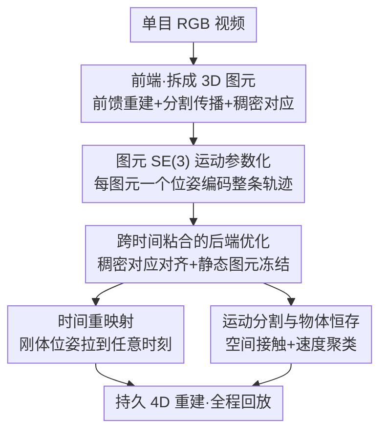

# 4D Primitive-Mâché: Glueing Primitives for Persistent 4D Scene Reconstruction

**会议**: CVPR 2026  
**论文**: [CVF Open Access](https://openaccess.thecvf.com/content/CVPR2026/html/Mazur_4D_Primitive-Mache_Glueing_Primitives_for_Persistent_4D_Scene_Reconstruction_CVPR_2026_paper.html)  
**代码**: 项目页 https://makezur.github.io/4DPM/ （未明确给出代码仓库）  
**领域**: 3D视觉  
**关键词**: 4D重建, 动态场景, 刚体图元, 单目视频, 物体恒存

## 一句话总结
4DPM 把随手拍的单目 RGB 视频拆成一组刚性运动的 3D 图元（primitive），用稠密 2D 对应把每个图元在时间上"粘"起来，只需对每个图元估一个 SE(3) 位姿就能把所有历史观测重映射到任意时刻，从而在每一帧都给出**完整且持久**的场景几何，甚至能维持被遮挡物体的位置（物体恒存）。

## 研究背景与动机

**领域现状**：动态场景的几何重建是机器人、具身智能、AR 的基础任务。传统 SLAM / SfM 在静态环境建图很强，但它们刻意回避动态部分；近年从单目视频联合估深度与相机位姿的"4D 重建"方法（含基于 DUSt3R 的点图 warp 方法）则能处理动态，但大多只重建"观测时刻"的几何。

**现有痛点**：这些方法缺乏**持久性（persistence）**——只有最新帧的深度代表最新几何，早先看到的运动物体一旦移走或被遮挡，其几何信息就被丢弃，无法把所有历史观测聚合成一个完整的场景。换句话说，你没法"回放"任意时刻的完整 3D 场景。另一类基于 DUSt3R 的成对 warp 方法表达力虽强，但真实监督数据稀缺导致精度有限，且成对处理在帧数增加时是二次复杂度。

**核心矛盾**：最一般的非刚性持久重建即便对 RGB-D 系统都极难，只能在受控短序列上做。要在单目、随手拍的条件下既完整又准确，必须找到一个**既紧凑可优化、又足够表达动态运动**的表示——稠密逐像素地估计 all-to-all 的时序运动维度太高、不可解。

**本文目标**：在分段刚性（piecewise-rigid）假设下，重建出尽可能完整、持久的动态场景，让每个观测关键帧都能在所有时刻被对应地重建出来，实现 4D 回放。

**切入角度**：借鉴 SuperPrimitive（SP）把帧分解成"物体级别块"的思路。SP 假设像素对齐的图元、只估未知深度尺度；本文把它扩展为给**每个图元赋予刚体运动参数**。关键观察是：如果一个物体是刚性运动的，那么它的整条时序轨迹只需一个 SE(3) 位姿就能编码。

**核心 idea**：把"逐像素稠密运动场"压缩成"每图元一个 SE(3) 位姿"，用稠密 2D 对应去"粘合"（glue）这些图元，从而把高维动态重建问题降到对每个图元解一个位姿。

## 方法详解

### 整体框架
4DPM 的输入是单目 RGB 视频，输出是每个观测时刻的完整场景点图集合 $\mathcal{X}^0,\dots,\mathcal{X}^n$（可回放的 4D 重建）。它建立在点图（point map）表示上：$X_k^t \in \mathbb{R}^{H\times W\times 3}$ 表示从相机 $k$ 捕获、warp 到世界坐标系时刻 $t$ 的几何。以往方法只给出观测时刻的图像对齐点图 $\{X_0^0, X_1^1,\dots,X_n^n\}$，本文要补全成每一时刻的完整集合。

整条流水线分前端、后端、重映射三段。**前端**把视频拆成一组互不重叠的 3D 图元：用前馈重建模型 $\pi_3$ 估各帧观测时刻的点图，用 SuperPrimitive 分割首帧、再用 SAMv2 把掩码传播到所有关键帧（对未覆盖区域主动采样实例化新物体），并跑稠密点跟踪网络估相邻关键帧的逐像素对应。图元被聚类成"物体（object）"——每个物体假设刚性运动，由一段时间内的图元集合 $O=\{S_{t_\text{start}},\dots,S_{t_\text{end}}\}$ 构成。**后端**用稠密 2D 对应作为约束，对所有物体、所有关键帧联合优化每个图元的 SE(3) 位姿，把图元"粘"成时序一致的物体；优化前先把对应残差很小的图元冻结为静态，以消解相机运动和场景运动的几何歧义。**重映射**利用刚体位姿把任意图元拉到任意时刻，得到全程完整重建。最后一个**运动分割**模块通过空间接触+速度相似，把变得不可见的物体挂到仍可见的父物体上，从而推断遮挡物体的运动（物体恒存）。

### 关键设计

**1. 图元级 SE(3) 运动参数化：把逐像素运动场压成每图元一个位姿**

痛点是稠密动态重建的维度爆炸——若逐像素估时序运动，参数量随像素和帧数线性叠加，all-to-all 的时空映射几乎不可解。本文的做法是把每帧切成互不重叠的图像区域 $S_p$，这些区域从点图里"切"出 3D 图元 $S_p \odot X_i$，并假设它作为刚体随时间运动，运动用单个 SE(3) 位姿 $T(S_p)$ 参数化。一个物体 $O$ 内每个图元的位姿 $T(S)$ 都把它映射到**该物体最后一次被观测的段** $S_{t_\text{end}}$ 的坐标系下，并把 $T(S_{t_\text{end}})$ 设为单位阵——因为每个物体的位姿估计天然有 SE(3) 规范自由度（gauge freedom），固定末帧即可消除冗余。位姿优化采用李群参数化，更新写作 $T \leftarrow T \oplus \tau$，其中 $\tau \in \mathfrak{se}(3) \simeq \mathbb{R}^6$ 是李代数增量。这一步的妙处在于：对刚性物体，"映射到末观测帧"这一个位姿就足以编码它的完整时序轨迹，把复杂的稠密时序映射降到"每图元一个 SE(3)"，既紧凑又保留分段刚性的表达力。

**2. 跨时间粘合的后端优化：用稠密对应把图元"焊"成时序一致物体**

前端只给出零散的、各自定位在观测时刻的图元，怎么让它们在时间上对齐成同一个物体？本文把图元跨时间匹配成物体有两个理由：一是能过滤物体边界处频繁出现的虚假对应，二是匹配后每个图元只需一个 SE(3) 即可表示其全程运动。具体地，对相邻关键帧 $I_k, I_{k+1}$ 跑稠密对应网络估逐像素光流（含逐像素置信度权重 $w_{ij}$），把 $X_{k+1}$ 按光流 warp 得到对应 3D 点 $X_{k+1}^V$。对一个物体 $O=\{S_n,\dots,S_m\}$，代价函数直接最小化同物体相邻图元对应 3D 点的距离：

$$E(O)=\sum_{(i,j)\in \mathcal{T}(O)} \left\| \, \mathbf{w}_{ij}\cdot S_i \cdot \widehat{S_j}\left(T_j^{-1}T_i X_i - \widehat{X_j}\right) \right\|_\rho$$

其中 $\mathcal{T}(O)$ 是该物体时序相邻图元对集合，$\|\cdot\|_\rho$ 是 Huber 鲁棒代价。总代价 $E_\text{final}=\sum_i E(O_i)$ 跨所有非静态物体累加，雅可比解析推导、所有物体并行计算，用迭代重加权最小二乘 + Gauss-Newton 求解 $\mathbf{J}^T\mathbf{W}\mathbf{J}\,\tau = -\mathbf{J}^T\mathbf{W}\mathbf{r}$。这里还嵌了一个**静态-动态分类**：单目视频里相机运动诱导的位移和真实场景运动从 2D 对应上难以区分，本文在优化前把初始对应残差不够大的物体冻结为静态（假设其观测到的运动全来自相机），以此消解后端优化的规范歧义，副产物是自动得到运动分割。

**3. 时间重映射：用刚体位姿把任意图元拉到任意时刻回放**

有了所有图元的位姿，就能把"只在观测时刻存在的几何"补全到每一时刻——这正是持久性的来源。由于每个位姿都把图元映射到物体末观测帧 $S_{t_\text{end}}$ 的坐标系，把时刻 $p$ 的图元 $S^p$ warp 到任意时刻 $q$ 可自然写成：

$$T^{p\mapsto q} := \left[T(S^q)\right]^{-1} T(S^p)$$

即先把 $S^p$ 变换到末观测帧坐标系、再拉回到时刻 $q$。这一步是分段刚性假设带来的"红利"：非刚性场景下你没法把过去的几何安全地搬到未来，但刚体物体一旦把所有观测都对齐到同一坐标系，就能在任意时刻重放它的位置，于是 $\mathcal{X}^0,\dots,\mathcal{X}^n$ 全部可得，实现 4D 回放。

**4. 运动分割与物体恒存：给被遮挡物体"续上"运动**

物体一旦移出视野（如被关进抽屉），单凭自身对应无法继续估其运动，但人类仍能推理它的位置。本文通过把不可见物体挂接到仍可见的**父物体**来续上运动，父子关系用两个准则确定：**空间接触**和**速度相似**。空间接触用每时刻物体的有向包围盒（OBB）判定——把包围盒按系数 $\alpha=1.1$ 扩张后若有非零交集则视为接触，并允许传递闭包（A 接 B、B 接 C 则 A 间接受 C 牵引）。速度相似则要解决一个微妙问题：每个物体位姿各有未知规范自由度 $\mathcal{F}\in SE(3)$，直接比位姿是病态的，但**速度是规范不变的**：

$$T'(t)^{-1}T'(t-1) = T(t)^{-1}\mathcal{F}^{-1}\mathcal{F}\,T(t-1) = T(t)^{-1}T(t-1)$$

于是用 $\log(V^{-1}W)$ 在马氏距离下比较两共观测物体的速度（平移协方差 $\sigma_\tau$、旋转协方差 $\sigma_\psi$），低于阈值即判为同运动。论文的抽屉示例很能说明问题：抽屉内物体并不直接接触抽屉前板，其运动是**经抽屉本体传递推断**的，因此即便完全遮挡，这些物体仍与抽屉保持运动分组、保留在重建里——这是据作者所知首个能从随手拍单目视频展示物体恒存的系统。

### 损失函数 / 训练策略
4DPM 是优化型（test-time optimization）系统而非端到端训练的网络：前馈重建 $\pi_3$、SAMv2 分割、稠密点跟踪都是现成（off-the-shelf）模型。核心优化目标即设计 2 的对应对齐代价 $E_\text{final}$（Huber 鲁棒 + 置信度加权），用 IRLS + Gauss-Newton 联合求解所有物体所有图元的 SE(3) 位姿，雅可比解析并行。全部实验在单张 NVIDIA RTX 4090 上完成；长序列切成 150 帧的 chunk 分别处理。

## 实验关键数据

评测方式：把所有观测 time-warp 到末关键帧 $n$ 得最终重建 $\mathcal{X}^n$，与多视角合成的伪 GT 几何对比。指标用 1cm 阈值下的 **accuracy（精度，预测点落在 GT 1cm 内的比例）/ recall（完整度，GT 点被覆盖比例）/ F-score（二者调和平均）**，且**只在动态部分评测**（静态区域会主导 recall，使其失去意义）。对齐用 Umeyama（Sim(3)）。

### 主实验

物体扫描数据集 HO3D（4 台标定深度相机提供 GT，手部近似静态、和被操控物体一起算作动态）平均结果：

| 方法 | 平均 F-score | Precision | Recall |
|------|------|------|------|
| π3 last view（仅末帧点图） | 0.3206 | **0.9255** | 0.2018 |
| π3（前馈重建原始输出） | 0.5219 | 0.4735 | 0.6296 |
| St4Track | 0.5392 | 0.4549 | 0.7293 |
| POMATO | 0.5214 | 0.4065 | 0.7650 |
| TraceAnything | 0.6069 | 0.6365 | 0.5748 |
| **Ours (4DPM)** | **0.7573** | **0.7630** | **0.7774** |

`π3 last view` 精度最高（0.9255）但 recall 极差（0.2018）——只保末帧、丢掉其余所有关键帧信息；其他基线 recall 不错但精度跟不上。4DPM 在精度和完整度之间取得最佳平衡，F-score 大幅领先（0.757 vs 次优 0.607）。

自采的**多物体数据集**（4 台同步 Azure Kinect，单路输入、四路合成伪 GT）领先更明显：

| 方法 | 平均 F-score | Precision | Recall |
|------|------|------|------|
| π3 last view | 0.5071 | **0.8837** | 0.3707 |
| π3 | 0.4799 | 0.3637 | 0.7382 |
| St4track | 0.4630 | 0.3585 | 0.6792 |
| POMATO | 0.5864 | 0.4668 | 0.8071 |
| TraceAnything | 0.4817 | 0.3773 | 0.6946 |
| **Ours (4DPM)** | **0.7948** | **0.7195** | **0.9000** |

在旋转球、机械夹爪、旋转底座上多物体旋转等高难场景上，4DPM 把 F-score 从次优 0.586 拉到 0.795，recall 高达 0.900，说明它能正确聚合所有观测得到完整准确的物体扫描。

### 消融 / 分析（按 baseline 拆解贡献）

论文未给传统"去模块"消融表，而是用两个自然 baseline 隔离各部分贡献：

| 配置 | 含义 | 现象 |
|------|------|------|
| π3 last view | 只用末帧点图 | 精度最高但 recall 崩（HO3D 0.20 / 多物体 0.37）——证明"持久聚合"是完整度的关键 |
| π3 | 前馈重建原始输出（不粘合） | 几何完整但早期帧定位错（精度低）——证明"跨时间粘合的位姿对齐"是精度的关键 |
| Full (4DPM) | 粘合 + 重映射 + 运动分割 | 精度与完整度同时拿下，F-score 全面最优 |

### 关键发现
- **完整度 vs 精度的取舍正是本文的主战场**：仅末帧极精但不全，原始前馈输出全但定位歪；4DPM 通过把所有观测刚体对齐到统一坐标系，第一次让两者兼得。
- **多物体场景增益最大**：相比 HO3D（领先约 0.15 F-score），多物体数据集领先约 0.21，说明"每物体独立 SE(3) + 联合优化"在复杂多刚体交互下尤其有效。
- **物体恒存是定性能力而非单一指标**：抽屉关闭示例显示遮挡物体经传递接触+速度聚类被保留在重建中，这是基线都不具备的能力。

## 亮点与洞察
- **用"每图元一个 SE(3)"换掉"逐像素运动场"**：这是把不可解的高维动态重建降到可解优化的关键一招，且对刚体而言一个末帧位姿就编码整条轨迹——简洁得近乎"取巧"，但分段刚性假设让它对大量真实场景仍然成立。
- **速度的规范不变性**：物体位姿各带未知 gauge $\mathcal{F}$，直接比位姿病态，但相邻时刻位姿之差 $T(t)^{-1}T(t-1)$ 让 $\mathcal{F}$ 自动消掉——这个观察让"跨物体比较运动"从不可行变可行，是物体恒存的数学基石，可迁移到任何带 gauge 自由度的多物体运动聚类。
- **把现成模型当积木、自己只解一个优化**：前馈重建、SAMv2、点跟踪全用 off-the-shelf，创新集中在"图元表示 + 粘合优化"，工程上轻、易复现，也说明它和上游前馈重建方法是互补关系（它们的输出可直接喂给 4DPM）。
- **静态-动态分类作为优化副产物**：冻结低残差图元既消解规范歧义、又免费得到运动分割，一举两得。

## 局限与展望
- **作者承认**：假设每个图元刚性，无法表示更精细的非刚性形变；在保持计算效率的同时扩展到非刚性是重要方向。此外尚未探索增量式建图（长序列上持续构建/更新表示）。
- **自己发现**：依赖前馈重建 $\pi_3$ 与点跟踪/对应网络的质量，上游误差会传导进位姿优化；静态-动态分类靠"初始对应残差阈值"，缓慢运动或低纹理物体可能被误冻结。
- **评测局限**：动态部分的 GT 依赖多视角合成（多物体数据集甚至因深度质量差改用前馈重建当伪 GT），伪 GT 本身可能有偏；长序列切 150 帧 chunk 评测，未充分考察跨 chunk 的全局一致性。
- **改进思路**：把刚性图元放宽为"局部刚性 + 少量形变基"以覆盖关节/柔性物体；引入增量式优化与回环，让系统能在线扩展。

## 相关工作与启发
- **vs SuperPrimitive (SP)**：SP 把帧分解成 2.5D 图元、只估深度尺度，用于静态 SLAM/SfM；4DPM 沿用图元分解思路，但给每个图元加上 SE(3) 刚体运动参数，把它从静态扩展到动态 4D 重建。
- **vs DUSt3R 系（St4Track / POMATO）**：它们把 DUSt3R 的共享坐标系范式扩到动态、成对建立时序对应 warp 点图，表达力更强但真实监督稀缺、精度受限，且成对处理是二次复杂度；4DPM 用紧凑的每图元位姿 + 联合优化，精度和完整度都更好。
- **vs TraceAnything**：同属能做观测几何稠密 time-warp 的 SOTA，但在 HO3D 与多物体数据集上 F-score 均被 4DPM 明显超越（0.61/0.48 → 0.76/0.79）。
- **vs DynamicFusion / Co-fusion / MID-fusion**：这些 RGB-D 融合方法同样用物体级运动表示，但需要连续深度流做地图融合与模型跟踪，无法用于单目；4DPM 只需单目 RGB + 现成前馈重建。

## 评分
- 新颖性: ⭐⭐⭐⭐⭐ 把刚体图元 SE(3) 参数化引入单目持久 4D 重建，并首次在随手拍视频上实现物体恒存。
- 实验充分度: ⭐⭐⭐⭐ 两个数据集 + 多 SOTA 对比 + 定性物体恒存，但缺逐模块消融、伪 GT 有偏。
- 写作质量: ⭐⭐⭐⭐⭐ 公式与动机清晰，规范自由度/速度不变性等关键点解释到位。
- 价值: ⭐⭐⭐⭐⭐ 持久且互补于前馈重建的设计对机器人/具身建图有直接价值。

<!-- RELATED:START -->

## 相关论文

- [\[CVPR 2026\] Complet4R: Geometric Complete 4D Reconstruction](complet4r_geometric_complete_4d_reconstruction.md)
- [\[CVPR 2026\] MoRe: Motion-aware Feed-forward 4D Reconstruction Transformer](more_motion-aware_feed-forward_4d_reconstruction_transformer.md)
- [\[CVPR 2026\] MotionScale: Reconstructing Appearance, Geometry, and Motion of Dynamic Scenes with Scalable 4D Gaussian Splatting](motionscale_reconstructing_appearance_geometry_and_motion_of_dynamic_scenes_with.md)
- [\[CVPR 2026\] EmbodMocap: In-the-Wild 4D Human-Scene Reconstruction for Embodied Agents](embodmocap_in-the-wild_4d_human-scene_reconstruction_for_embodied_agents.md)
- [\[CVPR 2026\] BulletGen: Improving 4D Reconstruction with Bullet-Time Generation](bulletgen_improving_4d_reconstruction_with_bullet-time_generation.md)

<!-- RELATED:END -->
