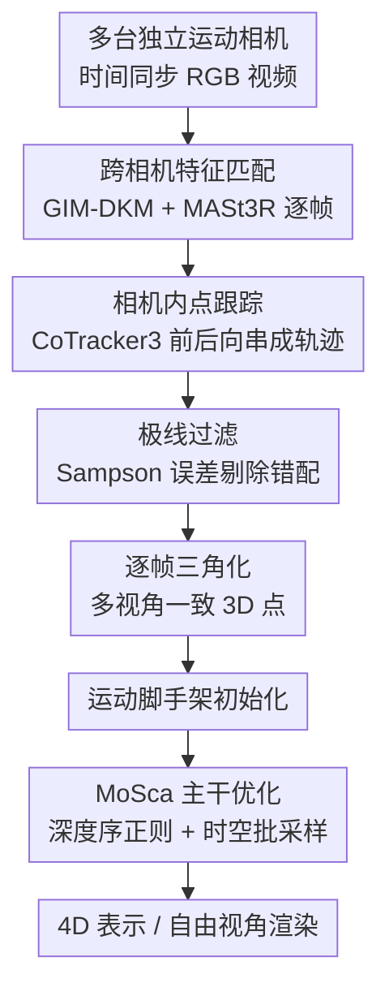

# 4D Reconstruction from Sparse Dynamic Cameras

**会议**: CVPR 2026  
**arXiv**: [2606.04593](https://arxiv.org/abs/2606.04593)  
**代码**: 待确认  
**领域**: 3D视觉  
**关键词**: 4D 重建, 稀疏动态相机, 多视角一致, 运动脚手架, 3DGS

## 一句话总结
本文研究"少量各自独立运动的相机拍同一动态场景"这一新设定（稀疏动态相机），指出把单目 4D 重建方法（MoSca）直接搬过来会因跨视角/跨时间不一致而崩，提出一套**多视角一致的 3D 轨迹初始化**（跨相机特征匹配 + 相机内点跟踪 + 极线过滤 + 三角化）外加深度序正则与时空多样化批采样，并发布真实数据集 LetCamsGo，在动态区域的重建质量上显著超过单目扩展和密集固定相机方法。

## 研究背景与动机
**领域现状**：动态 3D（即 4D）重建近年随 NeRF / 3D Gaussian Splatting（3DGS）和 2D 基础模型的进步而快速发展。最省事的采集方式是**单目动态相机**——一个人拿一台相机绕着拍。

**现有痛点**：单目设定有个根本性的缺陷——**深度歧义**。因为缺少多视角约束，即使用上最强的方法（如 MoSca），同一时刻的场景深度也是欠定的，重建出来的几何容易"飘"。另一头的密集固定相机方案（往往要 20+ 台机位）虽然能消歧义，但部署成本太高，不现实。

**核心矛盾**：高保真重建需要多视角约束去消除深度歧义，但多视角约束传统上要靠密集固定相机阵列，与"低成本、易部署"直接冲突。本文要找的是中间地带。

**本文目标**：研究一个被严重忽视、却很实用的设定——**稀疏动态相机**：几台（本文用 3 台）各自独立移动的相机同时拍同一批主体。它既能靠多视角解深度歧义，又保持低成本，天然贴合演唱会、体育、电视节目、多手机随手拍这类真实视频制作场景，重建出来可做自由视角视频。

**切入角度**：作者做实验发现，把单目方法（MoSca）或密集固定相机方法朴素地扩展到这个设定都不行——根因是**跨视角与跨时间的时空不一致**：每台相机自顾自地估深度、跟踪点，得到的动态点云在不同视角、不同时刻互相对不上，连换上最新的多视角深度估计器和多视角 3D 点跟踪器也救不回来（它们的训练数据与"相机和主体都大幅运动"的本设定存在域差）。问题出在**初始化**：MoSca 的运动脚手架（motion scaffold）初始化是为单目设计的，到了稀疏动态相机就失效。

**核心 idea**：不去改 3DGS 主干，而是**重做运动脚手架的 3D 轨迹初始化**——用跨相机特征匹配建立"同一时刻不同视角"的对应、再用相机内点跟踪把对应"沿时间"串起来，经极线过滤与逐帧三角化得到严格满足多视角一致的 3D 轨迹，给优化一个可靠的"运动脚手架先验"。

## 方法详解

### 整体框架
输入是 C 台（本文 C=3）时间同步、各自独立运动、内参已知/外参随时间变化的 RGB 视频；输出是一个高保真 4D 表示（可渲染任意新视角）。主干沿用 **MoSca**：场景由一组 3D Gaussian 表示，叠加稀疏的"运动脚手架节点"携带随时间变化的 $SE(3)$ 变换，用 KNN 图 + 双四元数混合（DQB）把节点运动插值到任意查询点，从而把规范空间下的动态 Gaussian warp 到各时刻再做 splatting 渲染。

本文不动这套渲染/形变机制，只改三处让它在稀疏动态相机下站得住：① 把脆弱的单目式初始化换成**多视角一致 3D 轨迹初始化**（核心贡献，又拆成跨相机特征匹配→相机内点跟踪→极线过滤→逐帧三角化四步）；② 把对噪声敏感的 L2 深度正则换成**深度序正则**；③ 把批采样改成**跨视角跨时刻多样化**。三者合起来稳住了这个无约束设定下的优化。

### 关键设计

**1. 多视角一致的 3D 轨迹初始化：用"先空间对应、再时间串联"替代各相机独立反投影**

这是全文最核心的设计，直接针对"朴素扩展会跨视角对不上"的痛点。朴素做法是每台相机各自跑单目（或多视角）深度估计 + 点跟踪，再把反投影出的噪声点云硬塞进联合优化——结果同一个 3D 点在不同视角下落在不同位置，track 正则的损失根本收不拢。本文换成两条线先后接力：

先做**跨相机特征匹配**：对每一帧 $t$，在相机对 $(c,c')$ 之间抽 2D 对应 $(\mathcal{M}_t^c,\mathcal{M}_t^{c'})$。为尽量多拿到可靠对应，把两个架构/训练数据都不同的稠密匹配器 GIM-DKM 与 MASt3R 的输出合并。这一步保证了**同一帧内跨视角的空间一致**，但帧与帧之间没有时间链接。再做**相机内点跟踪**：以匹配点作种子，用对非刚体运动和长程跟踪都鲁棒的 CoTracker3-Online，在每台相机内部前向+后向跟踪并合成单条轨迹，聚合所有查询帧得到每相机的半稠密 2D 轨迹集 $\mathcal{T}_c$。一句话：跨相机匹配负责"空间对得上"，相机内跟踪负责"时间串得起"，两者互补地铺出密集的时空 2D 对应。

**2. 极线过滤 + 逐帧三角化：把 2D 对应"洗干净再抬到 3D"，而非直接反投影噪声深度**

光有 2D 时空对应还不够，相机内跟踪本身有噪声，错配的跨视角对会拖垮 track 正则的收敛。于是加两步把 2D 对应变成可信的 3D 轨迹。第一步**极线过滤**：对每个跟踪点的每个时刻，检查它的跨视角对应是否满足极线约束，用 Sampson 误差作为一致性度量，给定基础矩阵 $\mathbf{F}$，只保留满足

$$d_{\mathrm{S}}(\mathbf{u},\mathbf{u}')=\frac{(\mathbf{u}'^{\top}\mathbf{F}\mathbf{u})^{2}}{(\mathbf{F}\mathbf{u})_{1}^{2}+(\mathbf{F}\mathbf{u})_{2}^{2}+(\mathbf{F}^{\top}\mathbf{u}')_{1}^{2}+(\mathbf{F}^{\top}\mathbf{u}')_{2}^{2}}<\tau_{\mathrm{epi}}$$

的对应（违反时把可见性 $\nu_{i,c,t}$ 置 0，实现里 $\tau_{\mathrm{epi}}=0.1$ px）。第二步**逐帧三角化**：对每条轨迹 $i$ 在时刻 $t$，用当时所有可见相机的观测做三角化求 3D 位置

$$\mathbf{X}_{i,t}=\arg\min_{\mathbf{X}}\sum_{c\in\mathcal{C}_t(i)}\left\|\pi(\mathbf{P}_{c,t}\mathbf{X})-\mathbf{u}_{i,c,t}\right\|_2^2$$

其中 $\mathbf{P}_{c,t}=\mathbf{K}_c[\mathbf{R}_{c,t}\mid\mathbf{t}_{c,t}]$ 是投影矩阵。和"反投影带噪声的单目/多视角深度"相比，三角化直接由几何约束给出**逐帧多视角一致**的 3D 点，逐帧重复就得到时空 3D 轨迹，用来初始化运动脚手架。消融里三角化（Tri）是涨点主力，尤其在动态区域。

**3. 深度序正则 + 时空多样化批采样：稳住无约束设定下的优化**

这两条是优化层面的"加固件"。原版 MoSca 的深度正则是最小化归一化估计深度与渲染深度的 L2 距离，但稀疏动态相机下深度估计本就噪声大（即使用 Depth Anything 3），逐像素对齐反而被噪声带偏。于是改成**深度序正则**：只约束深度值之间的**相对顺序**正确（谁在前谁在后），而不追求绝对值对齐，对深度噪声鲁棒得多。批采样上，作者发现让**每个 batch 由不同相机、不同时刻的样本组成**时泛化最好——相比同相机或时间局部的批，跨视角跨时刻采样削弱了监督信号的短程相关性，每次更新都注入更强的时空变化，从而拿到最高重建质量与最好泛化。

### 损失函数 / 训练策略
主干优化沿用 MoSca：光度损失 + 深度/track 正则 + as-rigid-as-possible 脚手架几何损失，配合稠密化与剪枝。本文改动有限但关键——深度正则换成上面的深度序（ordinal）形式、批采样换成跨视角跨时刻（D/D）。实现上 Sampson 阈值 0.1 px，深度图来自 Depth Anything 3，静态点除 Play 场景外由多视角立体深度初始化、Play 用 Depth Anything 3，关闭相机位姿优化，单卡 RTX A6000，30 FPS、半 FHD 分辨率训练。

## 实验关键数据

评测协议：用三台动态相机训练，渲染留出的固定相机视角做新视角合成，与真值比 PSNR / SSIM / LPIPS，分别在整图（Full）和动态区域（Dynamic）上报；并用共视掩码、排除摄像师区域等手段保证评测只看真正可比的部分。

### 主实验（LetCamsGo 5 场景平均，PSNR↑ / SSIM↑ / LPIPS↓）

| 方法 | Full PSNR | Full LPIPS | Dynamic PSNR | Dynamic LPIPS |
|------|-----------|-----------|--------------|---------------|
| D3DGS* [71] | 16.32 | 0.387 | 15.51 | 0.251 |
| FTGS [58] | 16.91 | 0.362 | 16.34 | 0.247 |
| FTGS* [58]（密集固定相机 SOTA） | 18.01 | 0.294 | 17.05 | 0.236 |
| MoSca [20]（单目扩展） | 18.28 | 0.339 | 15.60 | 0.274 |
| MoSca-M [20,44]（换多视角跟踪器） | 18.39 | 0.345 | 15.56 | 0.293 |
| **Ours** | **19.06** | **0.281** | **18.05** | **0.167** |

关键看点：本文在动态区域优势最明显——Dynamic PSNR 18.05 vs 次优 FTGS* 17.05（+1.0），Dynamic LPIPS 0.167 vs 0.236（降 0.069），说明运动主体重建得更锐、时间上更连贯。而朴素的 MoSca / MoSca-M 虽然 Full PSNR 看着不低，但 Dynamic LPIPS 反而比 FTGS* 更差（0.274 / 0.293），印证"直接扩展单目方法在动态区域会崩"。增益最大的是 Lunch（独立运动、大基线）和 Walking / Bench（相机和主体都大范围全局运动）等困难场景。

### 消融实验（全场景平均）

3D 轨迹初始化（Epi=极线过滤，Tri=三角化）：

| Epi | Tri | Full PSNR | Dynamic PSNR | Dynamic LPIPS |
|-----|-----|-----------|--------------|---------------|
| ✗ | ✗ | 18.46 | 15.40 | 0.246 |
| ✓ | ✗ | 18.42 | 15.51 | 0.252 |
| ✗ | ✓ | 18.71 | 17.65 | 0.184 |
| ✓ | ✓ | **19.06** | **18.05** | **0.167** |

深度损失与批采样：

| 配置 | Full PSNR | Dynamic PSNR | Dynamic LPIPS |
|------|-----------|--------------|---------------|
| 无深度损失 | 18.95 | 18.25 | 0.148 |
| 归一化深度损失（L2） | 18.97 | 18.27 | 0.147 |
| 序深度损失（Ordinal） | **19.02** | **18.36** | **0.144** |
| 批采样 同视角/异时刻 (S/D) | 18.92 | 18.31 | 0.146 |
| 批采样 异视角/同时刻 (D/S) | 18.86 | 18.33 | 0.148 |
| 批采样 异视角/异时刻 (D/D) | **19.02** | **18.36** | **0.144** |

### 关键发现
- **三角化（Tri）是涨点主力**：单开 Tri 就把 Dynamic PSNR 从 15.40 抬到 17.65、LPIPS 从 0.246 降到 0.184；而单开极线过滤（Epi）几乎不动甚至略降——说明 Epi 要和 Tri 配合才有意义（先洗掉错配，再三角化），单独洗对应但仍反投影噪声深度并不解决根本问题。两者全开达到最佳。
- **深度序正则 > 归一化 L2 > 不用**：在深度估计本就有噪的设定里，只约束"相对顺序"比强行对齐绝对值更稳，Dynamic LPIPS 0.144 最低。
- **批采样跨视角跨时刻（D/D）最好**：暴露给模型最广的时空变化，泛化最佳；但三种批采样差距较小（PSNR 0.92→1.02），说明它是"锦上添花"而非决定性因素，初始化才是大头。
- **稀疏动态相机 > 单目**：对比只用与评测视角重叠最大的单台相机，单目受深度歧义所限明显更差，多一些视角确实有帮助——但前提是要有本文这套强初始化，否则朴素多视角扩展甚至不如单目基线。

## 亮点与洞察
- **把"病灶"精准定位在初始化而非主干**：作者没有重造 4D 表示，而是诊断出稀疏动态相机失败的根因是运动脚手架初始化的时空不一致，只换初始化就拿到大幅提升——这种"对症下药、改最小的地方"的思路很值得借鉴。
- **"先空间匹配、再时间跟踪"的接力很巧**：跨相机匹配解决"同一时刻不同视角对得上"，相机内跟踪解决"沿时间串得起"，两者各擅一维、互补铺出密集时空对应，比让一个多视角时空跟踪器一口气全做更鲁棒（后者受训练域差拖累）。
- **三角化 vs 反投影深度的对比有普适价值**：在多视角可用时，用几何三角化拿 3D 点天然多视角一致，远比反投影单视角噪声深度可靠——这个 trick 可迁移到任何"有多视角对应但深度估计不可信"的重建任务。
- **深度序正则的迁移性**：当监督信号（深度）本身噪声大时，放弃绝对值对齐、只保相对序，是一种通用的鲁棒化手段，可用到各种带噪先验的优化里。
- **填补了一个真实且被忽视的设定 + 配套 benchmark**：LetCamsGo 用 3 动 1 固定相机覆盖 4 类环境 5 段序列，还按主体运动范围/相机朝向/相机运动/基线动态四个轴做了分类，给后续研究一个能细粒度分析的测试床。

## 局限与展望
- **依赖外参与同步**：方法假设相机内参已知、外参由 COLMAP 估、视频用硬件时间同步，关闭了相机位姿优化——真实"多手机随手拍"未必满足这些前提，外参/同步误差对极线过滤和三角化的影响未充分探讨。
- **强依赖现成基础模型**：跨相机匹配（GIM-DKM/MASt3R）、相机内跟踪（CoTracker3）、深度（Depth Anything 3）都是 off-the-shelf，整体上限被这些模型在大运动/遮挡下的表现卡住；动态掩码还是半自动生成的。
- **数据规模偏小**：LetCamsGo 仅 5 段序列、3 动态相机，相机数量、主体类型、环境多样性都有限，泛化到更多相机/更复杂场景仍待验证。
- **优化式而非前馈**：沿用 MoSca 的逐场景优化，重建一个场景需要训练，没有即时重建能力；与并发只重建人体网格的工作相比覆盖更广，但效率不是卖点。
- **改进思路**：把相机位姿与初始化联合优化、引入对极线/三角化噪声更鲁棒的加权、或把这套多视角一致初始化蒸馏进前馈模型，都是自然的下一步。

## 相关工作与启发
- **vs MoSca（单目动态相机 SOTA，本文主干）**：MoSca 为单目设计，初始化靠单目深度 + 点跟踪；本文保留其运动脚手架/DQB 形变机制，但把初始化整套换成多视角一致的跨相机匹配+三角化。直接把 MoSca 扩到多相机（朴素扩展、MoSca-M）在动态区域反而崩，本文的 Dynamic LPIPS 0.167 远好于 MoSca 的 0.274。
- **vs FreetimeGS / FTGS（密集固定相机 SOTA）**：FTGS 靠灵活的 Gaussian 形变在基线稳定、初始对应可靠时 pixel 级对齐很强（Blackboard/Bench 的 PSNR 不低），但它不显式利用长程时间信息，遇到快速运动会糊、时间一致性差、LPIPS 始终高于本文；本文整合全时刻视觉信息，在大基线变化和困难轨迹下更锐更连贯。
- **vs D3DGS（无先验单目方法）**：D3DGS 用形变 MLP + 纯光度损失，鲁棒于局部运动但抓不住细粒度动态、主体大范围全局运动时严重退化（甚至 OOM）；对比说明"光有很多时空视角"不够，灵活运动场 + 强初始化先验缺一不可，本文正是补上了后者。
- **启发**：当一个新采集设定让现有方法失效时，先做诊断实验定位"是表示不行、监督不行、还是初始化不行"，往往能把问题收敛到一个最小可改点上——本文示范了"只改初始化"就能撬动整体质量。

## 评分
- 新颖性: ⭐⭐⭐⭐ 提出并系统化一个实用但被忽视的设定（稀疏动态相机），方法上"先空间匹配再时间跟踪+三角化"的初始化设计简单有效，但主干沿用 MoSca、组件多为现成模型组合。
- 实验充分度: ⭐⭐⭐⭐ 自建 benchmark + 多基线对比 + 三组消融，动态区域提升清晰；但数据集仅 5 段序列、相机数固定为 3，规模偏小。
- 写作质量: ⭐⭐⭐⭐ 动机—诊断—方法逻辑链清楚，图表组织合理，公式定义完整。
- 价值: ⭐⭐⭐⭐ 给低成本"在野 4D 重建"指了条可行路径，LetCamsGo 与方法都利于后续研究复用。

<!-- RELATED:START -->

## 相关论文

- [\[CVPR 2026\] SparseCam4D: Spatio-Temporally Consistent 4D Reconstruction from Sparse Cameras](sparsecam4d_spatio-temporally_consistent_4d_reconstruction_from_sparse_cameras.md)
- [\[CVPR 2026\] SV-GS: Sparse View 4D Reconstruction with Skeleton-Driven Gaussian Splatting](sv-gs_sparse_view_4d_reconstruction_with_skeleton-driven_gaussian_splatting.md)
- [\[CVPR 2026\] V-DPM: 4D Video Reconstruction with Dynamic Point Maps](v-dpm_4d_video_reconstruction_with_dynamic_point_maps.md)
- [\[CVPR 2026\] S2D: Sparse to Dense Lifting for 3D Reconstruction with Minimal Inputs](s2d_sparse_to_dense_lifting_for_3d_reconstruction_with_minimal_inputs.md)
- [\[CVPR 2026\] Catalyst4D: High-Fidelity 3D-to-4D Scene Editing via Dynamic Propagation](catalyst4d_highfidelity_3dto4d_scene_editing_via_d.md)

<!-- RELATED:END -->
