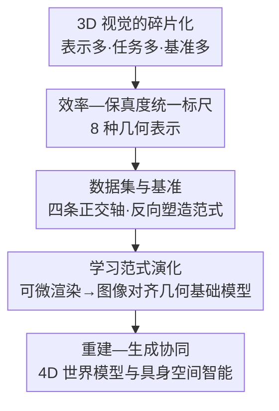

# A Cookbook of 3D Vision: Data, Learning Paradigms, and Application

**会议**: CVPR 2026  
**arXiv**: [2606.04291](https://arxiv.org/abs/2606.04291)  
**代码**: https://github.com/Hongyang-Du/awesome-3d-datasets （有，配套数据集清单）  
**领域**: 3D视觉  
**关键词**: 3D表示, 数据中心综述, 可微渲染, 几何基础模型, 4D世界模型

## 一句话总结
这是一篇"数据中心（data-centric）"视角的 3D 视觉综述（cookbook），它不按网络架构或单一任务来组织，而是把**几何表示 → 数据集与基准 → 学习范式 → 下游应用**串成一张统一的概念地图，帮初学者看清点云/网格/体素/3D 高斯等表示之间的"效率—保真度"权衡，以及近年从可微渲染到图像对齐几何基础模型、再到 4D 世界模型的演化主线。

## 研究背景与动机
**领域现状**：3D 视觉已经是自动驾驶、机器人操作、AR/VR、数字重建的核心支柱。随着 RGB-D 相机、LiDAR、实时神经渲染的普及，3D 感知越来越实用，方法也越来越多——光是数据表示就有点云、网格、体素、RGB-D、多视图、CAD、神经隐式场、3D 高斯等近十种，每种都有自己的结构假设、处理管线和计算权衡；下游任务又横跨重建、分割、位姿估计、场景生成。

**现有痛点**：这种"表示多 × 任务多 × 基准多"的碎片化，让新人面对极陡的学习曲线。更关键的是，已有综述大多是**架构中心**（只讲网络家族，如 PointNet/Transformer 谱系）、**表示中心**（只深挖某一种表示）或**任务中心**（只覆盖某个应用的 taxonomy），很少有人把"数据结构 ↔ 基准数据集 ↔ 建模范式"放在同一个框架里看。

**核心矛盾**：3D 视觉真正难在它的**数据**——表示的选择直接决定了能用什么网络、能拿什么监督、能扩到多大规模。但传统综述把"数据"当作附属，先讲模型再讲任务，于是读者始终拼不出"为什么这个表示配这个范式、这个范式被哪个基准推着走"的全局图。

**本文目标**：提供一张**统一、数据中心**的 3D 视觉地图，把三件事连起来——(1) 3D 数据在计算机里如何被表示/存储/处理；(2) 数据集与基准如何不仅用于评测、还反过来塑造了学习范式（定义了数据结构、监督格式、可扩展性约束）；(3) 2D 监督的 3D 学习、神经隐式场、向 4D 场景理解与世界模型的延伸，如何被"效率—保真度—可达性"这条主线统一起来。

**切入角度**：作者的核心观察是——**几何表示是一切的源头**。一旦你认定 3D 的"效率—保真度"权衡是由表示决定的，就能用同一把尺子（efficiency vs. fidelity）横向比较所有表示，再顺着"表示 → 数据集 → 范式 → 应用"自然展开整个领域。

**核心 idea**：用"**数据中心的统一 taxonomy**"代替"架构/任务中心的拼图"，把零散的 3D 子领域织进一张可导航的概念地图。

## 方法详解
综述类论文没有"方法"，这里把它的**组织骨架与核心洞察**讲清楚：它提出了哪几条分类轴、用什么观点把碎片化的 3D 视觉缝合成一张图。

### 整体框架
全文沿三条核心轴展开，且三条轴是**有先后依赖**的递进关系：先用第一条轴（数据表示）建立"效率—保真度"这把统一标尺，再说明第二条轴（数据集/基准）如何把这些表示落地成可学习、可评测的问题并反向塑造范式，最后第三条轴（学习范式与应用）讲清神经网络如何在这些表示与监督上演化，并外溢到重建、生成、视频、4D 世界模型等下游。可以把它读成一条"从原材料到成品"的烹饪流水线——这也是 cookbook 的命名由来。

### 关键设计
（综述类，这里的"设计"= 它提出的**分类轴**与**核心洞察**。）

**1. 八种几何表示的"效率—保真度"统一标尺：用一把尺子量遍所有 3D 数据**

针对"表示太多、彼此孤立、新人无从下手"的痛点，作者把 RGB-D、多视图图像、点云、体素、网格、CAD、神经隐式场、3D 高斯这八种表示放进**同一张对比表**，用结构（structure）、效率（efficiency）、保真度（fidelity）、典型应用四个维度统一刻画。每种表示都配了形式化定义与采集管线：RGB-D 用内参矩阵反投影 $\mathbf{p}=d(u,v)\cdot\mathbf{K}^{-1}\cdot[u,v,1]^{T}$ 在 $O(H\times W)$ 内把 2.5D 转成 3D 点；点云是无序集合 $\{\mathbf{p}_i=(x_i,y_i,z_i)\}_{i=1}^N$，处理复杂度随骨干而变（PointNet 是 $O(N)$、Point Transformer 是 $O(N^2)$、PointMamba 用状态空间回到 $O(N)$）；CAD 用 NURBS 参数曲面 $S(u,v)=\frac{\sum_{i,j}N_{i,p}(u)N_{j,q}(v)w_{ij}\mathbf{P}_{ij}}{\sum_{i,j}N_{i,p}(u)N_{j,q}(v)w_{ij}}$ 支持闭式求导与布尔运算；3D 高斯用 $f(\mathbf{x})=\frac{1}{(2\pi)^{3/2}|\Sigma|^{1/2}}\exp(-\frac12(\mathbf{x}-\mu)^T\Sigma^{-1}(\mathbf{x}-\mu))$ 且把协方差分解为 $\Sigma=RSS^TR^T$ 保证半正定。这把尺子之所以有效，是因为它揭示了一条清晰主线：从体素（低效率）到 3D 高斯（极高效率 + 高保真），整个领域其实在沿"既要快、又要真"的方向迁移，把看似无关的表示排进了同一条演化谱。

**2. 数据集/基准的四条正交轴：把"数据集"从配角抬成驱动力**

针对"综述只把数据集当评测附属"的痛点，作者沿**四条正交轴**给约 50 个代表性数据集编目：(1) 数据模态（RGB-D / 点云 / 网格 / 多视图 / 隐式场 / 高斯）；(2) 空间粒度（物体级 / 场景级室内外 / 人体级 face-hand-body / 混合）；(3) 任务形式（分割 / 对应 / 重建 / 生成）；(4) 时间维度（静态 3D vs. 动态 4D）。关键洞察是：现代基准**不再只是收集数据**，而是把"现代 3D 管线的假设"直接编码进了数据格式——例如为图像对齐重建、为 3DGS 原生学习量身定制的数据，会反过来决定下一代模型长什么样。换句话说，**基准定义了数据结构、监督格式和可扩展性约束，从而主动塑造了学习范式的演化方向**，这是把数据当"一等公民"的核心论点。

**3. 可微渲染 → 图像对齐几何基础模型：监督从 3D 空间搬到 2D 像素平面**

针对"早期直接 3D 监督（Chamfer / EMD / TSDF）在稠密体素或高分辨率表面上计算爆炸"的痛点，作者把学习范式的演化讲成一条线：**可微渲染**（Neural Mesh Renderer / Soft Rasterizer）通过对成像过程反传，把 3D 监督换成像平面上的光度损失 $\mathcal{L}_{\mathrm{photo}}=\sum_i\|I_i-\mathcal{R}(\mathcal{M}_\theta,P_i)\|^2$；渲染算子本身又从 NeRF 的体渲染（物理严谨但稠密 MLP 查询昂贵）跃迁到 3DGS 的瓦片光栅化（把渲染从秒级降到毫秒级），正是这一跃迁直接催生了大规模前馈式 3D 基础模型。在此之上，**图像对齐表示**成为主导范式（保留逐像素稠密结构、把学习留在 2D 域），并归纳出一族标志性模型：DUSt3R 用置信度加权回归 $\mathcal{L}_{\mathrm{pmap}}=\sum_i(\|C_i\odot(P_i-P_i^*)\|-\alpha\log C_i)$ 直接出图像对齐 3D 点图；VGGT 用多任务目标 $\mathcal{L}_{\mathrm{total}}=\mathcal{L}_{\mathrm{camera}}+\mathcal{L}_{\mathrm{depth}}+\mathcal{L}_{\mathrm{pmap}}+\lambda\mathcal{L}_{\mathrm{track}}$ 扩到大规模多视图；RayZer 纯 2D 自监督重建无需显式几何；$\pi^3$ 强制对无序图集做置换等变监督；Depth Anything 3 把多个几何头压成"深度+射线"统一表示 $R\in\mathbb{R}^{H\times W\times 6}$。这条线的"为什么有效"在于：监督越往 2D 像素平面搬，越能借力海量 2D 数据与可扩展训练，从而把 3D 学习推向"基础模型"规模。

**4. 重建—生成协同与 4D 世界模型：从静态几何走向时间持久的空间智能**

针对"显式 3D 数据稀缺、且重建与生成长期被当成两件事"的痛点，作者指出近年二者正深度耦合：当 3D 数据不足时，范式转向从大规模 2D 模型蒸馏先验（DreamFusion/Magic3D 的 Score Distillation Sampling）或用结构化隐空间（TRELLIS 学可解码成辐射场/高斯/网格的结构化 3D latent；SAM 3D 用 Rectified Conditional Flow Matching + Model-in-the-Loop 数据引擎，靠人审生成结果造递归监督来打破数据壁垒）。"生成服务重建"用生成先验在稀疏视图下幻想缺失几何，"重建服务生成"用刚性几何骨架约束生成的物理一致性，二者在共享隐空间里形成数据飞轮。再往上，应用扩到时间维：4D 渲染给静态高斯加形变场把运动表示成结构化 3D 演化；3D 世界模型（PointWorld / ParticleFormer）把状态空间推进到持久的 3D 点/粒子以保证时间一致与多视图忠实；最终落到具身 AI 的 3D-VLA，把感知—语言—控制 grounding 到共享 3D 表示、用 3D 点流表达意图，从而获得视角鲁棒与跨本体泛化。这一设计点把整张地图的"出口"指向了**空间智能**。

## 实验关键数据
综述类论文没有方法实验表，这里给出它用来支撑论点的**关键统计与代表性结构化结论**。

### 八种 3D 表示的效率—保真度对比（论文 Table 1 精选）

| 表示 | 结构 | 效率 | 保真度 | 典型应用 |
|------|------|------|--------|----------|
| RGB-D | 2.5D 网格（RGB+深度） | 高 | 中 | SLAM、室内建图、位姿 |
| 多视图图像 | 2D 视图 + 位姿 | 高 | 高* | SfM、MVS、NeRF 输入 |
| 点云 | 无序 3D 点 | 高 | 低—中 | 检测、建图、机器人 |
| 网格 | 顶点-边-面图 | 中 | 高 | 建模、动画、仿真 |
| 体素 | 稠密 3D 栅格 | 低 | 中 | 体积 CNN、分割 |
| 隐式场 | 神经函数 $f(x)$ | 低 | 极高 | 视图合成、场景建模 |
| 3D 高斯 | 稀疏 3D 高斯分布 | 极高 | 高 | 实时 NeRF 式渲染 |
| CAD | 参数曲面（NURBS） | 极高 | 极高 | CAD 设计、逆向工程 |

> *多视图的"保真度"指视觉外观高，几何结构需另行推断。该表是全文的"标尺"——可直接看出领域沿"高效率 + 高保真"（如 3D 高斯）方向迁移。

### 数据集生态统计（论文 Section 5 / Figure 2）

| 维度 | 关键统计/结论 |
|------|---------------|
| 规模 | 编目约 **50 个**代表性数据集，时间跨度约 2016（Thingi10k）→ 2025（SAM 3D Body、GigaHands、InteriorGS 等） |
| 模态分布 | 多标签统计（一个数据集可跨多模态），故用条形图而非饼图 |
| 空间粒度 | **物体级**与**室内场景级**基准当前占主导 |
| 时间维度 | 静态 3D 仍是主体，动态 4D（如 PointOdyssey、EgoExo4D、DIVA-360）在快速增长 |

### 关键发现
- **表示决定一切**：效率—保真度这把尺子能解释为何 3DGS 在 2024 年后迅速流行——它同时落在"极高效率 + 高保真"象限，恰好踩中领域主线。
- **基准是隐形的范式驱动力**：近年基准把"图像对齐重建""3DGS 原生学习"的假设直接写进数据格式，从数据侧推着模型形态走。
- **范式收敛于 2D 监督**：从直接 3D 监督 → 可微渲染 → 图像对齐几何基础模型，主旋律是"把监督搬到 2D 像素平面"以借力可扩展训练。
- **重建与生成正在合流**：共享隐空间 + 数据飞轮让"生成补几何、重建给约束"互相增益，是当前最活跃的趋势之一。

## 亮点与洞察
- **数据中心视角是真正的差异化**：相比架构中心/任务中心综述，它把"数据表示"当作组织全篇的第一性原理，读完能在脑子里建立一张"表示↔数据集↔范式↔应用"的可导航地图，而不是一堆互不相关的子领域清单。
- **一把尺子量八种表示**：用 efficiency–fidelity 二维把所有 3D 表示排进同一坐标系，是个非常可复用的认知框架——做任何 3D 项目选表示时都能照着权衡。
- **"基准塑造范式"的论点很有启发**：把数据集从"评测工具"重新定位成"范式驱动力"，提醒研究者关注数据格式里隐含的假设，这个视角可迁移到 2D 视觉、多模态等任何数据密集领域。
- **把零散前沿缝成一条主线**：DUSt3R / VGGT / RayZer / $\pi^3$ / DA3 / TRELLIS / SAM 3D 这些 2024–2025 的新工作，被它统一进"图像对齐 → 生成先验 → 重建生成协同 → 4D 世界模型"的叙事，对快速 onboarding 极友好。

## 局限与展望
- **综述固有的时效性**：3D 高斯、几何基础模型、4D 世界模型都在高速迭代，cookbook 的快照很快会过时；它本身也承认是面向"快速扩张领域"的入门地图。
- **深度 vs. 广度的取舍**：为覆盖全谱，单个表示/范式的技术细节相对浅（如各模型的损失只给一行公式），真要复现仍需回到原文；它定位是"导航"而非"教程"。
- **缺少定量横评**：八种表示的"效率/保真度"是定性标签（高/中/低），没有统一 benchmark 下的量化数字，跨表示比较只能停留在概念层。
- **应用侧偏前沿**：4D 世界模型、3D-VLA 等内容更像趋势展望而非成熟方法梳理，证据多来自少量代表作。
- **改进思路**：若能配一个随时间滚动更新的在线榜单（配套 repo 已是雏形），并对每条轴给出统一指标下的量化对比表，会从"地图"升级为"持续可查的索引"。

## 相关工作与启发
- **vs 架构中心综述（如 PointNet/Transformer 谱系类）**：它们聚焦网络家族，但不触及"数据集—表示"的耦合；本文反过来以数据为锚，优势是能解释"为什么某范式会出现"，劣势是对单个架构讲得浅。
- **vs 任务中心 / 表示中心综述**：那类工作在单一范式或单一任务上做深 taxonomy，但表示之间彼此孤立；本文用一张统一概念图把它们连起来，牺牲了局部深度换来全局可导航性。
- **vs 机制聚焦综述（如只分析可微渲染管线）**：它们把渲染当独立主题深挖；本文把可微渲染**降格为更大谱系里的一个组件**，强调它在"3D 监督 → 2D 像素监督"演化中的桥梁作用，视角更宏观。
- **启发**：这种"以数据/资源为第一性原理来组织一个碎片化领域"的写法，可直接迁移到具身智能、视频生成、多模态等同样表示多元、基准众多的方向，做成各自的 cookbook。

## 评分
- 新颖性: ⭐⭐⭐⭐ 不是新方法，但"数据中心 + 效率-保真度统一标尺 + 基准塑造范式"的组织视角在 3D 综述里确实少见
- 实验充分度: ⭐⭐⭐ 综述类，无方法实验；以约 50 个数据集编目 + 表示对比表 + 范式谱系作为支撑，定性为主、缺量化横评
- 写作质量: ⭐⭐⭐⭐ 三条轴递进清晰、公式与采集管线交代到位，把大量前沿工作缝成一条可读主线
- 价值: ⭐⭐⭐⭐ 对入门者和想快速 onboarding 3D 前沿的研究者是很好的导航地图，配套 repo 增强可用性

<!-- RELATED:START -->

## 相关论文

- [\[ICCV 2025\] DAViD: Data-efficient and Accurate Vision Models from Synthetic Data](../../ICCV2025/3d_vision/david_data-efficient_and_accurate_vision_models_from_synthetic_data.md)
- [\[CVPR 2026\] Action-guided Generation of 3D Functionality Segmentation Data](action-guided_generation_of_3d_functionality_segmentation_data.md)
- [\[CVPR 2026\] Lifting Unlabeled Internet-level Data for 3D Scene Understanding](lifting_unlabeled_internet-level_data_for_3d_scene_understanding.md)
- [\[CVPR 2026\] MonoVLM: Monocular 3D Visual Grounding with Vision Language Models](monovlm_monocular_3d_visual_grounding_with_vision_language_models.md)
- [\[CVPR 2026\] PromptDepth: Efficient and Promptable Geometric 3D Vision Model for Embodied Intelligence](promptdepth_efficient_and_promptable_geometric_3d_vision_model_for_embodied_inte.md)

<!-- RELATED:END -->
