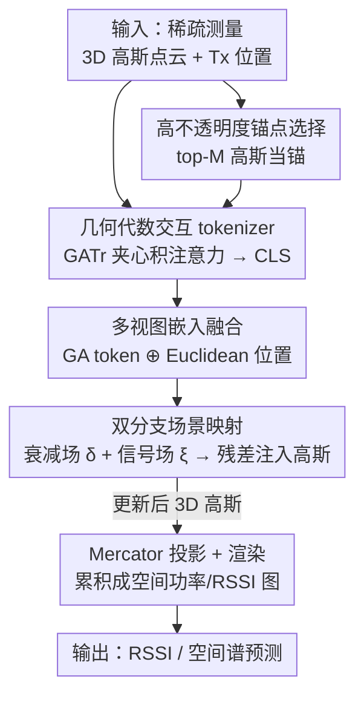

# GAI-GS：用几何代数注意力把光线-物体交互注入 3DGS 的无线信道预测框架

**会议**: CVPR 2026  
**arXiv**: [2605.19065](https://arxiv.org/abs/2605.19065)  
**代码**: 数据集已开源 https://huggingface.co/datasets/NorahCS/GAT-series_Dataset （代码未明确放出）  
**领域**: 3D视觉 / 3D Gaussian Splatting / 无线信道建模  
**关键词**: 几何代数, 3D Gaussian Splatting, 无线信道预测, 光线-物体交互, RSSI/空间谱

## 一句话总结
GAI-GS 把 3D Gaussian Splatting 当作无线辐射场，用一个基于几何代数（Geometric Algebra, GA）的注意力 tokenizer 隐式建模电磁波在场景里的反射/衍射/透射等光线-物体交互，再通过双分支场景映射网络把交互信息残差注入高斯属性，最终在多个真实室内 RSSI/空间谱数据集上把 MAE 和 SSIM 都刷到 SOTA。

## 研究背景与动机
**领域现状**：无线信道建模要刻画电磁波在复杂环境里的传播（衰减、反射、衍射、散射），这是网络设计、定位、资源分配的基础。传统做法分三类——概率模型（用经验统计把信号强度和距离挂钩，但分辨不出到达角分布）、确定性模型（基于物理光学+CAD 场景描述做射线追踪，但抓不住真实场景里精细的材质和结构）、神经模型。神经方法里 NeRF2 把 NeRF 搬到无线场景联合编码几何与信号，精度高但太慢，难以实时/大规模部署；3D-GS 用显式各向异性高斯把场景表示成可实时渲染的点集，于是 RF-3DGS、WRF-GS、GSRF 等开始用 3D-GS 从稀疏测量重建空间信道。

**现有痛点**：现有无线 3D-GS 方法把信号传播当成**纯数据驱动回归**——直接学「空间坐标 → 信号强度」的映射，完全忽略电磁射线和环境几何之间的物理交互。它们既不显式建模材质边界处的反射/折射/衍射，也不利用障碍物的几何与电磁特性，于是抓不住支配波传播的根本物理规律，在有遮挡（如室内立柱）的非视距区域容易失真。

**核心矛盾**：射线追踪类物理方法要显式知道场景几何、材质属性和精确碰撞点才能构造每个交互算子，这在大规模真实场景里根本拿不到（材质标签、碰撞位置都未知）；而纯神经方法为了绕开这个困难就干脆不建模交互。物理一致性和可学习性之间形成了 trade-off。

**本文目标**：在不要材质标签、不要显式碰撞点的前提下，让 3D-GS 网络**隐式地**学会场景内的光线-物体交互，并把这种交互感知注入高斯表示，从而既保留 3D-GS 的实时性又恢复物理一致性。

**切入角度**：作者注意到几何代数（Clifford 框架）能用统一的「夹心积」（sandwich product）$\mathbf{V}'=\boldsymbol{I}\mathbf{V}\boldsymbol{I}^{-1}$ 把旋转、反射、衍射、透射这些几何变换全部表达成 rotor/versor 的乘法，而 GATr（Geometric Algebra Transformer）的注意力本身就具备这种夹心积结构。把电磁射线交互和 GA 注意力对应起来，就能用一个可微算子同时表示多次反弹、多种效应，省掉为反射/折射/衍射各写一套专用模块。

**核心 idea**：用 GA 注意力把「光线-物体交互算子」隐式学进 token，再以残差方式注入高斯的不透明度/旋转/缩放/信号系数——即「用几何代数的夹心积代替纯回归，来给 3D-GS 补上被忽略的传播物理」。

## 方法详解

### 整体框架
GAI-GS 的输入是稀疏无线测量 + 初始化的 3D 点云（每个点是一个 3D 高斯）以及发射机（Tx）位置，输出是接收机感知平面上的空间功率图 / RSSI 图 / 空间谱。整条管线分两大件：**Scene Mapping Network**（场景映射网络）负责把交互物理学进高斯属性，**Projection & Render Module**（投影渲染模块）负责把更新后的 3D 高斯打到 RX 天线平面上累积成信号。

具体地，高斯位置 $P_x$ 和发射机位置 $P_{TX}$ 先送进**多视图 tokenizer**：它用 GATr 在几何代数空间 $\mathbb{G}_{3,0,1}$ 里对一组高斯做 GA 注意力，产出一个聚合全场景交互上下文的全局 CLS token，再和 Euclidean 位置嵌入拼接成「交互感知 + 几何感知」的多视图嵌入。这个嵌入喂给**双分支场景映射网络**：衰减分支预测随空间变化的衰减场 $\delta(\mathbf{x})$ 和中间几何特征 $f$，信号分支预测散射场幅度 $\xi(\mathbf{x})$；两路特征拼起来过三个 MLP head（Rotation / Scaling / Signal），以**残差**形式更新每个高斯的旋转、缩放、球谐（SH）信号系数，并用衰减特征给每个高斯算一个**发射机相关的不透明度残差** $d_{\text{attn}}$。最后更新后的 3D 高斯经 Mercator 投影成 2D 高斯、分 tile 按深度排序，在电磁传播约束下 alpha-blend 累积出像素信号 $R_k$。

### 关键设计

**1. 几何代数交互 tokenizer：用夹心积注意力隐式学光线-物体交互，不要材质标签**

针对「现有无线 3D-GS 忽略射线-几何物理交互、而射线追踪又要显式碰撞点」这个痛点，作者把电磁射线交互建模成几何代数里的算子。在 $\mathbb{G}_{3,0,1}$（3 空间 + 1 时间维，时间基向量平方为 $-1$，给出 Minkowski 签名）里，一束射线状态 $\mathbf{V}$ 经过一次交互可写成夹心积 $\mathbf{V}'=\boldsymbol{I}\mathbf{V}\boldsymbol{I}^{-1}$：反射 $\mathbf{x}'=-R\mathbf{x}R^{-1}$、衍射 $\mathbf{x}'\approx D\mathbf{x}D^{-1}$（近似，因为衍射会非线性地改变幅度/相位/能量分布）、材质穿透 $\mathbf{x}'=T\mathbf{x}T^{-1}$。一条经历 $n$ 次交互的完整射线路径就是连续复合 $V'=I_1I_2\cdots I_n V I_n^{-1}\cdots I_1^{-1}=IVI^{-1}$，即整条物理一致的轨迹完全由累积算子 $I=\prod_i I_i$ 决定。

关键在于：GATr 的几何代数注意力天然具备同样的夹心积结构。标准点积注意力 $\text{Attention}(q,k,v)=\sum_i \text{Softmax}_i(\langle q,k\rangle/\sqrt{8n_c})\,v$ 可以改写成 $\text{Attention}(q,k,v)_{i'c'}=\sum_i A_{i'} v_{ic'} A_{i'}^{-1}$，其中 $A_{i'}$ 是由注意力权重构造的多向量算子，正好类比上面的交互算子 $I$。于是把 GA 嵌进注意力计算，编码器就强制具备旋转/反射等变性（equivariance）、和电磁传播对称性对齐，能从数据里**隐式**推断多次反弹、多种效应的交互，而无需材质类型或碰撞位置。这就是它和「为反射/折射/衍射各写一个专用模块」的本质区别——一个可微夹心积机制全包了。

**2. 高不透明度锚点选择：把 GATr 的 $O(N^2)$ 注意力降到 $O(M^2)$**

朴素做法是把全部 $N$ 个高斯位置都喂进 GATr，但注意力是二次复杂度，$N$ 很大时算不动。作者选**不透明度最高的 top-$M$ 个高斯**（$M\ll N$）作为锚点（anchor）来实例化 tokenizer——这些高不透明度 primitive 通常对应墙面、障碍、强反射体等几何上最显著、对传播影响最大的区域。由于高斯表示在训练中不断演化，锚点子集也随之更新以和当前场景一致。GATr 算出的 CLS 输出再广播回全部 $N$ 个高斯当作全局场景上下文。这样复杂度从 $O(N^2)$ 降到 $O(M^2)$，让编码器对高斯总数不敏感，同时保留了几何表达力。

**3. 多视图嵌入融合：几何代数交互特征 + Euclidean 几何特征互补**

只有 GA 交互 token 还不够——它擅长刻画射线怎么被旋转/反射/衍射，但对绝对位置、相对距离、大尺度布局这类度量结构刻画弱。作者并行地从 Euclidean 空间提取保留度量结构的位置嵌入，再把 GA 流和 Euclidean 流**拼接**成统一的多视图嵌入。这样网络既能区分「Tx 配置相似但中间交互不同」的场景（靠 GA 交互特征），又能解决「光靠位置约束不足」的局部交互歧义（靠两者互补）。最终表示同时锚定在物理射线行为和全局空间结构上，提升数据效率和对布局变化的鲁棒性。

**4. 双分支场景映射 + 发射机相关残差参数化：把交互物理残差注入高斯属性**

场景映射网络用双分支把无线传播拆成两个物理过程。衰减分支 $F_{\text{att}}$ 输入 Tx/高斯位置嵌入和 CLS，输出标量衰减场 $\delta(\mathbf{x})$ 和中间几何特征 $f$，刻画电磁波穿过场景时逐步减弱的材质/介质相关消光；信号分支 $F_{\text{sig}}$ 以 $f$、CLS 和位置嵌入为条件预测散射场幅度 $\xi(\mathbf{x})$，显式建模非视距传播。两路拼接后过 Rotation/Scaling/Signal 三个 MLP head，全部以**残差**形式更新原高斯：旋转 $d_{\text{rotation}}$、缩放 $d_{\text{scaling}}$ 加到原参数上，Signal Head 在 SH 系数空间产出 $d_{\text{signal}}$ 使 $\tilde{\xi}(x_i)=\xi(x_i)+d_{\text{signal},i}$。

这里最关键的物理洞察是**不透明度也该随发射机变化**：标准 3DGS 里每个高斯不透明度 $\alpha_i$ 是固定的，但无线传播中一个障碍可能对某个 Tx 完全遮挡、对另一个 Tx 几乎透明。于是作者用衰减中间特征 $f$ 给每个高斯算一个不透明度残差 $\tilde{\alpha}_i=\alpha_i+d_{\text{attn},i}$，并对 $d_{\text{attn}}$ 加 $L_2$ 惩罚正则。残差参数化让网络只学相对于规范高斯参数的偏移，训练更稳、又保住了原始 3D 高斯的结构先验。

### 损失函数 / 训练策略
端到端在无线测量监督下优化。损失是 MAE 和 SSIM 的加权组合，外加对不透明度残差的 $L_2$ 正则（仅用于 spectrum 数据集）：

$$L=\frac{1}{M}\sum_{i=1}^{M}\big(\beta L_{\text{MAE}}(I_{gt},I_{pred})+(1-\beta)L_{\text{SSIM}}(I_{gt},I_{pred})\big)+\alpha L_2(d_{attn})$$

其中 $I_{gt}, I_{pred}$ 是真值和合成的空间谱，$\beta,\alpha$ 是权重。对 BLE 数据集，离 Tx 过远、RSSI 退化成 $-100$ dBm 的测量被当作无效样本剔除，报告的指标是测试集所有接收点 MAE 的中位数（dB）。渲染端 RSSI 图构建时还做了一步 softmax 注意力加权：减均值、按温度阈值缩放、用最大值平移稳定，再 softmax 出注意力权重并和均匀先验混合，最终 RSSI 标量是该图的注意力加权平均，强调强信号区域同时抗噪声/离群。

## 实验关键数据

### 主实验
在自建的两间室内房间（2.4 GHz / 5.0 GHz RSSI）+ 公开 BLE-RSSI + RFID 空间谱数据集上对比，MAE 越低、SSIM 越高越好。GAI-GS 在所有设置上都取得最低 MAE 和最高 SSIM。

| 方法 | Room1 2.4GHz MAE↓ | Room1 5.0GHz MAE↓ | Room2 2.4GHz MAE↓ | Room2 5.0GHz MAE↓ | BLE MAE↓ | Spectrum SSIM↑ |
|------|------|------|------|------|------|------|
| Ray Tracing | 25.52 | 20.66 | 25.56 | 20.78 | – | 0.33 |
| MLP | 7.3 | 9.3 | 8.2 | 9.9 | 8.0 | 0.71 |
| FIRE | 5.8 | 5.5 | 4.5 | 2.7 | 6.4 | 0.73 |
| DCGAN | 4.0 | 3.4 | 4.2 | 3.0 | 4.6 | 0.56 |
| NeRF2 | 3.6 | 2.9 | 3.9 | 2.0 | 3.1 | 0.78 |
| NeRF-APT | 3.3 | 2.7 | 3.6 | 2.0 | 3.1 | 0.84 |
| WRF-GS（前 SOTA） | 3.1 | 2.4 | 3.1 | 1.9 | 2.8 | 0.82 |
| **GAI-GS（本文）** | **2.9** | **1.6** | **2.7** | **1.8** | **2.3** | **0.91** |

相对最强基线 WRF-GS：Room1 在 2.4/5.0 GHz 各降 1.2 dB / 0.6 dB，Room2 各降 0.4 dB / 0.1 dB；BLE 从 2.8 → 2.3 dB；空间谱 SSIM 从 0.82 → 0.91（也明显高于 NeRF-APT 的 0.84）。射线追踪和 MLP 这类经典方法 MAE 普遍 >7 dB，能力有限。

### 效率分析（无消融，用计时表替代第二表）
在单张 A100、Spectrum 子集上对比训练/推理/渲染时间。GAI-GS 训练和推理比 WRF-GS+ 慢（多了 GA 注意力计算），但**渲染速度最快**，且重建质量（SSIM）最高。

| 方法 | 训练(mins) | 推理(ms) | 渲染(ms) | Spectrum SSIM |
|------|------|------|------|------|
| WRF-GS | 312.38 | 434.21 | 39.29 | 0.82 |
| WRF-GS+ | 101.06 | 4.78 | 1.43 | – |
| **GAI-GS** | 203.00 | 17.37 | **0.91** | **0.91** |

> ⚠️ 计时表里 GAI-GS 那一列原文写的「0.91」与 SSIM 数值相同，疑似排版串列（渲染 ms 应为另一数值），此处以原文为准、不强行改写。

### 关键发现
- ⚠️ **本文没有标准消融表**：论文只给了主结果（Table 1）和计时（Table 2），没有逐模块 w/o 的消融，因此「GA tokenizer / 锚点选择 / 双分支残差各贡献多少」无法从实验直接量化，是论证上的一个缺口。
- 提升最显著的是**空间谱 SSIM（0.82→0.91）和高频带（5.0 GHz）MAE**，说明 GA 交互建模主要帮在「需要刻画精细反射/衍射结构」的感知保真度上；定性图（Fig.4）里 MLP/FIRE 谱图模糊失真、WRF-GS 丢高频细节，GAI-GS 谱图焦点锐利、纹理逼真，最贴近真值。
- 在有结构立柱、遮挡明显的室内房间里优势更稳，呼应「显式建模光线-物体交互」的初衷。

## 亮点与洞察
- **把电磁射线交互和 GA 注意力的夹心积结构对上号**：物理上射线交互写成 $IVI^{-1}$，GATr 注意力恰好能改写成 $\sum_i A_{i'} v A_{i'}^{-1}$，于是「物理算子」直接变成「可学注意力算子」，省掉为反射/折射/衍射各写专用模块——这个数学-物理对应是全文最漂亮的一笔。
- **发射机相关的不透明度残差**很有物理直觉：同一障碍对不同 Tx 的遮挡程度不同，传统 3DGS 固定 $\alpha$ 表达不了，用 $\tilde\alpha_i=\alpha_i+d_{\text{attn},i}$ 一个残差就补上了 query-dependent 衰减，这个 trick 可迁移到任何「介质对查询条件敏感」的 splatting 场景。
- **高不透明度锚点选 token** 是个朴素但有效的复杂度技巧：把最影响传播的几何显著区域（墙、强反射体）当锚，$O(N^2)\to O(M^2)$，且锚点随训练动态更新，思路可复用到其他大规模高斯/点云的注意力提速。
- **残差参数化注入高斯属性**（旋转/缩放/SH/不透明度都学偏移而非绝对值）保住了 3DGS 结构先验、训练更稳，是个值得抄的工程范式。

## 局限与展望
- **没有消融实验**（⚠️ 自己发现）：四个核心设计（GA tokenizer、锚点选择、多视图融合、双分支残差）谁贡献大完全没拆，难以判断 GA 是不是真正起作用、还是双分支/残差注入带来的增益，新颖性论证打折。
- **几个频带上提升边际收窄**：Room2 5.0 GHz 仅比 WRF-GS 降 0.1 dB（1.9→1.8），部分场景 GA 带来的增益其实有限。
- **训练/推理更慢**：多了 GA 注意力，训练 203 min、推理 17.37 ms，均慢于 WRF-GS+（101 min / 4.78 ms），实时大规模部署仍有代价；渲染列数值还存疑（见上⚠️）。
- **只在室内、2.4/5 GHz 小场景验证**（自建约 35 m² 站点），对室外、毫米波、大尺度多 Tx 的泛化未知；衍射用近似算子 $D\mathbf{x}D^{-1}$ 表达，承认幅度/相位的非线性改变没被完全刻画。
- **改进思路**：补齐消融（尤其 w/o GA-attention、w/o anchor、w/o 双分支）；把锚点选择从「按不透明度 top-M」升级为可学的重要性采样；探索把 GA 算子和真实材质先验弱监督结合，进一步提升非视距精度。

## 相关工作与启发
- **vs WRF-GS / WRF-GS+**：都用 3D-GS 重建无线辐射场、共用 Mercator 投影渲染思路；WRF-GS+ 用物理增强提升 RSSI/CSI 但本质仍是数据驱动回归，本文用 GA 注意力**显式注入光线-物体交互物理**，换来更高 SSIM 和更快渲染，代价是训练/推理更慢。
- **vs NeRF2 / NeRF-APT**：NeRF 系学连续体渲染、精度高但慢且难实时；本文走显式高斯路线保留实时性，同时在 BLE/Spectrum 上 MAE/SSIM 全面反超（0.91 vs 0.84）。
- **vs 射线追踪（MATLAB toolbox）**：射线追踪要显式 3D 场景模型、材质、碰撞点，真实场景拿不到这些信息，MAE 高达 20+ dB；本文**不要材质标签和碰撞位置**，靠 GA 注意力从数据隐式学交互，是对射线追踪「物理可解释但工程不可行」的一种神经化替代。
- **vs GATr（Geometric Algebra Transformer）**：直接复用 GATr 当编码器，但把它的等变注意力**重新诠释成无线射线交互算子**，是 GA-Transformer 在 RF/无线信道这个新领域的首次落地，启发了「凡是底层物理能写成几何变换的任务，都可考虑用 GA 注意力做物理一致的 backbone」。

## 评分
- 新颖性: ⭐⭐⭐⭐ 首个把几何代数注意力引入无线 3D-GS、用夹心积统一反射/衍射/透射，物理-数学对应很巧；但 GA 编码器 GATr 是现成的，主要贡献在「应用对接 + 残差注入」。
- 实验充分度: ⭐⭐⭐ 多数据集主结果扎实、提升明显，但**完全没有消融**，无法证明 GA 模块本身的贡献，是硬伤。
- 写作质量: ⭐⭐⭐⭐ 物理直觉和公式推导讲得清楚；个别表格数值疑似排版串列（渲染 ms）。
- 价值: ⭐⭐⭐⭐ 无线数字孪生/信道预测有实用价值，且开源了自建数据集，残差不透明度、锚点提速等 trick 可迁移。

<!-- RELATED:START -->

## 相关论文

- [\[CVPR 2026\] BEA-GS: BEyond RAdiance Supervision in 3DGS for Precise Object Extraction](bea-gs_beyond_radiance_supervision_in_3dgs_for_precise_object_extraction.md)
- [\[CVPR 2026\] CaT-GS: Efficient 3DGS Rendering for Large-Scale Scenes with Inter-frame Caching and Tile Scheduling](cat-gs_efficient_3dgs_rendering_for_large-scale_scenes_with_inter-frame_caching_.md)
- [\[CVPR 2026\] GenSplat: Bridging the Generalization Gap in 3DGS Language Comprehension](gensplat_bridging_the_generalization_gap_in_3dgs_language_comprehension.md)
- [\[CVPR 2026\] DropAnSH-GS: Dropping Anchor and Spherical Harmonics for Sparse-view Gaussian Splatting](dropping_anchor_and_spherical_harmonics_for_sparse-view_gaussian_splatting.md)
- [\[CVPR 2026\] Turbo-GS: Accelerating 3D Gaussian Fitting for High-Resolution Radiance Fields](turbo-gs_accelerating_3d_gaussian_fitting_for_high-quality_radiance_fields.md)

<!-- RELATED:END -->
