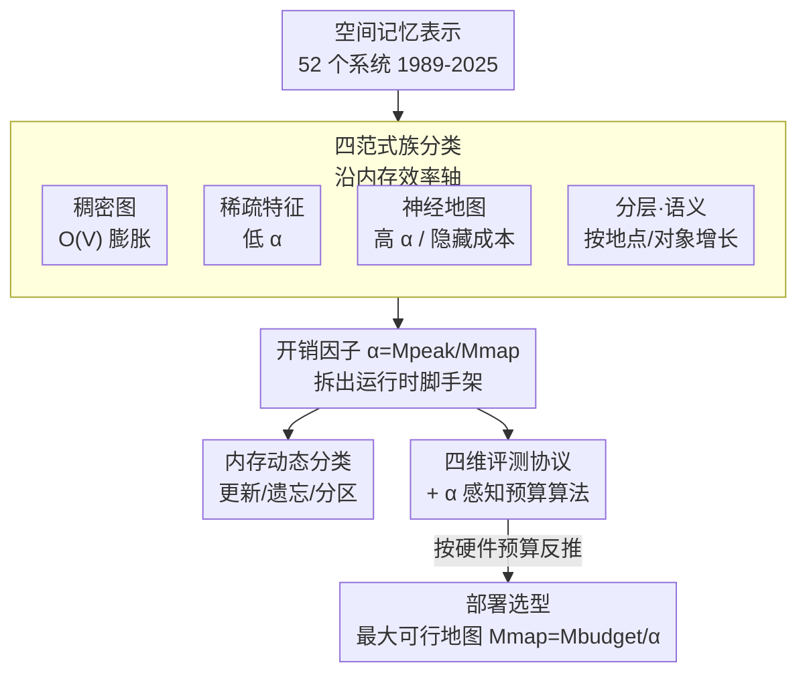

# A Survey of Spatial Memory Representations for Efficient Robot Navigation

**会议**: CVPR 2026  
**arXiv**: [2604.16482](https://arxiv.org/abs/2604.16482)  
**代码**: 无  
**领域**: 3D视觉 / SLAM / 机器人导航  
**关键词**: 空间记忆, SLAM, 内存效率, 神经隐式表示, 3D高斯泼溅

## 一句话总结
这是一篇以"内存效率"为主轴的 SLAM 空间记忆表示综述（横跨 1989–2025、88 篇文献、52 个系统），核心贡献是提出**开销因子 $\alpha=M_{\text{peak}}/M_{\text{map}}$**——揭示"论文报告的地图大小"和"实际部署所需运行时内存"之间常被隐藏的巨大鸿沟（神经方法内部 $\alpha$ 就横跨两个数量级，2.3–215），并据此给出独立实测的 $\alpha$ 参考值、四维评测协议和一个"按内存预算反推可行地图大小"的部署算法。

## 研究背景与动机
**领域现状**：视觉 SLAM（同时定位与建图）研究了二十多年，从占据栅格、稀疏特征到 NeRF / 3D 高斯泼溅（3DGS）等神经隐式表示，催生了大量在 Replica、EuRoC、TUM RGB-D 等室内短序列基准上刷精度（ATE、PSNR）的系统。现有综述（如 Tosi 等）主要**按方法族和精度**来组织这些系统。

**现有痛点**：机器人在真实大场景中导航时，空间记忆会**无界增长**——稠密表示随建图体积 $O(V)$ 膨胀，观测随任务时长线性累积，重访区域还被反复冗余存储。后果是查询延迟超过实时阈值、地图更新跟不上传感器流，在嵌入式平台上直接撑爆内存导致系统终止。而部署平台恰恰最受限：自动驾驶机器人、无人机、AR 头显跑在 8–16 GB 共享内存、$<30$ W 功耗的嵌入式 GPU（如 Jetson Orin）上，且**部署后无法加硬件**。

**核心矛盾**：论文里报告的"地图大小"（存盘的 checkpoint）根本不能预测部署可行性。作者实测发现：Co-SLAM 存盘只有 8 MB，运行时却吃掉 1.3 GB GPU 显存；NICE-SLAM 47 MB 的地图运行时要 10 GB；SplaTAM 254 MB 地图运行时 14 GB——在 16 GB 嵌入式 GPU 上留给感知/规划/OS 的空间已不足 2 GB，系统直接不可行。**是内存架构、而非"神经/稀疏"这种范式标签，决定了能不能部署。**

**本文目标**：① 用一个统一的诊断指标量化"运行时开销 vs 存盘地图"的鸿沟；② 给出可信、独立实测的跨范式参考数据；③ 提供能让工程师**在动手实现前**就判断"目标硬件上某范式可行的最大地图"的工具。

**切入角度**：换一个组织维度——不按方法族、不按精度排行，而是**按内存行为（scaling、$\alpha$、压缩策略）**来重新审视所有表示，把神经方法当作"更广义内存扩展问题"的一个特例。

**核心 idea**：用"开销因子 $\alpha$"把部署成本拆成"地图本身 + 计算脚手架"，再围绕它建立分类体系、评测协议和预算算法，让"内存可行性"成为一等公民。

## 方法详解

### 整体框架
综述以"内存效率轴"统领全文：先把空间记忆表示归为**四大范式族**，逐族分析其 scaling 行为、$\alpha$ 和压缩策略（第 3 节）；再用统一的**开销因子 $\alpha$** 把它们拉到同一张表里做跨范式比较与 Pareto 分析（第 4 节）；接着提出现有基准都没覆盖的**四维评测协议 + $\alpha$ 感知预算算法**（第 5 节）；最后用 update / forget / partition 三个维度刻画**内存动态**（第 6 节），并列出城市级、终身建图、不确定性量化等开放挑战（第 7 节）。读者拿到的是一张"路线图（图 2 分类体系）→ 选型表（表 4 按硬件约束选范式）→ 预算算法（算法 1 算最大可行地图）"的可操作工具链。

下图把综述的组织骨架画出来：四大范式族沿内存效率轴排列，统一汇入 $\alpha$ 分析，再落到评测协议与部署选型。

### 关键设计

**1. 开销因子 $\alpha$：把"地图大小"和"部署成本"的鸿沟量化出来**

综述指出，几乎所有论文只报告存盘地图大小 $M_{\text{map}}$，但真正决定能否部署的是峰值运行时内存 $M_{\text{peak}}$。作者定义开销因子

$$\alpha=\frac{M_{\text{peak}}}{M_{\text{map}}}$$

其中 $M_{\text{peak}}$ 是运行时峰值内存（CPU RSS 或 GPU 显存分配），$M_{\text{map}}$ 是系统存盘例程写入磁盘的全部持久化 checkpoint（含网络权重、特征库、码本等）。这个无量纲比值把运行时成本分解为"地图本身 + 计算脚手架（优化器状态、梯度缓冲、渲染缓存、词表、分配器开销）"：$\alpha$ 低说明地图大小能可靠预测部署成本；$\alpha$ 高说明存在被隐藏的运行时开销。关键细节是必须区分 $\alpha_{\text{CPU}}$（进程 RSS）和 $\alpha_{\text{GPU}}$（设备分配），二者不可直接比——前者含库和 OS 开销，后者含优化器状态和 CUDA 缓存但不含宿主进程。作者强调 $\alpha$ 必须和绝对的 $M_{\text{peak}}$、$M_{\text{map}}$ 一起读：例如 Point-SLAM 的 $\alpha\approx2.3$ 看似很优，其实是因为它把 2.9 GB 成本前置进了地图本身，绝对峰值并不低——所以低 $\alpha$ 可能源于"运行时真高效（稀疏 SLAM）"，也可能源于"把成本压进地图"，这正是要配合 Pareto 分析而非单一标量排行的原因

**2. 四范式族 × 内存效率轴的分类体系：用 scaling 行为而非方法标签归类**

综述把 52 个系统归为四族，每族有截然不同的内存 scaling 规律。**稠密图**（占据栅格、OctoMap、Voxblox/TSDF）随建图体积 $O(V)$ 膨胀，占据栅格大小 $M_{\text{grid}}=\frac{V}{r^{3}}\times b$（$r$ 体素分辨率、$b$ 每格字节数；5 cm、4 B、3000 m³ 楼层就要约 96 MB），OctoMap 用八叉树压缩 2–13×，但 $O(V)$ 的墙拆不掉。**稀疏特征**（ORB-SLAM3、VINS-Mono、Basalt、半稠密 LSD-SLAM）只存关键点地标/关键帧/共视图，地图小一个数量级、$\alpha$ 低（ORB-SLAM3 $\alpha_{\text{CPU}}\approx4$），地图大小能可靠预测成本。**神经地图**（NeRF 系 iMAP/NICE-SLAM/Co-SLAM/Point-SLAM 与 3DGS 系 SplaTAM/MonoGS/GS-SLAM/SGS-SLAM）地图极小但运行时开销巨大或把成本压进地图；3DGS 每个高斯原语约 236 B、随表面积 $O(N_G)$ 无界增长。**分层·语义**（拓扑图 FabMap、场景图 Hydra、CLIP 语义图 VLMaps/HOV-SG/Clio）按"地点/对象"而非体积增长——Hydra 的 48 MB 只是图抽象层，底层 Kimera 度量-语义网格的成本被漏报；CLIP 特征（$d=512$、32-bit）每百万点约 2 GB，几乎和几何地图本身一样大。这个分类的价值在于：它揭示"决定可行性的是内存架构而非范式标签"——同为神经方法，$\alpha$ 能从 2.3 跨到 215

**3. 内存动态三维分类：解释"为什么紧凑表示也会撑爆"**

即便地图紧凑，数据也会在缺乏管理时持续累积。综述用三个维度刻画内存动态：**更新策略**（如何吸收新观测：增量+BA、滑窗、门控）、**遗忘规则**（是否/如何丢弃旧数据：剔除关键帧、工作内存→长期内存转盘、时序窗口、合并）、**分区方式**（单体 vs 分层）。一个关键洞察是：**遗忘只能降 $M_{\text{map}}$，降不了 $\alpha$**——Co-SLAM 靠固定大小哈希表实现了有界 $M_{\text{map}}$（无遗忘机制），但运行时脚手架不变，$\alpha$ 仍高达 157；要降 $\alpha$ 得改架构（仅推理部署、梯度检查点、混合精度），缩小脚手架本身。作者把独立实测的内存时序（图 4）直接映射到这套分类：Co-SLAM 预分配哈希故曲线持平（有界）、NICE-SLAM 因周期性全局建图而在 3–7 GB 振荡、SplaTAM 因高斯只增不剪而单调涨到约 12.7 GB、Point-SLAM 初始化后稳定——四个神经系统都缺显式遗忘，而经典方法（ORB-SLAM3 剔除关键帧、RTAB-Map 转盘、DSO 时序窗口）反而更自律

**4. 四维评测协议与 $\alpha$ 感知部署算法：把分析变成可落地的工具**

综述指出现有基准（EuRoC/Replica/TUM 都只覆盖室内分钟级短序列）漏掉了四个关键维度，提出补齐：① **内存增长率 $dM/dt$**（区分有界 vs 无界系统，低终值 $M_{\text{map}}$ 但高 $dM/dt$ 会在长任务上 OOM）；② **查询延迟**（从 $O(1)$ 哈希查到完整 NeRF 推理跨数量级，却从没被对比测过）；③ **内存-完整度曲线**（F1 vs 累积地图大小，看重建质量的边际递减）；④ **吞吐降级**（地图逼近内存上限时的 FPS）。基于此，作者给出 $\alpha$ 感知预算算法：**不要从地图大小基准正向推，要从部署内存约束反向推**——给定可用预算 $M_{\text{budget}}$，由 $M_{\text{map}}^{\max}=\frac{M_{\text{budget}}}{\alpha}$ 算出硬件能撑的最大地图，再用选型表（表 4）按约束（CPU-only / 嵌入式 GPU / 稠密几何 / 真实感渲染 / 多小时 / 语义）挑范式。例如 Jetson Orin NX（16 GB）配高 $\alpha$ 神经 SLAM（$\alpha_{\text{GPU}}\in[55,215]$）只能撑约 75–290 MB 地图，而配稀疏 SLAM（$\alpha_{\text{CPU}}\approx4$）可达约 4 GB——同一硬件、可行地图差一个数量级

### 一个完整示例：用 $\alpha$ 判断一个系统能否上 Jetson
以 Co-SLAM 为例走一遍综述的诊断逻辑。读论文你只会看到"地图 8 MB"，几乎所有嵌入式平台都装得下，于是误判可行。但用本综述的 $\alpha$：在 A100 上独立实测它运行时峰值 1.3 GB，于是 $\alpha_{\text{GPU}}=1258/8\approx157$。反过来代入预算算法——Jetson Orin NX 扣掉 OS/驱动后假设有 ~12 GB 可用，按 $M_{\text{map}}^{\max}=M_{\text{budget}}/\alpha=12000/157\approx76$ MB，意味着这套架构在该硬件上最大只能撑约 76 MB 地图；一旦场景规模让运行时需求超过显存就会 OOM。同一逻辑下 ORB-SLAM3（$\alpha_{\text{CPU}}\approx4$）在同样预算下可撑约 3–4 GB——这就是综述想让工程师在写代码前就看清的"可行性鸿沟"。

## 实验关键数据
本文是综述，无新方法实验；核心"数据"是作者在 NVIDIA A100-SXM4-80GB 上对 5 个神经 SLAM 系统的**独立 profiling**（nvidia-smi 1 Hz 采样、减去基线、地图取存盘 checkpoint），首次给出跨范式的 $\alpha$ 参考值。

### 关键统计 / 代表性方法对比（统一效率分析，表 3 节选）

| 系统 | 范式 | 基准 | 地图 $M_{\text{map}}$ | 峰值 $M_{\text{peak}}$ | $\alpha$ | 备注 |
|------|------|------|------|------|------|------|
| ORB-SLAM3 | 稀疏 | EuRoC | 55 MB | 220 MB | $\alpha_{\text{CPU}}$=4.0 | 地图可靠预测成本 |
| Basalt | 稀疏(VI) | EuRoC | 35 MB | 120 MB | ≈3.4 | 最小地图/峰值 |
| Point-SLAM | NeRF | Replica | 2865 MB | 6563 MB | $\alpha_{\text{GPU}}$=2.3 | 成本压进地图本身 |
| Co-SLAM | NeRF | Replica | 8 MB | 1258 MB | $\alpha_{\text{GPU}}$=157 | 8 MB 地图藏 1.3 GB 开销 |
| NICE-SLAM | NeRF | Replica | 47 MB | 10082 MB | $\alpha_{\text{GPU}}$=215 | 开销主导极端值 |
| SplaTAM | 3DGS | Replica | 254 MB | 14024 MB | $\alpha_{\text{GPU}}$=55 | 高斯只增不剪 |
| SGS-SLAM | 3DGS(语义) | Replica | 254 MB | 40330 MB | $\alpha_{\text{GPU}}$=159 | 语义+无剪枝 |

> ⚠️ **跨基准不可直接比**：稀疏系统在 EuRoC（真实、双目-惯性）、神经系统在 Replica（合成、RGB-D）评测，ATE/内存不能横向比大小；跨范式结论只应从 $\alpha$ 和 scaling 行为得出。作者特别提醒其实测的 checkpoint 与文献常报值有系统性差异（如 Point-SLAM 实测 2865 MB vs 文献 80 MB），3DGS checkpoint 约大 3×。

### 关键发现
- **$\alpha$ 横跨两个数量级**：仅神经方法内部就从 2.3（Point-SLAM，地图主导）到 215（NICE-SLAM，开销主导），证明"范式标签"不能决定部署可行性，内存架构才是。
- **$\alpha$ 的三大架构驱动因素**：① 表示紧凑但运行时需脚手架（Adam 每参数存两个动量缓冲，约 3× 模型大小）→ $\alpha\gg1$；② 地图主导架构（Point-SLAM 把逐点神经特征直接存盘 2.9 GB）→ $\alpha$ 低但绝对峰值高；③ 只累积不剪枝（SplaTAM/SGS-SLAM 渲染缓冲随高斯数膨胀）→ $\alpha$ 放大到 55–159。
- **遗忘 ≠ 降 $\alpha$**：Co-SLAM 有界 $M_{\text{map}}$ 却 $\alpha$=157；降 $\alpha$ 必须改架构（仅推理/梯度检查点/混合精度）。
- **没有单一范式称王**：Replica 上 3DGS 在 90–254 MB 取得最佳绝对精度（SplaTAM ATE 0.36 cm），场景图在可预测成本下提供语义抽象，各有其评测域内的最优。
- **$\alpha$ 是硬件相关的**：Co-SLAM 在 RTX 3090 上约 3.2 GB、A100 上 1.3 GB，源于不同 GPU 的 CUDA 分配器行为；且当前测的都是训练期 $\alpha$，仅推理部署可能大幅降低，但没有系统测过。

## 亮点与洞察
- **一个比值戳破整个领域的报告习惯**：$\alpha=M_{\text{peak}}/M_{\text{map}}$ 极其简单，却把"论文报 8 MB、实际吃 1.3 GB"这种系统性误导一次说清——巧在它可被任何后续工作低成本复算并要求标注。
- **重新选轴比堆数据更有价值**：放弃"按精度排行"，改"按内存行为组织"，让综述直接回答工程师真正关心的"这套系统在我的 Jetson 上能不能跑"。
- **可迁移的方法论**：把"持久化成本 vs 运行时成本"分离的思路，可推广到任何"存盘小但运行时大"的系统评估（如大模型 checkpoint vs 推理显存、向量库落盘 vs 在线索引）。
- **诚实的实测态度**：作者主动披露自测 checkpoint 与文献的差异并逐项列出，而不是粉饰，反而增强了 $\alpha$ 参考值的可信度。

## 局限与展望
- **作者承认的局限**：profiling 只覆盖 5 个神经 SLAM 系统、单个 Replica 场景、单一 GPU（A100），$\alpha$ 在其他场景/数据集/硬件上可能不同；只测了训练期 $\alpha$，仅推理 $\alpha$ 未 profile；基准异质性使跨范式比较只能限于 $\alpha$ 和 scaling。
- **自己发现的局限**：四维评测协议中除内存增长率外的三项（查询延迟、内存-完整度曲线、吞吐降级）目前**没有任何系统实测**，只是被形式化为未来目标，因此协议的可操作性尚待验证；预算算法用的 $\alpha$ 是室内房间级，外推到楼宇/城市级可能失真（作者也注明 "room-scale"）。
- **覆盖范围**：明确排除完整自治栈、无持久记忆的感知、LiDAR 建图（仅保留 BioSLAM），对 NeRF/3DGS 的方法细节也让位给其他综述，所以它是"内存视角"而非"方法全景"。
- **改进思路**：建立 ≥30 min 长时基准记录 $M(t)$ 与 FPS$(t)$、分离训练期/推理期 $\alpha$、在嵌入式平台与离散 GPU 上双测；并探索信息论遗忘准则（只保留能降低地图熵的观测）实现 $O(\log t)$ 增长。

## 相关工作与启发
- **vs Tosi 等神经 SLAM 综述 [68, 6]**：他们按方法族组织、用精度排行（会基于 8 MB 地图把 Co-SLAM 排得很高）；本文按内存行为组织，用 $\alpha$ 揭示同一系统运行时要 1.3 GB（$\alpha$=157），两者互补而非替代。
- **vs 单系统内存优化工作（RTAB-Map / MS-SLAM）**：RTAB-Map 用"工作内存→长期内存"转盘界定活跃内存，MS-SLAM 滑窗稀疏化报告 >70% 峰值增长削减；这些是点状解法，本综述把它们统一到 update/forget/partition 动态分类里并指出"遗忘降不了 $\alpha$"。
- **vs 城市级/流式方案（GigaSLAM、DiskChunGS）**：GigaSLAM 演示了公里级 3DGS、DiskChunGS 用空间分块做流式，但真正城市级（$\sim10^7$ m³、>100 h、<30 W）仍未解；本综述把分层流式、信息论遗忘、软硬协同列为三条互补的收敛路线，并指出尚无系统三者兼备。
- **启发**：综述给出的 $\alpha$ 感知预算算法 $M_{\text{map}}^{\max}=M_{\text{budget}}/\alpha$ 本质上是个"先体检再选型"的部署门槛，可直接嵌进机器人选型流水线，避免实现后才发现 OOM。

## 评分
- 新颖性: ⭐⭐⭐⭐ 不是新方法，但"换内存轴重组 + $\alpha$ 指标 + 独立实测"的视角切换在综述里很扎实
- 实验充分度: ⭐⭐⭐ 作为综述其独立 profiling 难得，但只 5 系统/单场景/单 GPU，四维协议三项未实测
- 写作质量: ⭐⭐⭐⭐⭐ 路线图→选型表→算法的可操作链条清晰，且对自测差异诚实披露
- 价值: ⭐⭐⭐⭐⭐ 直接服务嵌入式部署决策，$\alpha$ 参考值和预算算法对从业者立即可用

<!-- RELATED:START -->

## 相关论文

- [\[CVPR 2026\] UniSplat: Learning 3D Representations for Spatial Intelligence from Unposed Multi-View Images](unisplat_3d_representations_unposed.md)
- [\[CVPR 2026\] Context-Nav: Context-Driven Exploration and Viewpoint-Aware 3D Spatial Reasoning for Instance Navigation](context-nav_context-driven_exploration_and_viewpoint-aware_3d_spatial_reasoning_.md)
- [\[CVPR 2026\] LightSplat: Fast and Memory-Efficient Open-Vocabulary 3D Scene Understanding in Five Seconds](lightsplat_fast_and_memory-efficient_open-vocabulary_3d_scene_understanding_in_f.md)
- [\[CVPR 2026\] SEA-Flow3D: Simplified, Efficient, and Accurate Scene Flow via Spatial Vector Sampling and Multi-scale Refinement](sea-flow3d_simplified_efficient_and_accurate_scene_flow_via_spatial_vector_sampl.md)
- [\[ICLR 2026\] MEGS2: Memory-Efficient Gaussian Splatting via Spherical Gaussians and Unified Pruning](../../ICLR2026/3d_vision/megs2_memory-efficient_gaussian_splatting_via_spherical_gaussians_and_unified_pr.md)

<!-- RELATED:END -->
