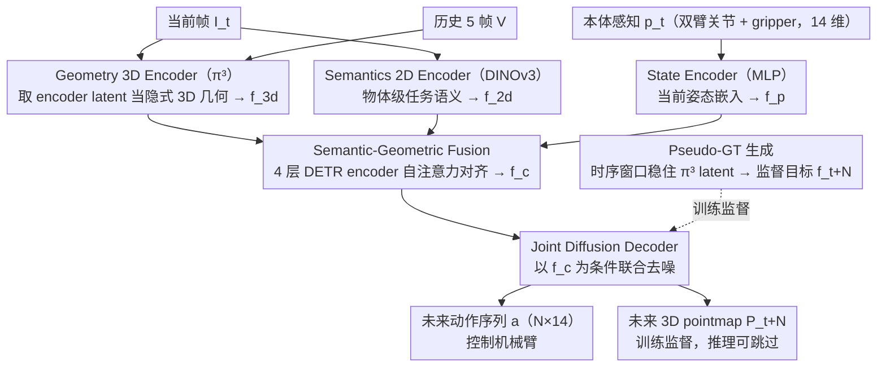

# GAP: Action-Geometry Prediction with 3D Geometric Prior for Bimanual Manipulation

**会议**: CVPR2026  
**arXiv**: [2602.23814](https://arxiv.org/abs/2602.23814)  
**代码**: [https://github.com/Chongyang-99/GAP.git](https://github.com/Chongyang-99/GAP.git)  
**领域**: 3D视觉  
**关键词**: 双臂操控, 3D几何先验, 扩散策略, 点云预测, 模仿学习

## 一句话总结
GAP利用预训练3D几何基础模型（π³）提取3D特征，融合2D语义和本体感知，通过条件扩散联合预测未来动作序列和未来3D pointmap，在RoboTwin 2.0和真实双臂实验中达到SOTA。

## 研究背景与动机

**领域现状**：双臂操控（bimanual manipulation）需要策略同时生成两只机械臂的协调动作，涉及精密装配、形变物体操作和杂乱环境交互。当前主流方法包括：基于2D的ACT（action chunking + DETR Transformer）、扩散策略DP，以及引入3D的DP3（点云输入）。

**现有痛点**：
   - **2D方法缺乏空间感知**：ACT、DP等方法依赖2D特征，无法显式推理3D空间关系、遮挡和接触。在需要精确空间推理的双臂任务中表现不佳
   - **3D方法依赖显式点云**：DP3等需要深度相机生成点云，但真实世界中高质量点云获取需要精确标定、对噪声和遮挡敏感。2D→3D提升方法（如back-projection）分辨率低、工程开销大
   - **缺乏预测性3D推理**：现有方法只感知当前3D状态，不预测动作执行后的3D变化，限制了长horizon规划能力

**核心矛盾**：双臂操控需要3D感知能力来推理空间关系，但显式获取3D信息（点云）在真实场景中不够可靠。同时，仅感知当前状态不足以支持需要预测未来几何变化的复杂操控。

**本文目标**：能否直接利用3D几何基础模型从RGB图像获取隐式3D特征，绕过显式点云管线？能否通过联合预测未来3D结构来增强策略的空间理解和长horizon规划？

**切入角度**：最近3D几何基础模型（如DUSt3R、VGGT、π³）能从RGB图像快速、鲁棒地重建稠密3D结构。作者将π³作为感知backbone，其latent特征天然包含丰富的3D几何信息——不需要显式生成点云，直接用latent做策略条件。更进一步，通过预测"未来3D latent"迫使模型学习3D-aware的前瞻推理。

**核心 idea**：用预训练3D几何基础模型的latent作为3D先验，联合去噪未来动作和未来3D pointmap来实现RGB-only的3D-aware双臂操控策略。

## 方法详解

### 整体框架
GAP要解决的问题是：双臂操控既需要3D空间推理，又不想依赖真实场景里难以稳定获取的显式点云。它的做法是把一个预训练3D几何基础模型（π³）的latent当作隐式3D先验，让策略只看RGB图像就能"懂"空间结构，并且在生成动作的同时顺手预测未来的3D场景，逼模型学会前瞻推理。

整条管线这样转：当前帧 $I_t$ 加上从历史里采样的5帧 $V$、以及机器人本体感知 $p_t \in \mathbb{R}^{14}$（双臂各6个关节角 + 1个gripper状态）先被三路并行编码器各自吃进去，分别吐出3D几何、2D语义、本体状态三种特征；三者拼接后过一个Transformer融合成统一上下文 $\mathbf{f}_c$；再以 $\mathbf{f}_c$ 为条件，用一个条件扩散解码器从噪声里"去噪"出两样东西——未来N步的双臂动作序列 $a_{t:t+N} \in \mathbb{R}^{N \times 14}$，以及未来第N步的3D pointmap $P_{t+N} \in \mathbb{R}^{H \times W \times 4}$。动作直接用于控制，pointmap则是训练时的辅助监督，推理时可跳过以省算力。

### 关键设计

**1. Geometry 3D Encoder（π³编码器）：用RGB换取隐式3D几何，绕开显式点云**

这一路直击"3D方法依赖深度相机和点云预处理"的痛点。GAP从历史帧 $V$ 里均匀采5帧、和当前帧 $I_t$ 拼成6帧序列，送进π³编码器；每帧被切成 $14 \times 14$ 个patch，取backbone最后两层特征拼接，得到1024维的3D几何特征 $\mathbf{f}_{3d}$。关键是只用π³的encoder、不走它的decoding heads——也就是说不真的去重建点云，而是直接拿它的latent。之所以这样可行，是因为π³本身是在多视图几何上预训练的基础模型，它的latent天然编码了帧间的3D结构关系；相比显式点云，这种latent不吃标定误差和深度噪声，又是一次前向就出结果，对真实部署友好得多。

**2. Semantics 2D Encoder（DINOv3编码器）：补上几何特征缺的"任务语义"**

3D几何特征知道"哪里有结构"，却不知道"哪个东西要去操作"。GAP让当前帧 $I_t$ 额外过一遍DINOv3，切成 $16 \times 16$ 个patch，得到1024维语义特征 $\mathbf{f}_{2d}$。DINOv3带来的是物体级别的语义先验，和几何特征互补——一个管空间、一个管"这是什么、重不重要"。

**3. State Encoder（MLP编码器）：把机器人当前姿态喂进上下文**

最轻的一路，用一个简单MLP把14维本体感知 $p_t$ 映射成1024维嵌入 $\mathbf{f}_p$，让融合阶段知道"机器人此刻摆成什么样、当前能做什么"。

**4. Semantic-Geometric Fusion（语义-几何融合）：让三种异构模态在注意力里互相对齐**

三路特征量纲、语义都不同，硬拼起来不一定好用。GAP把 $[\mathbf{f}_{3d}, \mathbf{f}_{2d}, \mathbf{f}_p]$ 沿token维度拼接后送进一个4层DETR encoder，靠自注意力做深度融合，输出统一的Semantic-Geometric Fused Context $\mathbf{f}_c$。注意力在这里起的作用很直白：几何特征告诉语义特征"物体在空间哪个位置"，语义特征反过来告诉几何特征"这堆结构里哪个才是要抓的目标"，本体感知则约束"当前机器人构型下哪些动作可达"。这样融合出的上下文比手工设计的拼接方式更能捕捉跨模态关系。

**5. Joint Diffusion Decoder（联合扩散解码器）：把"未来3D长什么样"和动作一起去噪，等于免费内建一个world model**

这是GAP最核心的一步。解码器沿用DETR decoder结构来实现条件扩散：训练时把clean target $x_0 = \{a_{t:t+N}, \mathbf{f}_{t+N}, P_{t+N}\}$ 加高斯噪声得到 $x_k$，再让以 $\mathbf{f}_c$ 为条件的decoder预测回clean的 $\hat{x}_0$。它同时去噪两类目标——一是未来动作块 Future Action Chunk $\mathbb{R}^{N \times 14}$（双臂各6-DoF关节 + 1-DoF gripper），二是未来3D pointmap的latent $\mathbf{f}_{t+N} \in \mathbb{R}^{H/14 \times W/14 \times 1024}$，后者再经π³的dense head解码成 $P_{t+N} \in \mathbb{R}^{H \times W \times 4}$（即x,y,z坐标加一个confidence）。让模型预测未来3D结构，本质上是逼它回答"如果执行这串动作，3D场景会变成什么样"，相当于把一个world model隐式地塞进了策略网络，无需单独训练。一个巧妙之处是：它只监督horizon末尾第N步的最终状态、而非逐步预测每一帧，这迫使模型一次性推理整段动作序列的累积效果，既增强了长horizon规划，又压低了监督和计算开销。

**6. Pseudo-GT生成策略：用时序窗口稳住3D latent监督信号**

要监督"未来3D latent"，就得先有干净的latent target，但直接对单帧调用π³会很不稳定、噪声大。GAP的做法是：对数据集里每一帧 $s$，都给它均匀采 $n$ 个历史帧凑成时序窗口 $\{V, I_s\}$ 一起送进π³ encoder，然后只取 $I_s$ 对应的那部分latent $\mathbf{f}_s$ 作为该帧的pseudo-GT，训练时target即设为 $\mathbf{f}_{t+N}$。靠这种时序联合处理，3D latent特征质量被显著拉稳，下游扩散监督才有意义。

### 一个完整示例：执行 Hanging Mug

以真实世界里"把杯子挂上挂钩"这个需要精确空间推理的任务走一遍。机器人当前看到杯子和挂钩的RGB画面 $I_t$，配上前几步运动留下的5帧历史 $V$ 和双臂当前关节状态 $p_t$。π³编码器从这6帧里读出杯耳、挂钩的相对3D位置关系（$\mathbf{f}_{3d}$），DINOv3标出"杯子"和"挂钩"这两个语义物体（$\mathbf{f}_{2d}$），State Encoder带入双臂此刻的姿态（$\mathbf{f}_p$）。三者在4层DETR encoder里对齐成 $\mathbf{f}_c$——此时上下文里已经同时包含"杯耳在挂钩左前方约几厘米、需要旋转对位"这类信息。扩散解码器从纯高斯噪声出发，以 $\mathbf{f}_c$ 为条件迭代去噪，一边生成未来N步双臂动作（一只臂稳住杯子、另一只臂调整角度对准挂钩），一边预测出动作执行后第N步的3D pointmap（杯耳已套上挂钩的几何形态）。后者在训练中作为额外监督，逼模型在"想清楚未来场景"的前提下产出动作；推理时只取动作、跳过pointmap解码。正是这种被几何想象约束过的动作，让GAP在ACT/DP都0%的Hanging Mug上拿到20%成功率。

### 损失函数 / 训练策略
扩散的训练目标是对三类去噪结果取L1损失：

$$\mathcal{L} = \mathbb{E}_{k, x_0, \epsilon}\left[\|{\hat{a}_{t:t+N}} - a_{t:t+N}\|_1 + \lambda\|\hat{\mathbf{f}}_{t+N} - \mathbf{f}_{t+N}\|_1 + \gamma\|\hat{P}_{t+N} - P_{t+N}\|_1\right]$$

其中 $\lambda, \gamma$ 为3D latent项与pointmap项的权重。其余训练配置：按ACT风格做action chunking；2D方法（含本文）训练200–600 epochs、3D方法训练3000 epochs，batch size 32；仿真用100条专家demo、真实用50条teleoperation demo。推理时从高斯噪声起迭代 $K$ 步去噪，3D pointmap解码可选择性跳过以提速。

## 实验关键数据

### 主实验 - RoboTwin 2.0 仿真（三类任务平均成功率%）

| 方法 | Dominant-select (16任务) | Sync-bimanual (8任务) | Seq-coordinate (8任务) |
|------|------------------------|-----------------------|------------------------|
| ACT (2D) | 34.1 | 32.4 | 29.4 |
| DP (2D) | 44.4 | 37.1 | 33.6 |
| DP3 (3D点云) | 61.2 | 42.0 | 42.0 |
| G3Flow (3D+语义) | 54.3 | 43.2 | 40.5 |
| RDT (1.2B参数) | 49.5 | 44.6 | 41.2 |
| Xu et al. (2D+预测) | 55.1 | 47.5 | 44.9 |
| **GAP (Ours)** | **63.2** | **51.3** | **50.4** |

### 消融实验（4任务平均成功率%）

| 2D Semantic | 3D Geometric | Geometric Imagination | 成功率 Avg. |
|:-----------:|:------------:|:---------------------:|:-----------:|
| ✓ | ✓ | ✓ | **25.1** |
| ✗ | ✓ | ✓ | 24.4 |
| ✓ | ✓ | ✗ | 23.6 |
| ✓ | ✗ | ✗ | 21.0 |

### 真实世界实验（成功率%，20 trials/task）

| 任务 | ACT | DP | Xu et al. | **Ours** |
|------|-----|----|-----------|----------|
| Place Empty Cup | 70 | 70 | 75 | **80** |
| Place Dual Shoes | 0 | 10 | 15 | **20** |
| Hanging Mug | 0 | 0 | 5 | **20** |
| Scan Object | 25 | 20 | 35 | **40** |
| **平均** | 23.8 | 25 | 32.5 | **40** |

### 关键发现
- **3D几何感知极其重要**：去掉3D Geometric Module + Geometric Imagination后成功率从25.1%降到21.0%（-16.3%相对下降），是三个模块中影响最大的
- **Geometric Imagination（预测未来3D）是核心创新**：单独去掉它使成功率从25.1%降到23.6%（-6.0%），说明预测未来3D结构确实帮助策略学到更好的3D理解
- **仅用RGB输入超越显式点云方法**：GAP（RGB only）在Dominant-select任务上超越DP3（63.2% vs 61.2%），证明预训练3D基础模型的latent可以替代显式点云
- **同步双臂任务优势明显**：在Place Dual Shoes上GAP达43.3%，DP3仅17.7%，说明GAP对双臂协调推理更好
- **数据效率优异**：低数据量（10-20 demo）时，GAP利用预训练特征已有明显学习信号，而DP完全失败（0%成功率）
- **真实世界Hanging Mug**：ACT和DP完全失败（0%），GAP达20%——该任务需要精确3D几何推理来定位杯耳和挂钩的空间关系

## 亮点与洞察
- **将3D基础模型的latent直接作为策略条件是一个优雅的范式**：绕过了点云获取的工程复杂性，π³的latent本身就编码了丰富的3D几何，这一思路可以推广到任何需要3D感知的机器人任务
- **联合预测动作和未来3D结构是隐式的world model**：不需要单独训练world model，通过扩散过程中的联合去噪自然地将3D预测能力注入策略网络。只预测horizon末尾的3D状态而非逐步预测，巧妙地降低了计算和监督复杂度
- **语义-几何融合用DETR encoder**：简单但有效，让不同模态（3D几何、2D语义、本体感知）通过自注意力充分交互，避免了手工设计融合方式
- **Pseudo-GT生成策略**（时序窗口稳定π³输出）可以迁移到任何使用3D基础模型做监督的下游任务

## 局限与展望
- **单步预测horizon**：只预测horizon $N$ 处的3D状态，缺乏multi-step 3D trajectory的预测。对超长horizon任务可能不足——可扩展为预测多个未来时间步的3D结构
- **缺乏持久3D记忆**：无法跨episode积累3D知识，每次推理独立处理当前窗口。可引入persistent 3D memory（借鉴Wang et al.的continuous 3D perception model）
- **真实世界成功率仍较低**：Hanging Mug最高也只有20%，说明复杂精密操控仍有很大进步空间。可能需要更多demo数据或更好的sim-to-real transfer
- **推理效率**：π³和DINOv3两个大型backbone + 扩散迭代去噪，计算开销较大。论文未报告推理时间，实际部署可能需要蒸馏或加速
- **泛化到未见任务/物体**：实验仅在RoboTwin benchmark已知任务上评估，未测试zero-shot泛化

## 相关工作与启发
- **vs DP3**: DP3直接用点云作为输入，需要深度相机和点云预处理。GAP只需RGB输入+预训练3D模型latent，在多数任务上反超DP3，说明隐式3D表示比显式点云更robust
- **vs G3Flow**: G3Flow将2D语义特征投影到3D点云上。GAP则在latent空间做语义-几何融合，避免了3D投影带来的量化误差和标定依赖
- **vs Xu et al.**: Xu et al.联合预测动作和未来2D帧。GAP将预测目标从2D帧升级为3D pointmap，更符合操控任务的3D本质——消融实验证明3D预测比2D预测更有效
- **vs ACT**: ACT是GAP的框架基础（DETR架构 + action chunking），但GAP加入了3D基础模型特征和geometric imagination，将ACT的平均成功率从约32%提升到约55%

## 评分
- 新颖性: ⭐⭐⭐⭐ 首次将3D几何基础模型的latent作为操控策略的核心感知先验+联合预测未来3D结构
- 实验充分度: ⭐⭐⭐⭐⭐ 仿真32个任务三类别、6个baseline、消融实验、数据效率分析、真实世界4任务验证
- 写作质量: ⭐⭐⭐⭐ 动机清晰、框架图直观，但某些实验细节需对照补充材料
- 价值: ⭐⭐⭐⭐ 在双臂操控中引入3D基础模型是重要方向，联合3D预测的paradigm有广泛影响力

<!-- RELATED:START -->

## 相关论文

- [\[CVPR 2026\] Action–Geometry Prediction with 3D Geometric Prior for Bimanual Manipulation](actiongeometry_prediction_with_3d_geometric_prior.md)
- [\[CVPR 2026\] Rethinking Pose Refinement in 3D Gaussian Splatting under Pose Prior and Geometric Uncertainty](rethinking_pose_refinement_in_3d_gaussian_splatting_under_pose_prior_and_geometr.md)
- [\[CVPR 2026\] Flow3r: Factored Flow Prediction for Scalable Visual Geometry Learning](flow3r_factored_flow_prediction_for_scalable_visual_geometry_learning.md)
- [\[CVPR 2026\] Pano360: Perspective to Panoramic Vision with Geometric Consistency](pano360_perspective_to_panoramic_vision_with_geometric_consistency.md)
- [\[CVPR 2026\] MatE: Material Extraction from Single-Image via Geometric Prior](mate_material_extraction_from_single-image_via_geometric_prior.md)

<!-- RELATED:END -->
