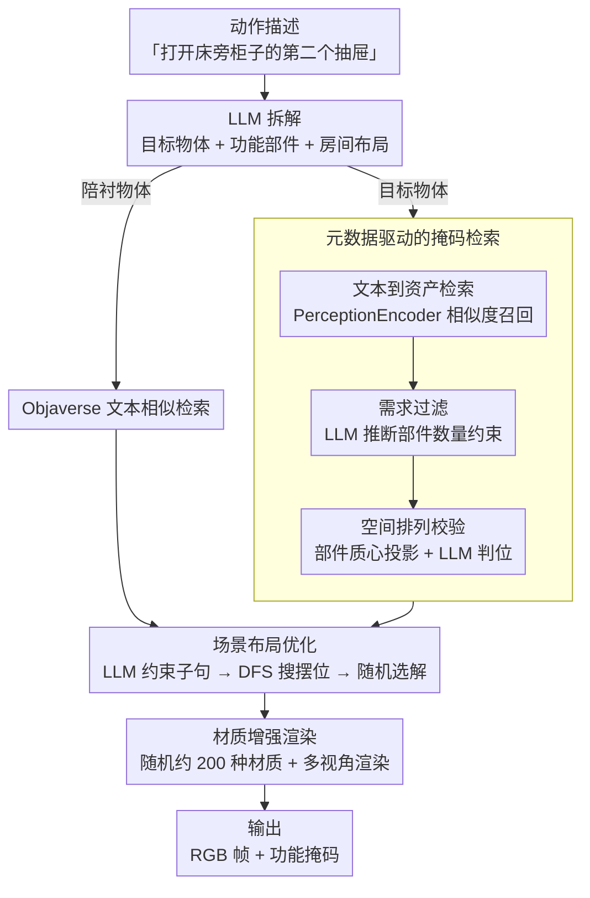

# Action-guided Generation of 3D Functionality Segmentation Data

**会议**: CVPR 2026  
**arXiv**: [2511.23230](https://arxiv.org/abs/2511.23230)  
**代码**: [项目页](https://tev-fbk.github.io/synthfun3d)  
**领域**: 3D视觉 / 具身AI  
**关键词**: 3D功能性分割, 合成数据生成, 动作描述, LLM检索, 场景布局

## 一句话总结
提出 SynthFun3D，首个从动作描述自动生成3D功能性分割训练数据的方法，通过元数据驱动的3D物体检索和场景布局，无需人工标注即可生成精确的部件级交互掩码，合成+真实数据训练在 SceneFun3D 基准上提升 +2.2 mAP / +6.3 mAR / +5.7 mIoU。

## 研究背景与动机
**任务定义**：3D功能性分割——给定自然语言动作描述（如"打开床旁柜子的第二个抽屉"），分割出3D场景中需要交互的部件（如抽屉把手）。这是具身AI的关键感知任务。

**核心痛点**：标注数据极度匮乏。目前唯一公开数据集 SceneFun3D 仅230个场景3041个功能掩码，采集和标注成本极高（估算25K美元/230场景）。

**核心矛盾**：深度学习模型需要大量训练数据，但精细的3D功能掩码几乎不可能大规模标注。合成数据在其他感知任务中已成功，但3D功能性分割从未有针对性的数据生成方案。

**核心idea**：从动作描述出发，利用LLM推理场景构成，检索带部件标注的3D资产，自动生成满足空间语义约束的场景布局和精确功能掩码。

## 方法详解

### 整体框架
SynthFun3D 要解决的是「没人标得起 3D 功能掩码」这件事：与其雇人在真实扫描里逐个抠抽屉把手，不如从一句动作描述出发，让流水线自己把一个合理的场景搭出来、并且天然知道哪个部件是被交互的目标。整篇方法可以看成一条从文字到带标注场景的传送带——先让 LLM 把动作描述拆成「目标物体 + 要交互的功能部件 + 它所在的房间布局」，接着分两路取资产：场景里的陪衬物体（床、地毯、窗帘）从 Objaverse 按文本相似度随便抓，真正的目标物体（要交互的那个柜子）则从带部件级标注的 PartNet-Mobility 里精挑细选；选好物体后用 DFS 搜一个满足空间约束的摆法，最后多视角渲染并随机换材质，输出 RGB 帧和对应的功能掩码。由于目标物体的部件标注是从资产库元数据继承下来的，掩码完全免标注、且像素级精确。

### 关键设计

**1. 元数据驱动的掩码检索：让检索听懂动作描述里的结构暗示**

这是整套方法的核心，针对的痛点是——一句"打开床旁柜子的第二个抽屉"里其实藏着很具体的物体结构要求（至少三个抽屉、抽屉得是上下纵向排列），而普通的文本-图像相似度检索只会按"柜子"这个粗概念返回一堆形态各异的家具，根本保证不了被选中的物体真有第二个抽屉可开。SynthFun3D 因此把检索拆成层层收紧的三道闸：第一道是**文本到资产检索**，用 PerceptionEncoder 算文本与渲染图的相似度，把所有超过阈值的候选先全留下，宁滥勿缺；第二道是**需求过滤**，让 LLM 从动作描述里推断出功能部件的硬性数量约束（"第二个抽屉"→ 这个物体至少要有两个 drawer-handle），逐个核对候选的部件标注、删掉数量不够的；第三道是**功能部件的空间排列校验**，对每个幸存候选算出各功能部件的 3D 质心、投影到 2D，再交给 LLM 判断这些部件的相对位置是否符合语义约束（"左上角的抽屉"要求部件呈网格排布，而不是横排）。为了让数量和位置的判断不被标签歧义搅乱，它还借 PartNet-Mobility 的层级元数据把笼统的 "handle" 细化成 "door handle" / "drawer handle"，避免把门把手错当抽屉把手计数。三道闸过完，留下来的物体不只是"看着像柜子"，而是结构上确实能完成那个动作，掩码也就指得准。

**2. 场景布局优化：把动作描述里的空间关系真正摆进场景**

光选对物体还不够——动作描述常常自带空间线索（"窗户旁的柜子""床头的柜子"），如果训练图里柜子被随便丢在房间正中，模型学到的"指向"线索就和文字对不上，数据等于白生成。这一步先让 LLM 把描述翻译成一组离散的布局约束子句（例如把"床头柜在床左边"写成 `nightstand bed <left-of>`），再用 DFS 在所有物体的可能摆位里搜索能同时满足全部约束的方案，最后在可行解里随机挑一个落地。随机化是刻意的：同一句描述能生成多个布局都成立的场景，多样性免费翻倍，而每个场景的空间关系又都严格守约束。

**3. 材质增强渲染：用几乎为零的成本撑开外观分布**

合成数据最容易暴露的破绽是外观太单调、和真实扫描有域差。SynthFun3D 的做法很轻：随机生成约 200 种材质（金属、磨砂、塑料、玻璃等），在渲染时把墙面和目标物体的材质随机替换掉。换材质不改变几何、也不影响部件标注，所以掩码完全复用、成本近乎为零，却能让同一套几何渲出截然不同的外观。实验里这一招单独就带来 +83% mIoU，是性价比最高的一个设计。

### 一个完整示例

以"打开床旁柜子的第二个抽屉"为例走一遍：LLM 先把它拆成目标物体=床头柜、功能部件=第二个抽屉的把手、房间=卧室，并顺带产出约束 `nightstand bed <left-of>`。陪衬的床、地毯从 Objaverse 抓来直接用。目标床头柜走三道闸检索：PerceptionEncoder 按"床头柜"召回一批候选；需求过滤把抽屉数 < 2 的候选剔掉（一个只有单抽屉的柜子在这步出局）；空间排列校验再确认剩下候选的抽屉是上下纵向排列、能数到"第二个"。选定物体后，DFS 在卧室里找到一个让床头柜恰好落在床左侧的摆法，随机定一个。最后多视角渲染，期间把墙面和柜体材质随机换成几种不同质感，输出若干 RGB 帧；而"第二个抽屉把手"这个部件的掩码，直接由 PartNet-Mobility 的部件标注投影得到，无需任何人工描画。

### 损失函数 / 训练策略
SynthFun3D 本身是数据生成管线，不含损失函数。下游验证时用 LoRA 微调 Gemma3-4B，让它学会从动作描述指向功能部件，再把它嵌进 Fun3DU 管线：Gemma3 给出指向 → SAM 做 2D 分割 → 把 2D 掩码提升到 3D。

## 实验关键数据

### 主实验

| 训练数据 | mAP | AP50 | AP25 | mAR | mIoU | P-acc |
|----------|-----|------|------|-----|------|-------|
| Zero-shot | 0 | 0 | 0 | 8.4 | 0.07 | 0.003 |
| R (仅真实) | 0.31 | 0.67 | 1.12 | 20.22 | 1.18 | 0.170 |
| S (仅合成) | 0.43 | 0.90 | 1.57 | 18.29 | 1.23 | 0.118 |
| S + A (合成+增强) | 0.38 | 1.35 | 3.60 | 18.49 | 2.25 | 0.176 |
| R + S | 1.17 | 2.92 | 7.42 | 26.20 | 4.40 | 0.320 |
| **R + S + A** | **2.56** | **5.17** | **12.81** | **26.54** | **6.91** | **0.384** |

### 消融实验

| 配置 | 关键发现 | 说明 |
|------|---------|------|
| 仅合成 vs 仅真实 | mIoU: 1.23 vs 1.18 | 合成数据可替代真实数据 |
| 材质增强效果 | 2.25 vs 1.23 | +83% mIoU |
| 混合训练关键 | 4.40 vs 2.25 (S+A) | 真实数据弥补域差距 |
| 全部数据 | 6.91 | 最优：多样性是关键 |
| 分类别分析 | Furniture: 大幅提升; Window: 提升有限 | 受资产库覆盖度影响 |

### 关键发现
- 仅用合成数据即可达到真实数据的性能水平（1.23 vs 1.18 mIoU）
- 合成+真实混合训练是关键：比单独使用任何一种都好得多
- 材质增强以近零成本贡献显著提升（+83% mIoU）
- 合成数据成本约1美元/场景 vs 真实数据约109美元/场景，降低100倍
- 点准确率从0.170翻倍至0.384，说明合成数据帮助VLM学会更精确的定位

## 亮点与洞察
- **首个功能性分割数据生成方案**：填补了该细分领域的空白
- **元数据驱动检索精妙**：三阶段过滤（文本相似 → 需求过滤 → 空间排列）确保检索到的物体精确匹配动作描述的隐含要求
- **"正确空间关系比视觉真实感更重要"**是重要发现：说明功能理解更依赖结构而非外观
- 成本效益极高：1美元/场景 vs 109美元/场景

## 局限与展望
- 依赖 PartNet-Mobility 资产库（仅~2K物体/46类），覆盖率有限
- 窗户等类别因布局策略偶发失败导致频率不足
- 当前生成2D多视角图像，未直接生成3D功能掩码
- 材质增强较简单，更高级的风格迁移可能进一步缩小域差
- 任务整体性能仍较低（最优mIoU仅6.91 vs GT上限29.26），说明任务本身极具挑战

## 相关工作与启发
- 借鉴 Holodeck 的 LLM 驱动场景布局，但增加了功能性约束
- 与 3D 场景合成方法（PhyScene, SceneFactor）的关键差异：关注功能部件级别的精确标注
- 随着 3D 铰接物体生成（CAGE, ArtFormer）的发展，资产库覆盖率将自然提升

## 评分
- 新颖性: ⭐⭐⭐⭐ 首个面向功能性分割的合成数据生成，但方法组合为主
- 实验充分度: ⭐⭐⭐⭐ 详细的数据组合对比+分类别分析
- 写作质量: ⭐⭐⭐⭐ 管线清晰，问题定义准确
- 价值: ⭐⭐⭐⭐ 为具身AI数据瓶颈提供了可扩展方案

<!-- RELATED:START -->

## 相关论文

- [\[CVPR 2026\] NG-GS: NeRF-Guided 3D Gaussian Splatting Segmentation](ng_gs_nerf_guided_3d_gaussian_splatting_segmentation.md)
- [\[CVPR 2025\] Functionality Understanding and Segmentation in 3D Scenes](../../CVPR2025/3d_vision/functionality_understanding_and_segmentation_in_3d_scenes.md)
- [\[CVPR 2026\] Action–Geometry Prediction with 3D Geometric Prior for Bimanual Manipulation](actiongeometry_prediction_with_3d_geometric_prior.md)
- [\[CVPR 2026\] Lifting Unlabeled Internet-level Data for 3D Scene Understanding](lifting_unlabeled_internet-level_data_for_3d_scene_understanding.md)
- [\[CVPR 2026\] GAP: Action-Geometry Prediction with 3D Geometric Prior for Bimanual Manipulation](action-geometry_prediction_with_3d_geometric_prior_for_bimanual_manipulation.md)

<!-- RELATED:END -->
