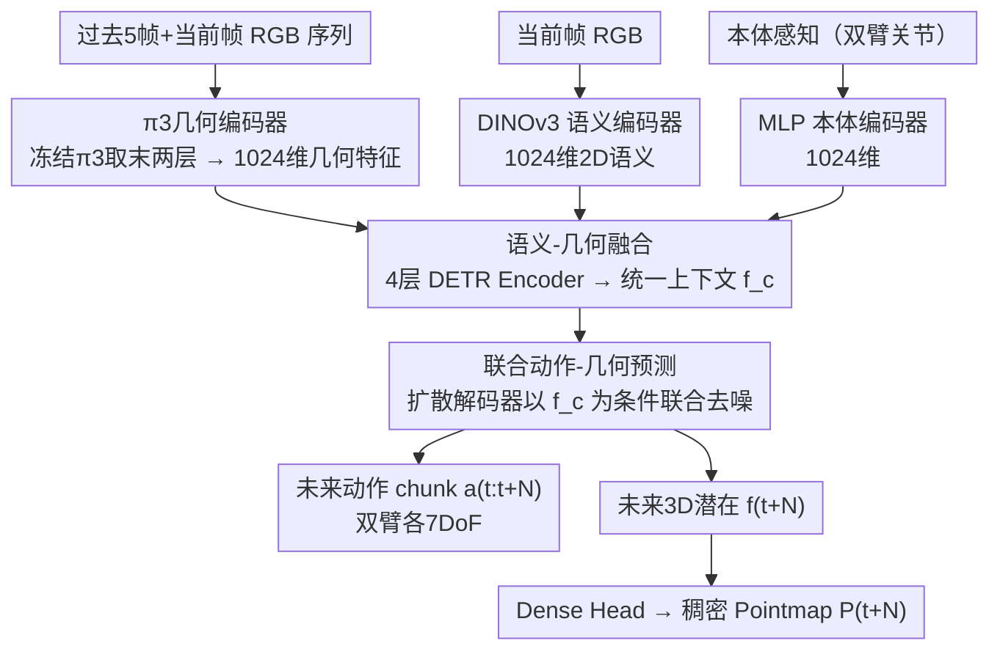

# Action–Geometry Prediction with 3D Geometric Prior for Bimanual Manipulation

**会议**: CVPR 2026  
**arXiv**: [2602.23814](https://arxiv.org/abs/2602.23814)  
**代码**: [https://github.com/Chongyang-99/GAP.git](https://github.com/Chongyang-99/GAP.git)  
**领域**:3D视觉
**关键词**: 双臂操作, 3D几何基础模型, 联合动作-几何预测, π3, 扩散策略  

## 一句话总结
利用预训练3D几何基础模型π3作为感知骨干，融合3D几何、2D语义和本体感知特征，通过扩散模型联合预测未来动作chunk和未来3D Pointmap，仅使用RGB输入就在RoboTwin双臂基准上全面超越点云方法。

## 背景与动机

**领域现状**：双臂操作需要精确的3D空间推理和臂间协调。现有2D方法（ACT、DP）缺乏空间感知，3D方法（DP3）虽然有效但依赖点云获取（需标定、对噪声敏感、难以在真实场景可靠获取）。同时，3D几何基础模型（DUSt3R、π3等）已能从RGB图像直接重建高质量3D结构。问题是：能否直接利用3D基础模型作为感知先验，仅用RGB实现甚至超越点云方法的3D感知？

**本文目标**：用预训练3D几何基础模型替代显式点云管线，实现仅RGB输入的3D感知双臂操作策略，并通过联合预测未来3D几何获得预测性规划能力。

## 方法详解

### 整体框架
三路并行编码器融合：π3编码器处理时序RGB提取3D几何特征，DINOv3编码当前帧提取2D语义特征，MLP编码本体感知。三个1024维特征通过4层DETR Encoder融合为语义-几何统一上下文$\mathbf{f}_c$。扩散解码器在$\mathbf{f}_c$条件下联合去噪生成：（1）未来动作chunk $a_{t:t+N}$（双臂各7DoF）；（2）未来3D潜在$\mathbf{f}_{t+N}$，经Dense Head解码为稠密Pointmap $P_{t+N} \in \mathbb{R}^{H \times W \times 4}$。

### 关键设计

**1. π3几何编码器：用冻结的3D基础模型直接从RGB拿到几何，省掉点云管线**

双臂操作的痛点是3D方法依赖点云、要标定且对噪声敏感。GAP 直接把过去5帧+当前帧共6帧的时序序列喂给预训练π3骨干提取3D几何特征——π3是排列等变的多视角3D重建模型，能从RGB推断稠密几何，作者取它最后两层特征拼成1024维。关键是π3全程冻结不训练，相当于把一个强3D感知先验“白嫖”进策略网络，既避开点云采集的工程开销，又比从头学3D特征稳得多。

**2. 语义-几何融合：用2D语义补几何缺的物体理解**

π3给的是空间结构，但缺任务相关的物体语义。GAP 再并一路冻结的 DINOv3 编码当前帧提取2D语义、一路 MLP 编码本体感知，三个1024维特征经4层 DETR Encoder 融合成统一上下文 $\mathbf{f}_c$ 作为扩散解码器的条件。消融显示语义是辅助角色——单独去掉2D语义只降约1%，而去掉3D几何+几何想象降4%，说明3D感知才是主要贡献，语义负责把“看到的结构”对应到“该操作的物体”。

**3. 联合动作-几何预测：让策略“想象”动作执行后的3D场景，获得隐式前瞻规划**

只预测动作的策略是“盲动”的。GAP 的扩散解码器在预测动作 chunk 的同时，还预测未来时间步的3D Pointmap潜在 $\mathbf{f}_{t+N}$，再经 Dense Head 解码为稠密 Pointmap。这迫使模型“想象”动作执行后的3D场景状态，等于把前瞻规划隐式地塞进了去噪过程。消融能看到这一设计的分量：去掉几何想象成功率从25.1%降到23.6%，再去掉3D几何模块成功率降到21.0%。

### 损失函数 / 训练策略

$$\mathcal{L} = \|a - \hat{a}\|_1 + \lambda\|\mathbf{f}_{t+N} - \hat{\mathbf{f}}_{t+N}\|_1 + \gamma\|P_{t+N} - \hat{P}_{t+N}\|_1$$

动作、未来3D潜在、稠密 Pointmap 三项 L1 损失联合监督。其中未来3D潜在的 GT 由π3预提取所有演示得到（按时序窗口提取以稳定化）。训练200-600 epoch，batch=32，4090 GPU。

## 实验关键数据

| RoboTwin 2.0 | 指标 | Ours | DP3 | ACT | DP | RDT |
|--------|------|------|----------|------|------|------|
| Dominant-select (16任务) | Avg SR(%) | **63.2** | 61.2 | 34.1 | 44.4 | 44.5 |
| Sync-bimanual (8任务) | Avg SR(%) | **51.3** | 40.7 | 32.4 | 37.1 | 47.0 |
| Seq-coordinate (8任务) | Avg SR(%) | **50.4** | 41.1 | 29.4 | 33.6 | 42.3 |
| 真实世界 (4任务) | Avg SR(%) | **40.0** | - | 23.8 | 25.0 | - |

### 消融实验要点
- 去掉2D语义模块: 25.1% → 24.4%（-0.7%），语义是辅助角色
- 去掉几何想象: 25.1% → 23.6%（-1.5%），预测未来3D对规划很重要
- 去掉3D几何+几何想象: 25.1% → 21.0%（-4.1%），3D感知是核心
- 数据效率：仅10条演示时本方法已有学习信号，2D方法DP完全失败（0%）
- 真实世界Hang Mug任务：ACT/DP都是0%，本方法20%，证明3D推理对复杂任务的价值

## 亮点与洞察
- 用RGB图像直接输入3D基础模型即超越显式点云方法，避免了标定和点云采集的工程开销
- "预测未来3D Pointmap"的设计优雅——既是辅助训练信号也是隐式前瞻规划
- 32个RoboTwin任务+4个真实任务的评估规模在双臂操作领域罕见
- 数据效率优势明显：预训练特征让低数据区间性能远超从头训练的2D方法

## 局限与展望
- 仅预测单步3D（N步后的Pointmap），缺乏多步3D轨迹预测和持久3D记忆
- 依赖π3的预训练质量，对π3未见过的场景可能退化
- 真实实验仅50条演示训练，规模有限
- Pointmap解码可选跳过说明推理效率有提升空间

## 相关工作与启发
- **DP3**: 使用显式点云，需标定和噪声处理；本文仅RGB但通过π3获得更好的3D感知，全面超越DP3
- **G3Flow**: 将2D特征投射到3D，依赖DINOv2+语义流；本文用π3直接在3D潜在空间工作
- **RDT**: 1.2B参数基础模型，在Seq-coordinate上42.3% vs 本文50.4%，证明3D预测比大模型更有效
- **Xu et al.**: 联合预测动作+未来图像帧（2D），本文预测3D Pointmap更具几何一致性

## 相关工作与启发
- π3等3D基础模型作为"即插即用"的几何骨干用于操作策略是一个有前景的方向
- 联合动作-几何预测的范式可以推广到单臂操作和导航任务

## 评分
- 新颖性: ⭐⭐⭐⭐ 首次将π3等3D几何基础模型用于双臂操作+联合几何预测
- 实验充分度: ⭐⭐⭐⭐⭐ 32个仿真任务+4个真实任务+数据效率+消融，评估极为全面
- 写作质量: ⭐⭐⭐⭐ 方法叙述清晰，实验层次分明
- 价值: ⭐⭐⭐⭐ 为RGB-only的3D感知双臂操作提供了实用范式

<!-- RELATED:START -->

## 相关论文

- [\[CVPR 2026\] GAP: Action-Geometry Prediction with 3D Geometric Prior for Bimanual Manipulation](action-geometry_prediction_with_3d_geometric_prior_for_bimanual_manipulation.md)
- [\[CVPR 2026\] MatE: Material Extraction from Single-Image via Geometric Prior](mate_material_extraction_from_single-image_via_geometric_prior.md)
- [\[CVPR 2026\] Action-guided Generation of 3D Functionality Segmentation Data](action-guided_generation_of_3d_functionality_segmentation_data.md)
- [\[CVPR 2026\] OLATverse: A Large-scale Real-world Object Dataset with Precise Lighting Control](olatverse_a_large-scale_real-world_object_dataset_with_precise_lighting_control.md)
- [\[CVPR 2026\] PerpetualWonder: Long-horizon Action-conditioned 4D Scene Generation](perpetualwonder_long-horizon_action-conditioned_4d_scene_generation.md)

<!-- RELATED:END -->
