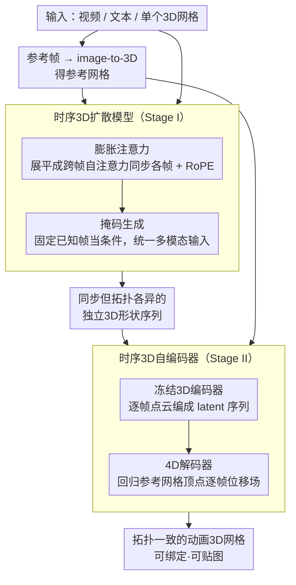

# ActionMesh: Animated 3D Mesh Generation with Temporal 3D Diffusion

**会议**: CVPR 2026  
**arXiv**: [2601.16148](https://arxiv.org/abs/2601.16148)  
**代码**: [项目页](https://remysabathier.github.io/actionmesh/)  
**领域**: 3D视觉 / 4D生成  
**关键词**: 动画3D网格生成, 时序3D扩散, 拓扑一致, 免绑定, 前馈式

## 一句话总结
提出 ActionMesh，通过最小化扩展预训练3D扩散模型增加时间轴（时序3D扩散），再用时序3D自编码器将独立形状序列转为拓扑一致的动画网格，仅2分钟即可从视频/文本/3D网格等多种输入生成产品级动画3D网格，在几何精度和时间一致性上均达SOTA。

## 研究背景与动机
**领域现状**：自动生成动画3D物体是游戏/影视/AR-VR的核心需求，但现有方法存在三大限制。

**现有痛点**：
   - **输入受限**：大多绑定特定输入模态和物体类别
   - **速度慢**：依赖30-45分钟的逐场景优化（DreamMesh4D, V2M4, LIM）
   - **质量不足**：不达产品标准（如Gaussian Splatting无固定拓扑、无法纹理映射）

**核心矛盾**：如何在保持高质量的同时实现快速、拓扑一致的4D生成？

**关键insight**：从早期视频模型获得启发——可以最小化地扩展预训练3D扩散模型加入时间轴，复用强大的3D先验来弥补4D动画数据的匮乏。

**核心idea**：分离"3D生成"和"动画预测"——先生成同步的独立3D形状序列，再将其转化为参考网格的变形。

## 方法详解

### 整体框架
ActionMesh 要解决的是：怎么在两分钟内、从一段视频（或文本、单个3D网格）生成一个拓扑一致、能直接进生产管线的动画3D物体。它的关键判断是把这件事拆成两步走——先不管拓扑、只把每一帧的3D形状都生成对、且彼此动作同步；再回过头把这一串各自独立的网格"压"成同一套拓扑的逐帧变形。

具体来说，第一阶段（Stage I）拿视频的参考帧跑一个现成的 image-to-3D 得到参考网格，同时用一个**时序3D扩散模型**一次性生成整段同步的3D形状序列；这一串形状动作是对齐的，但每帧各自是独立的网格、拓扑并不一致。第二阶段（Stage II）再用一个**时序3D自编码器**，把这串独立网格统一表达成参考网格顶点的逐帧偏移，输出拓扑一致、可绑定可贴图的动画3D网格。

### 关键设计

**1. 时序3D扩散模型（Stage I）：让一个只会生成静态3D的扩散模型"长出"时间轴**

4D 动画数据本就稀缺，从零训一个时序生成模型不现实，所以这里的思路是尽量少改、最大化复用预训练3D先验——就像当年视频模型是从图像模型扩展来的那样。底座是 3DShape2VecSet / TripoSG 这套3D latent 扩散框架，ActionMesh 只在它上面做两处最小修改。第一处是**膨胀注意力（Inflated Attention）**：把原本逐帧独立的自注意力扩展成跨帧注意力，让所有帧的 token 互相 attend，从而把"各帧形状要同步"这个约束直接编码进注意力里。做法是把 $N \times T \times D$ 的输入展平成 $1 \times NT \times D$ 再走原来的自注意力，算完再 reshape 回去：

$$\text{infattn}(\mathbf{X}) = \text{reshape}^{-1}(\text{selfattn}(\text{reshape}(\mathbf{X})))$$

这样不引入新参数、直接复用预训练自注意力权重，只需微调；再叠一层旋转位置编码（RoPE）把帧间相对位置喂进去，抑制时间抖动。第二处是**掩码生成（Masked Generation）**：训练时随机让一部分 latent 保持无噪声（flow step 置 0），等于告诉模型"这几帧的形状是已知的、别去生成"。这一招让推理时能把任意已知的3D网格固定下来当条件，于是 {3D网格 + 视频} → 动画、文本 → 动画等多种输入都用同一个模型处理，运动迁移（把鸟的飞行套到龙身上）也是顺带就能做。

**2. 时序3D自编码器（Stage II）：把一串各自为政的网格压成同一套拓扑的变形场**

Stage I 给出的形状帧帧拓扑不同，没法直接贴图、绑骨；传统做法是逐场景跑优化把它们配准成统一拓扑，慢且脆。Stage II 把这个优化问题直接改写成一次前馈推理。编码侧用冻结的3D编码器 $\mathcal{E}_{\text{3D}}$ 把每一帧点云各自编成 latent，得到一串 latent 序列；解码侧的 $\mathcal{D}_{\text{4D}}$ 一次性吃下整段序列，直接回归出参考网格每个顶点到目标时间步的位移场，输出即拓扑一致的动画。查询点取参考网格的顶点位置外加法线——法线用来消歧那些空间上挨得近、但在拓扑上其实隔得远的点（比如贴在一起的两片薄壳）。两个时间步 $(t_i, t_j)$ 通过傅里叶编码作为额外 token 注入，告诉解码器"从哪一帧变到哪一帧"。这里同样复用膨胀注意力 + RoPE 来保证跨帧的变形连贯。

### 损失函数 / 训练策略
两个阶段各自独立训练、推理时串联。Stage I 用 flow matching 损失，且只对被掩码（即真正需要生成）的 latent 计算损失，已知帧不回传。Stage II 直接对变形场做 MSE 监督。整段 16 帧视频的推理约 2 分钟，相比逐场景优化路线快约 10 倍。

## 实验关键数据

### 主实验（ActionBench）

| 方法 | 推理时间 | CD-3D↓ | CD-4D↓ | CD-M↓ |
|------|---------|--------|--------|-------|
| DreamMesh4D | 35min | 0.104 | 0.152 | 0.265 |
| LIM | 15min | 0.089 | 0.126 | 0.243 |
| V2M4 | 35min | 0.068 | 0.340 | 0.616 |
| ShapeGen4D | 15min | 0.056 | 0.170 | 0.348 |
| TripoSG (逐帧) | 2min | 0.056 | 0.184 | - |
| **ActionMesh** | **2min** | **0.053** | **0.081** | **0.148** |

### 消融实验

| 配置 | CD-3D↓ | CD-4D↓ | CD-M↓ | 说明 |
|------|--------|--------|-------|------|
| 完整模型 | 0.050 | 0.069 | 0.137 | 最优 |
| 无 Stage II | 0.050 | 0.069 | - | Stage II保持3D质量 |
| 无 Stage I & II | 0.050 | 0.187 | - | Stage I是4D关键 |
| Craftsman骨干 | 0.072 | 0.117 | 0.216 | 框架对骨干不敏感 |

### 关键发现
- CD-4D 改善35%（0.081 vs 0.126），CD-M 改善39%（0.148 vs 0.243），速度快10倍
- 逐帧 TripoSG 的 CD-3D 与 ActionMesh 相当（0.056 vs 0.053），但 CD-4D 大幅落后（0.184 vs 0.081），证明时序一致性是关键贡献
- Stage II 不损害3D质量（CD-3D不变），同时提供拓扑一致性
- 可在 DAVIS 真实视频上工作，仅在合成数据上训练但泛化良好
- 运动迁移能力突出：可将鸟的飞行运动转移给龙

## 亮点与洞察
- **最小化修改策略**：仅对预训练3D扩散模型添加膨胀注意力+掩码生成，最大化复用3D先验
- **拓扑一致+免绑定**两个特性是实际生产中的关键需求：纹理自动传播、重定向变得trivial
- **分离生成与动画**是优雅的简化：降低4D问题复杂度
- **运动迁移**是免费获得的能力：掩码生成天然支持{3D+视频}→动画

## 局限与展望
- **拓扑变化**：固定拓扑假设无法处理形变中的拓扑改变（如分裂、融合）
- **严重遮挡**：参考帧或运动过程中的遮挡可能导致重建失败
- 依赖 image-to-3D 模型的质量作为起点
- ActionBench 规模较小（128个动画场景），需要更大规模基准

## 相关工作与启发
- "时序3D扩散"这一命名准确区分了与"4D扩散"（多视图扩展）的区别
- 类似于视频模型从图像模型的扩展路径（添加时间注意力 + 微调）
- VecSet架构（3DShape2VecSet → TripoSG → CLAY）的通用性使得这种时序扩展具有广泛适用性

## 评分
- 新颖性: ⭐⭐⭐⭐ 最小化扩展3D扩散到时序的思路清晰优雅
- 实验充分度: ⭐⭐⭐⭐⭐ 定量基准+定性对比+消融+真实视频+运动迁移，非常全面
- 写作质量: ⭐⭐⭐⭐⭐ 清晰区分术语（4D mesh vs animated 3D mesh），结构精炼
- 价值: ⭐⭐⭐⭐⭐ 速度+质量+拓扑一致性三者兼得，产品级实用

<!-- RELATED:START -->

## 相关论文

- [\[CVPR 2026\] PartDiffuser: Part-wise 3D Mesh Generation via Discrete Diffusion](partdiffuser_part-wise_3d_mesh_generation_via_discrete_diffusion.md)
- [\[CVPR 2026\] MeshFlow: Efficient Artistic Mesh Generation via MeshVAE and Flow-based Diffusion Transformer](meshflow_efficient_artistic_mesh_generation_via_meshvae_and_flow-based_diffusion.md)
- [\[CVPR 2026\] Learning Spatial-Temporal Consistency for 3D Semantic Scene Completion](learning_spatial-temporal_consistency_for_3d_semantic_scene_completion.md)
- [\[CVPR 2026\] MeshWeaver: Sparse-Voxel-Guided Surface Weaving for Autoregressive Mesh Generation](meshweaver_sparse-voxel-guided_surface_weaving_for_autoregressive_mesh_generatio.md)
- [\[CVPR 2026\] NaTex: Seamless Texture Generation as Latent Color Diffusion](natex_seamless_texture_generation_as_latent_color_diffusion.md)

<!-- RELATED:END -->
