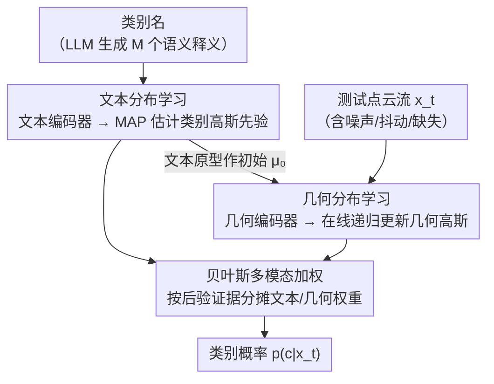

# Adapting Point Cloud Analysis via Multimodal Bayesian Distribution Learning

**会议**: CVPR 2026  
**arXiv**: [2603.22070](https://arxiv.org/abs/2603.22070)  
**代码**: 无  
**领域**: 3D Vision / Point Cloud Analysis  
**关键词**: 测试时适配, 点云识别, 贝叶斯推断, 多模态分布学习, 零样本泛化

## 一句话总结
BayesMM 提出了一个无需训练的动态贝叶斯分布学习框架，将文本和几何模态建模为高斯分布，并通过贝叶斯模型平均自动调节模态权重，在多个点云基准上实现了鲁棒的测试时适配，平均提升超过 4%。

## 研究背景与动机
**领域现状**：大型多模态 3D 视觉-语言模型（如 ULIP-2、Uni3D）通过对比预训练实现了良好的零样本泛化能力，但在分布偏移下性能明显下降。

**现有痛点**：
   - 基于缓存的测试时适配（TTA）方法维护有限容量的样本缓存，样本替换导致渐进的信息丢失；
   - 零样本和缓存 logits 的融合依赖经验调参（$\lambda$, $\gamma$），缺乏理论基础，适配过程不稳定。

**核心矛盾**：如何在测试时持续利用所有历史样本的统计信息，同时以有原则的方式融合不同模态？

**本文切入角度**：将每个类别的文本和几何特征建模为高斯分布，在贝叶斯框架下自动平衡两个模态的贡献。

**核心 idea**：用分布替代离散缓存，用贝叶斯模型平均替代启发式融合，实现连续、稳定、无需训练的测试时适配。

## 方法详解

### 整体框架
BayesMM 要解决的是：当点云数据在测试时发生分布偏移（噪声、抖动、缺失），预训练的 3D 视觉-语言模型怎么不重新训练就稳住精度。它的做法是把"每个类别长什么样"从一组离散的缓存样本，换成一个会随数据流不断更新的高斯分布。整条流程是这样转的：先用文本编码器把每类的若干释义压成一个文本高斯分布（离线，只算一次）；测试时每来一个点云样本，就用它把对应类别的几何高斯分布在线递归更新一次；最后预测时不再手调一个融合系数，而是让文本分布和几何分布各自按"自己对这个样本的解释力"来分摊权重，加权得到类别概率。所有编码器全程冻结，整个适配只是高斯参数的闭式更新。

### 关键设计

**1. 文本分布学习：用一团释义而非单一模板来锚定类别语义**

单条 prompt 模板（如"a point cloud of a {class}"）只能给出类别语义的一个采样点，遇到表述多样的真实类别就显得脆弱。BayesMM 让 LLM 为每类生成 $M$ 个语义释义，过文本编码器后得到 $M$ 个特征，估计出经验均值 $\bar{\mathbf{z}}^c$ 和协方差 $\mathbf{S}^c$，再以高斯先验 $p(\boldsymbol{\nu}^c) = \mathcal{N}(\bar{\mathbf{z}}^c, \beta^2\mathbf{I})$ 做 MAP 估计，得到一个确定性的类别原型 $\boldsymbol{\nu}^c_{\text{MAP}}$。这样类别先验不再是一个点，而是带方差的一片区域，既保留了语义多样性，又给后面几何分布的递归更新提供了一个稳定的起点。

**2. 几何分布学习：让分布吃下整条历史流，而不是塞进一个会溢出的缓存**

基于缓存的 TTA 之所以会渐进掉点，是因为缓存容量有限，新样本进来就得挤掉旧样本，历史统计被一点点丢掉。BayesMM 改成为每个类别维护一个在线高斯 $\{\boldsymbol{\mu}_t^c, \boldsymbol{\Sigma}_t^c\}$，初始就用文本原型 $\boldsymbol{\mu}_0^c = \bar{\mathbf{z}}^c$ 起步，每到一个新样本 $\mathbf{x}_t$ 就按贝叶斯规则做一次闭式递归更新：

$$\boldsymbol{\Sigma}_t^c = \big((\boldsymbol{\Sigma}_{t-1}^c)^{-1} + (\boldsymbol{\Sigma}^c)^{-1}\big)^{-1}, \qquad \boldsymbol{\mu}_t^c = \boldsymbol{\Sigma}_t^c\big((\boldsymbol{\Sigma}^c)^{-1}\mathbf{x}_t + (\boldsymbol{\Sigma}_{t-1}^c)^{-1}\boldsymbol{\mu}_{t-1}^c\big)$$

更新只是上一时刻分布与新样本似然的精度加权平均，所有看过的样本都通过这套递推持续沉淀进 $(\boldsymbol{\mu}_t^c, \boldsymbol{\Sigma}_t^c)$ 里，既没有容量上限，也不会因为替换而丢信息。

**3. 贝叶斯多模态加权：让证据而非手调系数来决定文本和几何谁说了算**

缓存方法融合零样本 logits 和缓存 logits 时要靠经验调 $\lambda$、$\gamma$，跨域时这套参数往往失灵。BayesMM 把融合写成贝叶斯模型平均：

$$p(c|\mathbf{x}_t) = p(c|\mathbf{x}_t, \boldsymbol{\Omega}^c)\, p(\boldsymbol{\Omega}^c|\mathbf{x}_t) + p(c|\mathbf{x}_t, \boldsymbol{\Theta}_t^c)\, p(\boldsymbol{\Theta}_t^c|\mathbf{x}_t)$$

文本模态和几何模态各自的权重就是它们对当前样本的后验证据 $p(\boldsymbol{\Omega}^c|\mathbf{x}_t)$ 与 $p(\boldsymbol{\Theta}_t^c|\mathbf{x}_t)$——哪个模态对这个样本解释得更好，权重就自动倾向哪边。于是当几何分布还没攒够样本时文本先验主导，几何统计稳定后权重自然移过去，整个过程没有任何需要随域手调的旋钮。

### 损失函数 / 训练策略
- **完全无需训练**：冻结所有编码器，仅通过贝叶斯规则在线更新分布参数
- 无额外超参数需要随域变化调整

## 实验关键数据

### 主实验（ModelNet-C，7 种腐蚀类型）

| 基础模型 | 方法 | Add Global | Add Local | Drop Global | Jitter | 平均 |
|---------|------|-----------|-----------|-------------|--------|------|
| ULIP | Zero-shot | 33.55 | 43.92 | 54.70 | 44.08 | 48.60 |
| ULIP | + Hierarchical Cache | 46.15 | 47.85 | 59.16 | 49.92 | 55.02 |
| ULIP | + **BayesMM** | **54.82** | **53.93** | **63.09** | **53.04** | **59.42** |
| Uni3D | Zero-shot | 72.45 | 56.36 | 68.15 | 56.24 | 69.69 |
| Uni3D | + Hierarchical Cache | 77.51 | 71.15 | 72.16 | 62.52 | 74.63 |
| Uni3D | + **BayesMM** | **77.59** | **73.30** | **74.96** | **65.84** | **76.56** |

### 消融实验（分布一致性验证）

| 配置 | KL 散度（初始→最终） | MMD（初始→最终） | 说明 |
|------|---------------------|-----------------|------|
| 仅文本模态 | 较高 | 较高 | 单模态不足 |
| 仅几何模态 | 中等 | 中等 | 缺少语义先验 |
| BayesMM（完整） | 17.2 → 12.6 | 0.91 → 0.71 | 贝叶斯融合持续收敛 |

### 关键发现
- BayesMM 在所有四个基础模型（ULIP、ULIP-2、OpenShape、Uni3D）上均带来显著提升
- 在 Sim-to-Real 设置中同样有效，证明跨域泛化能力
- KL 和 MMD 随适配进行持续降低，说明分布不断align 而非过拟合

## 亮点与洞察
- **完全无需训练的 TTA 方法**：无需梯度更新，仅通过闭式贝叶斯更新实现
- 将分布学习引入 3D 多模态 TTA，在理论上比缓存方法更优雅
- 模型无关：可即插即用到任何预训练3D视觉-语言模型

## 局限与展望
- 高斯假设可能不适合复杂的非高斯特征分布
- 类别数很多时，维护每类协方差矩阵的计算开销较大
- 当测试流中某类样本极少时，几何分布可能估计不准

## 相关工作与启发
- 与 DOTA（2D VLM 的在线高斯 TTA）思路相近，但扩展到 3D 多模态
- 贝叶斯模型平均的思想可推广到其他多模态融合场景

## 评分
- 新颖性: ⭐⭐⭐⭐ 贝叶斯框架替代缓存方法，理论优雅
- 实验充分度: ⭐⭐⭐⭐⭐ 四个基础模型×多个基准×多种设置
- 写作质量: ⭐⭐⭐⭐ 推导清晰，公式严谨
- 价值: ⭐⭐⭐⭐ 即插即用的实用 TTA 方案

<!-- RELATED:START -->

## 相关论文

- [\[CVPR 2026\] ECKConv: Learning Coordinate-based Convolutional Kernels for Continuous SE(3) Equivariant Point Cloud Analysis](learning_coordinate-based_convolutional_kernels_for_continuous_se3_equivariant_a.md)
- [\[CVPR 2026\] Deformation-based In-Context Learning for Point Cloud Understanding](deformation-based_in-context_learning_for_point_cloud_understanding.md)
- [\[AAAI 2026\] Graph Smoothing for Enhanced Local Geometry Learning in Point Cloud Analysis](../../AAAI2026/3d_vision/graph_smoothing_for_enhanced_local_geometry_learning_in_point_cloud_analysis.md)
- [\[CVPR 2026\] PhysGS: Bayesian-Inferred Gaussian Splatting for Physical Property Estimation](physgs_bayesian-inferred_gaussian_splatting_for_physical_property_estimation.md)
- [\[CVPR 2026\] Image-to-Point Cloud Feature Back-Projection for Multimodal Training of 3D Semantic Segmentation](image-to-point_cloud_feature_back-projection_for_multimodal_training_of_3d_seman.md)

<!-- RELATED:END -->
